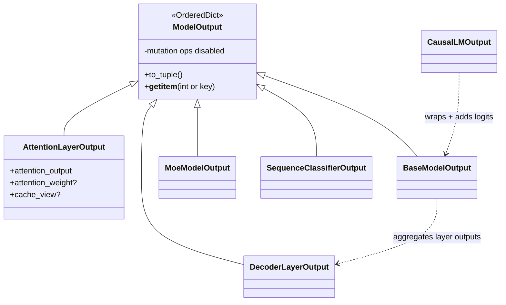

# easydel/infra/modeling_outputs — the tuple/dict output dataclasses threaded up the layer stack

## Overview
This file defines the family of structured return types every EasyDeL layer and model emits — [`AttentionLayerOutput`](../catalog/easydel/infra/modeling_outputs.md#AttentionLayerOutput), [`DecoderLayerOutput`](../catalog/easydel/infra/modeling_outputs.md#DecoderLayerOutput), [`BaseModelOutput`](../catalog/easydel/infra/modeling_outputs.md#BaseModelOutput), `CausalLMOutput`, [`MoeModelOutput`](../catalog/easydel/infra/modeling_outputs.md#MoeModelOutput), [`SequenceClassifierOutput`](../catalog/easydel/infra/modeling_outputs.md#SequenceClassifierOutput), [`VLMCausalLMOutput`](../catalog/easydel/infra/modeling_outputs.md#VLMCausalLMOutput), and ~25 more. They all descend from [`ModelOutput`](../catalog/easydel/infra/modeling_outputs.md#ModelOutput), an `OrderedDict` subclass that behaves like *both* a namedtuple and a dict — `output.logits` and `output["logits"]` both work, `to_tuple()` unpacks positionally, and `None` fields are filtered. The one non-obvious design rule enforced at runtime: every subclass must carry `@auto_pytree`, because these outputs travel *through* `jit`/`grad` as pytrees (they carry live JAX arrays plus cache views), so they can't be plain OrderedDicts.

## Diagram

## Design rationale (why it's built this way)
- **Tuple-and-dict duality for HF compatibility.** [`ModelOutput`](../catalog/easydel/infra/modeling_outputs.md#ModelOutput) inherits `OrderedDict` so it supports named access, but also positional/tuple access and `to_tuple()` — matching HuggingFace's `ModelOutput` contract so code written against `transformers` (which unpacks outputs as tuples or reads `.logits`) works unchanged. The docstring: "behaves like both a tuple (for positional access) and a dictionary (for named access)."
- **`@auto_pytree` is mandatory and runtime-enforced.** [`ModelOutput.__init__`](../catalog/easydel/infra/modeling_outputs.md#ModelOutput) checks `is_dataclass(self)` and raises `TypeError` if a subclass isn't decorated — because these objects hold JAX arrays (and cache views) and must flatten into pytree leaves to survive `jit`. A plain dict of arrays wouldn't; the dataclass registration is what lets an output be a traced value.
- **Immutability by disabling mutation ops.** The docstring notes "Item deletion, setdefault, pop, and update operations are disabled to maintain output immutability" — an output is a value, not a mutable container, consistent with JAX's functional model.
- **`None`-filtering keeps the pytree lean.** Optional fields default to `None` and are filtered from iteration/`to_tuple`, so `output_attentions=False` doesn't add a `None` leaf that would show up in every pytree traversal.
- **Layered specialization.** The hierarchy composes: `CausalLMOutput` subclasses `MaskedLMOutput`, [`AttentionLayerOutput`](../catalog/easydel/infra/modeling_outputs.md#AttentionLayerOutput) adds a `cache_view` for decode — each output type carries exactly the fields its producer emits, so the type of an output documents what a layer returns.

## Entry points
- [`ModelOutput`](../catalog/easydel/infra/modeling_outputs.md#ModelOutput) — the base every output subclasses; provides `to_tuple`, dual access, and the `@auto_pytree` validation.
- [`AttentionLayerOutput`](../catalog/easydel/infra/modeling_outputs.md#AttentionLayerOutput) — returned by every attention layer (`attention_output`, optional `attention_weight`, optional `cache_view` for autoregressive decode); the object [`UnifiedAttention.forward`](../catalog/easydel/layers/attention/_unified.md) builds.
- [`DecoderLayerOutput`](../catalog/easydel/infra/modeling_outputs.md#DecoderLayerOutput) / [`BaseModelOutput`](../catalog/easydel/infra/modeling_outputs.md#BaseModelOutput) — per-decoder-layer and whole-backbone outputs, threading hidden states + cache up the stack.
- Head outputs — `CausalLMOutput`, [`MoeModelOutput`](../catalog/easydel/infra/modeling_outputs.md#MoeModelOutput) (adds router/aux-loss fields), [`SequenceClassifierOutput`](../catalog/easydel/infra/modeling_outputs.md#SequenceClassifierOutput), [`VLMCausalLMOutput`](../catalog/easydel/infra/modeling_outputs.md#VLMCausalLMOutput) — the task-specific top-level returns.

## Mechanism (step-by-step)
1. **A layer constructs its output dataclass.** e.g. attention returns an [`AttentionLayerOutput`](../catalog/easydel/infra/modeling_outputs.md#AttentionLayerOutput)`(attention_output=..., cache_view=...)`; because it's `@auto_pytree`, the object is a dataclass whose fields are pytree leaves.
2. **`__init__` validates the dataclass contract.** [`ModelOutput.__init__`](../catalog/easydel/infra/modeling_outputs.md#ModelOutput) runs `OrderedDict.__init__` then asserts the subclass `is_dataclass` — catching a missing `@auto_pytree` at construction rather than as a cryptic pytree error deep inside `jit`.
3. **Outputs compose up the stack.** Each [`DecoderLayerOutput`](../catalog/easydel/infra/modeling_outputs.md#DecoderLayerOutput) feeds the next layer; the backbone aggregates them into a [`BaseModelOutput`](../catalog/easydel/infra/modeling_outputs.md#BaseModelOutput); the head wraps that into a `CausalLMOutput`/[`SequenceClassifierOutput`](../catalog/easydel/infra/modeling_outputs.md#SequenceClassifierOutput) — the `cache_view` fields thread the KV cache from bottom to top so the top-level output carries the updated cache for the next decode step.
4. **Consumers read by name or unpack.** Training/generation code uses `output.logits` / `output.attention_output`, or [`ModelOutput`](../catalog/easydel/infra/modeling_outputs.md#ModelOutput)'s `to_tuple()` to unpack — the same object serves both idioms and survives `jit` as a traced pytree.

## Key data structures
- [`ModelOutput`](../catalog/easydel/infra/modeling_outputs.md#ModelOutput) — `OrderedDict` base with `to_tuple`, dual access, mutation disabled, `@auto_pytree` enforced.
- [`AttentionLayerOutput`](../catalog/easydel/infra/modeling_outputs.md#AttentionLayerOutput) — `{attention_output, attention_weight?, cache_view?: TransformerCacheView}`.
- [`MoeModelOutput`](../catalog/easydel/infra/modeling_outputs.md#MoeModelOutput) — backbone output extended with MoE router/aux-loss fields (the reason MoE models need a distinct type).

## Dynamics (design intent)
> [!inferred] The `cache_view` field on [`AttentionLayerOutput`](../catalog/easydel/infra/modeling_outputs.md#AttentionLayerOutput) is what makes cache threading work under `jit`: because the output is a pytree, the updated cache view returned by a layer is a traced leaf that flows back out of the compiled function, so the loop can feed it into the next step without any Python-side cache bookkeeping.

## Edge cases
- **Missing `@auto_pytree`** on a new output subclass raises at first construction — an intentional loud failure.
- **Mutation attempts** (`pop`/`update`/`del`) are disabled — code expecting dict mutation on an output will error.
- **First field should have no `None` default; the rest should default to `None`** (docstring) — violating this breaks positional/tuple semantics.

## Open questions
> [!inferred] The `@auto_pytree` decorator's exact flatten/unflatten and the full ~30-class hierarchy are broader than this packet's citation subgraph, which covers the base plus the attention/decoder/base/MoE/classifier/VLM outputs specifically.

## See also
- [easydel/layers/attention/_unified](easydel-layers-attention-_unified.md) — the producer of `AttentionLayerOutput`.
- [easydel/caching/transformer/cache](easydel-caching-transformer-cache.md) — the `cache_view` type carried in the attention output.
- [easydel/infra/loss_utils](easydel-infra-loss_utils.md) — consumes head outputs to compute loss.

## Sources
- raw/code/EasyDeL/easydel/infra/modeling_outputs.py
