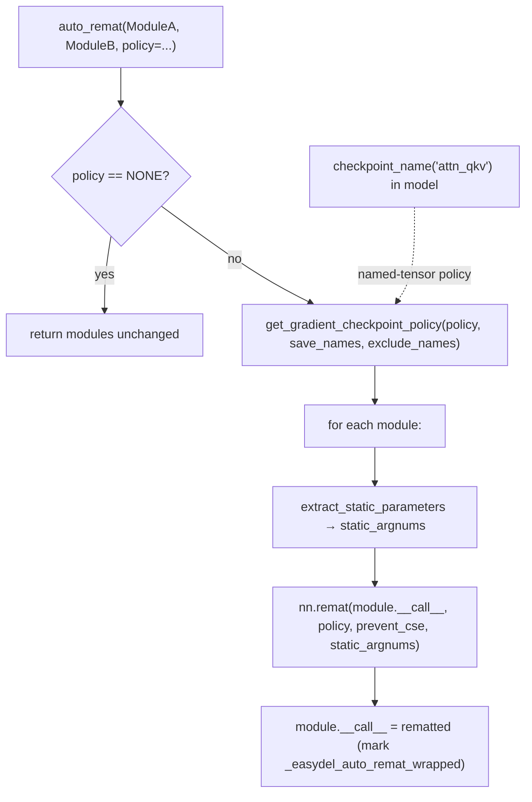

# easydel/infra/utils — auto_remat rematerialization, the activation registry, and FLOP accounting

## Overview
A grab-bag infra module, but its performance-load-bearing export is [`auto_remat`](../catalog/easydel/infra/utils.md#auto_remat): the one-call way to wrap a module's `__call__` in JAX rematerialization (gradient checkpointing), trading recompute for activation memory during the backward pass. It supports the full spectrum of checkpoint policies — from "save nothing" (recompute everything) to named-tensor policies that save only specific `checkpoint_name`-annotated tensors (like the `"attn_qkv"`/`"attn_output"` names the attention layer emits). The rest of the file supplies the shared [`ACT2FN`](../catalog/easydel/infra/utils.md#ACT2FN) activation registry, the [`ArrayParam`](../catalog/easydel/infra/utils.md#ArrayParam) serializable-parameter container, a [`ProcessingClassType`](../catalog/easydel/infra/utils.md#ProcessingClassType) tokenizer/processor type alias, and a large FLOP-counting toolkit (`flop_attention`, `flop_mlp`, `count_flop_jaxpr`, ...) that backs the model's MFU accounting.

## Diagram

## Design rationale (why it's built this way)
- **Rematerialization as a class-level wrap, idempotent.** [`auto_remat`](../catalog/easydel/infra/utils.md#auto_remat) mutates `module.__call__` to a `nn.remat`-wrapped version and tags it with `_easydel_auto_remat_wrapped` so calling it twice is a no-op — you can't accidentally double-remat a module. Wrapping the *class method* (not an instance) means every instance of that module type inherits checkpointing.
- **Policy is the whole knob.** The `policy` arg accepts an `EasyDeLGradientCheckPointers` enum, a string name (`'dots_saveable'`, `'nothing_saveable'`), or a custom callable — and two special modes, `'save_only_these_names'` / `'save_anything_except_these_names'`, work with `save_names`/`exclude_names` against the `checkpoint_name(...)` annotations models sprinkle on tensors. This is why attention wraps its projections in `checkpoint_name("attn_query")` etc.: it makes those tensors addressable by a selective remat policy, so you can choose to keep the cheap-to-store QKV and recompute the expensive MLP.
- **`static_argnums` preserved through remat.** Before wrapping, it calls `extract_static_parameters(module)` and passes the result as `static_argnums` to `nn.remat` — so arguments that must stay Python-static (e.g. `mode`) don't get traced into the rematerialized region, which would break compilation.
- **`prevent_cse` default True.** Common-subexpression elimination across a remat boundary can defeat the memory saving by keeping recomputed values alive; defaulting `prevent_cse=True` protects the intended trade.
- **`ArrayParam` stores init as data, not a closure.** [`ArrayParam`](../catalog/easydel/infra/utils.md#ArrayParam) keeps `init_method` as a *string* name plus `init_kwargs` instead of an initializer function — making the parameter pickleable/serializable for checkpointing and distributed use, where a captured Python init function wouldn't survive.

## Entry points
- [`auto_remat`](../catalog/easydel/infra/utils.md#auto_remat) — the rematerialization wrapper; called at model-build time on the layer classes whose activations should be checkpointed. Returns the same class(es) with a rematted `__call__`.
- [`ACT2FN`](../catalog/easydel/infra/utils.md#ACT2FN) — the name→activation dict (`"gelu"`, `"silu"`/`"swish"`, `"gelu_new"`, `"quick_gelu"`, ...); every model's MLP resolves its activation through this so a config string maps to a JAX function.
- [`ArrayParam`](../catalog/easydel/infra/utils.md#ArrayParam) — the serializable `nn.Param` subclass used where init metadata must round-trip through a checkpoint.
- [`ProcessingClassType`](../catalog/easydel/infra/utils.md#ProcessingClassType) — the union type alias for tokenizer/image-processor/feature-extractor/processor classes, used to type the "processing class" threaded through data/generation code.

## Mechanism (step-by-step)
1. **Short-circuit when checkpointing is off.** [`auto_remat`](../catalog/easydel/infra/utils.md#auto_remat) returns the modules untouched if `policy` is `NONE`/`""`/`"none"` — so the default build path has zero remat overhead.
2. **Resolve the policy.** Inside [`auto_remat`](../catalog/easydel/infra/utils.md#auto_remat), a string/enum policy is turned into a concrete callable via `get_gradient_checkpoint_policy(policy, save_names, exclude_names)`; a non-callable non-string raises. Named-tensor policies bind to the `save_names`/`exclude_names` lists here, and an [`EasyDeLGradientCheckPointers.NONE`](../catalog/easydel/infra/etils.md#EasyDeLGradientCheckPointers.NONE) policy short-circuits.
3. **Wrap each module's `__call__` once.** For each module [`auto_remat`](../catalog/easydel/infra/utils.md#auto_remat) skips already-wrapped ones (via the `_easydel_auto_remat_wrapped` flag), computes `static_argnums` from `extract_static_parameters`, builds `nn.remat(module.__call__, prevent_cse=..., static_argnums=..., policy=...)`, marks and assigns it back to `module.__call__`.
4. **Activations and FLOPs are looked up on demand.** MLPs resolve their nonlinearity via [`ACT2FN`](../catalog/easydel/infra/utils.md#ACT2FN); the model's `flops_per_token` accounting composes the per-op FLOP helpers (`flop_attention`, `flop_mlp`, `flop_lm_head`, `count_flop_jaxpr`) defined here.

## Key data structures
- [`ACT2FN`](../catalog/easydel/infra/utils.md#ACT2FN) — activation name registry (dict).
- [`ArrayParam`](../catalog/easydel/infra/utils.md#ArrayParam) — `nn.Param` with `{shape, dtype, init_method: str, init_kwargs}` for serializable init.
- `AttnMaskType` / `AttnMaskDetail` — the mask-kind enum + detail struct (SLIDING etc.) the caches consult; `FlopCalcConfig`/`ActivationType` back the FLOP accounting.
- [`ProcessingClassType`](../catalog/easydel/infra/utils.md#ProcessingClassType) — tokenizer/processor union alias.

## Dynamics (design intent)
- The named-tensor remat policy is the fine-grained lever the optimization loop actually pulls: because attention/MLP tag their outputs with `checkpoint_name`, a `save_only_these_names` policy lets you pick *exactly* which activations survive the forward vs. get recomputed — the per-tensor memory/compute frontier, rather than an all-or-nothing checkpoint.
- Idempotent wrapping means the build can safely call `auto_remat` on shared module classes multiple times across a model without compounding the wrapping.

## Edge cases
- **Double-wrap is a no-op** by design (the flag guard) — but note it wraps the *class* method, so wrapping a class used by two different models applies the same policy to both.
- **Wrong `static_argnums`** (if `extract_static_parameters` misidentifies a static arg) would trace a value that must stay static — the explicit extraction step exists to avoid this.
- **`prevent_cse=False`** can silently erase the memory benefit by letting XLA CSE recomputed values back into liveness.

## Open questions
> [!inferred] `get_gradient_checkpoint_policy`, `create_transformer_checkpoint_policy`, and the full FLOP-counting suite are in this file but outside this packet's citation subgraph; this page documents the cited `auto_remat`/`ACT2FN`/`ArrayParam`/`ProcessingClassType` surface and how remat policies interact with model `checkpoint_name` annotations.

## See also
- [easydel/layers/attention/_unified](easydel-layers-attention-_unified.md) — emits the `checkpoint_name` tensors selective remat targets.
- [easydel/infra/base_config](easydel-infra-base_config.md) — `gradient_checkpointing` knob that drives which policy `auto_remat` gets.
- [easydel/infra/base_module](easydel-infra-base_module.md) — `flops_per_token` uses this file's FLOP helpers.

## Sources
- raw/code/EasyDeL/easydel/infra/utils.py
