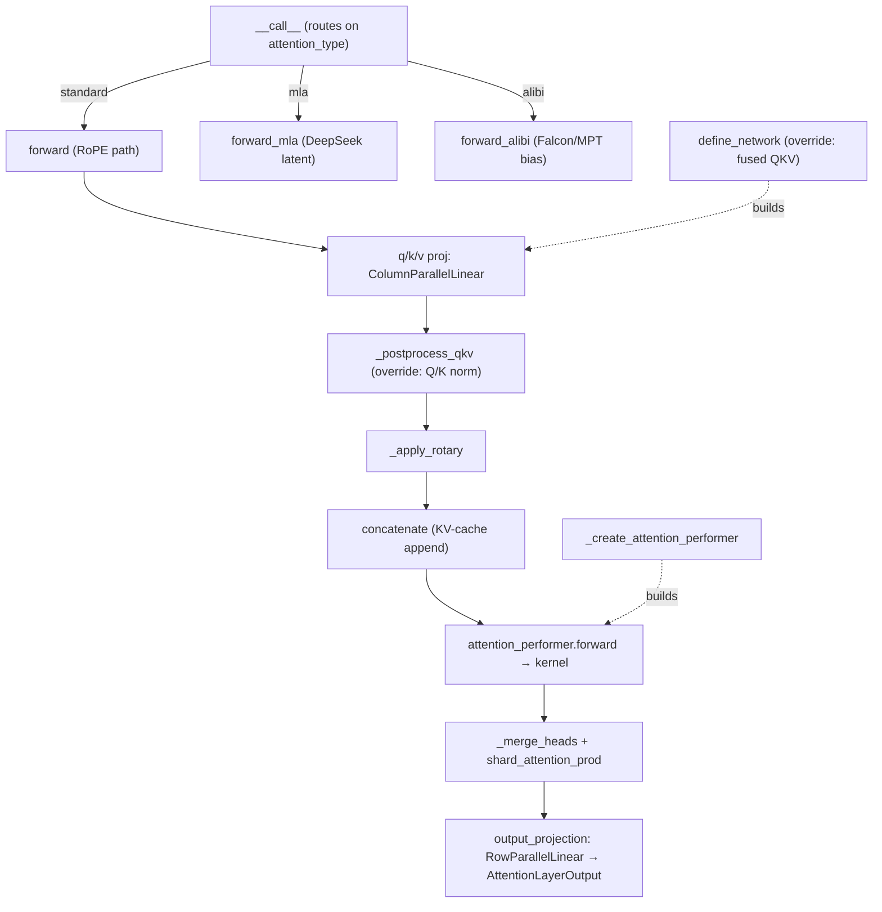

# easydel/layers/attention/_unified — one attention base class, three positional regimes, override hooks

## Overview
[`UnifiedAttention`](../catalog/easydel/layers/attention/_unified.md#UnifiedAttention) is the single base class every EasyDeL model's attention layer subclasses. Its key idea: the *common* attention plumbing (QKV projection → reshape → RoPE → KV-cache concat → kernel dispatch → head-merge → output projection) is written once, and the ~90 model architectures customize only the parts that actually differ through a small set of named override hooks (`_postprocess_qkv`, `define_network`, `_create_rotary`) rather than reimplementing the whole path. Positional-encoding families that *can't* share the main path — Multi-head Latent Attention (DeepSeek) and ALiBi (Falcon/MPT) — get their own full [`forward_mla`](../catalog/easydel/layers/attention/_unified.md#UnifiedAttention.forward_mla) / [`forward_alibi`](../catalog/easydel/layers/attention/_unified.md#UnifiedAttention.forward_alibi) methods, and [`__call__`](../catalog/easydel/layers/attention/_unified.md#UnifiedAttention.__call__) routes to the right one based on a single `attention_type` string set at construction. The actual math is not here — it is delegated to a per-instance [`FlexibleAttentionModule`](../catalog/easydel/layers/attention/_flexible.md#FlexibleAttentionModule) that picks the concrete TPU/GPU kernel (Flash, Splash, Ring, ...).

## Diagram

## Design rationale (why it's built this way)
- **Template-method inheritance instead of copy-paste per model.** The class docstring states it directly: "A single base class that handles all common attention patterns through: 1. Multiple forward paths (methods) for different attention types, 2. Post-processing hooks for Q/K normalization and other transformations, 3. Automatic routing based on configuration." The payoff is visible in the packet's `(virtual)` edges: [`DbrxAttention.forward`](../catalog/easydel/modules/dbrx/modeling_dbrx.md#DbrxAttention.forward), [`OpenELMMultiHeadCausalAttention.forward`](../catalog/easydel/modules/openelm/modeling_openelm.md#OpenELMMultiHeadCausalAttention.forward), [`Qwen3NextFullAttention.forward`](../catalog/easydel/modules/qwen3_next/modeling_qwen3_next.md#Qwen3NextFullAttention.forward), and [`Phi3Attention.__call__`](../catalog/easydel/modules/phi3/modeling_phi3.md#Phi3Attention.__call__) are all recovered as overrides of these base methods — each model overrides the *one* hook it needs and inherits the rest.
- **Two indirection tables (`projection_mapping`, `norms_mapping`) decouple attribute names from roles.** Instead of hardcoding `self.q_proj`, the base uses `setattr(self, self.projection_mapping["query_projection"], ...)` in [`define_network`](../catalog/easydel/layers/attention/_unified.md#UnifiedAttention.define_network). A model whose checkpoint uses different projection names overrides the class-var dict rather than the construction code — the MLA-specific entries (`mla_q_a_proj`, `mla_kv_a_proj_with_mqa`, ...) live in the same table so the latent path reuses the same machinery.
- **The kernel choice is a *per-instance* object, not a global.** [`_create_attention_performer`](../catalog/easydel/layers/attention/_unified.md#UnifiedAttention._create_attention_performer) builds one [`FlexibleAttentionModule`](../catalog/easydel/layers/attention/_flexible.md#FlexibleAttentionModule) per attention layer, and for MLA layers it honors a *separate* `mla_attn_mechanism` / `mla_attn_dtype` config so a mixed model can run its MLA layers on a different kernel and precision than its dense layers — it deep-copies the config before mutating `attn_dtype` so the override doesn't leak to sibling layers.

## Entry points
- [`__call__`](../catalog/easydel/layers/attention/_unified.md#UnifiedAttention.__call__) — the single public entry every decoder layer invokes. It reads `self.attention_type` (fixed at construction) and dispatches to [`forward`](../catalog/easydel/layers/attention/_unified.md#UnifiedAttention.forward), [`forward_mla`](../catalog/easydel/layers/attention/_unified.md#UnifiedAttention.forward_mla), or [`forward_alibi`](../catalog/easydel/layers/attention/_unified.md#UnifiedAttention.forward_alibi); its docstring notes models "usually don't need to override this method" — they override the specific `forward_*` or the helper hooks instead.
- [`__init__`](../catalog/easydel/layers/attention/_unified.md#UnifiedAttention.__init__) — captures the behavior flags (`attention_type`, `causal`, `sliding_window`, `use_qk_norm`, `use_fused_qkv`, `use_gqa`, `use_mla_lora`), derives [`num_heads`](../catalog/easydel/layers/attention/_unified.md#UnifiedAttention.num_heads)/[`head_dim`](../catalog/easydel/layers/attention/_unified.md#UnifiedAttention.head_dim)/`num_key_value_groups` from the [`EasyDeLBaseConfig`](../catalog/easydel/infra/base_config.md#EasyDeLBaseConfig), then calls [`define_network`](../catalog/easydel/layers/attention/_unified.md#UnifiedAttention.define_network) to materialize the actual parameters — construction is where the whole layer shape is decided.
- [`define_network`](../catalog/easydel/layers/attention/_unified.md#UnifiedAttention.define_network) — the primary *structural* override point. It builds either a fused QKV projection or three separate [`ColumnParallelLinear`](../catalog/easydel/layers/linears/_linear.md#ColumnParallelLinear) Q/K/V projections plus a [`RowParallelLinear`](../catalog/easydel/layers/linears/_linear.md#RowParallelLinear) output projection, creates the rotary embedding (or ALiBi slopes), and instantiates the [`attention_performer`](../catalog/easydel/layers/attention/_unified.md#UnifiedAttention.attention_performer). Models with fused-QKV checkpoints (e.g. [`DeepseekV2Attention.define_network`](../catalog/easydel/modules/deepseek_v2/modeling_deepseek.md#DeepseekV2Attention.define_network), [`DeepseekV3Attention.define_network`](../catalog/easydel/modules/deepseek_v3/modeling_deepseek.md#DeepseekV3Attention.define_network)) override exactly this.

## Mechanism (step-by-step)
1. **Projection, with a fused/GQA fast path.** [`forward`](../catalog/easydel/layers/attention/_unified.md#UnifiedAttention.forward) first projects hidden states to Q/K/V. When `use_fused_qkv` is set it runs a single `query_key_value_projection` and splits the result — and when `use_gqa` is *also* set it `rearrange`s the fused tensor into `2 + num_key_value_groups` groups so the query heads and the (shared) K/V heads come out of one matmul, saving two separate GEMMs. Otherwise it runs three independent projections. Every projection output is wrapped in `checkpoint_name(...)` (`"attn_qkv"`/`"attn_query"`/...) so rematerialization policies can name-target these tensors. The projections themselves are [`ColumnParallelLinear`](../catalog/easydel/layers/linears/_linear.md#ColumnParallelLinear) built in [`define_network`](../catalog/easydel/layers/attention/_unified.md#UnifiedAttention.define_network).
2. **Reshape then the Q/K-norm hook.** The flat projections are reshaped to `[batch, seq, num_heads, head_dim]` (K/V to `num_key_value_heads`), then passed through [`_postprocess_qkv`](../catalog/easydel/layers/attention/_unified.md#UnifiedAttention._postprocess_qkv) — the base implementation is a pass-through, but the docstring flags it "**KEY METHOD**": a model like Gemma3 overrides it to apply [`RMSNorm`](../catalog/easydel/layers/norms/_norms.md#RMSNorm) (or [`LayerNorm`](../catalog/easydel/layers/norms/_norms.md#LayerNorm)) to Q and K before RoPE. Placing the hook *after* the reshape means the norm sees per-head vectors, which is what QK-norm requires.
3. **Sharding + RoPE.** The reshaped tensors get logical-sharding constraints applied, then RoPE is applied to Q and K (the frequencies are either passed in or produced by the rotary module built via [`_create_rotary`](../catalog/easydel/layers/attention/_unified.md#UnifiedAttention._create_rotary)). ALiBi layers skip this — [`define_network`](../catalog/easydel/layers/attention/_unified.md#UnifiedAttention.define_network) sets `self.rotary = None` when `attention_type == "alibi"`.
4. **KV-cache append via `concatenate`.** [`concatenate`](../catalog/easydel/layers/attention/_flexible.md#AttentionModule.concatenate) (inherited from [`AttentionModule`](../catalog/easydel/layers/attention/_flexible.md#AttentionModule)) merges the freshly-computed K/V with whatever is already in the `cache_view` — one of [`TransformerCacheView`](../catalog/easydel/caching/transformer/cache.md#TransformerCacheView), [`RaggedPagesCacheView`](../catalog/easydel/caching/ragged_page/cache.md#RaggedPagesCacheView), or [`UnifiedAttentionCacheView`](../catalog/easydel/caching/unified_attention/cache.md#UnifiedAttentionCacheView) — and returns updated K/V, the mask, and a bias initializer. Two subtle flags are resolved just before this: if the `mask_info` has `_causal_baked` the kernel is told `causal=False` (the causal structure is already in the mask), and if it has `sliding_window_baked_in` the sliding-window arg is cleared — avoiding double-application of masking.
5. **Kernel dispatch.** The concatenated tensors go to [`attention_performer.forward`](../catalog/easydel/layers/attention/_flexible.md#FlexibleAttentionModule.forward), which is where the actual attention math runs on the backend-selected kernel; it returns an [`AttentionOutput`](../catalog/easydel/operations/_attention_outputs.md#AttentionOutput) whose [`attention_outputs`](../catalog/easydel/operations/_attention_outputs.md#AttentionOutput.attention_outputs) field holds the `[batch, seq, heads, dim]` result and may carry an updated cache view.
6. **Head-merge, shard, output projection.** The result is reshaped back to `[batch, seq, hidden]`, passed through [`shard_attention_prod`](../catalog/easydel/layers/attention/_flexible.md#AttentionModule.shard_attention_prod) (which applies `HiddenStateSharding` via the config's [`partition_manager`](../catalog/easydel/infra/base_config.md#EasyDeLBaseConfig.partition_manager)) so the tensor is correctly laid out for the row-parallel output GEMM, then through the [`RowParallelLinear`](../catalog/easydel/layers/linears/_linear.md#RowParallelLinear) output projection, optional residual dropout, and returned as an [`AttentionLayerOutput`](../catalog/easydel/infra/modeling_outputs.md#AttentionLayerOutput) whose [`cache_view`](../catalog/easydel/infra/modeling_outputs.md#AttentionLayerOutput.cache_view) threads the updated cache back to the caller.

## Key data structures
- The `attention_type` string (`"standard"|"mla"|"alibi"`) is the whole routing state — set once in [`__init__`](../catalog/easydel/layers/attention/_unified.md#UnifiedAttention.__init__), read in [`__call__`](../catalog/easydel/layers/attention/_unified.md#UnifiedAttention.__call__).
- [`AttentionLayerOutput`](../catalog/easydel/infra/modeling_outputs.md#AttentionLayerOutput) — the return envelope: attention output, optional weights, and the updated [`cache_view`](../catalog/easydel/infra/modeling_outputs.md#AttentionLayerOutput.cache_view). It is one of a family of output dataclasses ([`DecoderLayerOutput`](../catalog/easydel/infra/modeling_outputs.md#DecoderLayerOutput), [`BaseModelOutput`](../catalog/easydel/infra/modeling_outputs.md#BaseModelOutput), [`CausalLMOutput`](../catalog/easydel/infra/modeling_outputs.md#CausalLMOutput), [`MoeModelOutput`](../catalog/easydel/infra/modeling_outputs.md#MoeModelOutput), [`SequenceClassifierOutput`](../catalog/easydel/infra/modeling_outputs.md#SequenceClassifierOutput), [`VLMCausalLMOutput`](../catalog/easydel/infra/modeling_outputs.md#VLMCausalLMOutput), [`ModelOutput`](../catalog/easydel/infra/modeling_outputs.md#ModelOutput)) that thread cache/weights up the layer stack.
- `projection_mapping` / `norms_mapping` class-vars — the role→attribute-name indirection tables the whole `define_network`/`_create_*` machinery reads.

## Dynamics (design intent)
- The cache-view *union type* (`TransformerCacheView | RaggedPagesCacheView | UnifiedAttentionCacheView`) means the same [`forward`](../catalog/easydel/layers/attention/_unified.md#UnifiedAttention.forward) body serves training (no cache), transformer-style contiguous decode, and paged decode without branching in the layer — the branching lives inside [`concatenate`](../catalog/easydel/layers/attention/_flexible.md#AttentionModule.concatenate) / [`concatenate_to_cache`](../catalog/easydel/caching/transformer/cache.md#TransformerCacheView.concatenate_to_cache) and the corresponding metadata ([`TransformerMetadata`](../catalog/easydel/caching/transformer/cache.md#TransformerMetadata), [`RaggedPagesMetadata`](../catalog/easydel/caching/ragged_page/cache.md#RaggedPagesMetadata), [`OperationsMetadata`](../catalog/easydel/caching/_abstracts.md#OperationsMetadata)).
- `mode` (`common_types.RUNTIME_MODE_TYPES`, i.e. TRAIN/PREFILL/DECODE) is threaded all the way into [`attention_performer.forward`](../catalog/easydel/layers/attention/_flexible.md#FlexibleAttentionModule.forward), so a single compiled layer specializes its kernel behavior by mode rather than needing distinct layer classes.

## Edge cases
- **Causal/sliding-window "baked-in" flags.** If a mask was pre-computed with the causal or sliding-window structure already applied, [`forward`](../catalog/easydel/layers/attention/_unified.md#UnifiedAttention.forward) must *not* re-apply them at the kernel — hence the `_causal_baked` / `sliding_window_baked_in` checks that flip `causal_for_kernel`/`sliding_window_for_kernel` before dispatch.
- **`softmax_aux` (attention sinks).** `forward` looks up `self.sinks` or `self.softmax_aux` and unwraps a `.value`, passing it to the kernel — models with attention-sink tokens set this attribute; models without it pass `None`.
- **GQA head layout under fused QKV.** The `rearrange` with `gs=2 + num_key_value_groups` bakes a specific memory layout assumption (query groups first, then one K and one V head) — a fused-QKV checkpoint that interleaves heads differently would need a `define_network`/`forward` override, not just a flag.

## Open questions
> [!inferred] The exact backend-selection logic inside [`FlexibleAttentionModule`](../catalog/easydel/layers/attention/_flexible.md#FlexibleAttentionModule) (how it picks Flash vs Splash vs Ring from hardware + `attn_mechanism`) lives in `_flexible.py` beyond this packet's subgraph; this page documents only that the selection is per-instance and honors an MLA-specific override.

## See also
- [easydel/layers/linears/_linear](easydel-layers-linears-_linear.md) — the `ColumnParallelLinear`/`RowParallelLinear` projections attention builds.
- [easydel/layers/norms/_norms](easydel-layers-norms-_norms.md) — the `RMSNorm`/`LayerNorm` used by the Q/K-norm hook.
- [easydel/caching/transformer/cache](easydel-caching-transformer-cache.md), [easydel/caching/ragged_page/cache](easydel-caching-ragged_page-cache.md), [easydel/caching/_abstracts](easydel-caching-_abstracts.md) — the cache views/metadata `concatenate` writes into.
- [easydel/infra/modeling_outputs](easydel-infra-modeling_outputs.md) — the output-envelope family.

## Sources
- raw/code/EasyDeL/easydel/layers/attention/_unified.py
- raw/code/EasyDeL/easydel/layers/attention/_flexible.py
