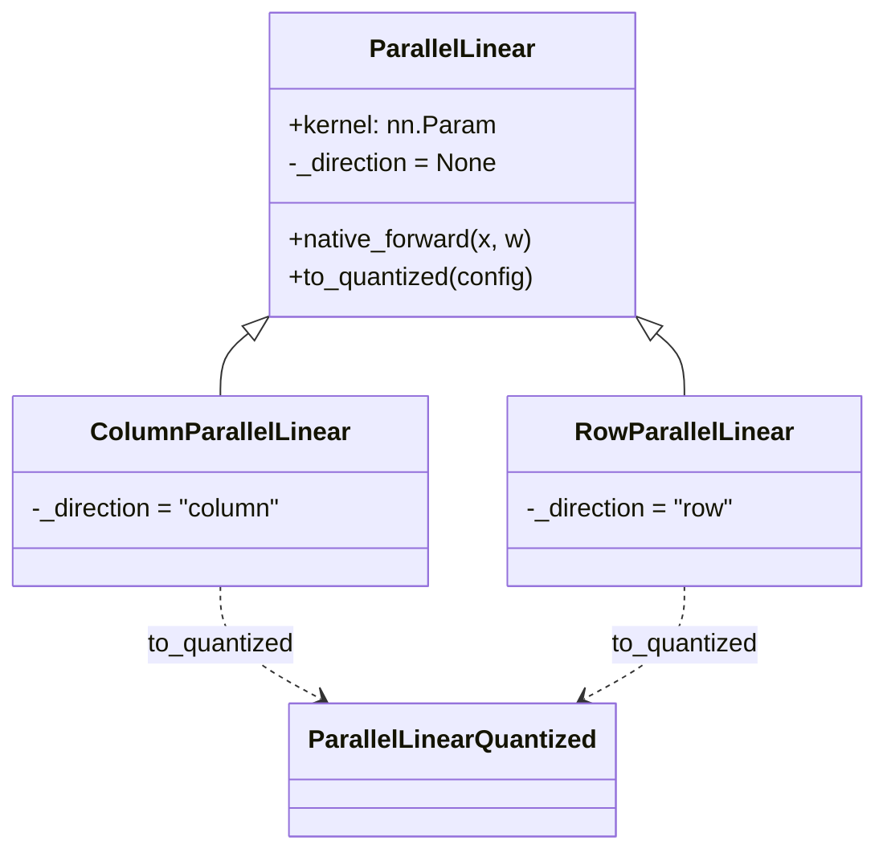

# easydel/layers/linears/_linear — the tensor-parallel Linear every projection is built from

## Overview
[`ParallelLinear`](../catalog/easydel/layers/linears/_linear.md#ParallelLinear) is EasyDeL's single dense-layer primitive: one `x @ W (+ b)` implementation whose only job beyond a plain matmul is to carry a *parallelism direction* so the sharding system knows how to partition its weight. It has exactly two concrete subclasses — [`ColumnParallelLinear`](../catalog/easydel/layers/linears/_linear.md#ColumnParallelLinear) (output dimension sharded, no communication) and [`RowParallelLinear`](../catalog/easydel/layers/linears/_linear.md#RowParallelLinear) (input dimension sharded, needs an all-reduce) — which differ *only* in a one-line `_direction` class variable. Every attention projection and MLP layer across the ~90 model architectures is one of these two, so this ~510-line file is the highest-fan-in perf surface in the layer stack: its dtype-promotion and `einsum` choices apply to every GEMM in the model.

## Diagram

The canonical MLP wiring the docstrings describe: `x → ColumnParallelLinear → activation → RowParallelLinear → (all-reduce) → y`.

## Design rationale (why it's built this way)
- **Direction is data, not code.** [`RowParallelLinear`](../catalog/easydel/layers/linears/_linear.md#RowParallelLinear) and [`ColumnParallelLinear`](../catalog/easydel/layers/linears/_linear.md#ColumnParallelLinear) are near-empty subclasses whose entire specialization is `_direction = "row"` / `"column"`. `craft_sharding` reads that string to choose `RowWise` vs `ColumnWise` kernel partition specs (bias always `Replicated`). Keeping the compute identical across both means the compiler sees one linear pattern and the *only* variable is the partition spec — the column-then-row MLP pairing (docstrings: column-parallel first, "no comm needed"; row-parallel second, "all-reduce") falls out of picking the right subclass per layer, not from writing two different forwards.
- **A `scale` operator folded into the layer.** The constructor precompiles a `_scale_operator` closure — identity when `scale == 1.0`, else a multiply — chosen once at build time from `float | "fan_in" | "fan_out"`. This lets models like Gemma fold a `1/sqrt(d)` logit-scaling directly into a projection ([`Gemma2MLP.act`](../catalog/easydel/modules/gemma2/modeling_gemma2.md#Gemma2MLP.act), [`Gemma3MLP.act`](../catalog/easydel/modules/gemma3/modeling_gemma3.md#Gemma3MLP.act) sit next to such scaled projections) without a separate op in the graph.
- **`out_features` may be a sequence (fused/merged tensor-parallel output).** The constructor detects a sequence `out_features`, sums it for the [`kernel`](../catalog/easydel/layers/linears/_linear.md#ParallelLinear.kernel) shape, and records `tp_merged` — this is how a fused QKV projection ([`UnifiedAttention._create_fused_qkv_proj`](../catalog/easydel/layers/attention/_unified.md#UnifiedAttention._create_fused_qkv_proj), [`FalconAttention._create_fused_qkv_proj`](../catalog/easydel/modules/falcon/modeling_falcon.md#FalconAttention._create_fused_qkv_proj)) packs several logically-separate outputs into one weight and one matmul.

## Entry points
- [`ColumnParallelLinear`](../catalog/easydel/layers/linears/_linear.md#ColumnParallelLinear) — the default projection constructor throughout the codebase: attention Q/K/V ([`UnifiedAttention._create_q_proj`](../catalog/easydel/layers/attention/_unified.md#UnifiedAttention._create_q_proj), [`_create_k_proj`](../catalog/easydel/layers/attention/_unified.md#UnifiedAttention._create_k_proj), [`_create_v_proj`](../catalog/easydel/layers/attention/_unified.md#UnifiedAttention._create_v_proj)), MLP up/gate projections, LM heads ([`RobertaLMHead.decoder`](../catalog/easydel/modules/roberta/modeling_roberta.md#RobertaLMHead.decoder)), and vision projectors ([`AyaVisionMultiModalProjector.linear_1`](../catalog/easydel/modules/aya_vision/modeling_aya_vision.md#AyaVisionMultiModalProjector.linear_1)) are all instances. Control reaches it at model construction time (e.g. inside every `define_network`).
- [`RowParallelLinear`](../catalog/easydel/layers/linears/_linear.md#RowParallelLinear) — used for the *output/down* projections that must reduce across the sharded dimension: attention output ([`UnifiedAttention.output_projection`](../catalog/easydel/layers/attention/_unified.md#UnifiedAttention.output_projection), [`UnifiedAttention._create_o_proj`](../catalog/easydel/layers/attention/_unified.md#UnifiedAttention._create_o_proj), [`FalconAttention._create_o_proj`](../catalog/easydel/modules/falcon/modeling_falcon.md#FalconAttention._create_o_proj)) and MLP down-projections.
- [`native_forward`](../catalog/easydel/layers/linears/_linear.md#ParallelLinear.native_forward) — the actual compute; every call to a projection instance lands here (the public `__call__` just delegates to it).
- [`to_quantized`](../catalog/easydel/layers/linears/_linear.md#ParallelLinear.to_quantized) — the swap-in point that replaces a full-precision layer with its quantized sibling (its inverse being [`ParallelLinearQuantized.from_quantized`](../catalog/easydel/layers/linears/_linear_quantized.md#ParallelLinearQuantized.from_quantized)); reached during a post-build quantization pass.

## Mechanism (step-by-step)
1. **Weight + optional bias are allocated in the constructor.** The [`kernel`](../catalog/easydel/layers/linears/_linear.md#ParallelLinear.kernel) is an `nn.Param` of shape `(in_features, out_features_sum)`; bias (if `use_bias`) is `(out_features,)`. For a merged/fused output the columns of the single kernel are the concatenation of the several logical outputs. No sharding is applied here — that is deferred to `craft_sharding`, which the runtime invokes with the mesh + partition manager.
2. **The forward is one dtype-promoted `einsum`.** [`native_forward`](../catalog/easydel/layers/linears/_linear.md#ParallelLinear.native_forward) resolves the weight (either `self.kernel.value` or an injected `w` — the `w` override enables weight-tying/external injection), promotes inputs+kernel(+bias) to `self.dtype` via `promote_dtype`, and runs `jnp.einsum("...ik,...kj->...ij", ...)` with `optimize=True` and the configured `precision`. Choosing an `einsum` (not `dot_general` directly) lets it transparently handle arbitrary leading batch dims and lets XLA fuse it; `precision` is the knob that controls TPU MXU pass count (bf16 vs fp32 accumulation).
3. **Scale, then bias.** The `einsum` result passes through the precompiled `_scale_operator` (a no-op for the common `scale=1.0` case), then bias is reshaped to broadcast on the last axis and added. A missing [`kernel`](../catalog/easydel/layers/linears/_linear.md#ParallelLinear.kernel) raises immediately ("layer cannot run without kernel weights") — a guard for partially-loaded checkpoints.
4. **Quantization is a subclass swap, not an in-place mutation.** [`to_quantized`](../catalog/easydel/layers/linears/_linear.md#ParallelLinear.to_quantized) takes a [`QuantizationConfig`](../catalog/easydel/layers/quantization/_configs.md#QuantizationConfig), picks the matching quantized class via `_quantized_friend` (row→`RowParallelLinearQuantized`, column→`ColumnParallelLinearQuantized`), and builds a new layer holding compressed weights; the reverse path [`ParallelLinearQuantized.from_quantized`](../catalog/easydel/layers/linears/_linear_quantized.md#ParallelLinearQuantized.from_quantized) reconstructs a full-precision layer. Keeping the two representations as sibling classes (rather than a mode flag) means the quantized matmul is a genuinely different `__call__` body with no runtime branch in the hot path.

## Key data structures
- [`kernel`](../catalog/easydel/layers/linears/_linear.md#ParallelLinear.kernel) — the `nn.Param` weight; its shape encodes whether the layer is fused (sequence `out_features`).
- `_direction` (`"row"|"column"|None`) — the single field that distinguishes the subclasses and drives `craft_sharding`.
- `tp_merged` / `_scale_operator` — build-time-computed metadata (merge count, scaling closure) so the forward stays branch-light.

## Dynamics (design intent)
> [!inferred] Because `craft_sharding` returns partition *specs* rather than eagerly sharding, weight partitioning is decided lazily when the mesh is known — consistent with EasyDeL constructing modules abstractly and materializing/sharding them in a later pass. The column-parallel-then-row-parallel MLP convention (per the class docstrings) is what makes the intermediate activation stay sharded on the feature axis until the row-parallel all-reduce, minimizing communication to one collective per MLP.

## Edge cases
- **`out_features` as a sequence** changes kernel shape and sets `tp_merged > 1`; the bias shape logic still uses the raw `out_features`, so fused layers must be constructed with matching bias expectations.
- **`w` override in `native_forward`** bypasses `self.kernel` entirely — used for weight-shared heads (e.g. tied LM-head/embedding); the same layer object can thus be driven by external weights.
- **`scale="fan_in"/"fan_out"`** resolves to `in_features**-0.5` / `out_features**-0.5` at build time — a model that relies on this must not also apply the same scaling elsewhere, or it double-scales.

## Open questions
> [!inferred] `craft_sharding`, `_direction`, `_quantized_friend` and `_scale_operator` are read from source but are not in this packet's citation subgraph, so they are described in prose without a catalog link; the quantized forward bodies live in `_linear_quantized.py` (only [`from_quantized`](../catalog/easydel/layers/linears/_linear_quantized.md#ParallelLinearQuantized.from_quantized) is in-subgraph here).

## See also
- [easydel/layers/attention/_unified](easydel-layers-attention-_unified.md) — the largest consumer; every attention projection is a `Column`/`RowParallelLinear`.
- [easydel/layers/norms/_norms](easydel-layers-norms-_norms.md) — the other per-layer primitive.

## Sources
- raw/code/EasyDeL/easydel/layers/linears/_linear.py
