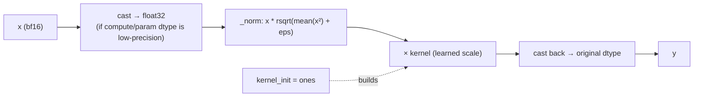

# easydel/layers/norms/_norms — RMSNorm / LayerNorm with mixed-precision discipline

## Overview
This module holds EasyDeL's normalization primitives — chiefly [`RMSNorm`](../catalog/easydel/layers/norms/_norms.md#RMSNorm) (the norm of essentially every modern LLM here) and [`LayerNorm`](../catalog/easydel/layers/norms/_norms.md#LayerNorm) (BERT/RoBERTa/OPT/Whisper-era models), plus a gated RMSNorm and a `BatchNorm`. The single design idea worth internalizing: normalization is the place where low-precision training most easily loses accuracy, so each norm *forces its reductions into float32* regardless of the model's compute dtype, then casts the result back — the learned scale stays cheap while the statistics stay numerically safe. Every decoder layer's `input_layernorm`/`post_attention_layernorm`, every model's final `norm`, and the attention Q/K-norm hooks are instances built here.

## Diagram

## Design rationale (why it's built this way)
- **Statistics in float32, params cheap.** [`RMSNorm.__call__`](../catalog/easydel/layers/norms/_norms.md#RMSNorm) checks whether either `param_dtype` or `dtype` is a low-float type and, if so, upcasts the input to float32 *before* computing the mean-square; otherwise it promotes to the wider of the two. The learned [`kernel`](../catalog/easydel/layers/norms/_norms.md#RMSNorm.kernel) (initialized to ones) is applied in `self.dtype`, and the final result is cast back to the *original* input dtype. This is the standard mixed-precision recipe (accumulate reductions wide, keep the surrounding math narrow) made explicit so a bf16 model doesn't silently compute variance in bf16.
- **`lax.rsqrt` instead of `1/sqrt`.** `_norm` uses `x * lax.rsqrt(mean(x²)+eps)`; the docstring notes `rsqrt` is "typically faster than separate division and sqrt operations on accelerator hardware" — a deliberate TPU/GPU-friendly choice.
- **Named scope for profiling.** `RMSNorm.__call__` is decorated `@jax.named_scope("easydel-rmsnorm")`, so norm time is attributable in an xprof trace rather than folded into an adjacent fusion — a concession that norms, though cheap in FLOPs, are worth seeing separately when hunting for un-fused elementwise overhead.
- **`LayerNorm` delegates its stats/normalize to shared util helpers** ([`LayerNorm.__call__`](../catalog/easydel/layers/norms/_norms.md#LayerNorm.__call__) calls `nutil._compute_stats` / `nutil._normalize`) and supports an optional `mask` to exclude padded positions from the statistics — RMSNorm has no mean-subtraction and thus no such path.

## Entry points
- [`RMSNorm`](../catalog/easydel/layers/norms/_norms.md#RMSNorm) — constructed wherever a model needs pre/post-norm: decoder `input_layernorm`/`post_attention_layernorm` across Qwen2/3, Phi3, StableLM ([`Qwen3DecoderLayer.input_layernorm`](../catalog/easydel/modules/qwen3/modeling_qwen3.md#Qwen3DecoderLayer.input_layernorm), [`Phi3DecoderLayer.post_attention_layernorm`](../catalog/easydel/modules/phi3/modeling_phi3.md#Phi3DecoderLayer.post_attention_layernorm), [`StableLmDecoderLayer.input_layernorm`](../catalog/easydel/modules/stablelm/modeling_stablelm.md#StableLmDecoderLayer.input_layernorm)), final model norms ([`Glm4MoeLiteModel.norm`](../catalog/easydel/modules/glm4_moe_lite/modeling_glm4_moe_lite.md#Glm4MoeLiteModel.norm)), Grok's four-norm block ([`Grok1DecoderLayer.pre_attn_norm`](../catalog/easydel/modules/grok_1/modeling_grok_1.md#Grok1DecoderLayer.pre_attn_norm), [`post_moe_norm`](../catalog/easydel/modules/grok_1/modeling_grok_1.md#Grok1DecoderLayer.post_moe_norm)), and the attention Q/K-norm hooks ([`UnifiedAttention._create_q_norm`](../catalog/easydel/layers/attention/_unified.md#UnifiedAttention._create_q_norm), [`_create_k_norm`](../catalog/easydel/layers/attention/_unified.md#UnifiedAttention._create_k_norm), overridden by Olmo2/3: [`Olmo2Attention._create_q_norm`](../catalog/easydel/modules/olmo2/modeling_olmo2.md#Olmo2Attention._create_q_norm)).
- [`LayerNorm`](../catalog/easydel/layers/norms/_norms.md#LayerNorm) — the mean-subtracting norm for encoder/older architectures: RoBERTa embeddings/output ([`RobertaEmbeddings.LayerNorm`](../catalog/easydel/modules/roberta/modeling_roberta.md#RobertaEmbeddings.LayerNorm), [`RobertaSelfOutput.LayerNorm`](../catalog/easydel/modules/roberta/modeling_roberta.md#RobertaSelfOutput.LayerNorm)), OPT/GPT-NeoX/Whisper final norms ([`OPTDecoder.final_layer_norm`](../catalog/easydel/modules/opt/modeling_opt.md#OPTDecoder.final_layer_norm), [`GPTNeoXModel.final_layer_norm`](../catalog/easydel/modules/gpt_neox/modeling_gpt_neox.md#GPTNeoXModel.final_layer_norm), [`WhisperDecoder.layer_norm`](../catalog/easydel/modules/whisper/modeling_whisper.md#WhisperDecoder.layer_norm)), and Falcon's dual attn/mlp norms ([`FalconBlock.ln_attn`](../catalog/easydel/modules/falcon/modeling_falcon.md#FalconBlock.ln_attn), [`FalconBlock.ln_mlp`](../catalog/easydel/modules/falcon/modeling_falcon.md#FalconBlock.ln_mlp)).
- [`BatchNorm.__call__`](../catalog/easydel/layers/norms/_norms.md#BatchNorm.__call__) — the running-statistics norm, present for vision/audio sub-networks that need it; not on the LLM decoder hot path.

## Mechanism (step-by-step)
1. **Construction allocates only the learned scale.** [`RMSNorm`](../catalog/easydel/layers/norms/_norms.md#RMSNorm)'s constructor stores `dim`/`eps`/dtypes and creates a single [`kernel`](../catalog/easydel/layers/norms/_norms.md#RMSNorm.kernel) parameter of shape `(dim,)` initialized to ones — RMSNorm has no bias and no mean term, so the whole parameter footprint is one vector per norm.
2. **Forward upcasts, normalizes, rescales, downcasts.** [`RMSNorm.__call__`](../catalog/easydel/layers/norms/_norms.md#RMSNorm) records the input dtype, conditionally upcasts to float32 (when compute or param dtype is low-precision), runs `_norm` (`x * rsqrt(mean(x²)+eps)`) in that wide dtype, multiplies by the scale in `self.dtype`, and casts back to the original dtype. The four-line body is deliberately explicit about every cast boundary.
3. **LayerNorm computes mean+variance, optionally masked.** [`LayerNorm.__call__`](../catalog/easydel/layers/norms/_norms.md#LayerNorm.__call__) promotes `x`/scale/bias to `self.dtype`, delegates statistics to `nutil._compute_stats` over its `reduction_axes` (honoring an optional `mask` and `use_fast_variance`), then `nutil._normalize` applies the affine transform — the mean subtraction is what distinguishes it from RMSNorm.
4. **Sharding of norm params is replication.** Both [`RMSNorm`](../catalog/easydel/layers/norms/_norms.md#RMSNorm) and [`LayerNorm`](../catalog/easydel/layers/norms/_norms.md#LayerNorm) implement `craft_sharding` returning `Replicated` specs for `kernel`/`scale`/`bias` — norm parameters are tiny and every device needs the full vector, so they are never partitioned; this is consistent across the whole file.

## Key data structures
- [`RMSNorm.kernel`](../catalog/easydel/layers/norms/_norms.md#RMSNorm.kernel) — the sole learned parameter (ones-initialized scale, shape `(dim,)`).
- `LayerNorm`'s `scale` + optional `bias`, plus `reduction_axes`/`feature_axes`/`use_fast_variance` config that parameterize the shared normalize helpers.

## Dynamics (design intent)
> [!inferred] The build system that materializes and dtype-transforms modules ([`EasyDeLBaseModule._build_transform_fn`](../catalog/easydel/infra/base_module.md#EasyDeLBaseModule._build_transform_fn)) applies dtype policies uniformly; the norms' internal float32 upcast is a *local* safety net independent of that policy, so even if a model is built fully in bf16 the norm statistics remain float32.

## Edge cases
- **`param_dtype` OR `dtype` low-precision** triggers the float32 upcast in RMSNorm — setting only one to bf16 still forces the wide reduction, which is intentional (either being narrow risks the accumulation).
- **LayerNorm `mask`** excludes padded positions from mean/variance; forgetting to pass it on padded batches biases the statistics toward the padding.
- RMSNorm applies scale in `self.dtype` (not float32), so an extreme learned scale could still lose precision on the final multiply even though the reduction was safe.

## Open questions
> [!inferred] `RMSNormGated` (SiLU-gated RMSNorm for linear-attention output paths) and `BatchNorm`'s running-stat handling are in this file but only `BatchNorm.__call__` is in-subgraph here; the gated variant's exact use sites aren't cited in this packet.

## See also
- [easydel/layers/attention/_unified](easydel-layers-attention-_unified.md) — builds `RMSNorm`/`LayerNorm` for the Q/K-norm hook.
- [easydel/layers/linears/_linear](easydel-layers-linears-_linear.md) — the sibling per-layer primitive.
- [easydel/infra/base_module](easydel-infra-base_module.md) — the dtype-transform build pass norms live inside.

## Sources
- raw/code/EasyDeL/easydel/layers/norms/_norms.py
