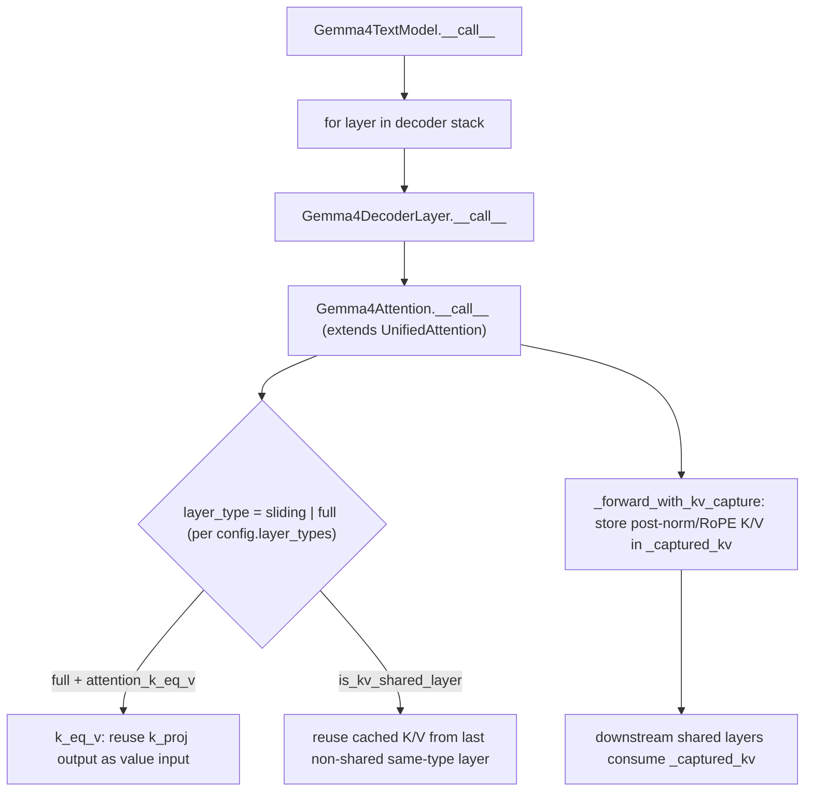

# easydel/modules/gemma4/modeling_gemma4 — a UnifiedAttention subclass showcasing per-layer attention variation

## Overview
Gemma4 is a good worked example of *how* an EasyDeL architecture customizes the shared machinery: `Gemma4Attention` subclasses [`UnifiedAttention`](../catalog/easydel/layers/attention/_unified.md) and adds four Gemma-specific tricks — per-layer sliding-vs-global attention selection, Q/K/V RMSNorm, key-equals-value weight elimination, and cross-layer KV sharing — each of which is a parameter/memory optimization, not a semantic change. The model registers three task bindings (base text model, causal-LM, image-text-to-text VLM) via the factory decorators, and its decoder layer ([`Gemma4DecoderLayer.__call__`](../catalog/easydel/modules/gemma4/modeling_gemma4.md#Gemma4DecoderLayer.__call__)) wires attention + a MoE-routed MLP. The one novel mechanism to understand is [`_forward_with_kv_capture`](../catalog/easydel/modules/gemma4/modeling_gemma4.md#Gemma4Attention._forward_with_kv_capture): a variant forward that stashes the post-norm/post-RoPE K/V so later "shared" layers can reuse them instead of recomputing.

## Diagram

## Design rationale (why it's built this way)
- **Customize via subclass + config, not a fork of the attention path.** `Gemma4Attention(UnifiedAttention)` inherits the whole projection/RoPE/cache/kernel pipeline and overrides only what differs — exactly the extension model [`UnifiedAttention`](../catalog/easydel/layers/attention/_unified.md) was built for. The `__init__` reads `config.layer_types[layer_idx]` to fix `is_sliding` per layer, so one class serves both local and global layers with different head geometry.
- **key-equals-value drops the V weight (~33% attn params).** The docstring: when `attention_k_eq_v=True` on a global layer, "the key projection output is reused as the value input (before normalization). This eliminates the separate `v_proj` weight matrix ... while the v_norm still produces a distinct representation from the k_norm output." A genuine parameter reduction that keeps K and V semantically distinct via separate norms.
- **KV sharing avoids redundant KV compute in deep tails.** Layers past `num_hidden_layers - num_kv_shared_layers` set `is_kv_shared_layer` and locate the last non-shared layer *of the same attention type* (`kv_shared_layer_index`) to reuse its K/V — so the deep tail of the model skips KV projection entirely. This is why [`_forward_with_kv_capture`](../catalog/easydel/modules/gemma4/modeling_gemma4.md#Gemma4Attention._forward_with_kv_capture) exists: the *providing* layer must stash its post-norm/post-RoPE K/V in `self._captured_kv` for the consumers.
- **Per-layer-type head geometry.** Global layers may use `global_head_dim`/`num_global_key_value_heads` (larger dim, fewer KV heads) while sliding layers use the standard values — resolved in `_resolve_head_dim`/`_resolve_num_kv_heads` at construction, so the kernel sees the right shapes per layer.

## Entry points
- [`Gemma4Attention.__call__`](../catalog/easydel/modules/gemma4/modeling_gemma4.md#Gemma4Attention.__call__) — the per-layer attention entry; routes to the standard path or the KV-capture path depending on whether this layer must provide K/V to shared downstream layers.
- [`_forward_with_kv_capture`](../catalog/easydel/modules/gemma4/modeling_gemma4.md#Gemma4Attention._forward_with_kv_capture) — the variant forward that runs the normal projection→norm→RoPE pipeline but also writes the post-processed K/V into `self._captured_kv` for reuse.
- [`Gemma4DecoderLayer.__call__`](../catalog/easydel/modules/gemma4/modeling_gemma4.md#Gemma4DecoderLayer.__call__) — one transformer block: attention + the MoE-routed MLP stack, with Gemma's characteristic pre/post norms.
- [`Gemma4TextModel.__call__`](../catalog/easydel/modules/gemma4/modeling_gemma4.md#Gemma4TextModel.__call__) — the backbone loop that runs the decoder layers and threads the shared-KV state between them.

## Mechanism (step-by-step)
1. **Construction resolves this layer's identity.** `Gemma4Attention.__init__` sets `layer_type`/`is_sliding` from `config.layer_types`, computes `use_alternative_attention` (`attention_k_eq_v and not is_sliding`), resolves per-type head dim / KV-head count, and determines `is_kv_shared_layer` + which earlier layer to share from — all static per layer, and read at dispatch time by [`Gemma4Attention.__call__`](../catalog/easydel/modules/gemma4/modeling_gemma4.md#Gemma4Attention.__call__).
2. **Standard layers run the inherited path.** A non-providing layer's [`__call__`](../catalog/easydel/modules/gemma4/modeling_gemma4.md#Gemma4Attention.__call__) uses the [`UnifiedAttention`](../catalog/easydel/layers/attention/_unified.md) pipeline (with Gemma's Q/K/V norms via the `_postprocess_qkv` hook and k_eq_v applied before norm).
3. **Provider layers capture K/V.** [`_forward_with_kv_capture`](../catalog/easydel/modules/gemma4/modeling_gemma4.md#Gemma4Attention._forward_with_kv_capture) projects Q/K/V (each `checkpoint_name`-tagged), runs the same preprocess/norm/RoPE, and stores the final K/V in `self._captured_kv` — so a later shared layer can attend against them without re-projecting.
4. **The backbone threads shared state.** [`Gemma4TextModel.__call__`](../catalog/easydel/modules/gemma4/modeling_gemma4.md#Gemma4TextModel.__call__) runs the stack, passing captured K/V from provider layers into their downstream consumers; [`Gemma4DecoderLayer.__call__`](../catalog/easydel/modules/gemma4/modeling_gemma4.md#Gemma4DecoderLayer.__call__) combines attention output with the routed MLP.

## Key data structures
- `layer_type`/`is_sliding`/`use_alternative_attention`/`is_kv_shared_layer`/`kv_shared_layer_index` — the static per-layer identity computed in `__init__`.
- `self._captured_kv` — the stash a provider layer writes for shared consumers.

## Dynamics (design intent)
> [!inferred] All three optimizations here (k_eq_v, KV sharing, per-type geometry) reduce parameters or KV compute without changing what the model represents — they are the class of "invalid if they changed semantics, valid if they don't" optimizations the autoresearch scope targets, and Gemma4 ships them as architecture, validated against the reference. This page treats them as a case study of the [`UnifiedAttention`](../catalog/easydel/layers/attention/_unified.md) extension contract, not as a re-derivation of the base pipeline.

## Edge cases
- **k_eq_v only on global (non-sliding) layers** — `use_alternative_attention` explicitly excludes sliding layers.
- **KV-shared layer whose type isn't in the earlier layers** falls back to `is_kv_shared_layer = False` (the `else` branch) — so sharing silently disables rather than sharing wrong-type K/V.
- **Provider/consumer ordering** — a consumer must run after its provider populated `_captured_kv`; the backbone loop order enforces this.

## Open questions
> [!inferred] The MoE router ([`Gemma4TextRouter`](../catalog/easydel/modules/gemma4/modeling_gemma4.md)), vision tower, and multimodal embedder are large parts of this file outside this packet's citation subgraph; this page focuses on the cited attention/decoder/backbone surface as an exemplar of per-layer attention customization.

## See also
- [easydel/layers/attention/_unified](easydel-layers-attention-_unified.md) — the base class Gemma4Attention extends.
- [easydel/layers/norms/_norms](easydel-layers-norms-_norms.md) — the RMSNorm used for Q/K/V norm.
- [easydel/infra/factory](easydel-infra-factory.md) — the decorators registering Gemma4's three task bindings.

## Sources
- raw/code/EasyDeL/easydel/modules/gemma4/modeling_gemma4.py
