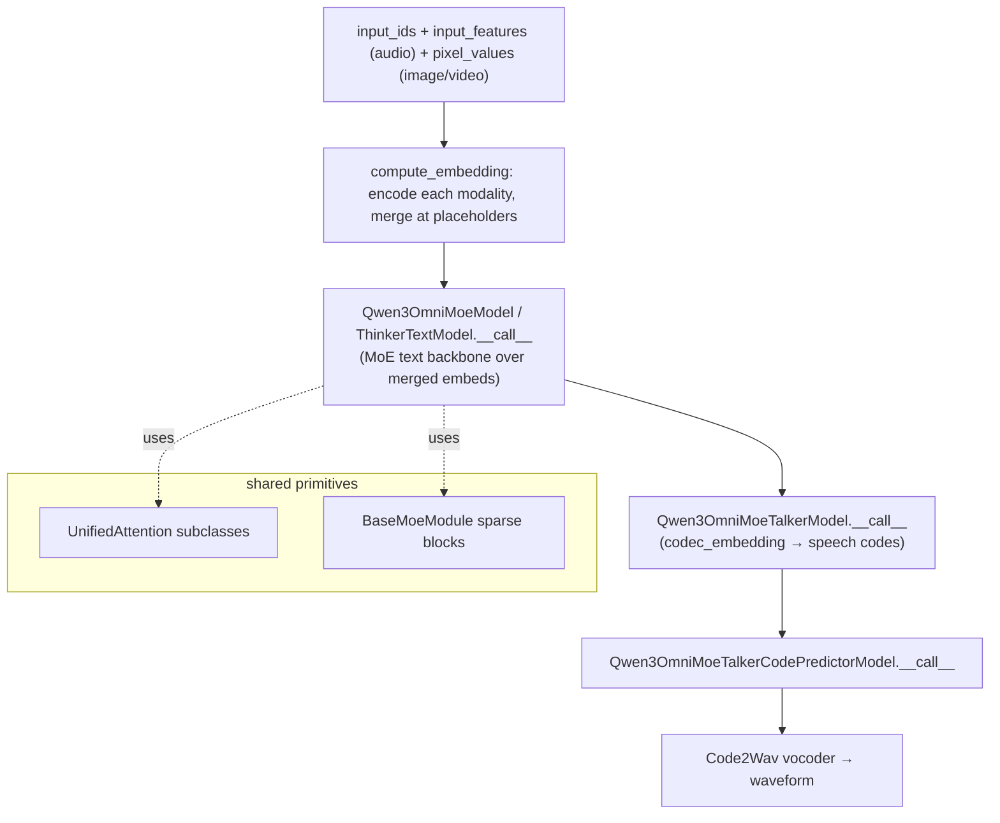

# easydel/modules/qwen3_omni_moe/modeling_qwen3_omni_moe — the multi-tower any-to-any omni model

## Overview
Qwen3-Omni-MoE is the largest, most compositional model in this ingest: a single file assembling *four* sub-models — a **Thinker** (audio + vision + text MoE understanding), a **Talker** (text→speech-codec generation), a **CodePredictor**, and a **Code2Wav** vocoder — into an any-to-any (text/audio/image/video in, text/audio out) system. The mental model to carry: it is not one transformer but a pipeline of MoE transformers, each still built from the shared primitives — the text towers' attention (`Qwen3OmniMoeTextAttention`, `Qwen3OmniMoeTalkerTextAttention`, `Qwen3OmniMoeTalkerCodePredictorAttention`) all subclass [`UnifiedAttention`](../catalog/easydel/layers/attention/_unified.md), their MoE blocks subclass `BaseMoeModule`, and the whole thing hangs off [`EasyDeLBaseModule`](../catalog/easydel/infra/base_module.md). The one cross-cutting mechanism is multimodal embedding merge: [`compute_embedding`](../catalog/easydel/modules/qwen3_omni_moe/modeling_qwen3_omni_moe.md#Qwen3OmniMoeModel.compute_embedding) encodes each modality and splices the results into the text-token embedding sequence at placeholder positions.

## Diagram

## Design rationale (why it's built this way)
- **One file, many towers, shared primitives.** Despite the size, each tower reuses the codebase's building blocks: the text attentions are [`UnifiedAttention`](../catalog/easydel/layers/attention/_unified.md) subclasses, the sparse MLPs are `BaseMoeModule` subclasses, and every top-level tower is an [`EasyDeLBaseModule`](../catalog/easydel/infra/base_module.md). So the omni model inherits sharding, remat, and state-split for free — the novelty is composition, not new low-level mechanism.
- **Modality encoders feed a common text backbone.** [`compute_embedding`](../catalog/easydel/modules/qwen3_omni_moe/modeling_qwen3_omni_moe.md#Qwen3OmniMoeModel.compute_embedding) computes text embeddings from `input_ids` (via [`Qwen3OmniMoeThinkerTextModel.embed_tokens`](../catalog/easydel/modules/qwen3_omni_moe/modeling_qwen3_omni_moe.md#Qwen3OmniMoeThinkerTextModel.embed_tokens)) and *merges* audio/image/video embeddings "at their respective placeholder positions." Encoding each modality to the text hidden space and splicing at placeholder tokens is what lets a single autoregressive backbone attend across modalities without modality-specific attention paths.
- **Generation is staged: think → talk → predict → vocode.** The Thinker produces text/understanding; the [`Qwen3OmniMoeTalkerModel.__call__`](../catalog/easydel/modules/qwen3_omni_moe/modeling_qwen3_omni_moe.md#Qwen3OmniMoeTalkerModel.__call__) turns that into speech-codec tokens (via its [`codec_embedding`](../catalog/easydel/modules/qwen3_omni_moe/modeling_qwen3_omni_moe.md#Qwen3OmniMoeTalkerModel.codec_embedding)); the [`Qwen3OmniMoeTalkerCodePredictorModel.__call__`](../catalog/easydel/modules/qwen3_omni_moe/modeling_qwen3_omni_moe.md#Qwen3OmniMoeTalkerCodePredictorModel.__call__) refines codes; Code2Wav renders audio. Each stage is a separate module so they can be sharded/compiled independently.
- **Backward-compat nesting.** The base [`Qwen3OmniMoeModel`](../catalog/easydel/modules/qwen3_omni_moe/modeling_qwen3_omni_moe.md#Qwen3OmniMoeModel.compute_embedding)'s docstring notes it nests audio/visual components under itself "kept for backward compatibility," whereas HF places them at the `ForConditionalGeneration` level — a deliberate structural choice for checkpoint compatibility.

## Entry points
- [`Qwen3OmniMoeModel.compute_embedding`](../catalog/easydel/modules/qwen3_omni_moe/modeling_qwen3_omni_moe.md#Qwen3OmniMoeModel.compute_embedding) — the multimodal merge: encodes text + audio (mel) + image/video (patch) and splices modality embeddings into the token sequence at placeholder positions.
- [`Qwen3OmniMoeModel.__call__`](../catalog/easydel/modules/qwen3_omni_moe/modeling_qwen3_omni_moe.md#Qwen3OmniMoeModel.__call__) / [`Qwen3OmniMoeThinkerTextModel.__call__`](../catalog/easydel/modules/qwen3_omni_moe/modeling_qwen3_omni_moe.md#Qwen3OmniMoeThinkerTextModel.__call__) — the understanding backbone running the MoE text stack over merged embeddings.
- [`Qwen3OmniMoeTalkerModel.__call__`](../catalog/easydel/modules/qwen3_omni_moe/modeling_qwen3_omni_moe.md#Qwen3OmniMoeTalkerModel.__call__) — the speech-generation tower, using its [`codec_embedding`](../catalog/easydel/modules/qwen3_omni_moe/modeling_qwen3_omni_moe.md#Qwen3OmniMoeTalkerModel.codec_embedding).
- [`Qwen3OmniMoeTalkerCodePredictorModel.__call__`](../catalog/easydel/modules/qwen3_omni_moe/modeling_qwen3_omni_moe.md#Qwen3OmniMoeTalkerCodePredictorModel.__call__) — the codec-token refinement stage.

## Mechanism (step-by-step)
1. **Encode + merge modalities.** [`compute_embedding`](../catalog/easydel/modules/qwen3_omni_moe/modeling_qwen3_omni_moe.md#Qwen3OmniMoeModel.compute_embedding) turns `input_ids` into text embeddings ([`embed_tokens`](../catalog/easydel/modules/qwen3_omni_moe/modeling_qwen3_omni_moe.md#Qwen3OmniMoeThinkerTextModel.embed_tokens)), encodes `input_features` (audio mel), `pixel_values`/`pixel_values_videos` (vision patches with `grid_thw` geometry), and writes each into the text sequence at its placeholder positions — producing one unified embedding stream.
2. **Run the Thinker MoE backbone.** [`Qwen3OmniMoeThinkerTextModel.__call__`](../catalog/easydel/modules/qwen3_omni_moe/modeling_qwen3_omni_moe.md#Qwen3OmniMoeThinkerTextModel.__call__) (via [`Qwen3OmniMoeModel.__call__`](../catalog/easydel/modules/qwen3_omni_moe/modeling_qwen3_omni_moe.md#Qwen3OmniMoeModel.__call__)) processes the merged stream through UnifiedAttention + sparse-MoE decoder layers — the same per-token top-k expert routing as any MoE model here, just over multimodal-augmented tokens.
3. **Generate speech codes.** [`Qwen3OmniMoeTalkerModel.__call__`](../catalog/easydel/modules/qwen3_omni_moe/modeling_qwen3_omni_moe.md#Qwen3OmniMoeTalkerModel.__call__) consumes the Thinker's hidden states and, using [`codec_embedding`](../catalog/easydel/modules/qwen3_omni_moe/modeling_qwen3_omni_moe.md#Qwen3OmniMoeTalkerModel.codec_embedding), autoregressively produces audio-codec tokens.
4. **Refine + vocode.** [`Qwen3OmniMoeTalkerCodePredictorModel.__call__`](../catalog/easydel/modules/qwen3_omni_moe/modeling_qwen3_omni_moe.md#Qwen3OmniMoeTalkerCodePredictorModel.__call__) refines the codes and the Code2Wav vocoder renders them to a waveform.

## Key data structures
- The four towers (Thinker/Talker/CodePredictor/Code2Wav), each an [`EasyDeLBaseModule`](../catalog/easydel/infra/base_module.md) with its own attention/MoE stack.
- The merged multimodal embedding produced by [`compute_embedding`](../catalog/easydel/modules/qwen3_omni_moe/modeling_qwen3_omni_moe.md#Qwen3OmniMoeModel.compute_embedding) — text tokens with audio/vision embeddings spliced at placeholders.
- `grid_thw` (temporal/height/width) geometry threaded through image/video encoding.

## Dynamics (design intent)
> [!inferred] Structuring the omni model as a pipeline of independent [`EasyDeLBaseModule`](../catalog/easydel/infra/base_module.md) towers (rather than one monolith) means each stage can be compiled and sharded on its own mesh plan and, at inference, run as a staged pipeline — the memory/throughput profile of the understanding backbone and the speech vocoder are very different, and separating them lets each be optimized independently.

## Edge cases
- **Placeholder-position alignment** in [`compute_embedding`](../catalog/easydel/modules/qwen3_omni_moe/modeling_qwen3_omni_moe.md#Qwen3OmniMoeModel.compute_embedding) — the number of modality embeddings must match the placeholder count in `input_ids`, or the merge misaligns.
- **`Qwen3OmniMoeModel` vs HF layout** — audio/vision nesting differs from HuggingFace, so a checkpoint converter must account for the level shift.
- **Staged generation ordering** — Talker consumes Thinker output, CodePredictor consumes Talker output; the towers are not independent at inference despite being separate modules.

## Open questions
> [!inferred] Only the four `__call__`/`compute_embedding`/`embed_tokens`/`codec_embedding` symbols are in this packet's citation subgraph out of the ~50 classes in this file; the audio/vision encoder internals and MoE routing math are documented elsewhere (the shared MoE/attention primitives), not re-derived here.

## See also
- [easydel/modules/qwen3_omni_moe/qwen3_omni_moe_configuration](easydel-modules-qwen3_omni_moe-qwen3_omni_moe_configuration.md) — the nested config for these towers.
- [easydel/layers/attention/_unified](easydel-layers-attention-_unified.md) — the attention base the text towers subclass.
- [easydel/infra/base_module](easydel-infra-base_module.md) — the module base each tower extends.

## Sources
- raw/code/EasyDeL/easydel/modules/qwen3_omni_moe/modeling_qwen3_omni_moe.py
