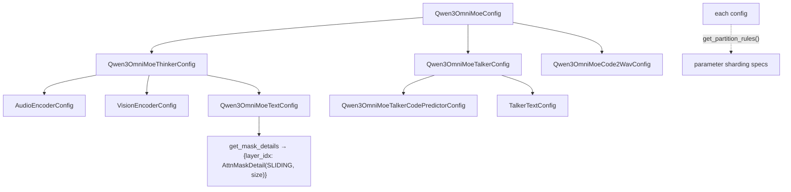

# easydel/modules/qwen3_omni_moe/qwen3_omni_moe_configuration — nested per-tower configs + sliding-window mask details

## Overview
This file is the configuration counterpart to the omni model: one [`EasyDeLBaseConfig`](../catalog/easydel/infra/base_config.md) subclass per sub-component — audio encoder, vision encoder, text decoder, [`Qwen3OmniMoeThinkerConfig`](../catalog/easydel/modules/qwen3_omni_moe/qwen3_omni_moe_configuration.md#Qwen3OmniMoeThinkerConfig), [`Qwen3OmniMoeTalkerCodePredictorConfig`](../catalog/easydel/modules/qwen3_omni_moe/qwen3_omni_moe_configuration.md#Qwen3OmniMoeTalkerCodePredictorConfig), [`Qwen3OmniMoeCode2WavConfig`](../catalog/easydel/modules/qwen3_omni_moe/qwen3_omni_moe_configuration.md#Qwen3OmniMoeCode2WavConfig), and a top `Qwen3OmniMoeConfig` — each `@register_config`-registered under its own name. The composite configs *nest* the leaf configs (Thinker holds audio+vision+text configs), mirroring the model's tower structure. The one mechanism worth calling out is [`get_mask_details`](../catalog/easydel/modules/qwen3_omni_moe/qwen3_omni_moe_configuration.md#Qwen3OmniMoeTextConfig.get_mask_details) on the text config, which declares *which layers use sliding-window attention* — the config-side half of the sliding-window optimization the attention/cache code consumes.

## Diagram

## Design rationale (why it's built this way)
- **One config class per tower, each independently registered.** Every sub-config `@register_config("qwen3_omni_moe_*")`s itself, so the factory can resolve any tower's config by name; the composite configs (`Thinker`, `Talker`, top) hold their children as fields, so a single serialized checkpoint config reconstructs the whole nested structure. This nesting mirrors the model file's tower composition exactly.
- **Sliding-window declared per-layer in the config, applied in the cache/kernel.** [`get_mask_details`](../catalog/easydel/modules/qwen3_omni_moe/qwen3_omni_moe_configuration.md#Qwen3OmniMoeTextConfig.get_mask_details) returns a `{layer_idx: AttnMaskDetail(mask_type=SLIDING, size=sliding_window)}` map, but *only* for layers at or past `max_window_layers` and only when `use_sliding_window` is set. This is the config-side declaration the [`TransformerCacheView`](../catalog/easydel/caching/transformer/cache.md) and attention kernel read to allocate a window-sized cache and apply window masking — separating "which layers are sliding" (config) from "how sliding is implemented" (cache/kernel).
- **Per-config `get_partition_rules` override.** The composite configs override [`EasyDeLBaseConfig.get_partition_rules`](../catalog/easydel/infra/base_config.md) to return explicit `(regex, PartitionSpec)` rules — because a multi-tower model's parameter names span several sub-namespaces, explicit rules give precise control over how each tower's params shard rather than relying entirely on per-module auto-sharding.
- **Placeholder token IDs live in the config.** The Thinker config carries `audio_token_id`/`image_token_id`/`video_token_id`/`audio_start_token_id` — the placeholder tokens the model's `compute_embedding` splices modality embeddings at. Keeping them in config means the merge logic and the tokenizer agree on the same sentinel IDs.

## Entry points
- [`Qwen3OmniMoeThinkerConfig`](../catalog/easydel/modules/qwen3_omni_moe/qwen3_omni_moe_configuration.md#Qwen3OmniMoeThinkerConfig) — the understanding-tower config; nests audio+vision+text configs and the modality placeholder token IDs.
- [`Qwen3OmniMoeTalkerCodePredictorConfig`](../catalog/easydel/modules/qwen3_omni_moe/qwen3_omni_moe_configuration.md#Qwen3OmniMoeTalkerCodePredictorConfig) — the code-predictor stage config.
- [`Qwen3OmniMoeCode2WavConfig`](../catalog/easydel/modules/qwen3_omni_moe/qwen3_omni_moe_configuration.md#Qwen3OmniMoeCode2WavConfig) — the vocoder-stage config.
- [`Qwen3OmniMoeTextConfig.get_mask_details`](../catalog/easydel/modules/qwen3_omni_moe/qwen3_omni_moe_configuration.md#Qwen3OmniMoeTextConfig.get_mask_details) — the per-layer sliding-window mask declaration read by the attention/cache stack.

## Mechanism (step-by-step)
1. **Composite config nests leaf configs.** [`Qwen3OmniMoeThinkerConfig`](../catalog/easydel/modules/qwen3_omni_moe/qwen3_omni_moe_configuration.md#Qwen3OmniMoeThinkerConfig) (and the top config) hold audio/vision/text sub-configs as fields, so constructing the composite constructs the whole tree; each is an [`EasyDeLBaseConfig`](../catalog/easydel/infra/base_config.md) so each carries its own sharding/kernel knobs.
2. **Mask details computed from config flags.** [`get_mask_details`](../catalog/easydel/modules/qwen3_omni_moe/qwen3_omni_moe_configuration.md#Qwen3OmniMoeTextConfig.get_mask_details) iterates layers and, for those at/after `max_window_layers` with `use_sliding_window`, emits an `AttnMaskDetail(SLIDING, size=sliding_window)` — so the "first N layers global, rest sliding" pattern is a pure config computation.
3. **Sharding rules resolved per tower.** Each composite config (e.g. [`Qwen3OmniMoeThinkerConfig`](../catalog/easydel/modules/qwen3_omni_moe/qwen3_omni_moe_configuration.md#Qwen3OmniMoeThinkerConfig)) overrides `get_partition_rules` to return the explicit parameter-sharding specs for its tower's namespaces, which the model build applies.
4. **Placeholder IDs bind merge to tokenizer.** The [`Qwen3OmniMoeThinkerConfig`](../catalog/easydel/modules/qwen3_omni_moe/qwen3_omni_moe_configuration.md#Qwen3OmniMoeThinkerConfig)'s token-ID fields are the sentinels `compute_embedding` uses to know where to splice each modality's embeddings.

## Key data structures
- The config tree: top `Qwen3OmniMoeConfig` → [`Qwen3OmniMoeThinkerConfig`](../catalog/easydel/modules/qwen3_omni_moe/qwen3_omni_moe_configuration.md#Qwen3OmniMoeThinkerConfig) (audio+vision+text) / Talker (→ [`Qwen3OmniMoeTalkerCodePredictorConfig`](../catalog/easydel/modules/qwen3_omni_moe/qwen3_omni_moe_configuration.md#Qwen3OmniMoeTalkerCodePredictorConfig) + talker-text) / [`Qwen3OmniMoeCode2WavConfig`](../catalog/easydel/modules/qwen3_omni_moe/qwen3_omni_moe_configuration.md#Qwen3OmniMoeCode2WavConfig).
- The sliding-window declaration: `{layer_idx: AttnMaskDetail(SLIDING, size)}` from [`get_mask_details`](../catalog/easydel/modules/qwen3_omni_moe/qwen3_omni_moe_configuration.md#Qwen3OmniMoeTextConfig.get_mask_details).

## Dynamics (design intent)
> [!inferred] Declaring the sliding-window layer map in the config (rather than hardcoding it in the model) is what lets the attention/cache stack allocate window-sized KV for exactly those layers — the config is the single source of truth the [`TransformerCacheView`](../catalog/easydel/caching/transformer/cache.md) consults to shrink its buffer, tying this file directly to the KV-cache memory footprint.

## Edge cases
- **`use_sliding_window` false or `sliding_window` None** → [`get_mask_details`](../catalog/easydel/modules/qwen3_omni_moe/qwen3_omni_moe_configuration.md#Qwen3OmniMoeTextConfig.get_mask_details) returns an empty map (all layers global) — the whole KV cache is then full-length.
- **`max_window_layers` threshold** — layers *before* it stay global even with sliding enabled; a wrong threshold silently changes which layers get the memory saving.
- **Placeholder token-ID mismatch** with the tokenizer breaks the modality-merge alignment in the model.

## Open questions
> [!inferred] Only four config symbols are in this packet's citation subgraph out of ~8 config classes; the exact field lists and each tower's `get_partition_rules` bodies are visible in source but not all cited here.

## See also
- [easydel/modules/qwen3_omni_moe/modeling_qwen3_omni_moe](easydel-modules-qwen3_omni_moe-modeling_qwen3_omni_moe.md) — the model these configs parameterize.
- [easydel/infra/base_config](easydel-infra-base_config.md) — the config base each subclasses.
- [easydel/caching/transformer/cache](easydel-caching-transformer-cache.md) — consumes the sliding-window mask details.

## Sources
- raw/code/EasyDeL/easydel/modules/qwen3_omni_moe/qwen3_omni_moe_configuration.py
