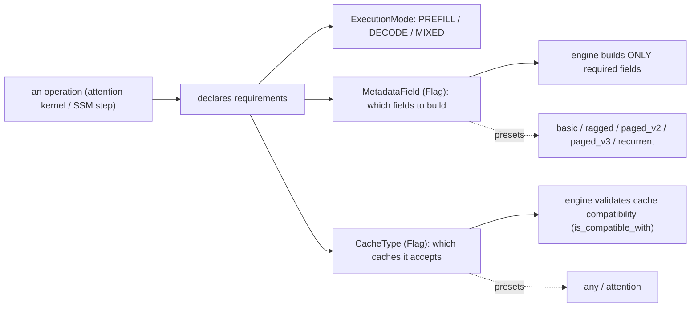

# easydel/operations/requirements/types — the flag vocabulary operations use to declare metadata needs

## Overview
This tiny module defines the *contract vocabulary* for EasyDeL's operation-requirements system: three enums that let an operation (an attention kernel, an SSM step, etc.) declare, in one place, (a) which [`ExecutionMode`](../catalog/easydel/operations/requirements/types.md#ExecutionMode) it runs in (prefill/decode/[`MIXED`](../catalog/easydel/operations/requirements/types.md#ExecutionMode.MIXED)), (b) which runtime [`MetadataField`](../catalog/easydel/operations/requirements/types.md#MetadataField)s it needs the inference engine to compute, and (c) which [`CacheType`](../catalog/easydel/operations/requirements/types.md#CacheType)s it's compatible with. The key idea is *declarative minimalism*: operations state their needs as `Flag` bitmasks, and the engine builds only the metadata that's actually required and validates cache compatibility up front — so the expensive per-step metadata (page tables, slot mappings, position IDs) is computed on demand, not always.

## Diagram

## Design rationale (why it's built this way)
- **`Flag` enums so requirements compose and test with `in`.** [`MetadataField`](../catalog/easydel/operations/requirements/types.md#MetadataField) and [`CacheType`](../catalog/easydel/operations/requirements/types.md#CacheType) are `enum.Flag`, so an op declares `SEQ_LENS | POSITIONS` and the engine checks `if MetadataField.SEQ_LENS in required`. Bitmask composition is exactly right for "this op needs these several fields" and makes `is_compatible_with` a one-line `bool(self & other)` overlap test.
- **Preset classmethods encode the standard bundles.** Rather than every attention op re-listing fields, [`MetadataField.basic`](../catalog/easydel/operations/requirements/types.md#MetadataField.basic) (`SEQ_LENS|POSITIONS|LOGITS_INDICES`), [`ragged`](../catalog/easydel/operations/requirements/types.md#MetadataField.ragged) (adds `QUERY_START_LOC|CONTEXT_LENS`), and [`paged_v2`](../catalog/easydel/operations/requirements/types.md#MetadataField.paged_v2) (adds `PAGES_TABLES|SLOT_MAPPING`) build up in layers — each preset is defined *in terms of* the simpler one, so the field hierarchy mirrors the cache-format hierarchy (basic → ragged → paged). This directly ties back to the two paged-attention formats: `paged_v2` uses `SLOT_MAPPING`, `paged_v3` uses `REQUEST_DISTRIBUTION`.
- **Cache compatibility as overlap, with `any`/`attention` presets.** [`CacheType.any`](../catalog/easydel/operations/requirements/types.md#CacheType.any) means cache-agnostic (all four types OR'd); `attention()` is the subset valid for attention ops (`TRANSFORMER|RAGGED_PAGES|HYBRID`, notably excluding pure `RECURRENT`). Declaring compatibility as a flag set lets the engine reject an op/cache mismatch at init rather than crashing mid-inference.
- **`ExecutionMode` lets one op vary its requirements by phase.** An op can need different metadata in prefill vs decode; `ExecutionMode` (`PREFILL`/`DECODE`/[`MIXED`](../catalog/easydel/operations/requirements/types.md#ExecutionMode.MIXED)) is the axis it keys those declarations on — `MIXED` for continuous-batching engines that run prefill and decode tokens in the same step.

## Entry points
- [`MetadataField`](../catalog/easydel/operations/requirements/types.md#MetadataField) (+ presets [`basic`](../catalog/easydel/operations/requirements/types.md#MetadataField.basic)/[`ragged`](../catalog/easydel/operations/requirements/types.md#MetadataField.ragged)/[`paged_v2`](../catalog/easydel/operations/requirements/types.md#MetadataField.paged_v2)) — an operation returns one of these bitmasks to tell the engine which runtime fields to construct.
- [`CacheType`](../catalog/easydel/operations/requirements/types.md#CacheType) (+ [`any`](../catalog/easydel/operations/requirements/types.md#CacheType.any)) — an operation returns this to declare which cache backends it accepts; `is_compatible_with` is the engine's validation call.
- [`ExecutionMode`](../catalog/easydel/operations/requirements/types.md#ExecutionMode) / [`MIXED`](../catalog/easydel/operations/requirements/types.md#ExecutionMode.MIXED) — the phase axis requirements are declared against.

## Mechanism (step-by-step)
1. **An op declares its requirements** using these enums — e.g. a paged-attention op returns [`MetadataField.paged_v2`](../catalog/easydel/operations/requirements/types.md#MetadataField.paged_v2) and a [`CacheType`](../catalog/easydel/operations/requirements/types.md#CacheType) including `RAGGED_PAGES`, keyed by [`ExecutionMode`](../catalog/easydel/operations/requirements/types.md#ExecutionMode).
2. **The engine unions field requirements across ops** and builds *only* those [`MetadataField`](../catalog/easydel/operations/requirements/types.md#MetadataField)s — a decode-only model never pays to compute prefill-specific fields.
3. **Cache compatibility is validated at init** via `is_compatible_with` (`bool(self & other)`) — an op whose [`CacheType`](../catalog/easydel/operations/requirements/types.md#CacheType) doesn't overlap the configured cache is rejected before any step runs.
4. **Presets keep declarations DRY** — [`ragged`](../catalog/easydel/operations/requirements/types.md#MetadataField.ragged) is [`basic`](../catalog/easydel/operations/requirements/types.md#MetadataField.basic)`| QUERY_START_LOC | CONTEXT_LENS`, so an op that says "ragged" automatically gets the basic fields too.

## Key data structures
- [`MetadataField`](../catalog/easydel/operations/requirements/types.md#MetadataField) (`Flag`) — `SEQ_LENS`, `CONTEXT_LENS`, `POSITIONS`, `QUERY_START_LOC`, `PAGES_TABLES`, `SLOT_MAPPING`, `REQUEST_DISTRIBUTION`, `HAS_INITIAL_STATE`, `STATE_INDICES`, `LOGITS_INDICES` + presets.
- [`CacheType`](../catalog/easydel/operations/requirements/types.md#CacheType) (`Flag`) — `TRANSFORMER`, `RAGGED_PAGES`, `RECURRENT`, `HYBRID` + `any`/`attention` presets + `is_compatible_with`.
- [`ExecutionMode`](../catalog/easydel/operations/requirements/types.md#ExecutionMode) (`Enum`) — `PREFILL`/`DECODE`/`MIXED`.

## Dynamics (design intent)
> [!inferred] Building only the required metadata is a real inference-throughput lever: page tables and slot mappings are non-trivial to construct each step, and a model whose ops declare only `basic` requirements skips them entirely — the declarative flags are what let the engine specialize the per-step metadata to the actual operation set.

## Edge cases
- **`RECURRENT` excluded from `CacheType.attention()`** — an attention op declaring `attention()` compatibility won't accept a pure recurrent cache, by design.
- **`paged_v2` vs `paged_v3`** differ by exactly one field (`SLOT_MAPPING` vs `REQUEST_DISTRIBUTION`) — mixing them silently omits the field the actual kernel needs.
- **`Flag.NONE = 0`** as the empty requirement — an op that forgets to declare fields gets nothing built for it.

## Open questions
> [!inferred] How ops actually *register* these requirements (the executor/builder that consumes them) lives in the sibling `operations/requirements/builder.py` and `validation.py`, outside this packet's subgraph; this page documents the vocabulary, not the consumption path.

## See also
- [easydel/caching/ragged_page/cache](easydel-caching-ragged_page-cache.md) — the paged cache whose `slot_mapping` maps to `paged_v2`.
- [easydel/caching/_abstracts](easydel-caching-_abstracts.md) — the cache types `CacheType` enumerates.

## Sources
- raw/code/EasyDeL/easydel/operations/requirements/types.py
