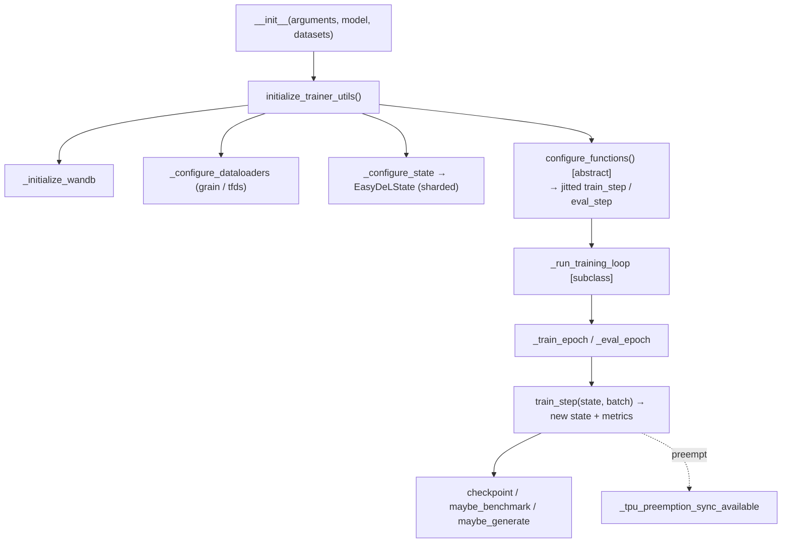

# easydel/trainers/base_trainer — the abstract training loop that compiles step functions and shards state

## Overview
`BaseTrainer` is the foundation every EasyDeL trainer (SFT, GRPO, DPO, reward, distillation, ...) inherits from. It owns the parts of a training run that are the same regardless of objective: building dataloaders, initializing and *sharding* the [`EasyDeLState`](../catalog/easydel/infra/base_state.md#EasyDeLState) across the device mesh, compiling the train/eval step functions, and running the epoch loop with checkpointing, metrics, benchmarking, and TPU-preemption handling. The objective-specific parts are abstract hooks — chiefly [`configure_functions`](../catalog/easydel/trainers/trainer/trainer.md#Trainer.configure_functions) (produce the jitted step fns) and `_preprocess_batch_input` — that each concrete trainer overrides. The mental model: `BaseTrainer` is the *machinery* (state, sharding, compilation, loop, I/O); a subclass supplies the *math* (what one step computes). Everything it does is parameterized by a single [`TrainingArguments`](../catalog/easydel/trainers/training_configurations.md#TrainingArguments) object held as [`arguments`](../catalog/easydel/trainers/base_trainer.md#BaseTrainer.arguments).

## Diagram

## Design rationale (why it's built this way)
- **Template-method training loop.** The concrete objective is confined to abstract hooks — [`configure_functions`](../catalog/easydel/trainers/trainer/trainer.md#Trainer.configure_functions) (marked `@abstractmethod`) returns the compiled step functions, and `_preprocess_batch_input` shapes the batch per objective (RL trainers like [`GRPOTrainer._preprocess_batch_input`](../catalog/easydel/trainers/group_relative_policy_optimization/grpo_trainer.md#GRPOTrainer._preprocess_batch_input), [`PPOTrainer._preprocess_batch_input`](../catalog/easydel/trainers/proximal_policy_optimization_trainer/ppo_trainer.md#PPOTrainer._preprocess_batch_input) override it; the plain [`Trainer`](../catalog/easydel/trainers/trainer/trainer.md#Trainer.configure_functions) supplies the standard SFT versions). This is why one loop serves ~20 objectives.
- **Ordered initialization because steps depend on earlier ones.** `initialize_trainer_utils`'s docstring spells out the order: W&B → timer → dataloaders → model/optimizer/scheduler → state sharding → compiled step functions. Optimizer config depends on the *number of steps*, which is only known after dataloader configuration — so the order is load-bearing, not incidental.
- **State attribute assignment is intercepted.** `__setattr__` intercepts writes to `model_state`/`reference_state`/`teacher_state` (the `_RUNTIME_MODEL_OVERRIDE_STATE_ATTRS` set) to apply runtime config overrides — so setting a trainer's state automatically re-applies any argument-driven model-config overrides, keeping the state consistent with the arguments.
- **Sharded state is first-class.** [`model_state`](../catalog/easydel/trainers/base_trainer.md#BaseTrainer.model_state) is an [`EasyDeLState`](../catalog/easydel/infra/base_state.md#EasyDeLState) sharded across the mesh in [`_configure_state`](../catalog/easydel/trainers/base_trainer.md#BaseTrainer._configure_state); the trainer threads this pytree through the jitted step, and [`_all_gather`](../catalog/easydel/trainers/base_trainer.md#BaseTrainer._all_gather) replicates an array back to all devices (`NamedSharding(mesh, PartitionSpec())`) when a metric/output must be gathered.
- **Two dataloader backends.** [`_create_grain_dataloader`](../catalog/easydel/trainers/base_trainer.md#BaseTrainer._create_grain_dataloader) and [`_configure_tfds_dataloader`](../catalog/easydel/trainers/base_trainer.md#BaseTrainer._configure_tfds_dataloader) support Grain and TensorFlow-Datasets sources behind one `_configure_dataloaders` dispatch — the input pipeline is pluggable without touching the loop.

## Entry points
- [`BaseTrainer.__init__`](../catalog/easydel/trainers/base_trainer.md#BaseTrainer.__init__) — takes [`arguments`](../catalog/easydel/trainers/base_trainer.md#BaseTrainer.arguments) ([`TrainingArguments`](../catalog/easydel/trainers/training_configurations.md#TrainingArguments)), the model, and datasets; sets up the trainer's fields before `initialize_trainer_utils` wires the run.
- [`configure_functions`](../catalog/easydel/trainers/trainer/trainer.md#Trainer.configure_functions) — the abstract hook each objective implements to return the compiled `train_step`/`eval_step`; this is where the loss and gradient logic lives.
- [`_configure_state`](../catalog/easydel/trainers/base_trainer.md#BaseTrainer._configure_state) — initializes and shards the [`EasyDeLState`](../catalog/easydel/infra/base_state.md#EasyDeLState) onto the mesh; the sharded [`model_state`](../catalog/easydel/trainers/base_trainer.md#BaseTrainer.model_state) is the carry for the loop.
- [`maybe_benchmark`](../catalog/easydel/trainers/base_trainer.md#BaseTrainer.maybe_benchmark) / [`maybe_generate`](../catalog/easydel/trainers/base_trainer.md#BaseTrainer.maybe_generate) — periodic side-tasks (throughput benchmark, sample generation) the loop calls on a schedule; `maybe_generate` uses [`generate_unified`](../catalog/easydel/trainers/base_trainer.md#BaseTrainer.generate_unified).

## Mechanism (step-by-step)
1. **Construct + initialize in order.** [`__init__`](../catalog/easydel/trainers/base_trainer.md#BaseTrainer.__init__) stores arguments/model/datasets; `initialize_trainer_utils` then runs the ordered setup (W&B, timer, dataloaders, model/optimizer/scheduler, [`_configure_state`](../catalog/easydel/trainers/base_trainer.md#BaseTrainer._configure_state) sharding, [`configure_functions`](../catalog/easydel/trainers/trainer/trainer.md#Trainer.configure_functions) compilation). Step counts resolved during dataloader setup ([`_resolve_step_count`](../catalog/easydel/trainers/base_trainer.md#BaseTrainer._resolve_step_count), [`_eval_dataset_steps_auto_clamped`](../catalog/easydel/trainers/base_trainer.md#BaseTrainer._eval_dataset_steps_auto_clamped)) feed the optimizer schedule.
2. **Compile the step functions once.** [`configure_functions`](../catalog/easydel/trainers/trainer/trainer.md#Trainer.configure_functions) returns jitted `train_step`/`eval_step` operating on the sharded [`EasyDeLState`](../catalog/easydel/infra/base_state.md#EasyDeLState); because the state carries `graphdef`/`tx` as static, the step compiles once and reuses across the run.
3. **Run the loop.** The concrete [`Trainer._run_training_loop`](../catalog/easydel/trainers/trainer/trainer.md#Trainer._run_training_loop) drives [`_train_epoch`](../catalog/easydel/trainers/trainer/trainer.md#Trainer._train_epoch)/[`_eval_epoch`](../catalog/easydel/trainers/trainer/trainer.md#Trainer._eval_epoch), each step producing a new state + metrics; the base handles checkpointing, [`maybe_benchmark`](../catalog/easydel/trainers/base_trainer.md#BaseTrainer.maybe_benchmark), [`maybe_generate`](../catalog/easydel/trainers/base_trainer.md#BaseTrainer.maybe_generate), and metric gathering via [`_all_gather`](../catalog/easydel/trainers/base_trainer.md#BaseTrainer._all_gather).
4. **Survive TPU preemption.** [`_tpu_preemption_sync_available`](../catalog/easydel/trainers/base_trainer.md#BaseTrainer._tpu_preemption_sync_available) gates preemption-aware sync so a preempted TPU pod can checkpoint/resume cleanly — a serving/training-scale concern the base handles for every objective.

## Key data structures
- [`arguments`](../catalog/easydel/trainers/base_trainer.md#BaseTrainer.arguments) ([`TrainingArguments`](../catalog/easydel/trainers/training_configurations.md#TrainingArguments)) — the single config bag ([`max_length`](../catalog/easydel/trainers/training_configurations.md#TrainingArguments.max_length), batch sizes, schedules, ...) parameterizing the run.
- [`model_state`](../catalog/easydel/trainers/base_trainer.md#BaseTrainer.model_state) ([`EasyDeLState`](../catalog/easydel/infra/base_state.md#EasyDeLState)) — the sharded train carry; `reference_state`/`teacher_state` are analogous for RL/distillation.
- `_train_source`/`_eval_source` (`ShardedDataSource`) — the sharded input sources behind the dataloaders.

## Dynamics (design intent)
> [!inferred] Because `configure_functions` returns *compiled* step fns and the state is sharded before compilation, the trainer establishes the parallelism/compilation once and the epoch loop is pure Python orchestration over already-jitted calls — the reason changing objective (subclass) doesn't require re-architecting the distributed machinery.

## Edge cases
- **Optimizer needs step count from dataloaders** — reordering `initialize_trainer_utils` would break schedule setup.
- **`__setattr__` interception** means directly assigning `model_state` triggers config-override logic; bypassing it (e.g. `object.__setattr__`) would skip the overrides.
- **Abstract `configure_functions` unimplemented** makes a trainer subclass non-instantiable — the objective *must* supply its step compilation.

## Open questions
> [!inferred] The concrete epoch/step bodies live in `trainers/trainer/trainer.py` ([`Trainer`](../catalog/easydel/trainers/trainer/trainer.md#Trainer.configure_functions)) and the RL/DPO subclasses, only partially in this packet's subgraph; this page documents the base machinery and its abstract hooks, not each objective's step math.

## See also
- [easydel/trainers/training_configurations](easydel-trainers-training_configurations.md) — the `TrainingArguments` this trainer consumes.
- [easydel/infra/base_state](easydel-infra-base_state.md) — the `EasyDeLState` carry it shards and steps.
- [easydel/infra/loss_utils](easydel-infra-loss_utils.md) — the losses a concrete `configure_functions` wires in.

## Sources
- raw/code/EasyDeL/easydel/trainers/base_trainer.py
