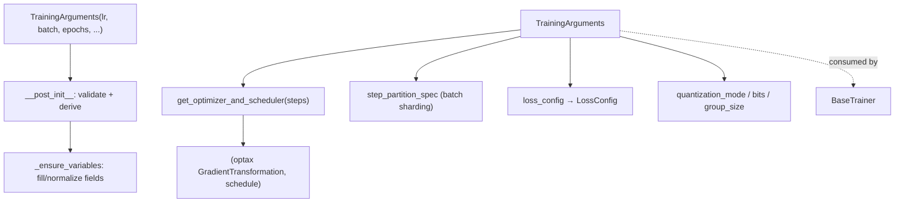

# easydel/trainers/training_configurations — TrainingArguments, the single dataclass that configures a run

## Overview
[`TrainingArguments`](../catalog/easydel/trainers/training_configurations.md#TrainingArguments) is the one dataclass a user fills in to describe a training run: learning rate, batch size, epochs, optimizer/scheduler, sharding, precision, checkpointing, logging, and quantization — all in one place, consumed by `BaseTrainer`. It is the training-side analogue of `EasyDeLBaseConfig` (which configures the *model*): where the model config decides kernels and model-level sharding, `TrainingArguments` decides *how the loop runs*. Two behaviors distinguish it from a plain config bag: it builds the optax optimizer+scheduler on demand (`get_optimizer_and_scheduler`), and its [`__post_init__`](../catalog/easydel/trainers/training_configurations.md#TrainingArguments.__post_init__) validates/derives interdependent fields so an incompletely-specified run is caught early.

## Diagram

## Design rationale (why it's built this way)
- **One flat dataclass, `field(metadata={help})` per knob.** Every option is a `dataclasses.field` with a `help` string, so the arguments are self-documenting and can be surfaced in a CLI/serialization layer. The docstring enumerates the coverage: hyperparameters, optimization, data loading, checkpointing, logging, hardware/sharding, performance. Flatness (vs. nested sub-configs) is deliberate — it maps cleanly to command-line flags.
- **`__post_init__` derives and validates interdependent fields.** [`__post_init__`](../catalog/easydel/trainers/training_configurations.md#TrainingArguments.__post_init__) and [`_ensure_variables`](../catalog/easydel/trainers/training_configurations.md#TrainingArguments._ensure_variables) run after construction to normalize/fill fields (e.g. defaulting [`max_length`](../catalog/easydel/trainers/training_configurations.md#TrainingArguments.max_length), resolving scheduler names) — catching inconsistent combos at object-creation time rather than mid-run.
- **Optimizer built lazily with the resolved step count.** `get_optimizer_and_scheduler(steps)` deep-copies `optimizer_kwargs`, injects the *actual* step count (only known after dataloader setup), pops the scheduler spec, and delegates to an `OptimizerFactory` to produce an optax transform chain (clipping + weight decay + base optimizer). This is why `BaseTrainer` must configure dataloaders before the optimizer — the schedule length is a runtime-derived value.
- **Gradient accumulation and step sharding are explicit knobs.** [`gradient_accumulation_steps`](../catalog/easydel/trainers/training_configurations.md#TrainingArguments.gradient_accumulation_steps) lets a large effective batch fit on limited HBM by accumulating micro-batch grads, and [`step_partition_spec`](../catalog/easydel/trainers/training_configurations.md#TrainingArguments.step_partition_spec) declares how the per-step batch is sharded across the mesh — both first-class throughput levers.
- **Training-time quantization knobs.** [`quantization_mode`](../catalog/easydel/trainers/training_configurations.md#TrainingArguments.quantization_mode), [`quantization_bits`](../catalog/easydel/trainers/training_configurations.md#TrainingArguments.quantization_bits), [`quantization_group_size`](../catalog/easydel/trainers/training_configurations.md#TrainingArguments.quantization_group_size) let the trainer apply quantization during training, separate from the model config's inference quantization.

## Entry points
- [`TrainingArguments`](../catalog/easydel/trainers/training_configurations.md#TrainingArguments) — the dataclass constructed by the user and passed to a trainer; `BaseTrainer` reads it as `self.arguments`.
- [`TrainingArguments`](../catalog/easydel/trainers/training_configurations.md#TrainingArguments)'s `get_optimizer_and_scheduler(steps)` — builds the optax optimizer + LR schedule with the resolved step count; called during trainer initialization once dataloaders fix the step count.
- [`__post_init__`](../catalog/easydel/trainers/training_configurations.md#TrainingArguments.__post_init__) / [`_ensure_variables`](../catalog/easydel/trainers/training_configurations.md#TrainingArguments._ensure_variables) — the validation/derivation hooks that run at construction.
- [`loss_config`](../catalog/easydel/trainers/training_configurations.md#TrainingArguments.loss_config) — the field carrying the [`LossConfig`](../catalog/easydel/infra/loss_utils.md#LossConfig) the loss functions consume.

## Mechanism (step-by-step)
1. **Construct + normalize.** The user builds [`TrainingArguments`](../catalog/easydel/trainers/training_configurations.md#TrainingArguments); [`__post_init__`](../catalog/easydel/trainers/training_configurations.md#TrainingArguments.__post_init__) runs [`_ensure_variables`](../catalog/easydel/trainers/training_configurations.md#TrainingArguments._ensure_variables) to fill defaults (e.g. [`max_length`](../catalog/easydel/trainers/training_configurations.md#TrainingArguments.max_length)) and validate interdependencies.
2. **Trainer reads sharding + loss + quantization.** `BaseTrainer` uses [`step_partition_spec`](../catalog/easydel/trainers/training_configurations.md#TrainingArguments.step_partition_spec) to shard each step's batch, [`loss_config`](../catalog/easydel/trainers/training_configurations.md#TrainingArguments.loss_config) to parameterize the loss, and the [`quantization_mode`](../catalog/easydel/trainers/training_configurations.md#TrainingArguments.quantization_mode)/[`quantization_bits`](../catalog/easydel/trainers/training_configurations.md#TrainingArguments.quantization_bits)/[`quantization_group_size`](../catalog/easydel/trainers/training_configurations.md#TrainingArguments.quantization_group_size) fields to apply training-time quantization.
3. **Optimizer built with the real step count.** After dataloaders resolve the step count, the [`TrainingArguments`](../catalog/easydel/trainers/training_configurations.md#TrainingArguments)' `get_optimizer_and_scheduler(steps)` produces the `(optax transform, schedule)` pair the `EasyDeLState` is created with — so LR warmup/decay spans exactly the real number of steps.
4. **Gradient accumulation folds into the step.** [`gradient_accumulation_steps`](../catalog/easydel/trainers/training_configurations.md#TrainingArguments.gradient_accumulation_steps) instructs the compiled step to accumulate micro-batch gradients before applying — enabling a large effective batch without materializing it at once.

## Key data structures
- [`TrainingArguments`](../catalog/easydel/trainers/training_configurations.md#TrainingArguments) — the flat `@dataclass` of all run knobs.
- [`loss_config`](../catalog/easydel/trainers/training_configurations.md#TrainingArguments.loss_config) — nested [`LossConfig`](../catalog/easydel/infra/loss_utils.md#LossConfig).
- Throughput levers: [`gradient_accumulation_steps`](../catalog/easydel/trainers/training_configurations.md#TrainingArguments.gradient_accumulation_steps), [`step_partition_spec`](../catalog/easydel/trainers/training_configurations.md#TrainingArguments.step_partition_spec), [`max_length`](../catalog/easydel/trainers/training_configurations.md#TrainingArguments.max_length), the `quantization_*` fields.

## Dynamics (design intent)
> [!inferred] The split between `TrainingArguments` (how the loop runs) and `EasyDeLBaseConfig` (how the model computes) means a perf experiment can vary one without the other — e.g. change `gradient_accumulation_steps` or `step_partition_spec` while holding the model config fixed, which is exactly the kind of single-variable change the optimization loop attributes deltas to.

## Edge cases
- **Optimizer built before step count is known** would produce a wrong-length schedule — hence the deferred `get_optimizer_and_scheduler(steps)` call.
- **`scheduler == "none"`** is normalized to `None` inside the builder — a string sentinel, not a real schedule.
- **Inconsistent field combos** (e.g. quantization mode without bits) are meant to be caught by [`__post_init__`](../catalog/easydel/trainers/training_configurations.md#TrainingArguments.__post_init__); fields set after construction bypass that validation.

## Open questions
> [!inferred] The full field catalog (~100+ options) and the `OptimizerFactory` internals are broader than this packet's citation subgraph; this page documents the arguments' role and the cited sharding/loss/quantization/optimizer surface.

## See also
- [easydel/trainers/base_trainer](easydel-trainers-base_trainer.md) — the consumer of these arguments.
- [easydel/infra/loss_utils](easydel-infra-loss_utils.md) — the `LossConfig` carried in `loss_config`.
- [easydel/infra/base_config](easydel-infra-base_config.md) — the model-side config counterpart.

## Sources
- raw/code/EasyDeL/easydel/trainers/training_configurations.py
