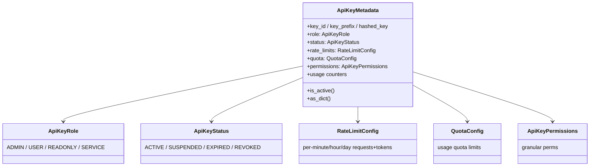

# easydel/workers/esurge/auth/auth_models — the API-key metadata / RBAC / rate-limit dataclasses

## Overview
This module is the data model for eSurge's serving-worker authentication: plain dataclasses/enums describing a managed API key — [`ApiKeyMetadata`](../catalog/easydel/workers/esurge/auth/auth_models.md#ApiKeyMetadata) (the full record), the [`ApiKeyRole`](../catalog/easydel/workers/esurge/auth/auth_models.md#ApiKeyRole) RBAC enum, the [`ApiKeyStatus`](../catalog/easydel/workers/esurge/auth/auth_models.md#ApiKeyStatus) lifecycle enum, and the nested [`RateLimitConfig`](../catalog/easydel/workers/esurge/auth/auth_models.md#RateLimitConfig)/[`QuotaConfig`](../catalog/easydel/workers/esurge/auth/auth_models.md#QuotaConfig)/[`ApiKeyPermissions`](../catalog/easydel/workers/esurge/auth/auth_models.md#ApiKeyPermissions) policy structs. It has no performance role; it exists so a production serving deployment can gate/limit/meter access. The one design point worth noting: the *raw* key is never stored — only a SHA-256 `hashed_key` plus a display-safe `key_prefix` — and every policy struct has an `as_dict` for JSON persistence, since these records are held in-memory by the key manager and persisted to disk.

## Diagram

## Design rationale (why it's built this way)
- **Never store the raw key.** [`ApiKeyMetadata`](../catalog/easydel/workers/esurge/auth/auth_models.md#ApiKeyMetadata) holds `hashed_key` (SHA-256 hex digest) and `key_prefix` (display-safe first chars) but not the secret — auth verifies by hashing the presented key and comparing, so a leaked metadata store doesn't leak usable keys. Standard credential-storage hygiene, encoded in the data model.
- **RBAC as an enum, permissions as a struct.** [`ApiKeyRole`](../catalog/easydel/workers/esurge/auth/auth_models.md#ApiKeyRole) gives coarse levels (`ADMIN` full incl. key management, `USER` inference, `READONLY` metrics/health, `SERVICE` custom) while [`ApiKeyPermissions`](../catalog/easydel/workers/esurge/auth/auth_models.md#ApiKeyPermissions) carries the granular per-endpoint permissions — the coarse role is the common case, the fine permissions handle service accounts.
- **Lifecycle status separate from expiry.** [`ApiKeyStatus`](../catalog/easydel/workers/esurge/auth/auth_models.md#ApiKeyStatus) (`ACTIVE`/`SUSPENDED`/`EXPIRED`/`REVOKED`) distinguishes reversible suspension from permanent revocation from time-based expiry — and [`is_active`](../catalog/easydel/workers/esurge/auth/auth_models.md#ApiKeyMetadata.is_active) is precisely `status == ACTIVE and not is_expired()`, so a key is usable only if both the explicit status and the clock agree.
- **All-optional limits mean "unlimited unless set".** [`RateLimitConfig`](../catalog/easydel/workers/esurge/auth/auth_models.md#RateLimitConfig) and [`QuotaConfig`](../catalog/easydel/workers/esurge/auth/auth_models.md#QuotaConfig) fields default `None` = "no limit for that window/metric" — a permissive default where each limit is opt-in per key.
- **`as_dict` on every struct for persistence.** [`RateLimitConfig.as_dict`](../catalog/easydel/workers/esurge/auth/auth_models.md#RateLimitConfig.as_dict), [`QuotaConfig.as_dict`](../catalog/easydel/workers/esurge/auth/auth_models.md#QuotaConfig.as_dict), [`ApiKeyPermissions.as_dict`](../catalog/easydel/workers/esurge/auth/auth_models.md#ApiKeyPermissions.as_dict), and the metadata's own serializer support disk persistence (via `AuthStorage`) without an external serialization framework.

## Entry points
- [`ApiKeyMetadata`](../catalog/easydel/workers/esurge/auth/auth_models.md#ApiKeyMetadata) — the full key record the manager creates on key issuance and looks up on each request; carries id/hash, [`role`](../catalog/easydel/workers/esurge/auth/auth_models.md#ApiKeyMetadata.role), [`status`](../catalog/easydel/workers/esurge/auth/auth_models.md#ApiKeyMetadata.status), [`rate_limits`](../catalog/easydel/workers/esurge/auth/auth_models.md#ApiKeyMetadata.rate_limits), [`quota`](../catalog/easydel/workers/esurge/auth/auth_models.md#ApiKeyMetadata.quota), [`permissions`](../catalog/easydel/workers/esurge/auth/auth_models.md#ApiKeyMetadata.permissions), and usage counters.
- [`ApiKeyMetadata.is_active`](../catalog/easydel/workers/esurge/auth/auth_models.md#ApiKeyMetadata.is_active) — the authorization gate: true only if `ACTIVE` and unexpired.
- [`ApiKeyRole`](../catalog/easydel/workers/esurge/auth/auth_models.md#ApiKeyRole) / [`ApiKeyStatus`](../catalog/easydel/workers/esurge/auth/auth_models.md#ApiKeyStatus) — the RBAC and lifecycle enums checked during authorization.
- `as_dict` (on [`ApiKeyMetadata`](../catalog/easydel/workers/esurge/auth/auth_models.md#ApiKeyMetadata.as_dict), [`RateLimitConfig`](../catalog/easydel/workers/esurge/auth/auth_models.md#RateLimitConfig.as_dict), [`QuotaConfig`](../catalog/easydel/workers/esurge/auth/auth_models.md#QuotaConfig.as_dict), [`ApiKeyPermissions`](../catalog/easydel/workers/esurge/auth/auth_models.md#ApiKeyPermissions.as_dict)) — the persistence serializers.

## Mechanism (step-by-step)
1. **Key issued → metadata record created.** The manager builds an [`ApiKeyMetadata`](../catalog/easydel/workers/esurge/auth/auth_models.md#ApiKeyMetadata) storing only the `hashed_key`+`key_prefix`, the assigned [`role`](../catalog/easydel/workers/esurge/auth/auth_models.md#ApiKeyMetadata.role), an [`ApiKeyStatus.ACTIVE`](../catalog/easydel/workers/esurge/auth/auth_models.md#ApiKeyStatus) status, and any [`rate_limits`](../catalog/easydel/workers/esurge/auth/auth_models.md#ApiKeyMetadata.rate_limits)/[`quota`](../catalog/easydel/workers/esurge/auth/auth_models.md#ApiKeyMetadata.quota)/[`permissions`](../catalog/easydel/workers/esurge/auth/auth_models.md#ApiKeyMetadata.permissions).
2. **Request authorized.** On each API call, the presented key is hashed and matched to a record; [`is_active`](../catalog/easydel/workers/esurge/auth/auth_models.md#ApiKeyMetadata.is_active) gates it (status ACTIVE + not expired), and the [`role`](../catalog/easydel/workers/esurge/auth/auth_models.md#ApiKeyMetadata.role)/[`permissions`](../catalog/easydel/workers/esurge/auth/auth_models.md#ApiKeyMetadata.permissions) decide endpoint access.
3. **Usage metered.** After serving, the counters ([`total_requests`](../catalog/easydel/workers/esurge/auth/auth_models.md#ApiKeyMetadata.total_requests), [`total_prompt_tokens`](../catalog/easydel/workers/esurge/auth/auth_models.md#ApiKeyMetadata.total_prompt_tokens), [`total_completion_tokens`](../catalog/easydel/workers/esurge/auth/auth_models.md#ApiKeyMetadata.total_completion_tokens), [`monthly_requests`](../catalog/easydel/workers/esurge/auth/auth_models.md#ApiKeyMetadata.monthly_requests), [`monthly_tokens`](../catalog/easydel/workers/esurge/auth/auth_models.md#ApiKeyMetadata.monthly_tokens)) update and are checked against [`rate_limits`](../catalog/easydel/workers/esurge/auth/auth_models.md#ApiKeyMetadata.rate_limits)/[`quota`](../catalog/easydel/workers/esurge/auth/auth_models.md#ApiKeyMetadata.quota).
4. **Persisted via `as_dict`.** The record and its nested configs serialize through their `as_dict` methods ([`ApiKeyMetadata.as_dict`](../catalog/easydel/workers/esurge/auth/auth_models.md#ApiKeyMetadata.as_dict), [`RateLimitConfig.as_dict`](../catalog/easydel/workers/esurge/auth/auth_models.md#RateLimitConfig.as_dict)) for disk storage, and [`tags`](../catalog/easydel/workers/esurge/auth/auth_models.md#ApiKeyMetadata.tags)/`metadata` carry org-specific labels.

## Key data structures
- [`ApiKeyMetadata`](../catalog/easydel/workers/esurge/auth/auth_models.md#ApiKeyMetadata) — the full record: identity ([`key_id`](../catalog/easydel/workers/esurge/auth/auth_models.md#ApiKeyMetadata.key_id), `key_prefix`, `hashed_key`, [`name`](../catalog/easydel/workers/esurge/auth/auth_models.md#ApiKeyMetadata.name)), state ([`role`](../catalog/easydel/workers/esurge/auth/auth_models.md#ApiKeyMetadata.role)/[`status`](../catalog/easydel/workers/esurge/auth/auth_models.md#ApiKeyMetadata.status)/[`expires_at`](../catalog/easydel/workers/esurge/auth/auth_models.md#ApiKeyMetadata.expires_at)), policy ([`rate_limits`](../catalog/easydel/workers/esurge/auth/auth_models.md#ApiKeyMetadata.rate_limits)/[`quota`](../catalog/easydel/workers/esurge/auth/auth_models.md#ApiKeyMetadata.quota)/[`permissions`](../catalog/easydel/workers/esurge/auth/auth_models.md#ApiKeyMetadata.permissions)), usage counters, [`tags`](../catalog/easydel/workers/esurge/auth/auth_models.md#ApiKeyMetadata.tags).
- [`ApiKeyRole`](../catalog/easydel/workers/esurge/auth/auth_models.md#ApiKeyRole) / [`ApiKeyStatus`](../catalog/easydel/workers/esurge/auth/auth_models.md#ApiKeyStatus) — the two `StrEnum`s.
- [`RateLimitConfig`](../catalog/easydel/workers/esurge/auth/auth_models.md#RateLimitConfig) / [`QuotaConfig`](../catalog/easydel/workers/esurge/auth/auth_models.md#QuotaConfig) / [`ApiKeyPermissions`](../catalog/easydel/workers/esurge/auth/auth_models.md#ApiKeyPermissions) — the nested policy structs.

## Dynamics (design intent)
> [!inferred] These are pure data records — the enforcement logic (hashing, rate-limit windows, quota resets) lives in the key manager and middleware, not here. Keeping the model as plain dataclasses with `as_dict` serializers makes the auth state trivially persistable and inspectable, which is the right shape for a serving deployment's admin surface.

## Edge cases
- **`is_active` requires both status and clock** — a key marked ACTIVE but past `expires_at` is *not* active; both must pass.
- **`None` limits mean unlimited** — an unset [`RateLimitConfig`](../catalog/easydel/workers/esurge/auth/auth_models.md#RateLimitConfig) field imposes no cap, so forgetting to set one leaves that window unlimited.
- **Monthly counters need external reset** (`last_reset_month`) — the model tracks the reset month but the rollover is the manager's job.

## Open questions
> [!inferred] The `EnhancedApiKeyManager`, `AuthStorage`, and `AuditLogEntry` that consume/persist these records are outside this packet's citation subgraph; this page documents the data model, not the enforcement path.

## See also
- [easydel/inference/esurge/esurge_engine](easydel-inference-esurge-esurge_engine.md) — the engine these workers front with auth.
- [easydel/inference/openai_api_modules](easydel-inference-openai_api_modules.md) — the API schema the authenticated requests use.

## Sources
- raw/code/EasyDeL/easydel/workers/esurge/auth/auth_models.py
