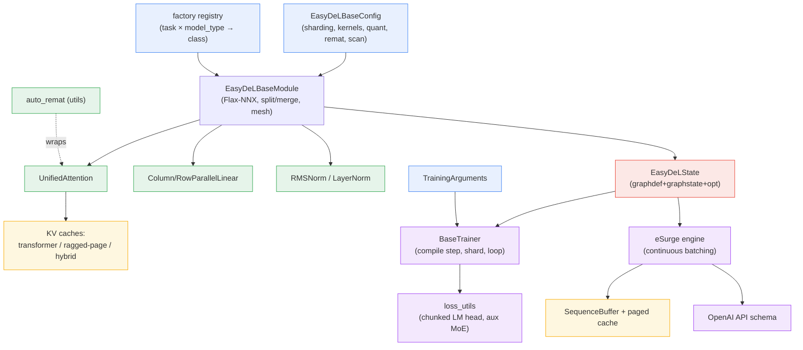
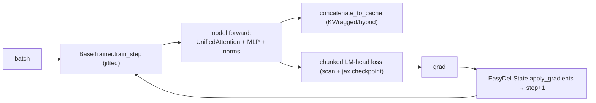

# easydel — what it is and how it fits together

## In one paragraph
EasyDeL is a JAX/Flax-NNX framework for training and serving large language (and multimodal) models on TPU/GPU at scale. Its central design idea is *radical sharing*: ~90 model architectures are built from one attention base class, one linear primitive, one norm module, and one config object, so an optimization applied once transfers everywhere. Models are Flax-NNX modules split into a structural `graphdef` and a parameter `graphstate`, carried through `jit` inside an immutable `EasyDeLState`; a hierarchical sharding plan lives entirely in the config and is resolved lazily onto a device mesh. On the serving side, a continuous-batching engine (eSurge) drives a paged KV cache with a CPU-side slot buffer and an OpenAI-compatible API. The performance-relevant surfaces are concentrated: attention-kernel selection, KV-cache format, rematerialization policy, chunked-LM-head loss, and quantization are all knobs on the shared config, read by the shared primitives.

## Core architecture

## Main concepts

**Shared attention with override hooks.** Every model's attention layer subclasses `UnifiedAttention`, which writes the QKV→norm→RoPE→cache→kernel→output pipeline once and lets architectures override only the hooks they need (`_postprocess_qkv`, `define_network`); it routes standard/MLA/ALiBi paths and delegates the math to a per-instance `FlexibleAttentionModule` that picks the TPU/GPU kernel. See [easydel-layers-attention-_unified](concepts/easydel-layers-attention-_unified.md).

**One tensor-parallel linear, two directions.** `ParallelLinear` is the single dense primitive; `ColumnParallelLinear`/`RowParallelLinear` differ only in a `_direction` field that selects the sharding spec, and the canonical column-then-row MLP pairing minimizes communication. Highest-fan-in perf surface. See [easydel-layers-linears-_linear](concepts/easydel-layers-linears-_linear.md); norms in [easydel-layers-norms-_norms](concepts/easydel-layers-norms-_norms.md).

**Config as the knob surface.** `EasyDeLBaseConfig` carries the parallelism plan, attention-kernel selection, block/tiling sizes, quantization, remat policy, and scan flags — read by every shared primitive, hashable as a compile-cache key. It is the page to read for "what controls X." See [easydel-infra-base_config](concepts/easydel-infra-base_config.md).

**Module, state, and the split/merge idiom.** `EasyDeLBaseModule` is the Flax-NNX base providing mesh access, `graphstate` param-split, RoPE frequencies, uniform head/embedding accessors, and FLOP accounting; `EasyDeLState` bundles the split model + optimizer + step into an immutable pytree threaded through `jit`. See [easydel-infra-base_module](concepts/easydel-infra-base_module.md) and [easydel-infra-base_state](concepts/easydel-infra-base_state.md).

**A registry decouples names from classes.** The factory's global registry, keyed by `(TaskType, model_type)`, binds each architecture's config and module via import-time decorators, so generic loaders resolve a class by name without importing every model. See [easydel-infra-factory](concepts/easydel-infra-factory.md). Output types thread cache/logits up the stack: [easydel-infra-modeling_outputs](concepts/easydel-infra-modeling_outputs.md).

**KV cache is an abstraction with three implementations.** A `BaseCache`/`BaseCacheView`/`BaseCacheConfig`/`OperationsMetadata` contract ([easydel-caching-_abstracts](concepts/easydel-caching-_abstracts.md)) is realized as a dense contiguous cache with a sliding-window path ([easydel-caching-transformer-cache](concepts/easydel-caching-transformer-cache.md)), a paged cache with a TPU Pallas update kernel ([easydel-caching-ragged_page-cache](concepts/easydel-caching-ragged_page-cache.md)), and a per-layer union cache for hybrid attention/SSM models ([easydel-caching-hybrid-cache](concepts/easydel-caching-hybrid-cache.md)).

**Memory levers: rematerialization and chunked LM-head loss.** `auto_remat` wraps modules in JAX remat with named-tensor policies targeting `checkpoint_name` annotations ([easydel-infra-utils](concepts/easydel-infra-utils.md)); the chunked LM-head loss projects logits in scanned, `jax.checkpoint`-wrapped token chunks to avoid the `[B,T,V]` materialization ([easydel-infra-loss_utils](concepts/easydel-infra-loss_utils.md)).

**Training loop as machinery + objective hooks.** `BaseTrainer` owns dataloaders, state sharding, step compilation, checkpointing, and preemption handling; ~20 objectives (SFT/GRPO/DPO/...) override abstract hooks. Configured by one `TrainingArguments` dataclass. See [easydel-trainers-base_trainer](concepts/easydel-trainers-base_trainer.md) and [easydel-trainers-training_configurations](concepts/easydel-trainers-training_configurations.md).

**Serving: continuous batching over a paged cache.** The eSurge engine ([easydel-inference-esurge-esurge_engine](concepts/easydel-inference-esurge-esurge_engine.md)) runs a background scheduler mixing prefill+decode across requests, backed by a CPU-side slot table ([easydel-inference-esurge-runners-sequence_buffer](concepts/easydel-inference-esurge-runners-sequence_buffer.md)) whose ops declare their needs via requirement flags ([easydel-operations-requirements-types](concepts/easydel-operations-requirements-types.md)); it speaks an OpenAI-compatible schema ([easydel-inference-openai_api_modules](concepts/easydel-inference-openai_api_modules.md)) with API-key RBAC ([easydel-workers-esurge-auth-auth_models](concepts/easydel-workers-esurge-auth-auth_models.md)).

**Architectures as thin customizations.** Concrete models are small extensions of the shared base: Gemma4 subclasses `UnifiedAttention` for per-layer sliding/global attention, key-equals-value, and cross-layer KV sharing ([easydel-modules-gemma4-modeling_gemma4](concepts/easydel-modules-gemma4-modeling_gemma4.md)); Qwen3-Omni-MoE composes four MoE towers into an any-to-any pipeline ([easydel-modules-qwen3_omni_moe-modeling_qwen3_omni_moe](concepts/easydel-modules-qwen3_omni_moe-modeling_qwen3_omni_moe.md), config in [easydel-modules-qwen3_omni_moe-qwen3_omni_moe_configuration](concepts/easydel-modules-qwen3_omni_moe-qwen3_omni_moe_configuration.md)).

## How a request flows
**Training:** user fills a `TrainingArguments` and picks a registered model → `BaseTrainer` shards an `EasyDeLState` onto the mesh and compiles the step → each step runs the model (UnifiedAttention writing the KV cache, chunked LM-head loss) and `apply_gradients` returns a new state. **Serving:** eSurge admits a request into the `SequenceBuffer`, the scheduler forms a mixed prefill/decode batch over the paged cache, and streams `RequestOutput` deltas back through the OpenAI schema.

## Map of the wiki
- "Which knob controls sharding/kernels/quant/remat?" → [base_config](concepts/easydel-infra-base_config.md); training-loop knobs → [training_configurations](concepts/easydel-trainers-training_configurations.md).
- "How does attention/KV caching work?" → [_unified](concepts/easydel-layers-attention-_unified.md) + the three cache pages.
- "How is memory bounded?" → [utils (auto_remat)](concepts/easydel-infra-utils.md) + [loss_utils](concepts/easydel-infra-loss_utils.md).
- "How does serving/continuous batching work?" → [esurge_engine](concepts/easydel-inference-esurge-esurge_engine.md) + [sequence_buffer](concepts/easydel-inference-esurge-runners-sequence_buffer.md).
- "How is a new model wired in?" → [factory](concepts/easydel-infra-factory.md); worked examples in the Gemma4 / Qwen3-Omni pages.
- Exhaustive per-symbol index → `catalog/`; concept table → `index.md`.

## Sources
- raw/code/EasyDeL (commit 090a03b2e0)
