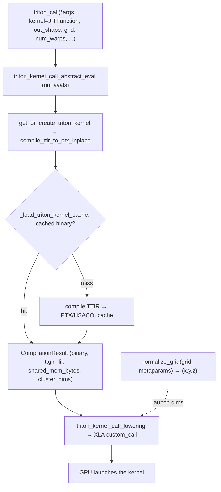

# ejkernel/callib/_triton_call — the JAX↔Triton FFI bridge for calling GPU kernels from JAX

## Overview
ejkernel's GPU kernels are written in OpenAI Triton, but JAX has no native Triton support — so this module is the bridge: [`triton_call`](../catalog/ejkernel/callib/_triton_call.md#triton_call) lets a JAX program invoke a Triton `JITFunction` as if it were a JAX primitive, by compiling the Triton kernel to GPU machine code and wiring it into XLA via a `custom_call`. The lowering path is [`triton_kernel_call_lowering`](../catalog/ejkernel/callib/_triton_call.md#triton_kernel_call_lowering) (MLIR lowering) and [`get_or_create_triton_kernel`](../catalog/ejkernel/callib/_triton_call.md#get_or_create_triton_kernel) / [`_load_triton_kernel_cache`](../catalog/ejkernel/callib/_triton_call.md#_load_triton_kernel_cache) (compile once, cache the binary). This is the GPU counterpart to the Pallas TPU kernels — it's how the [kernel registry](ejkernel-kernels-_registry.md)'s `Platform.TRITON` implementations actually execute. On TPU-only setups [`CAN_USE_TRITON`](../catalog/ejkernel/callib/_triton_call.md#CAN_USE_TRITON) is false and this path is inert.

## Diagram

## Design rationale (why it's built this way)
- **Triton kernels as JAX custom_calls.** [`triton_call`](../catalog/ejkernel/callib/_triton_call.md#triton_call) takes a Triton `JITFunction`/`Autotuner`/`Heuristics`, an `out_shape`, and a `grid`, and produces a JAX-traceable op via `custom_call` with target [`custom_call_target_name`](../catalog/ejkernel/callib/_triton_call.md#triton_call). This is the standard jax-triton FFI pattern: the Triton kernel is compiled to GPU code and registered as an XLA custom call so it composes with the rest of a jitted JAX program.
- **Compile-once, cache the binary.** [`get_or_create_triton_kernel`](../catalog/ejkernel/callib/_triton_call.md#get_or_create_triton_kernel) + [`_load_triton_kernel_cache`](../catalog/ejkernel/callib/_triton_call.md#_load_triton_kernel_cache) memoize compilation so a kernel isn't re-lowered every call. The [`CompilationResult`](../catalog/ejkernel/callib/_triton_call.md#CompilationResult) caches everything the launch needs: the [`binary`](../catalog/ejkernel/callib/_triton_call.md#CompilationResult.binary), the intermediate IRs ([`ttgir`](../catalog/ejkernel/callib/_triton_call.md#CompilationResult.ttgir)/[`llir`](../catalog/ejkernel/callib/_triton_call.md#CompilationResult.llir)) for debugging, [`shared_mem_bytes`](../catalog/ejkernel/callib/_triton_call.md#CompilationResult.shared_mem_bytes) (dynamic-shared-memory size the launch must request), [`cluster_dims`](../catalog/ejkernel/callib/_triton_call.md#CompilationResult.cluster_dims), and the [`name`](../catalog/ejkernel/callib/_triton_call.md#CompilationResult.name).
- **Grid can be a lambda over metaparams.** The `grid` is a [`GridOrLambda`](../catalog/ejkernel/callib/_triton_call.md#GridOrLambda) — either a fixed [`Grid`](../catalog/ejkernel/callib/_triton_call.md#Grid) tuple or a function of the Triton metaparams — resolved by [`normalize_grid`](../catalog/ejkernel/callib/_triton_call.md#normalize_grid) into a `(x,y,z)` launch. This matches Triton's convention where launch dims often depend on autotuned block sizes.
- **Single-device / shard_map guardrails.** The module checks device sets (`_array_device_set`, `_assert_single_device_args`, `_in_shard_map_context`, `_has_multi_accelerators`) because a Triton kernel launches on one GPU — passing arrays spread across devices (outside a proper shard_map) is an error caught up front rather than a confusing runtime failure.
- **Backend-aware compilation.** `get_cuda_backend`/`get_hip_backend` + compute-capability detection ([`_get_cuda_compute_capability`](../catalog/ejkernel/callib/_triton_call.md#_get_cuda_compute_capability)) select the right target (NVIDIA PTX vs AMD HSACO) so the same `triton_call` works across GPU vendors.

## Entry points
- [`triton_call`](../catalog/ejkernel/callib/_triton_call.md#triton_call) — the public bridge: run a Triton kernel from JAX with `out_shape`/`grid`/`num_warps`/`num_stages` and metaparams; returns JAX arrays.
- [`triton_kernel_call_lowering`](../catalog/ejkernel/callib/_triton_call.md#triton_kernel_call_lowering) — the MLIR lowering turning the call into an XLA `custom_call`.
- [`get_or_create_triton_kernel`](../catalog/ejkernel/callib/_triton_call.md#get_or_create_triton_kernel) / [`_load_triton_kernel_cache`](../catalog/ejkernel/callib/_triton_call.md#_load_triton_kernel_cache) — compile + cache the Triton kernel binary.
- [`CAN_USE_TRITON`](../catalog/ejkernel/callib/_triton_call.md#CAN_USE_TRITON) — the availability flag gating this whole path (false on TPU-only / no-Triton installs).

## Mechanism (step-by-step)
1. **Abstract-eval the outputs.** [`triton_kernel_call_abstract_eval`](../catalog/ejkernel/callib/_triton_call.md#triton_kernel_call_lowering) derives output avals from `out_shape` so the call is JAX-traceable without running the kernel.
2. **Compile (or load from cache).** [`get_or_create_triton_kernel`](../catalog/ejkernel/callib/_triton_call.md#get_or_create_triton_kernel) checks [`_load_triton_kernel_cache`](../catalog/ejkernel/callib/_triton_call.md#_load_triton_kernel_cache); on a miss it compiles the Triton IR to PTX/HSACO (`compile_ttir_to_ptx_inplace`) for the detected backend/compute-capability, producing a [`CompilationResult`](../catalog/ejkernel/callib/_triton_call.md#CompilationResult).
3. **Lower to a custom_call.** [`triton_kernel_call_lowering`](../catalog/ejkernel/callib/_triton_call.md#triton_kernel_call_lowering) emits an XLA `custom_call` carrying the compiled [`binary`](../catalog/ejkernel/callib/_triton_call.md#CompilationResult.binary), the normalized grid ([`normalize_grid`](../catalog/ejkernel/callib/_triton_call.md#normalize_grid)), `num_warps`/`num_stages`, and the [`shared_mem_bytes`](../catalog/ejkernel/callib/_triton_call.md#CompilationResult.shared_mem_bytes) to request.
4. **Launch on one GPU.** At runtime XLA invokes the custom call emitted by [`triton_kernel_call_lowering`](../catalog/ejkernel/callib/_triton_call.md#triton_kernel_call_lowering), which launches the Triton kernel with the given grid — after the single-device guards confirmed all arrays live on the target GPU.

## Key data structures
- [`CompilationResult`](../catalog/ejkernel/callib/_triton_call.md#CompilationResult) — `{`[`binary`](../catalog/ejkernel/callib/_triton_call.md#CompilationResult.binary), [`name`](../catalog/ejkernel/callib/_triton_call.md#CompilationResult.name), [`ttgir`](../catalog/ejkernel/callib/_triton_call.md#CompilationResult.ttgir), [`llir`](../catalog/ejkernel/callib/_triton_call.md#CompilationResult.llir), [`shared_mem_bytes`](../catalog/ejkernel/callib/_triton_call.md#CompilationResult.shared_mem_bytes), [`cluster_dims`](../catalog/ejkernel/callib/_triton_call.md#CompilationResult.cluster_dims)`}` — the cached compilation.
- [`Grid`](../catalog/ejkernel/callib/_triton_call.md#Grid) / [`GridOrLambda`](../catalog/ejkernel/callib/_triton_call.md#GridOrLambda) — the launch-grid type (tuple or metaparam function).
- [`CAN_USE_TRITON`](../catalog/ejkernel/callib/_triton_call.md#CAN_USE_TRITON) — global availability flag.

## Dynamics (design intent)
> [!inferred] This module is what makes ejkernel genuinely multi-backend: the same registry-dispatched algorithm can resolve to a Pallas TPU kernel or a Triton GPU kernel, and this bridge is the GPU execution path. On the TPU-focused deployments this project targets it's dormant ([`CAN_USE_TRITON`](../catalog/ejkernel/callib/_triton_call.md#CAN_USE_TRITON) false), but it's why `Platform.TRITON` entries in the registry are runnable at all on GPU hosts.

## Edge cases
- **Arrays on multiple devices** (outside shard_map) → the single-device asserts fail — a Triton kernel can't span devices.
- **No Triton installed / TPU-only** → [`CAN_USE_TRITON`](../catalog/ejkernel/callib/_triton_call.md#CAN_USE_TRITON) is false and `triton_call` is unusable; the registry must not resolve to a Triton impl there.
- **Wrong `shared_mem_bytes`** — the launch must request the compiled kernel's dynamic shared memory; a mismatch fails the launch, which is why it's cached in [`CompilationResult`](../catalog/ejkernel/callib/_triton_call.md#CompilationResult).

## Open questions
> [!inferred] The exact TTIR→PTX compilation pipeline and the custom-call runtime registration are jax-triton-derived plumbing not detailed here; this page documents the bridge's role and caching structure.

## See also
- [ejkernel/kernels/_registry](ejkernel-kernels-_registry.md) — dispatches `Platform.TRITON` implementations that this bridge runs.
- [ejkernel/modules/base](ejkernel-modules-base.md) — `detect_platform` may select Triton on GPU.

## Sources
- raw/code/ejkernel/ejkernel/callib/_triton_call.py
