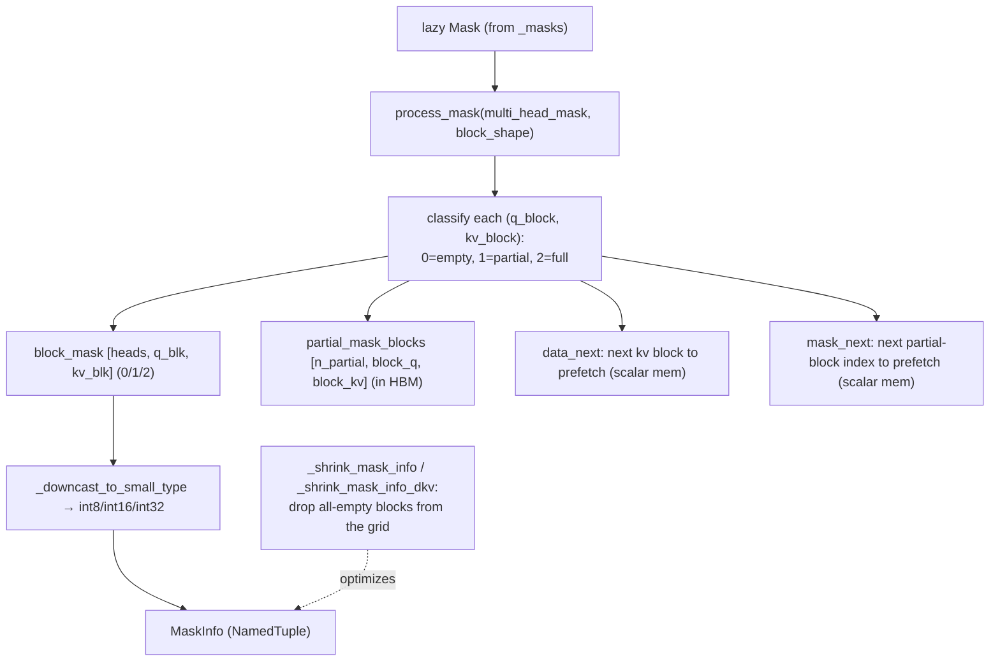

# ejkernel/kernels/_pallas/tpu/blocksparse_attention/_info — the sparse MaskInfo the Splash kernel prefetches

## Overview
This module turns a dense/lazy attention mask into the *sparse block representation* the Splash attention Pallas kernel actually runs on. The central type is [`MaskInfo`](../catalog/ejkernel/kernels/_pallas/tpu/blocksparse_attention/_info.md#MaskInfo) (a NamedTuple), and the core function is [`process_mask`](../catalog/ejkernel/kernels/_pallas/tpu/blocksparse_attention/_info.md#process_mask) (static masks) / [`process_dynamic_mask`](../catalog/ejkernel/kernels/_pallas/tpu/blocksparse_attention/_info.md#process_dynamic_mask) (traced masks). The key idea is a three-way per-block classification: every `(q_block, kv_block)` in the mask is *empty* (all zeros — skip entirely), *full* (all ones — no masking work), or *partial* (mixed — store the actual block). That classification is packed into prefetch lookup tables ([`block_mask`](../catalog/ejkernel/kernels/_pallas/tpu/blocksparse_attention/_info.md#MaskInfo.block_mask), [`data_next`](../catalog/ejkernel/kernels/_pallas/tpu/blocksparse_attention/_info.md#MaskInfo.data_next), [`mask_next`](../catalog/ejkernel/kernels/_pallas/tpu/blocksparse_attention/_info.md#MaskInfo.mask_next)) that the kernel uses to skip masked blocks and prefetch only the partial ones — the mechanism that makes block-sparse attention faster than dense.

## Diagram

## Design rationale (why it's built this way)
- **Three-state block classification is the whole optimization.** [`block_mask`](../catalog/ejkernel/kernels/_pallas/tpu/blocksparse_attention/_info.md#MaskInfo.block_mask) entries are `0` (empty), `1` (partial), or `2` (full) — the docstring's exact encoding. Empty blocks are skipped (no compute), full blocks run un-masked (no per-element masking), and only partial blocks need the actual mask applied. This turns the mask from a per-element cost into a per-block decision.
- **Prefetch tables live in scarce TPU scalar memory; downcast aggressively.** [`data_next`](../catalog/ejkernel/kernels/_pallas/tpu/blocksparse_attention/_info.md#MaskInfo.data_next)/[`mask_next`](../catalog/ejkernel/kernels/_pallas/tpu/blocksparse_attention/_info.md#MaskInfo.mask_next)/[`block_mask`](../catalog/ejkernel/kernels/_pallas/tpu/blocksparse_attention/_info.md#MaskInfo.block_mask) are stored in TPU scalar memory ("a scarce resource"), so `_downcast_to_small_type` shrinks them to the smallest int dtype (int8/int16/int32) that fits — a deliberate concession to TPU's tiny scalar-memory budget. The bulky [`partial_mask_blocks`](../catalog/ejkernel/kernels/_pallas/tpu/blocksparse_attention/_info.md#MaskInfo.partial_mask_blocks) live in HBM and are loaded on demand.
- **Prefetch pointers hide memory latency.** [`data_next`](../catalog/ejkernel/kernels/_pallas/tpu/blocksparse_attention/_info.md#MaskInfo.data_next) points to the *next* kv block to load and [`mask_next`](../catalog/ejkernel/kernels/_pallas/tpu/blocksparse_attention/_info.md#MaskInfo.mask_next) to the next partial-mask block — so while the kernel computes the current block, the next one is already streaming in. This double-buffering is why the sparse pattern doesn't stall on the irregular HBM accesses that skipping blocks would otherwise cause.
- **Per-head vs per-shard first dimension.** The leading dimension of the tables is `num_heads` when heads have distinct masks, or `num_head_shards` when a shard's heads share one mask (broadcast) — a size optimization that avoids replicating identical mask tables across heads.
- **Grid shrinking removes empty rows/cols.** [`_shrink_mask_info`](../catalog/ejkernel/kernels/_pallas/tpu/blocksparse_attention/_info.md#_shrink_mask_info) / [`_shrink_mask_info_dkv`](../catalog/ejkernel/kernels/_pallas/tpu/blocksparse_attention/_info.md#_shrink_mask_info_dkv) drop entirely-empty blocks from the computation grid, so the Pallas grid iterates only over blocks that can contribute — the forward and the `dkv` backward each get their own shrink.

## Entry points
- [`process_mask`](../catalog/ejkernel/kernels/_pallas/tpu/blocksparse_attention/_info.md#process_mask) / [`process_mask_dkv`](../catalog/ejkernel/kernels/_pallas/tpu/blocksparse_attention/_info.md#process_mask_dkv) — transform a static `MultiHeadMask` into a [`MaskInfo`](../catalog/ejkernel/kernels/_pallas/tpu/blocksparse_attention/_info.md#MaskInfo) (+ a mask function), for the forward and dkv-backward grids.
- [`process_dynamic_mask`](../catalog/ejkernel/kernels/_pallas/tpu/blocksparse_attention/_info.md#process_dynamic_mask) / [`process_dynamic_mask_dkv`](../catalog/ejkernel/kernels/_pallas/tpu/blocksparse_attention/_info.md#process_dynamic_mask_dkv) — handle traced masks that can't be analyzed at compile time (keeping [`is_dynamic_mask`](../catalog/ejkernel/kernels/_pallas/tpu/blocksparse_attention/_info.md#MaskInfo.is_dynamic_mask)=True so leading dims aren't collapsed and can be sharded).
- [`MaskInfo`](../catalog/ejkernel/kernels/_pallas/tpu/blocksparse_attention/_info.md#MaskInfo) — the NamedTuple result: `data_next`/`mask_next`/`block_mask`/`partial_mask_blocks`/`q_sequence`/`is_dynamic_mask`.

## Mechanism (step-by-step)
1. **Slice + classify every block.** [`_process_mask`](../catalog/ejkernel/kernels/_pallas/tpu/blocksparse_attention/_info.md#_process_mask) walks the lazy mask block-by-block, marking each `(q,kv)` block as empty/partial/full in [`block_mask`](../catalog/ejkernel/kernels/_pallas/tpu/blocksparse_attention/_info.md#MaskInfo.block_mask), and collecting the actual arrays of partial blocks into [`partial_mask_blocks`](../catalog/ejkernel/kernels/_pallas/tpu/blocksparse_attention/_info.md#MaskInfo.partial_mask_blocks) (assigning unique IDs so identical partial blocks are deduplicated).
2. **Build prefetch tables.** [`data_next`](../catalog/ejkernel/kernels/_pallas/tpu/blocksparse_attention/_info.md#MaskInfo.data_next) (next kv block) and [`mask_next`](../catalog/ejkernel/kernels/_pallas/tpu/blocksparse_attention/_info.md#MaskInfo.mask_next) (next partial-block index) are computed so the kernel can double-buffer.
3. **Downcast + shrink.** [`_downcast_to_small_type`](../catalog/ejkernel/kernels/_pallas/tpu/blocksparse_attention/_info.md#_downcast_to_small_type) shrinks the scalar-memory tables to int8/16; [`_shrink_mask_info`](../catalog/ejkernel/kernels/_pallas/tpu/blocksparse_attention/_info.md#_shrink_mask_info)/[`_shrink_mask_info_dkv`](../catalog/ejkernel/kernels/_pallas/tpu/blocksparse_attention/_info.md#_shrink_mask_info_dkv) drop empty rows/cols from the grid.
4. **Dynamic path keeps leading dims.** For traced masks, [`_process_dynamic_mask`](../catalog/ejkernel/kernels/_pallas/tpu/blocksparse_attention/_info.md#_process_dynamic_mask) sets [`is_dynamic_mask`](../catalog/ejkernel/kernels/_pallas/tpu/blocksparse_attention/_info.md#MaskInfo.is_dynamic_mask)=True, leaving the head/q/kv leading dimensions un-collapsed so the arrays can be sharded rather than analyzed statically.

## Key data structures
- [`MaskInfo`](../catalog/ejkernel/kernels/_pallas/tpu/blocksparse_attention/_info.md#MaskInfo) — `{`[`data_next`](../catalog/ejkernel/kernels/_pallas/tpu/blocksparse_attention/_info.md#MaskInfo.data_next), [`mask_next`](../catalog/ejkernel/kernels/_pallas/tpu/blocksparse_attention/_info.md#MaskInfo.mask_next), [`block_mask`](../catalog/ejkernel/kernels/_pallas/tpu/blocksparse_attention/_info.md#MaskInfo.block_mask), [`partial_mask_blocks`](../catalog/ejkernel/kernels/_pallas/tpu/blocksparse_attention/_info.md#MaskInfo.partial_mask_blocks), [`q_sequence`](../catalog/ejkernel/kernels/_pallas/tpu/blocksparse_attention/_info.md#MaskInfo.q_sequence), [`is_dynamic_mask`](../catalog/ejkernel/kernels/_pallas/tpu/blocksparse_attention/_info.md#MaskInfo.is_dynamic_mask)`}`.
- [`_HashableNDArray`](../catalog/ejkernel/kernels/_pallas/tpu/blocksparse_attention/_info.md#_HashableNDArray) — wraps a numpy [`array`](../catalog/ejkernel/kernels/_pallas/tpu/blocksparse_attention/_info.md#_HashableNDArray.array) so mask arrays can key a cache (dedup partial blocks / memoize processing).

## Dynamics (design intent)
> [!inferred] The scalar-memory pressure is the design driver: TPU scalar memory is tiny, so the classification tables must be as small as possible (downcast + shrink + per-shard broadcast), while the actual partial mask data stays in HBM and is prefetched. This is why block-sparse attention on TPU is a memory-layout problem as much as a compute one — the win comes from never loading masked blocks, and the prefetch pointers are what keep that irregular access from stalling.

## Edge cases
- **Dynamic (traced) masks** can't be statically classified — [`process_dynamic_mask`](../catalog/ejkernel/kernels/_pallas/tpu/blocksparse_attention/_info.md#process_dynamic_mask) keeps [`is_dynamic_mask`](../catalog/ejkernel/kernels/_pallas/tpu/blocksparse_attention/_info.md#MaskInfo.is_dynamic_mask)=True and forgoes the empty-block skipping that static analysis enables.
- **All-partial mask** defeats the sparsity — if every block is mixed, [`partial_mask_blocks`](../catalog/ejkernel/kernels/_pallas/tpu/blocksparse_attention/_info.md#MaskInfo.partial_mask_blocks) is large and the kernel approaches dense cost.
- **Distinct per-head masks** force the `num_heads` (not `num_head_shards`) leading dimension, inflating scalar-memory usage.

## Open questions
> [!inferred] The exact `q_index_map`/`kv_index_map` prefetch semantics inside the kernel (how `data_next`/`mask_next` are consumed) live in [_kernel](ejkernel-kernels-_pallas-tpu-blocksparse_attention-_kernel.md); this page documents the sparse-representation construction.

## See also
- [ejkernel/kernels/_pallas/tpu/blocksparse_attention/_masks](ejkernel-kernels-_pallas-tpu-blocksparse_attention-_masks.md) — the lazy masks this pass slices and classifies.
- [ejkernel/kernels/_pallas/tpu/blocksparse_attention/_kernel](ejkernel-kernels-_pallas-tpu-blocksparse_attention-_kernel.md) — the Splash kernel that prefetches using these tables.
- [ejkernel/types/mask](ejkernel-types-mask.md) — the op-level MaskInfo container.

## Sources
- raw/code/ejkernel/ejkernel/kernels/_pallas/tpu/blocksparse_attention/_info.py
