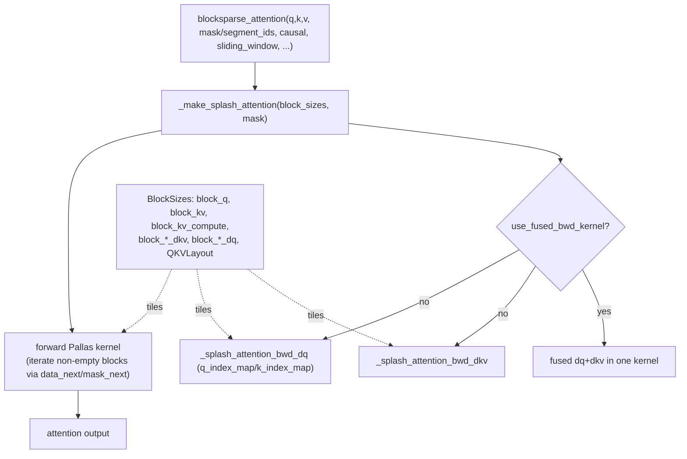

# ejkernel/kernels/_pallas/tpu/blocksparse_attention/_kernel — the Splash attention Pallas kernel (fwd + dq/dkv bwd)

<!-- connect:up:begin -->
> **Cross-repo concept:** part of [pallas-kernel](../../../concepts/pallas-kernel.md), [splash-attention](../../../concepts/splash-attention.md) across this wiki's repos.
<!-- connect:up:end -->
## Overview
This is the actual TPU Pallas implementation of block-sparse ("Splash") attention: the forward kernel plus the two backward kernels (`dq` and `dkv`), assembled by [`_make_splash_attention`](../catalog/ejkernel/kernels/_pallas/tpu/blocksparse_attention/_kernel.md#_make_splash_attention) and exposed through the public [`blocksparse_attention`](../catalog/ejkernel/kernels/_pallas/tpu/blocksparse_attention/_kernel.md#blocksparse_attention) entry point. It consumes the sparse [MaskInfo](ejkernel-kernels-_pallas-tpu-blocksparse_attention-_info.md) prefetch tables to skip masked blocks, is tiled by a [`BlockSizes`](../catalog/ejkernel/kernels/_pallas/tpu/blocksparse_attention/_kernel.md#BlockSizes) config (with distinct forward and `dq`/`dkv` tiles), and supports a *fused backward* mode ([`use_fused_bwd_kernel`](../catalog/ejkernel/kernels/_pallas/tpu/blocksparse_attention/_kernel.md#BlockSizes.use_fused_bwd_kernel)) that computes `dq` and `dkv` in one pass. The kernel handles the full feature surface a production attention needs: GQA, sliding window, causal/chunked masks, attention sinks (`softmax_aux`), logit soft-capping, bias, and sequence-parallel sharding.

## Diagram

## Design rationale (why it's built this way)
- **Sparse iteration driven by the prefetch tables.** The forward and `dkv` kernels iterate only over blocks the [MaskInfo](ejkernel-kernels-_pallas-tpu-blocksparse_attention-_info.md)'s `block_mask`/`data_next`/`mask_next` say are non-empty, using [`_next_nonzero`](../catalog/ejkernel/kernels/_pallas/tpu/blocksparse_attention/_kernel.md#_next_nonzero) and per-kernel `q_index_map`/`k_index_map` (e.g. [`_splash_attention_bwd_dkv.k_index_map`](../catalog/ejkernel/kernels/_pallas/tpu/blocksparse_attention/_kernel.md#_splash_attention_bwd_dkv.k_index_map)) to map grid indices to physical blocks — that indirection is what realizes "skip masked regions."
- **Separate or fused backward.** [`BlockSizes.use_fused_bwd_kernel`](../catalog/ejkernel/kernels/_pallas/tpu/blocksparse_attention/_kernel.md#BlockSizes.use_fused_bwd_kernel) chooses between two backward strategies: unfused runs [`_splash_attention_bwd_dq`](../catalog/ejkernel/kernels/_pallas/tpu/blocksparse_attention/_kernel.md#_splash_attention_bwd_dq) and [`_splash_attention_bwd_dkv`](../catalog/ejkernel/kernels/_pallas/tpu/blocksparse_attention/_kernel.md#_splash_attention_bwd_dkv) as separate kernels (each with its own tiles), fused computes both in one pass. The fused mode forbids `dq` tiles ([`__post_init__`](../catalog/ejkernel/kernels/_pallas/tpu/blocksparse_attention/_kernel.md#BlockSizes) raises if `block_q_dq`/`block_kv_dq` are set) — a real trade: fused saves a kernel launch and re-read of activations, unfused allows independent `dq`/`dkv` tiling.
- **Compute vs. major tile separation.** [`BlockSizes`](../catalog/ejkernel/kernels/_pallas/tpu/blocksparse_attention/_kernel.md#BlockSizes) distinguishes [`block_kv`](../catalog/ejkernel/kernels/_pallas/tpu/blocksparse_attention/_kernel.md#BlockSizes.block_kv) (the KV block brought in) from [`block_kv_dkv_compute`](../catalog/ejkernel/kernels/_pallas/tpu/blocksparse_attention/_kernel.md#BlockSizes.block_kv_dkv_compute)-style *compute* tiles — the inner MXU tile — defaulting the compute tile to the major tile when unset. Same major/minor idea as flash attention.
- **Layout is physical-only; logical interface is fixed.** [`QKVLayout`](../catalog/ejkernel/kernels/_pallas/tpu/blocksparse_attention/_kernel.md#QKVLayout) (defaulting to [`HEAD_DIM_MINOR`](../catalog/ejkernel/kernels/_pallas/tpu/blocksparse_attention/_kernel.md#QKVLayout.HEAD_DIM_MINOR)) controls the *physical* memory layout the kernel enforces per Q/K/V, but the docstring guarantees "the logical interface ... always takes the head dimension as the minormost one" — so layout tuning never changes the caller's tensor convention, only the on-chip arrangement.
- **`NUM_LANES`/`NUM_SUBLANES` bake in TPU geometry.** The kernel uses TPU's [`NUM_LANES`](../catalog/ejkernel/kernels/_pallas/tpu/blocksparse_attention/_kernel.md#NUM_LANES)/[`NUM_SUBLANES`](../catalog/ejkernel/kernels/_pallas/tpu/blocksparse_attention/_kernel.md#NUM_SUBLANES) (128×8 vector-unit geometry) as constants — the tiling must align to these for the vector unit to be fully utilized.

## Entry points
- [`blocksparse_attention`](../catalog/ejkernel/kernels/_pallas/tpu/blocksparse_attention/_kernel.md#blocksparse_attention) — the public kernel: takes q/k/v, optional segment-ids/positions/mask/bias, `causal`/`sliding_window`/`chunk_size`, sinks (`softmax_aux`), `logits_soft_cap`, `fwd_params`/`bwd_params` tiling, and `fused_backward`; returns the attention output.
- [`_make_splash_attention`](../catalog/ejkernel/kernels/_pallas/tpu/blocksparse_attention/_kernel.md#_make_splash_attention) — assembles the forward + backward kernels for a given [`BlockSizes`](../catalog/ejkernel/kernels/_pallas/tpu/blocksparse_attention/_kernel.md#BlockSizes) + mask (shrinking the grid unless fused).
- [`_splash_attention_bwd_dq`](../catalog/ejkernel/kernels/_pallas/tpu/blocksparse_attention/_kernel.md#_splash_attention_bwd_dq) / [`_splash_attention_bwd_dkv`](../catalog/ejkernel/kernels/_pallas/tpu/blocksparse_attention/_kernel.md#_splash_attention_bwd_dkv) — the two backward Pallas kernels (unfused path), each with its own index maps.
- [`BlockSizes`](../catalog/ejkernel/kernels/_pallas/tpu/blocksparse_attention/_kernel.md#BlockSizes) (+ [`get_default`](../catalog/ejkernel/kernels/_pallas/tpu/blocksparse_attention/_kernel.md#BlockSizes.get_default), [`has_backward_blocks`](../catalog/ejkernel/kernels/_pallas/tpu/blocksparse_attention/_kernel.md#BlockSizes.has_backward_blocks)) — the Splash-specific tiling config.

## Mechanism (step-by-step)
1. **Resolve mask + build kernels.** [`blocksparse_attention`](../catalog/ejkernel/kernels/_pallas/tpu/blocksparse_attention/_kernel.md#blocksparse_attention) turns its masking args (causal/sliding_window/chunk_size/explicit mask) into a sparse mask and calls [`_make_splash_attention`](../catalog/ejkernel/kernels/_pallas/tpu/blocksparse_attention/_kernel.md#_make_splash_attention) with the [`BlockSizes`](../catalog/ejkernel/kernels/_pallas/tpu/blocksparse_attention/_kernel.md#BlockSizes) derived from `fwd_params`/`bwd_params`.
2. **Forward over non-empty blocks.** The forward Pallas kernel iterates the shrunk grid, using [`_next_nonzero`](../catalog/ejkernel/kernels/_pallas/tpu/blocksparse_attention/_kernel.md#_next_nonzero) + the prefetch tables to load only non-empty KV/partial-mask blocks, computing flash-style running softmax per block and applying partial masks / sinks / soft-cap.
3. **Backward, fused or split.** If [`use_fused_bwd_kernel`](../catalog/ejkernel/kernels/_pallas/tpu/blocksparse_attention/_kernel.md#BlockSizes.use_fused_bwd_kernel), one kernel produces `dq`+`dkv`; otherwise [`_splash_attention_bwd_dq`](../catalog/ejkernel/kernels/_pallas/tpu/blocksparse_attention/_kernel.md#_splash_attention_bwd_dq) and [`_splash_attention_bwd_dkv`](../catalog/ejkernel/kernels/_pallas/tpu/blocksparse_attention/_kernel.md#_splash_attention_bwd_dkv) run with their own tiles and index maps ([`.q_index_map`](../catalog/ejkernel/kernels/_pallas/tpu/blocksparse_attention/_kernel.md#_splash_attention_bwd_dkv.q_index_map)/[`.k_index_map`](../catalog/ejkernel/kernels/_pallas/tpu/blocksparse_attention/_kernel.md#_splash_attention_bwd_dkv.k_index_map)).
4. **Grid shrink unless fused.** [`_make_splash_attention`](../catalog/ejkernel/kernels/_pallas/tpu/blocksparse_attention/_kernel.md#_make_splash_attention) applies `shrink_grid=not use_fused_bwd_kernel` — the fused path can't shrink the same way, another facet of the fused/unfused trade.

## Key data structures
- [`BlockSizes`](../catalog/ejkernel/kernels/_pallas/tpu/blocksparse_attention/_kernel.md#BlockSizes) — forward ([`block_q`](../catalog/ejkernel/kernels/_pallas/tpu/blocksparse_attention/_kernel.md#BlockSizes.block_q), [`block_kv`](../catalog/ejkernel/kernels/_pallas/tpu/blocksparse_attention/_kernel.md#BlockSizes.block_kv), `block_kv_compute`), dkv ([`block_q_dkv`](../catalog/ejkernel/kernels/_pallas/tpu/blocksparse_attention/_kernel.md#BlockSizes.block_q_dkv), [`block_kv_dkv`](../catalog/ejkernel/kernels/_pallas/tpu/blocksparse_attention/_kernel.md#BlockSizes.block_kv_dkv), [`block_kv_dkv_compute`](../catalog/ejkernel/kernels/_pallas/tpu/blocksparse_attention/_kernel.md#BlockSizes.block_kv_dkv_compute)), dq ([`block_q_dq`](../catalog/ejkernel/kernels/_pallas/tpu/blocksparse_attention/_kernel.md#BlockSizes.block_q_dq), [`block_kv_dq`](../catalog/ejkernel/kernels/_pallas/tpu/blocksparse_attention/_kernel.md#BlockSizes.block_kv_dq)), [`use_fused_bwd_kernel`](../catalog/ejkernel/kernels/_pallas/tpu/blocksparse_attention/_kernel.md#BlockSizes.use_fused_bwd_kernel), and per-Q/K/V [`QKVLayout`](../catalog/ejkernel/kernels/_pallas/tpu/blocksparse_attention/_kernel.md#QKVLayout).
- [`SegmentIds`](../catalog/ejkernel/kernels/_pallas/tpu/blocksparse_attention/_kernel.md#SegmentIds) (NamedTuple), [`MaskFunctionType`](../catalog/ejkernel/kernels/_pallas/tpu/blocksparse_attention/_kernel.md#MaskFunctionType) — the segment-id container and mask-function alias the kernel accepts.

## Dynamics (design intent)
> [!inferred] This is a port of the JAX/Mosaic SplashAttention kernel (the same lineage as maxdiffusion's splash kernel), specialized into ejkernel's autotuned-kernel framework. Its performance is governed almost entirely by [`BlockSizes`](../catalog/ejkernel/kernels/_pallas/tpu/blocksparse_attention/_kernel.md#BlockSizes) (tiling) and the mask sparsity (how many blocks are skippable) — the fused-vs-split backward and the compute-tile split are the levers the autotuner explores for the training backward.

## Edge cases
- **Fused backward with dq tiles set** → `ValueError` (the dq kernel's tiles are meaningless when fused).
- **`has_backward_blocks`** requires the dkv tiles always and the dq tiles only when not fused — so a config's backward-readiness depends on the fused flag.
- **Sliding window + causal + chunk** compose through the mask; conflicting masking args can produce an unexpected sparse pattern if not consistent.

## Open questions
> [!inferred] The exact running-softmax accumulation and the fused-backward math are extensive Pallas code not reproduced here; this page documents the kernel's structure, tiling, and sparse-iteration mechanism.

## See also
- [ejkernel/kernels/_pallas/tpu/blocksparse_attention/_info](ejkernel-kernels-_pallas-tpu-blocksparse_attention-_info.md) — the prefetch tables driving sparse iteration.
- [ejkernel/kernels/_pallas/tpu/blocksparse_attention/_masks](ejkernel-kernels-_pallas-tpu-blocksparse_attention-_masks.md) — the mask patterns.
- [ejkernel/kernels/_pallas/tpu/flash_attention/_utils](ejkernel-kernels-_pallas-tpu-flash_attention-_utils.md) — the dense flash-attention tiling counterpart.
- [ejkernel/kernels/_pallas/tpu/ring_attention/_pallas_impl_bwd](ejkernel-kernels-_pallas-tpu-ring_attention-_pallas_impl_bwd.md) — ring attention built on splash.

## Sources
- raw/code/ejkernel/ejkernel/kernels/_pallas/tpu/blocksparse_attention/_kernel.py
