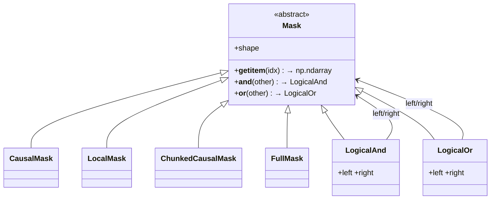

# ejkernel/kernels/_pallas/tpu/blocksparse_attention/_masks — the composable lazy mask algebra

<!-- connect:up:begin -->
> **Cross-repo concept:** part of [pallas-kernel](../../../concepts/pallas-kernel.md) across this wiki's repos.
<!-- connect:up:end -->
## Overview
Splash (block-sparse) attention needs to know, per query-key block, whether that block is fully masked, fully open, or partial — and this module defines the *lazy, composable* mask objects that express those patterns. [`Mask`](../catalog/ejkernel/kernels/_pallas/tpu/blocksparse_attention/_masks.md#Mask) is the abstract base; concrete masks ([`CausalMask`](../catalog/ejkernel/kernels/_pallas/tpu/blocksparse_attention/_masks.md#CausalMask), [`LocalMask`](../catalog/ejkernel/kernels/_pallas/tpu/blocksparse_attention/_masks.md#LocalMask), [`ChunkedCausalMask`](../catalog/ejkernel/kernels/_pallas/tpu/blocksparse_attention/_masks.md#ChunkedCausalMask), [`FullMask`](../catalog/ejkernel/kernels/_pallas/tpu/blocksparse_attention/_masks.md#FullMask)) define a pattern, and they compose via bitwise operators — [`Mask.__and__`](../catalog/ejkernel/kernels/_pallas/tpu/blocksparse_attention/_masks.md#Mask.__and__)/[`Mask.__or__`](../catalog/ejkernel/kernels/_pallas/tpu/blocksparse_attention/_masks.md#Mask.__or__) build [`LogicalAnd`](../catalog/ejkernel/kernels/_pallas/tpu/blocksparse_attention/_masks.md#LogicalAnd)/[`LogicalOr`](../catalog/ejkernel/kernels/_pallas/tpu/blocksparse_attention/_masks.md#LogicalOr) trees. The key idea: a mask is *never densely materialized* until a specific block is sliced via `__getitem__`, so "causal AND local-window" is a small composition object that the sparse-processing pass ([_info](ejkernel-kernels-_pallas-tpu-blocksparse_attention-_info.md)) can query block-by-block rather than a full `[seq, seq]` boolean array.

## Diagram

## Design rationale (why it's built this way)
- **Lazy: materialize only the sliced block.** [`Mask`](../catalog/ejkernel/kernels/_pallas/tpu/blocksparse_attention/_masks.md#Mask)'s core method is `__getitem__(idx)`, which returns the dense `np.ndarray` for *just that index range*. The mask-processing pass slices the mask block-by-block to classify each block (empty/full/partial) without ever building the full mask — essential because the full mask for long sequences is `O(seq²)` and the whole point of block-sparse is to avoid touching masked regions.
- **Composition as an algebra.** [`Mask.__and__`](../catalog/ejkernel/kernels/_pallas/tpu/blocksparse_attention/_masks.md#Mask.__and__) and [`Mask.__or__`](../catalog/ejkernel/kernels/_pallas/tpu/blocksparse_attention/_masks.md#Mask.__or__) build [`LogicalAnd`](../catalog/ejkernel/kernels/_pallas/tpu/blocksparse_attention/_masks.md#LogicalAnd)/[`LogicalOr`](../catalog/ejkernel/kernels/_pallas/tpu/blocksparse_attention/_masks.md#LogicalOr) nodes holding `left`/`right` sub-masks; slicing a composite recurses and combines the sliced sub-results. So "sliding-window causal" is `CausalMask & LocalMask` — a two-node tree — and arbitrary patterns are expressible without a new class per combination.
- **Hashable/equatable for caching.** [`CausalMask.__hash__`](../catalog/ejkernel/kernels/_pallas/tpu/blocksparse_attention/_masks.md#CausalMask.__hash__)/[`__eq__`](../catalog/ejkernel/kernels/_pallas/tpu/blocksparse_attention/_masks.md#CausalMask.__eq__) (and siblings) make masks usable as keys — the sparse `MaskInfo` derived from a mask can be cached by the mask's identity, so processing a given mask pattern is done once.
- **`shape` on every node.** [`Mask`](../catalog/ejkernel/kernels/_pallas/tpu/blocksparse_attention/_masks.md#Mask), [`FullMask.shape`](../catalog/ejkernel/kernels/_pallas/tpu/blocksparse_attention/_masks.md#FullMask.shape), [`LogicalAnd.shape`](../catalog/ejkernel/kernels/_pallas/tpu/blocksparse_attention/_masks.md#LogicalAnd.shape)/[`LogicalOr.shape`](../catalog/ejkernel/kernels/_pallas/tpu/blocksparse_attention/_masks.md#LogicalOr.shape) all expose a `shape`, and composition requires compatible shapes — so a malformed combination fails at build rather than at slice time.

## Entry points
- [`Mask`](../catalog/ejkernel/kernels/_pallas/tpu/blocksparse_attention/_masks.md#Mask) — the base defining `__getitem__` (block slice), [`__and__`](../catalog/ejkernel/kernels/_pallas/tpu/blocksparse_attention/_masks.md#Mask.__and__)/[`__or__`](../catalog/ejkernel/kernels/_pallas/tpu/blocksparse_attention/_masks.md#Mask.__or__), and `shape`.
- [`CausalMask`](../catalog/ejkernel/kernels/_pallas/tpu/blocksparse_attention/_masks.md#CausalMask) / [`LocalMask`](../catalog/ejkernel/kernels/_pallas/tpu/blocksparse_attention/_masks.md#LocalMask) / [`ChunkedCausalMask`](../catalog/ejkernel/kernels/_pallas/tpu/blocksparse_attention/_masks.md#ChunkedCausalMask) / [`FullMask`](../catalog/ejkernel/kernels/_pallas/tpu/blocksparse_attention/_masks.md#FullMask) — the concrete patterns; each implements `__getitem__` for its rule.
- [`LogicalAnd`](../catalog/ejkernel/kernels/_pallas/tpu/blocksparse_attention/_masks.md#LogicalAnd) / [`LogicalOr`](../catalog/ejkernel/kernels/_pallas/tpu/blocksparse_attention/_masks.md#LogicalOr) — the composition nodes produced by `&`/`|`, holding [`left`](../catalog/ejkernel/kernels/_pallas/tpu/blocksparse_attention/_masks.md#LogicalAnd.left)/[`right`](../catalog/ejkernel/kernels/_pallas/tpu/blocksparse_attention/_masks.md#LogicalAnd.right).

## Mechanism (step-by-step)
1. **Build a mask (possibly composite).** A caller constructs a [`CausalMask`](../catalog/ejkernel/kernels/_pallas/tpu/blocksparse_attention/_masks.md#CausalMask)(shape) or composes patterns with `&`/`|` — [`Mask.__and__`](../catalog/ejkernel/kernels/_pallas/tpu/blocksparse_attention/_masks.md#Mask.__and__)/[`Mask.__or__`](../catalog/ejkernel/kernels/_pallas/tpu/blocksparse_attention/_masks.md#Mask.__or__) wrap the operands in a [`LogicalAnd`](../catalog/ejkernel/kernels/_pallas/tpu/blocksparse_attention/_masks.md#LogicalAnd)/[`LogicalOr`](../catalog/ejkernel/kernels/_pallas/tpu/blocksparse_attention/_masks.md#LogicalOr) node.
2. **Sparse pass slices block-by-block.** The [_info](ejkernel-kernels-_pallas-tpu-blocksparse_attention-_info.md) processing walks the mask's blocks, calling `__getitem__` on each `(q_block, kv_block)` range; a composite's slice recurses into [`left`](../catalog/ejkernel/kernels/_pallas/tpu/blocksparse_attention/_masks.md#LogicalAnd.left)/[`right`](../catalog/ejkernel/kernels/_pallas/tpu/blocksparse_attention/_masks.md#LogicalAnd.right) and combines.
3. **Blocks classified.** Each sliced block (from [`Mask`](../catalog/ejkernel/kernels/_pallas/tpu/blocksparse_attention/_masks.md#Mask)'s `__getitem__`) is classified empty/full/partial; the mask objects thus drive which blocks the kernel skips vs computes vs partially masks.
4. **Cached by identity.** Because masks are hashable/equatable ([`CausalMask.__hash__`](../catalog/ejkernel/kernels/_pallas/tpu/blocksparse_attention/_masks.md#CausalMask.__hash__)/[`__eq__`](../catalog/ejkernel/kernels/_pallas/tpu/blocksparse_attention/_masks.md#CausalMask.__eq__)), the derived sparse `MaskInfo` can be memoized per mask, so re-using the same pattern skips re-processing.

## Key data structures
- [`Mask`](../catalog/ejkernel/kernels/_pallas/tpu/blocksparse_attention/_masks.md#Mask) hierarchy: [`CausalMask`](../catalog/ejkernel/kernels/_pallas/tpu/blocksparse_attention/_masks.md#CausalMask), [`LocalMask`](../catalog/ejkernel/kernels/_pallas/tpu/blocksparse_attention/_masks.md#LocalMask), [`ChunkedCausalMask`](../catalog/ejkernel/kernels/_pallas/tpu/blocksparse_attention/_masks.md#ChunkedCausalMask), [`FullMask`](../catalog/ejkernel/kernels/_pallas/tpu/blocksparse_attention/_masks.md#FullMask) (with [`_shape`](../catalog/ejkernel/kernels/_pallas/tpu/blocksparse_attention/_masks.md#FullMask._shape)/[`shape`](../catalog/ejkernel/kernels/_pallas/tpu/blocksparse_attention/_masks.md#FullMask.shape)), plus [`LogicalAnd`](../catalog/ejkernel/kernels/_pallas/tpu/blocksparse_attention/_masks.md#LogicalAnd)/[`LogicalOr`](../catalog/ejkernel/kernels/_pallas/tpu/blocksparse_attention/_masks.md#LogicalOr) composites.

## Dynamics (design intent)
> [!inferred] This is the classic Splash-attention lazy `Mask` design (shared with JAX's `splash_attention` and mirrored in maxdiffusion): masks are cheap symbolic objects that only densify per block, so the O(seq²) mask never exists in full — the whole block-sparse speedup depends on being able to classify blocks by slicing these objects, not by scanning a materialized mask.

## Edge cases
- **Shape-mismatched composition** — `&`/`|` between masks of incompatible shapes is invalid; `shape` on each node is what the combination checks.
- **`FullMask`** is the identity for `&` (all-ones) — composing with it is a no-op but still a node in the tree.
- **Deeply nested composites** slice recursively — a very deep mask tree slices more slowly per block.

## Open questions
> [!inferred] `MultiHeadMask` (the per-head wrapper) and the exact `__getitem__` bodies of each pattern are in this file/package but not all cited here; this page documents the composition algebra and lazy-slice contract.

## See also
- [ejkernel/kernels/_pallas/tpu/blocksparse_attention/_info](ejkernel-kernels-_pallas-tpu-blocksparse_attention-_info.md) — turns these masks into the sparse `MaskInfo` the kernel prefetches.
- [ejkernel/kernels/_pallas/tpu/blocksparse_attention/_kernel](ejkernel-kernels-_pallas-tpu-blocksparse_attention-_kernel.md) — the Splash kernel consuming the sparse mask.
- [ejkernel/types/mask](ejkernel-types-mask.md) — the higher-level `MaskInfo` container at the op boundary.

## Sources
- raw/code/ejkernel/ejkernel/kernels/_pallas/tpu/blocksparse_attention/_masks.py
