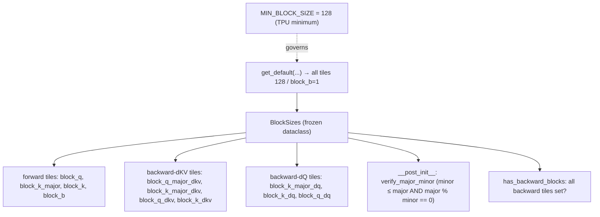

# ejkernel/kernels/_pallas/tpu/flash_attention/_utils — BlockSizes, the flash-attention TPU tiling with major/minor validation

<!-- connect:up:begin -->
> **Cross-repo concept:** part of [flash-attention](../../../concepts/flash-attention.md), [pallas-kernel](../../../concepts/pallas-kernel.md) across this wiki's repos.
<!-- connect:up:end -->
## Overview
The FlashAttention TPU Pallas kernel is tiled by a [`BlockSizes`](../catalog/ejkernel/kernels/_pallas/tpu/flash_attention/_utils.md#BlockSizes) dataclass, and this file defines it plus the reference-attention helpers. The key idea: TPU flash attention uses a *two-level* (major/minor) tiling for both the forward and the backward (`dq`, `dkv`) passes, and getting those block sizes right is where nearly all the performance lives — the docstring is blunt: "Those parameters have negligible effect on numerics, but affect performance greatly." `BlockSizes` validates the major/minor relationships at construction ([`__post_init__`](../catalog/ejkernel/kernels/_pallas/tpu/flash_attention/_utils.md#BlockSizes.__post_init__)), knows whether it carries backward tiles ([`has_backward_blocks`](../catalog/ejkernel/kernels/_pallas/tpu/flash_attention/_utils.md#BlockSizes.has_backward_blocks)), and provides an all-128 default ([`get_default`](../catalog/ejkernel/kernels/_pallas/tpu/flash_attention/_utils.md#BlockSizes.get_default)) — 128 being the TPU-efficient minimum ([`MIN_BLOCK_SIZE`](../catalog/ejkernel/kernels/_pallas/tpu/flash_attention/_utils.md#MIN_BLOCK_SIZE)).

## Diagram

## Design rationale (why it's built this way)
- **Two-level (major/minor) tiling per pass.** [`BlockSizes`](../catalog/ejkernel/kernels/_pallas/tpu/flash_attention/_utils.md#BlockSizes) has a `*_major` and a plain tile for each dimension (e.g. [`block_k_major`](../catalog/ejkernel/kernels/_pallas/tpu/flash_attention/_utils.md#BlockSizes.block_k_major) vs [`block_k`](../catalog/ejkernel/kernels/_pallas/tpu/flash_attention/_utils.md#BlockSizes.block_k)). The major tile is the outer Pallas grid block (what's brought into VMEM at once); the minor is the inner compute tile. Separating them lets the kernel stage large chunks into VMEM while computing on MXU-friendly sub-tiles — the standard TPU flash-attention structure.
- **Construction-time validation of the tile relationship.** [`__post_init__`](../catalog/ejkernel/kernels/_pallas/tpu/flash_attention/_utils.md#BlockSizes.__post_init__)'s `verify_major_minor` enforces that each minor tile is ≤ its major and *divides* it — because the inner loop tiles the major block, a non-dividing minor would leave a ragged remainder. Catching this at construction turns a subtle kernel miscompile into a clear `ValueError`.
- **Backward tiling is optional and separate.** The `*_dkv`/`*_dq` fields default to `None`, and [`has_backward_blocks`](../catalog/ejkernel/kernels/_pallas/tpu/flash_attention/_utils.md#BlockSizes.has_backward_blocks) reports whether they're all set. An inference-only deployment supplies only forward tiles; a training deployment must supply the backward ones too (with their own optimal sizes, since the `dq`/`dkv` passes have different access patterns — mirroring the `BwdParams` split).
- **128 as the universal safe default.** [`get_default`](../catalog/ejkernel/kernels/_pallas/tpu/flash_attention/_utils.md#BlockSizes.get_default) returns all tiles = 128 ([`block_b`](../catalog/ejkernel/kernels/_pallas/tpu/flash_attention/_utils.md#BlockSizes.block_b)=1), ignoring its shape arguments — 128 is [`MIN_BLOCK_SIZE`](../catalog/ejkernel/kernels/_pallas/tpu/flash_attention/_utils.md#MIN_BLOCK_SIZE), the TPU sublane/lane-friendly minimum. It's the always-correct heuristic the autotuner improves upon; the shape args are accepted "for API compatibility" but currently unused.

## Entry points
- [`BlockSizes`](../catalog/ejkernel/kernels/_pallas/tpu/flash_attention/_utils.md#BlockSizes) — the tiling dataclass the flash kernel reads; constructing one validates the major/minor invariants.
- [`BlockSizes.get_default`](../catalog/ejkernel/kernels/_pallas/tpu/flash_attention/_utils.md#BlockSizes.get_default) — the all-128 safe default (the kernel's `heuristic_cfg` equivalent).
- [`BlockSizes.has_backward_blocks`](../catalog/ejkernel/kernels/_pallas/tpu/flash_attention/_utils.md#BlockSizes.has_backward_blocks) — gate the kernel uses to decide whether the backward pass can run with these tiles.
- [`MIN_BLOCK_SIZE`](../catalog/ejkernel/kernels/_pallas/tpu/flash_attention/_utils.md#MIN_BLOCK_SIZE) — the `128` TPU minimum block size referenced throughout.

## Mechanism (step-by-step)
1. **Tiles are provided (or defaulted).** A caller either constructs [`BlockSizes`](../catalog/ejkernel/kernels/_pallas/tpu/flash_attention/_utils.md#BlockSizes) with explicit forward (+optional backward) tiles or uses [`get_default`](../catalog/ejkernel/kernels/_pallas/tpu/flash_attention/_utils.md#BlockSizes.get_default) for all-128.
2. **Validation fires at construction.** [`__post_init__`](../catalog/ejkernel/kernels/_pallas/tpu/flash_attention/_utils.md#BlockSizes.__post_init__) checks each minor tile ≤ and divides its major (`verify_major_minor`), for the forward `block_k` and every provided backward pair — raising immediately on a bad combination.
3. **The kernel reads the tiles.** The flash-attention Pallas kernel uses [`block_q`](../catalog/ejkernel/kernels/_pallas/tpu/flash_attention/_utils.md#BlockSizes.block_q)/[`block_k_major`](../catalog/ejkernel/kernels/_pallas/tpu/flash_attention/_utils.md#BlockSizes.block_k_major)/[`block_k`](../catalog/ejkernel/kernels/_pallas/tpu/flash_attention/_utils.md#BlockSizes.block_k)/[`block_b`](../catalog/ejkernel/kernels/_pallas/tpu/flash_attention/_utils.md#BlockSizes.block_b) to shape its grid and inner loops; if [`has_backward_blocks`](../catalog/ejkernel/kernels/_pallas/tpu/flash_attention/_utils.md#BlockSizes.has_backward_blocks), the `dq`/`dkv` tiles ([`block_q_dkv`](../catalog/ejkernel/kernels/_pallas/tpu/flash_attention/_utils.md#BlockSizes.block_q_dkv), [`block_k_major_dq`](../catalog/ejkernel/kernels/_pallas/tpu/flash_attention/_utils.md#BlockSizes.block_k_major_dq), ...) drive the backward grids.
4. **Autotuning searches over them.** These [`BlockSizes`](../catalog/ejkernel/kernels/_pallas/tpu/flash_attention/_utils.md#BlockSizes) fields are what the [autotuner](ejkernel-ops-execution-tuning.md) varies (via the config's `FwdParams`/`BwdParams`) to find the fastest tiling for a given shape.

## Key data structures
- [`BlockSizes`](../catalog/ejkernel/kernels/_pallas/tpu/flash_attention/_utils.md#BlockSizes) — forward tiles ([`block_q`](../catalog/ejkernel/kernels/_pallas/tpu/flash_attention/_utils.md#BlockSizes.block_q), [`block_k_major`](../catalog/ejkernel/kernels/_pallas/tpu/flash_attention/_utils.md#BlockSizes.block_k_major), [`block_k`](../catalog/ejkernel/kernels/_pallas/tpu/flash_attention/_utils.md#BlockSizes.block_k), [`block_b`](../catalog/ejkernel/kernels/_pallas/tpu/flash_attention/_utils.md#BlockSizes.block_b)) + backward dKV tiles ([`block_q_major_dkv`](../catalog/ejkernel/kernels/_pallas/tpu/flash_attention/_utils.md#BlockSizes.block_q_major_dkv), [`block_k_dkv`](../catalog/ejkernel/kernels/_pallas/tpu/flash_attention/_utils.md#BlockSizes.block_k_dkv), ...) + backward dQ tiles ([`block_k_dq`](../catalog/ejkernel/kernels/_pallas/tpu/flash_attention/_utils.md#BlockSizes.block_k_dq), [`block_q_dq`](../catalog/ejkernel/kernels/_pallas/tpu/flash_attention/_utils.md#BlockSizes.block_q_dq), ...).
- [`MIN_BLOCK_SIZE`](../catalog/ejkernel/kernels/_pallas/tpu/flash_attention/_utils.md#MIN_BLOCK_SIZE) = 128 — the TPU efficiency floor.
- (Reference `mha_reference`/`_mha_reference_fwd`/`_bwd` in the same file provide a non-Pallas oracle for correctness testing.)

## Dynamics (design intent)
> [!inferred] Because block sizes are "negligible for numerics, huge for performance," this dataclass is the primary autotuning surface for flash attention on TPU — the whole ops/tuning apparatus exists largely to search its fields. The major/minor split is what maps flash attention onto TPU's memory hierarchy (major = VMEM staging block, minor = MXU compute tile), and the divisibility invariant is what keeps that mapping tile-aligned.

## Edge cases
- **Minor not dividing major** → `ValueError` at construction (the invariant most likely to trip a hand-tuned config).
- **Partial backward tiles** → [`has_backward_blocks`](../catalog/ejkernel/kernels/_pallas/tpu/flash_attention/_utils.md#BlockSizes.has_backward_blocks) is `False` if any `*_dkv`/`*_dq` is `None`, so a training run with incomplete backward tiling can't use the backward kernel.
- **`get_default` ignores shapes** — its all-128 result is shape-independent, so it's safe but rarely optimal for large heads/sequences (hence autotuning).

## Open questions
> [!inferred] The forward/backward Pallas kernel bodies that consume these tiles live in sibling files in the `flash_attention/` package; this page documents the tiling contract, not the kernel loops.

## See also
- [ejkernel/ops/utils/datacarrier](ejkernel-ops-utils-datacarrier.md) — the `FwdParams`/`BwdParams` that carry these block sizes into the config.
- [ejkernel/kernels/_pallas/tpu/ragged_page_attention_v3/_utils](ejkernel-kernels-_pallas-tpu-ragged_page_attention_v3-_utils.md) — analogous TPU tiling helpers for paged attention.
- [ejkernel/ops/execution/tuning](ejkernel-ops-execution-tuning.md) — the autotuner that searches these tiles.

## Sources
- raw/code/ejkernel/ejkernel/kernels/_pallas/tpu/flash_attention/_utils.py
