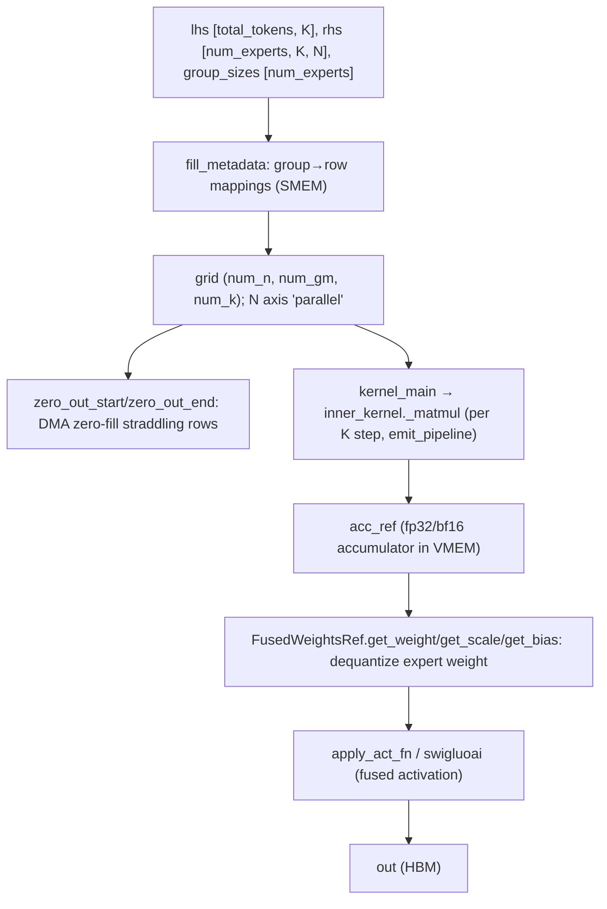

# ejkernel/kernels/_pallas/tpu/grouped_matmulv3/_pallas_impl — the MoE grouped matmul with fused activation

## Overview
[`grouped_matmulv3_pallas_impl`](../catalog/ejkernel/kernels/_pallas/tpu/grouped_matmulv3/_pallas_impl.md#grouped_matmulv3_pallas_impl) is the TPU Pallas kernel that powers Mixture-of-Experts feed-forward: it computes, in *one launch*, a batched matmul where each contiguous group of rows (tokens routed to expert `i`) multiplies a *different* weight matrix `rhs[i]` — `out[s_i:s_i+g_i] = lhs[s_i:s_i+g_i] @ rhs[i]`. The group boundaries come from a `group_sizes` array (how many tokens each expert got). This is the shape MoE routing produces, and doing it as one metadata-driven kernel — rather than a Python loop of per-expert matmuls — is what makes MoE efficient on TPU. v3 adds fused activation (`swigluoai`/`apply_act_fn`), fused dequantization (`rhs_scale`/`rhs_bias` for quantized expert weights), and a `FusedWeightsRef` that packs gate+up projections together.

## Diagram

## Design rationale (why it's built this way)
- **One kernel, metadata-driven grid.** The docstring: "issues DMA zero-fills, grid metadata, and tiled matmul all in a single kernel launch." `fill_metadata` precomputes group/row mappings into SMEM so the grid `(num_n, num_gm, num_k)` can, at each step, look up which expert's `rhs` to use for the current row block — avoiding `num_experts` separate launches. The N dimension is marked `"parallel"` since output columns are independent.
- **Straddling-row handling is the hard part.** Group boundaries don't align to tile boundaries — a tile of `tile_m` rows can straddle two experts. The kernel uses a `partial_out_ref` scratch `(size_lhs_sublane, tile_n)` for "partial rows straddling sublane boundaries" and `zero_out_start`/`zero_out_end` DMA zero-fills, so partial tiles are correctly attributed. This ragged-boundary bookkeeping is why grouped matmul is a dedicated kernel, not just a reshape+bmm.
- **Fused dequantization for quantized experts.** `FusedWeightsRef` exposes [`get_weight`](../catalog/ejkernel/kernels/_pallas/tpu/grouped_matmulv3/_pallas_impl.md#FusedWeightsRef.get_weight)/[`get_scale`](../catalog/ejkernel/kernels/_pallas/tpu/grouped_matmulv3/_pallas_impl.md#FusedWeightsRef.get_scale)/[`get_bias`](../catalog/ejkernel/kernels/_pallas/tpu/grouped_matmulv3/_pallas_impl.md#FusedWeightsRef.get_bias) so a quantized expert weight is dequantized *inside* the matmul (scale/bias applied to the accumulator) — no separate dequant pass materializing full-precision weights in HBM.
- **Fused gate+up + activation for GLU MLPs.** [`FusedWeightsRef.gate`](../catalog/ejkernel/kernels/_pallas/tpu/grouped_matmulv3/_pallas_impl.md#FusedWeightsRef.gate)/[`up`](../catalog/ejkernel/kernels/_pallas/tpu/grouped_matmulv3/_pallas_impl.md#FusedWeightsRef.up) pack a GLU MLP's two projections, and `fuse_act` (`swigluoai` etc.) applies the SwiGLU activation in-kernel — so `silu(gate) * up` is one fused op, not three (two matmuls + an elementwise), saving two HBM round-trips of the intermediate.
- **fp32 accumulation, tunable tiles.** `acc_ref` is an fp32 (or bf16) accumulator; the `tile_info`/`calculate_tiling` sizing plus `vmem_limit_bytes` bound the working set — the standard TPU matmul memory/precision trade.

## Entry points
- [`grouped_matmulv3_pallas_impl`](../catalog/ejkernel/kernels/_pallas/tpu/grouped_matmulv3/_pallas_impl.md#grouped_matmulv3_pallas_impl) — the public kernel: `lhs` (all tokens), `rhs` (per-expert weights), `group_sizes`, optional `rhs_scale`/`rhs_bias` (quantized), `fuse_act`.
- [`kernel_main`](../catalog/ejkernel/kernels/_pallas/tpu/grouped_matmulv3/_pallas_impl.md#kernel_main) → [`inner_kernel`](../catalog/ejkernel/kernels/_pallas/tpu/grouped_matmulv3/_pallas_impl.md#inner_kernel)'s [`_matmul`](../catalog/ejkernel/kernels/_pallas/tpu/grouped_matmulv3/_pallas_impl.md#inner_kernel._matmul) — the Pallas body doing the per-K-step tiled matmul via `emit_pipeline`.
- [`generate_block_specs`](../catalog/ejkernel/kernels/_pallas/tpu/grouped_matmulv3/_pallas_impl.md#generate_block_specs) — builds the Pallas `BlockSpec`s for lhs/rhs/out tiling.
- `FusedWeightsRef` — the ref abstraction for (possibly quantized, possibly gate+up-fused) expert weights, exposing [`get_weight`](../catalog/ejkernel/kernels/_pallas/tpu/grouped_matmulv3/_pallas_impl.md#FusedWeightsRef.get_weight)/[`gate`](../catalog/ejkernel/kernels/_pallas/tpu/grouped_matmulv3/_pallas_impl.md#FusedWeightsRef.gate)/[`up`](../catalog/ejkernel/kernels/_pallas/tpu/grouped_matmulv3/_pallas_impl.md#FusedWeightsRef.up).

## Mechanism (step-by-step)
1. **Compute group metadata.** `fill_metadata` turns `group_sizes` into row→group and grid-step mappings (in SMEM) so each grid step knows its expert and row range; [`Dimensions`](../catalog/ejkernel/kernels/_pallas/tpu/grouped_matmulv3/_pallas_impl.md#Dimensions.size_m) records `size_m`/`size_n`/`size_k`/`size_group`/`size_lhs_sublane`.
2. **Zero-fill output rows as needed.** [`zero_out_start`](../catalog/ejkernel/kernels/_pallas/tpu/grouped_matmulv3/_pallas_impl.md#zero_out_start)/[`zero_out_end`](../catalog/ejkernel/kernels/_pallas/tpu/grouped_matmulv3/_pallas_impl.md#zero_out_end) DMA-zero the output rows that straddle group boundaries (using `zero_ref` + a DMA semaphore), so partial tiles start clean.
3. **Tiled matmul per K step.** [`kernel_main`](../catalog/ejkernel/kernels/_pallas/tpu/grouped_matmulv3/_pallas_impl.md#kernel_main)'s [`_matmul`](../catalog/ejkernel/kernels/_pallas/tpu/grouped_matmulv3/_pallas_impl.md#inner_kernel._matmul) accumulates `lhs_tile @ rhs_tile` into `acc_ref` across K steps (`is_first_k_step`/`is_last_k_step` gate init/finalize), pulling the right expert's weight via [`FusedWeightsRef.get_weight`](../catalog/ejkernel/kernels/_pallas/tpu/grouped_matmulv3/_pallas_impl.md#FusedWeightsRef.get_weight) and dequantizing with [`get_scale`](../catalog/ejkernel/kernels/_pallas/tpu/grouped_matmulv3/_pallas_impl.md#FusedWeightsRef.get_scale)/[`get_bias`](../catalog/ejkernel/kernels/_pallas/tpu/grouped_matmulv3/_pallas_impl.md#FusedWeightsRef.get_bias).
4. **Fuse activation, write out.** On the last K step, `apply_act_fn`/`swigluoai` applies the (SwiGLU) activation combining [`gate`](../catalog/ejkernel/kernels/_pallas/tpu/grouped_matmulv3/_pallas_impl.md#FusedWeightsRef.gate)/[`up`](../catalog/ejkernel/kernels/_pallas/tpu/grouped_matmulv3/_pallas_impl.md#FusedWeightsRef.up) results, and the tile is written to HBM.

## Key data structures
- `FusedWeightsRef` — expert-weight ref with [`gate`](../catalog/ejkernel/kernels/_pallas/tpu/grouped_matmulv3/_pallas_impl.md#FusedWeightsRef.gate)/[`up`](../catalog/ejkernel/kernels/_pallas/tpu/grouped_matmulv3/_pallas_impl.md#FusedWeightsRef.up) and [`get_weight`](../catalog/ejkernel/kernels/_pallas/tpu/grouped_matmulv3/_pallas_impl.md#FusedWeightsRef.get_weight)/[`get_scale`](../catalog/ejkernel/kernels/_pallas/tpu/grouped_matmulv3/_pallas_impl.md#FusedWeightsRef.get_scale)/[`get_bias`](../catalog/ejkernel/kernels/_pallas/tpu/grouped_matmulv3/_pallas_impl.md#FusedWeightsRef.get_bias) dequant accessors.
- [`Dimensions`](../catalog/ejkernel/kernels/_pallas/tpu/grouped_matmulv3/_pallas_impl.md#Dimensions.size_m) — the problem dims ([`size_m`](../catalog/ejkernel/kernels/_pallas/tpu/grouped_matmulv3/_pallas_impl.md#Dimensions.size_m)/[`size_n`](../catalog/ejkernel/kernels/_pallas/tpu/grouped_matmulv3/_pallas_impl.md#Dimensions.size_n)/[`size_k`](../catalog/ejkernel/kernels/_pallas/tpu/grouped_matmulv3/_pallas_impl.md#Dimensions.size_k)/[`size_group`](../catalog/ejkernel/kernels/_pallas/tpu/grouped_matmulv3/_pallas_impl.md#Dimensions.size_group)/[`size_lhs_sublane`](../catalog/ejkernel/kernels/_pallas/tpu/grouped_matmulv3/_pallas_impl.md#Dimensions.size_lhs_sublane)).
- VMEM scratch: `acc_ref` (accumulator), `partial_out_ref` (straddling rows), `metadata_ref` (SMEM group map).

## Dynamics (design intent)
> [!inferred] Grouped matmul is the MoE-specific kernel that turns "N experts, ragged token counts" into one dense-ish TPU launch: the metadata-driven grid + straddling-row handling let it process all experts in one pass, and the fused dequant + SwiGLU collapse a quantized MoE MLP into a single kernel. This is the ejkernel counterpart to EasyDeL's `BaseMoeModule` — the layer builds the routing, this kernel does the per-expert compute.

## Edge cases
- **Group boundary mid-tile** is the central complexity — mis-handled straddling rows attribute tokens to the wrong expert; `partial_out_ref` + zero-fill exist for exactly this.
- **`group_offset`** shifts which experts this shard handles (expert parallelism) — wrong offset skips/repeats experts.
- **Quantized rhs without scale/bias** would use raw quantized values as weights — the dequant accessors must be wired when `rhs_scale` is present.

## Open questions
> [!inferred] The `calculate_tiling` heuristics and the exact `emit_pipeline` double-buffering aren't detailed here; grouped matmul v2 (`grouped_matmulv2`) is a sibling with a different pipeline structure.

## See also
- [ejkernel/kernels/_pallas/tpu/quantized_matmul/_pallas_impl_core](ejkernel-kernels-_pallas-tpu-quantized_matmul-_pallas_impl_core.md) — the non-grouped quantized matmul with related dequant logic.
- [ejkernel/modules/operations/configs](ejkernel-modules-operations-configs.md) — `GroupedMatmulConfig`.

## Sources
- raw/code/ejkernel/ejkernel/kernels/_pallas/tpu/grouped_matmulv3/_pallas_impl.py
