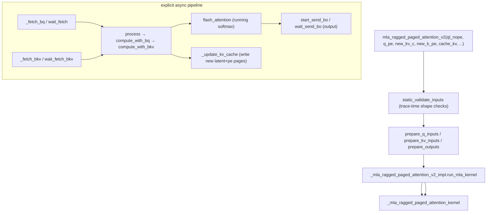

# ejkernel/kernels/_pallas/tpu/multi_latent_ragged_page_attention_v2/_pallas_impl_fwd — MLA paged attention with explicit async pipelining

<!-- connect:up:begin -->
> **Cross-repo concept:** part of [pallas-kernel](../../../concepts/pallas-kernel.md) across this wiki's repos.
<!-- connect:up:end -->
## Overview
This is the paged-attention kernel for **Multi-head Latent Attention (MLA)** — DeepSeek's attention variant where K and V are stored as a low-rank *latent* (`kv_c`) plus a separate RoPE component (`k_pe`), rather than full per-head K/V. [`mla_ragged_paged_attention_v2`](../catalog/ejkernel/kernels/_pallas/tpu/multi_latent_ragged_page_attention_v2/_pallas_impl_fwd.md#mla_ragged_paged_attention_v2) serves the same continuous-batching role as the standard ragged-page kernel (decode/prefill/mixed via an [`MlaCase`](../catalog/ejkernel/kernels/_pallas/tpu/multi_latent_ragged_page_attention_v2/_pallas_impl_fwd.md#MlaCase) split) but for the latent KV layout. What distinguishes it is an **explicit software pipeline**: the kernel body ([`_mla_ragged_paged_attention_kernel`](../catalog/ejkernel/kernels/_pallas/tpu/multi_latent_ragged_page_attention_v2/_pallas_impl_fwd.md#_mla_ragged_paged_attention_kernel)) manually manages async copies (`_async_copy`, `_fetch_bkv`/`_fetch_bq`, `_send_bo`) with wait barriers, double-buffering the paged-KV loads against compute — a level of hand-pipelining the simpler kernels leave to Pallas.

## Diagram

## Design rationale (why it's built this way)
- **Latent KV layout, not full K/V.** MLA caches a compressed latent `kv_c` (`lkv_dim`) plus a RoPE component `k_pe`, so the paged `cache_kv` stores the combined latent+rope dimension (`get_kv_cache_shape`) rather than full per-head K/V. The kernel reconstructs attention from these — dramatically less KV memory than standard attention, which is MLA's whole point and why it needs a dedicated paged kernel.
- **Explicit async double-buffering.** The kernel manually orchestrates DMA: [`_fetch_bkv`](../catalog/ejkernel/kernels/_pallas/tpu/multi_latent_ragged_page_attention_v2/_pallas_impl_fwd.md#_mla_ragged_paged_attention_kernel._fetch_bkv)/[`_fetch_bq`](../catalog/ejkernel/kernels/_pallas/tpu/multi_latent_ragged_page_attention_v2/_pallas_impl_fwd.md#_mla_ragged_paged_attention_kernel._fetch_bq) start async copies via [`_async_copy`](../catalog/ejkernel/kernels/_pallas/tpu/multi_latent_ragged_page_attention_v2/_pallas_impl_fwd.md#_mla_ragged_paged_attention_kernel._async_copy), [`wait_fetch_bkv`](../catalog/ejkernel/kernels/_pallas/tpu/multi_latent_ragged_page_attention_v2/_pallas_impl_fwd.md#_mla_ragged_paged_attention_kernel.wait_fetch_bkv) barriers before use, and [`start_send_bo`](../catalog/ejkernel/kernels/_pallas/tpu/multi_latent_ragged_page_attention_v2/_pallas_impl_fwd.md#_mla_ragged_paged_attention_kernel.start_send_bo)/[`wait_send_bo`](../catalog/ejkernel/kernels/_pallas/tpu/multi_latent_ragged_page_attention_v2/_pallas_impl_fwd.md#_mla_ragged_paged_attention_kernel.wait_send_bo) overlap output stores. This manual pipeline hides HBM latency behind MXU compute — a hand-tuned optimization warranted because MLA's irregular paged latent access would otherwise stall.
- **Decode/prefill/mixed split, per-phase tiles.** Like the standard kernel, [`MlaCase`](../catalog/ejkernel/kernels/_pallas/tpu/multi_latent_ragged_page_attention_v2/_pallas_impl_fwd.md#MlaCase) ([`DECODE`](../catalog/ejkernel/kernels/_pallas/tpu/multi_latent_ragged_page_attention_v2/_pallas_impl_fwd.md#MlaCase.DECODE)/[`PREFILL`](../catalog/ejkernel/kernels/_pallas/tpu/multi_latent_ragged_page_attention_v2/_pallas_impl_fwd.md#MlaCase.PREFILL)/[`MIXED`](../catalog/ejkernel/kernels/_pallas/tpu/multi_latent_ragged_page_attention_v2/_pallas_impl_fwd.md#MlaCase.MIXED)) partitions the batch, and `num_kv_pages_per_block`/`num_queries_per_block` can be per-phase tuples — so decode (tiny queries) and prefill (large) get independently-sized tiles in one launch.
- **KV cache updated inside the kernel.** [`_update_kv_cache`](../catalog/ejkernel/kernels/_pallas/tpu/multi_latent_ragged_page_attention_v2/_pallas_impl_fwd.md#_mla_ragged_paged_attention_kernel._update_kv_cache) writes the new latent/rope pages during the attention pass — fusing the cache append into the attention kernel rather than a separate write, saving an HBM round-trip.
- **Static validation before launch.** [`static_validate_inputs`](../catalog/ejkernel/kernels/_pallas/tpu/multi_latent_ragged_page_attention_v2/_pallas_impl_fwd.md#static_validate_inputs) checks shapes at trace time, and `prepare_q_inputs`/`prepare_kv_inputs`/`prepare_outputs` marshal the ragged inputs into the kernel's expected layout — catching mis-shaped MLA inputs before a cryptic Pallas failure.

## Entry points
- [`mla_ragged_paged_attention_v2`](../catalog/ejkernel/kernels/_pallas/tpu/multi_latent_ragged_page_attention_v2/_pallas_impl_fwd.md#mla_ragged_paged_attention_v2) — the public MLA paged kernel; takes `ql_nope`/`q_pe` (query nope+rope), `new_kv_c`/`new_k_pe` (new latent+rope), the paged `cache_kv`, and the ragged/paging metadata.
- [`_mla_ragged_paged_attention_v2_impl`](../catalog/ejkernel/kernels/_pallas/tpu/multi_latent_ragged_page_attention_v2/_pallas_impl_fwd.md#_mla_ragged_paged_attention_v2_impl) (+ [`run_mla_kernel`](../catalog/ejkernel/kernels/_pallas/tpu/multi_latent_ragged_page_attention_v2/_pallas_impl_fwd.md#_mla_ragged_paged_attention_v2_impl.run_mla_kernel)) — the JIT orchestrator sizing tiles and launching the Pallas kernel.
- [`_mla_ragged_paged_attention_kernel`](../catalog/ejkernel/kernels/_pallas/tpu/multi_latent_ragged_page_attention_v2/_pallas_impl_fwd.md#_mla_ragged_paged_attention_kernel) — the Pallas body with the explicit fetch/compute/send pipeline.
- [`MlaCase`](../catalog/ejkernel/kernels/_pallas/tpu/multi_latent_ragged_page_attention_v2/_pallas_impl_fwd.md#MlaCase) — the decode/prefill/mixed phase enum.

## Mechanism (step-by-step)
1. **Validate + marshal.** [`mla_ragged_paged_attention_v2`](../catalog/ejkernel/kernels/_pallas/tpu/multi_latent_ragged_page_attention_v2/_pallas_impl_fwd.md#mla_ragged_paged_attention_v2) runs [`static_validate_inputs`](../catalog/ejkernel/kernels/_pallas/tpu/multi_latent_ragged_page_attention_v2/_pallas_impl_fwd.md#static_validate_inputs) then `prepare_*` to arrange query (nope+pe), new latent/rope, and outputs.
2. **Launch per phase.** [`_mla_ragged_paged_attention_v2_impl`](../catalog/ejkernel/kernels/_pallas/tpu/multi_latent_ragged_page_attention_v2/_pallas_impl_fwd.md#_mla_ragged_paged_attention_v2_impl) splits by [`MlaCase`](../catalog/ejkernel/kernels/_pallas/tpu/multi_latent_ragged_page_attention_v2/_pallas_impl_fwd.md#MlaCase) and launches the kernel with per-phase tiles.
3. **Pipeline: fetch, compute, send.** Inside [`_mla_ragged_paged_attention_kernel`](../catalog/ejkernel/kernels/_pallas/tpu/multi_latent_ragged_page_attention_v2/_pallas_impl_fwd.md#_mla_ragged_paged_attention_kernel), [`process`](../catalog/ejkernel/kernels/_pallas/tpu/multi_latent_ragged_page_attention_v2/_pallas_impl_fwd.md#_mla_ragged_paged_attention_kernel.process)'s [`compute_with_bq`](../catalog/ejkernel/kernels/_pallas/tpu/multi_latent_ragged_page_attention_v2/_pallas_impl_fwd.md#_mla_ragged_paged_attention_kernel.process.compute_with_bq)→[`compute_with_bkv`](../catalog/ejkernel/kernels/_pallas/tpu/multi_latent_ragged_page_attention_v2/_pallas_impl_fwd.md#_mla_ragged_paged_attention_kernel.process.compute_with_bq.compute_with_bkv) loop prefetches the next KV block ([`_fetch_bkv`](../catalog/ejkernel/kernels/_pallas/tpu/multi_latent_ragged_page_attention_v2/_pallas_impl_fwd.md#_mla_ragged_paged_attention_kernel._fetch_bkv)) while running [`flash_attention`](../catalog/ejkernel/kernels/_pallas/tpu/multi_latent_ragged_page_attention_v2/_pallas_impl_fwd.md#_mla_ragged_paged_attention_kernel.flash_attention) on the current one, then overlaps the output store.
4. **Append cache in-pass.** [`_update_kv_cache`](../catalog/ejkernel/kernels/_pallas/tpu/multi_latent_ragged_page_attention_v2/_pallas_impl_fwd.md#_mla_ragged_paged_attention_kernel._update_kv_cache) writes the new latent/rope pages during the same kernel, and [`wait_update_kv_cache`](../catalog/ejkernel/kernels/_pallas/tpu/multi_latent_ragged_page_attention_v2/_pallas_impl_fwd.md#_mla_ragged_paged_attention_kernel.wait_update_kv_cache) barriers it before the pages are read.

## Key data structures
- [`MlaCase`](../catalog/ejkernel/kernels/_pallas/tpu/multi_latent_ragged_page_attention_v2/_pallas_impl_fwd.md#MlaCase) — the DECODE/PREFILL/MIXED enum (with [`symbol`](../catalog/ejkernel/kernels/_pallas/tpu/multi_latent_ragged_page_attention_v2/_pallas_impl_fwd.md#MlaCase.symbol)).
- Latent KV inputs: `ql_nope`/`q_pe`, `new_kv_c`/`new_k_pe`, paged `cache_kv` (combined latent+rope), `page_indices`, `kv_lens`, `cu_q_lens`, `distribution`.
- The async-pipeline helpers ([`_async_copy`](../catalog/ejkernel/kernels/_pallas/tpu/multi_latent_ragged_page_attention_v2/_pallas_impl_fwd.md#_mla_ragged_paged_attention_kernel._async_copy), fetch/wait/send methods) — the manual DMA state machine.

## Dynamics (design intent)
> [!inferred] MLA trades a big KV-memory reduction for a more complex attention reconstruction, and paging it makes the memory access irregular — so this kernel invests in explicit software pipelining (manual DMA + barriers) to keep the MXU fed. It is the paged serving counterpart to EasyDeL's MLA attention path and MLA ragged-page cache; the two together are what let DeepSeek-class models serve efficiently on TPU.

## Edge cases
- **Mismatched latent/rope dims** are caught by [`static_validate_inputs`](../catalog/ejkernel/kernels/_pallas/tpu/multi_latent_ragged_page_attention_v2/_pallas_impl_fwd.md#static_validate_inputs) at trace time.
- **Missing wait barrier** in the manual pipeline would read a page mid-DMA — the explicit `wait_*` calls exist precisely to prevent this; it's a correctness-critical hand-written ordering.
- **Per-phase tile tuples** must match the phase count — a scalar tile applies to all phases, a tuple must be length-3.

## Open questions
> [!inferred] The exact `flash_attention.load_with_init` running-softmax and the latent→attention reconstruction math are extensive; this page documents the kernel's MLA-specific layout, phase split, and async-pipeline structure.

## See also
- [ejkernel/kernels/_pallas/tpu/ragged_page_attention_v3/_pallas_impl_fwd](ejkernel-kernels-_pallas-tpu-ragged_page_attention_v3-_pallas_impl_fwd.md) — the standard-attention paged kernel.
- [ejkernel/kernels/_pallas/tpu/ragged_page_attention_v3/_utils](ejkernel-kernels-_pallas-tpu-ragged_page_attention_v3-_utils.md) — shared TPU sizing helpers (cdiv/align_to/packing).

## Sources
- raw/code/ejkernel/ejkernel/kernels/_pallas/tpu/multi_latent_ragged_page_attention_v2/_pallas_impl_fwd.py
