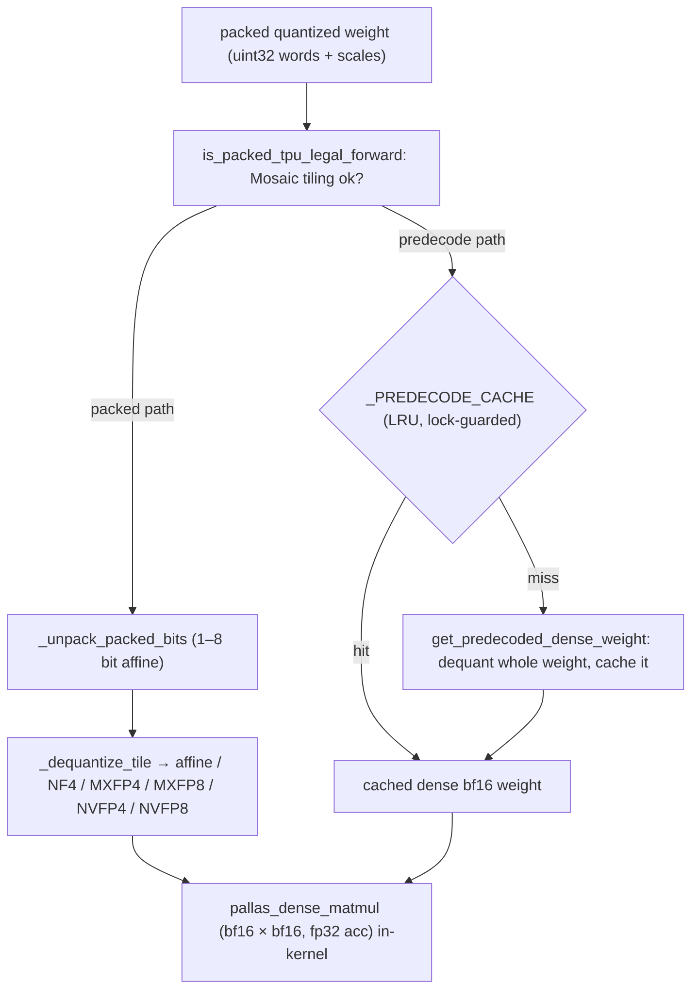

# ejkernel/kernels/_pallas/tpu/quantized_matmul/_pallas_impl_core — bit-unpacking, dequant, and predecode caching for quantized matmul

## Overview
This module is the shared TPU core for *quantized* matmul — the building blocks the forward and input-gradient quantized-matmul kernels both use. It solves one problem: how to multiply by a weight matrix stored in a sub-byte packed format (1–8 bit affine, or NF4/MXFP4/MXFP8/NVFP4/NVFP8 float formats) without materializing the full bf16 weight in HBM. It provides bit-unpacking (`_unpack_packed_bits` extracting affine values from packed uint32 words), format-specific dequantization ([`_dequantize_tile`](../catalog/ejkernel/kernels/_pallas/tpu/quantized_matmul/_pallas_impl_core.md#_dequantize_tile) dispatching to [`_decode_nf4`](../catalog/ejkernel/kernels/_pallas/tpu/quantized_matmul/_pallas_impl_core.md#_decode_nf4)/[`_decode_e2m1`](../catalog/ejkernel/kernels/_pallas/tpu/quantized_matmul/_pallas_impl_core.md#_decode_e2m1)/[`_decode_e4m3`](../catalog/ejkernel/kernels/_pallas/tpu/quantized_matmul/_pallas_impl_core.md#_decode_e4m3)/...), TPU-tiling legality checks ([`is_packed_tpu_legal_forward`](../catalog/ejkernel/kernels/_pallas/tpu/quantized_matmul/_pallas_impl_core.md#is_packed_tpu_legal_forward)), and — the key perf feature — an LRU-cached *predecode* path ([`get_predecoded_dense_weight`](../catalog/ejkernel/kernels/_pallas/tpu/quantized_matmul/_pallas_impl_core.md#get_predecoded_dense_weight)) that materializes and caches the dense bf16 weight so repeated matmuls with the same quantized weight don't re-dequantize each time.

## Diagram

## Design rationale (why it's built this way)
- **Two paths: packed (dequant-in-kernel) vs predecode (dequant-once-and-cache).** The docstring notes `EJKERNEL_QMM_TPU_PATH` selects the path; TPU Pallas "currently supports packed-only execution" with `"hybrid"`/`"predecode"` normalizing to `"packed"`. The packed path dequantizes each tile inside the matmul (minimal memory, repeated work); the [`get_predecoded_dense_weight`](../catalog/ejkernel/kernels/_pallas/tpu/quantized_matmul/_pallas_impl_core.md#get_predecoded_dense_weight) predecode path dequantizes the whole weight once and caches the dense bf16 — trading HBM for avoiding repeated dequant. Which wins depends on how often a weight is reused (a static model weight reused every step favors predecode).
- **LRU predecode cache with hard byte + item caps.** [`_PREDECODE_CACHE`](../catalog/ejkernel/kernels/_pallas/tpu/quantized_matmul/_pallas_impl_core.md#_PREDECODE_CACHE._PREDECODE_CACHE) (an `OrderedDict`, guarded by [`_PREDECODE_CACHE_LOCK`](../catalog/ejkernel/kernels/_pallas/tpu/quantized_matmul/_pallas_impl_core.md#_PREDECODE_CACHE_LOCK)) is bounded by [`_DEFAULT_PREDECODE_CACHE_MAX_ITEMS`](../catalog/ejkernel/kernels/_pallas/tpu/quantized_matmul/_pallas_impl_core.md#_DEFAULT_PREDECODE_CACHE_MAX_ITEMS) (2) and [`_DEFAULT_PREDECODE_MAX_BYTES`](../catalog/ejkernel/kernels/_pallas/tpu/quantized_matmul/_pallas_impl_core.md#_DEFAULT_PREDECODE_MAX_BYTES) (256 MiB) — because a dense bf16 weight is large, the cache holds only a couple to bound HBM, evicting LRU. The tiny default item count reflects that predecode is only worth it for the hottest weights.
- **Many quantization formats, one dequant dispatcher.** [`_dequantize_tile`](../catalog/ejkernel/kernels/_pallas/tpu/quantized_matmul/_pallas_impl_core.md#_dequantize_tile) handles affine integer quant *and* the sub-byte float formats (NF4 via [`_decode_nf4`](../catalog/ejkernel/kernels/_pallas/tpu/quantized_matmul/_pallas_impl_core.md#_decode_nf4), MXFP4/NVFP4 via [`_decode_e2m1`](../catalog/ejkernel/kernels/_pallas/tpu/quantized_matmul/_pallas_impl_core.md#_decode_e2m1), MXFP8/NVFP8 via [`_decode_e4m3`](../catalog/ejkernel/kernels/_pallas/tpu/quantized_matmul/_pallas_impl_core.md#_decode_e4m3)) — one dispatcher so the matmul kernel is format-agnostic; adding a format is a new decode branch, not a new kernel.
- **Mosaic tiling legality is checked, not assumed.** Packed weights impose bit-alignment constraints ([`_bit_aligned_values`](../catalog/ejkernel/kernels/_pallas/tpu/quantized_matmul/_pallas_impl_core.md#_bit_aligned_values), `_packed_words_for_values`) that must satisfy Mosaic TPU's tiling; [`is_packed_tpu_legal_forward`](../catalog/ejkernel/kernels/_pallas/tpu/quantized_matmul/_pallas_impl_core.md#is_packed_tpu_legal_forward) verifies a block layout is legal before the kernel runs, so an illegal packing fails clearly rather than miscompiling.
- **Env-var controlled, thread-safe.** The path, cache enable, and cache sizes are all environment variables — a deployment tunes the memory/speed trade without code changes — and the cache is lock-guarded for multi-threaded serving.

## Entry points
- [`_dequantize_tile`](../catalog/ejkernel/kernels/_pallas/tpu/quantized_matmul/_pallas_impl_core.md#_dequantize_tile) — dequantize a packed tile to bf16, dispatching on the quantization mode; called inside the matmul (packed path).
- [`get_predecoded_dense_weight`](../catalog/ejkernel/kernels/_pallas/tpu/quantized_matmul/_pallas_impl_core.md#get_predecoded_dense_weight) — materialize (and LRU-cache) the full dense bf16 weight from its quantized form; the predecode path.
- [`is_packed_tpu_legal_forward`](../catalog/ejkernel/kernels/_pallas/tpu/quantized_matmul/_pallas_impl_core.md#is_packed_tpu_legal_forward) — Mosaic-tiling legality check for a packed forward matmul block layout.
- [`pallas_dense_matmul`](../catalog/ejkernel/kernels/_pallas/tpu/quantized_matmul/_pallas_impl_core.md#pallas_dense_matmul) — the underlying tiled bf16×bf16 (fp32-accumulate) Pallas matmul both paths feed dequantized tiles into.

## Mechanism (step-by-step)
1. **Check legality, pick path.** The QMM entry (env `EJKERNEL_QMM_TPU_PATH`, normalized against [`is_packed_tpu_legal_forward`](../catalog/ejkernel/kernels/_pallas/tpu/quantized_matmul/_pallas_impl_core.md#is_packed_tpu_legal_forward)) decides packed vs predecode.
2. **Packed: unpack + dequant per tile.** In the matmul, `_unpack_packed_bits` extracts affine values from uint32 words and [`_dequantize_tile`](../catalog/ejkernel/kernels/_pallas/tpu/quantized_matmul/_pallas_impl_core.md#_dequantize_tile) converts them (with scale/bias, or the float-format decoder) to bf16 for the MXU.
3. **Predecode: dequant once, cache.** [`get_predecoded_dense_weight`](../catalog/ejkernel/kernels/_pallas/tpu/quantized_matmul/_pallas_impl_core.md#get_predecoded_dense_weight) checks [`_PREDECODE_CACHE`](../catalog/ejkernel/kernels/_pallas/tpu/quantized_matmul/_pallas_impl_core.md#_PREDECODE_CACHE._PREDECODE_CACHE) (under [`_PREDECODE_CACHE_LOCK`](../catalog/ejkernel/kernels/_pallas/tpu/quantized_matmul/_pallas_impl_core.md#_PREDECODE_CACHE_LOCK)); on a miss it dequantizes the whole weight to dense bf16 and inserts it (evicting LRU past the item/byte caps).
4. **Dense matmul.** Either path feeds bf16 tiles into [`pallas_dense_matmul`](../catalog/ejkernel/kernels/_pallas/tpu/quantized_matmul/_pallas_impl_core.md#pallas_dense_matmul) with fp32 accumulation.

## Key data structures
- [`_PREDECODE_CACHE`](../catalog/ejkernel/kernels/_pallas/tpu/quantized_matmul/_pallas_impl_core.md#_PREDECODE_CACHE._PREDECODE_CACHE) — the LRU `OrderedDict` of dense bf16 weights, with [`_PREDECODE_CACHE_LOCK`](../catalog/ejkernel/kernels/_pallas/tpu/quantized_matmul/_pallas_impl_core.md#_PREDECODE_CACHE_LOCK) and caps [`_DEFAULT_PREDECODE_CACHE_MAX_ITEMS`](../catalog/ejkernel/kernels/_pallas/tpu/quantized_matmul/_pallas_impl_core.md#_DEFAULT_PREDECODE_CACHE_MAX_ITEMS)/[`_DEFAULT_PREDECODE_MAX_BYTES`](../catalog/ejkernel/kernels/_pallas/tpu/quantized_matmul/_pallas_impl_core.md#_DEFAULT_PREDECODE_MAX_BYTES).
- The dequant dispatcher [`_dequantize_tile`](../catalog/ejkernel/kernels/_pallas/tpu/quantized_matmul/_pallas_impl_core.md#_dequantize_tile) + format decoders ([`_decode_nf4`](../catalog/ejkernel/kernels/_pallas/tpu/quantized_matmul/_pallas_impl_core.md#_decode_nf4), [`_decode_e2m1`](../catalog/ejkernel/kernels/_pallas/tpu/quantized_matmul/_pallas_impl_core.md#_decode_e2m1), [`_decode_e4m3`](../catalog/ejkernel/kernels/_pallas/tpu/quantized_matmul/_pallas_impl_core.md#_decode_e4m3)).
- Bit-packing math: [`_ceil_div`](../catalog/ejkernel/kernels/_pallas/tpu/quantized_matmul/_pallas_impl_core.md#_ceil_div), [`_bit_aligned_values`](../catalog/ejkernel/kernels/_pallas/tpu/quantized_matmul/_pallas_impl_core.md#_bit_aligned_values), `_packed_words_for_values`.

## Dynamics (design intent)
> [!inferred] The packed-vs-predecode choice is a memory/compute frontier specific to quantized weights on TPU: a weight reused N times pays N dequants (packed) or 1 dequant + N cached reads (predecode) at the cost of holding the dense weight. The tiny 2-item cache says the library expects predecode to help only for the hottest handful of weights; everything else stays packed. This is ejkernel's kernel-side complement to EasyDeL's quantized linear layers.

## Edge cases
- **Predecode cache thrash** — with only 2 items, cycling through >2 large weights evicts constantly, negating the benefit (packed would be better).
- **Illegal packed tiling** → [`is_packed_tpu_legal_forward`](../catalog/ejkernel/kernels/_pallas/tpu/quantized_matmul/_pallas_impl_core.md#is_packed_tpu_legal_forward) rejects it; the block sizes must respect bit-alignment.
- **Float-format mismatch** — decoding NVFP4 data with the MXFP4 decoder silently produces wrong values; the mode must match the packed data.

## Open questions
> [!inferred] `pallas_dense_matmul`'s exact tiling and the input-gradient legality check (`is_packed_tpu_legal_input_grad`) are in this file but not detailed; the higher-level quantized-matmul operation and config selection live in [modules/operations/quantized_matmul](ejkernel-modules-operations-quantized_matmul.md).

## See also
- [ejkernel/modules/operations/quantized_matmul](ejkernel-modules-operations-quantized_matmul.md) — the operation dispatching to this kernel.
- [ejkernel/quantization/_quants/quantizations](ejkernel-quantization-_quants-quantizations.md) — the quantize/dequantize entry points.
- [ejkernel/quantization/_utils/qparams](ejkernel-quantization-_utils-qparams.md) — quantization mode/axis resolution.

## Sources
- raw/code/ejkernel/ejkernel/kernels/_pallas/tpu/quantized_matmul/_pallas_impl_core.py
