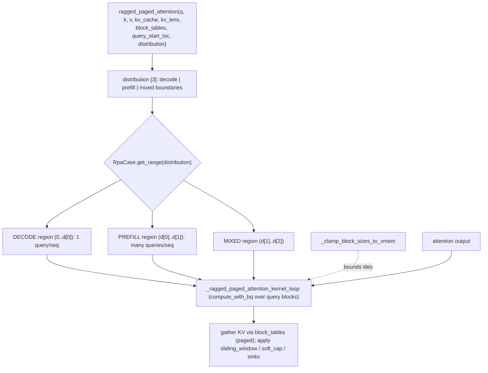

# ejkernel/kernels/_pallas/tpu/ragged_page_attention_v3/_pallas_impl_fwd — mixed prefill/decode paged attention kernel

<!-- connect:up:begin -->
> **Cross-repo concept:** part of [pallas-kernel](../../../concepts/pallas-kernel.md) across this wiki's repos.
<!-- connect:up:end -->
## Overview
[`ragged_paged_attention`](../catalog/ejkernel/kernels/_pallas/tpu/ragged_page_attention_v3/_pallas_impl_fwd.md#ragged_paged_attention) is the forward TPU Pallas kernel behind continuous-batching serving: it attends a *ragged* batch (sequences of different lengths, each with its own KV pages via `block_tables`) and — critically — handles **mixed prefill and decode in one launch**. The design idea is the [`RpaCase`](../catalog/ejkernel/kernels/_pallas/tpu/ragged_page_attention_v3/_pallas_impl_fwd.md#RpaCase) split ([`DECODE`](../catalog/ejkernel/kernels/_pallas/tpu/ragged_page_attention_v3/_pallas_impl_fwd.md#RpaCase.DECODE)/[`PREFILL`](../catalog/ejkernel/kernels/_pallas/tpu/ragged_page_attention_v3/_pallas_impl_fwd.md#RpaCase.PREFILL)/[`MIXED`](../catalog/ejkernel/kernels/_pallas/tpu/ragged_page_attention_v3/_pallas_impl_fwd.md#RpaCase.MIXED)): a `distribution` array partitions the batch into a decode region (1 query token each), a prefill region (many tokens), and a mixed region, and the kernel specializes each. This is exactly what an eSurge-style scheduler needs — it can pack decode tokens from many requests and prefill tokens from others into a single kernel call, keeping the TPU busy rather than launching a separate kernel per phase.

## Diagram

## Design rationale (why it's built this way)
- **One kernel for prefill + decode via a case split.** [`RpaCase`](../catalog/ejkernel/kernels/_pallas/tpu/ragged_page_attention_v3/_pallas_impl_fwd.md#RpaCase)'s docstring: "Case split used to specialize decode, prefill, and mixed launches." [`get_range`](../catalog/ejkernel/kernels/_pallas/tpu/ragged_page_attention_v3/_pallas_impl_fwd.md#RpaCase.get_range) reads a 3-element `distribution` to slice the batch into `[0, d0)` decode, `[d0, d1)` prefill, `[d1, d2)` mixed. Decode (1 query/sequence) and prefill (many queries) have very different compute shapes, so specializing each region — rather than padding decode to prefill shape or launching twice — is what makes continuous batching efficient on TPU.
- **Ragged, paged KV access.** Queries are indexed by `query_start_loc` (cumulative per-sequence offsets) and KV is gathered through `block_tables` (each sequence's logical→physical page map) with per-sequence `kv_lens`. This is the vLLM PagedAttention pattern: no per-sequence contiguous KV buffer, just pages pulled on demand — the same paged cache EasyDeL's ragged-page cache manages.
- **VMEM-clamped tiling.** [`_clamp_block_sizes_to_vmem`](../catalog/ejkernel/kernels/_pallas/tpu/ragged_page_attention_v3/_pallas_impl_fwd.md#_clamp_block_sizes_to_vmem) shrinks the requested `num_kv_pages_per_block`/`num_queries_per_block` so the working set fits VMEM (with `get_vmem_estimate_bytes`/`get_smem_estimate_bytes` estimating usage) — a hard requirement since exceeding VMEM fails compilation. The tuned tiles from [_utils](ejkernel-kernels-_pallas-tpu-ragged_page_attention_v3-_utils.md) feed in here.
- **Full serving feature surface.** The kernel accepts `sliding_window`, `logits_soft_cap`, `softmax_aux` (attention sinks), and per-tensor `q_scale`/`k_scale`/`v_scale` (for quantized KV) plus `chunk_prefill_size` — everything a production LLM-serving attention needs, in one kernel.
- **A reference oracle ships alongside.** [`ref_ragged_paged_attention`](../catalog/ejkernel/kernels/_pallas/tpu/ragged_page_attention_v3/_pallas_impl_fwd.md#ref_ragged_paged_attention) is a plain-JAX implementation used to validate the Pallas kernel ([`run_case`](../catalog/ejkernel/kernels/_pallas/tpu/ragged_page_attention_v3/_pallas_impl_fwd.md#ragged_paged_attention.run_case) drives comparisons) — the kernel is correctness-checked against a readable oracle.

## Entry points
- [`ragged_paged_attention`](../catalog/ejkernel/kernels/_pallas/tpu/ragged_page_attention_v3/_pallas_impl_fwd.md#ragged_paged_attention) — the public forward kernel; consumes paged KV + a `distribution` describing the decode/prefill/mixed split.
- [`RpaCase`](../catalog/ejkernel/kernels/_pallas/tpu/ragged_page_attention_v3/_pallas_impl_fwd.md#RpaCase) (+ [`get_range`](../catalog/ejkernel/kernels/_pallas/tpu/ragged_page_attention_v3/_pallas_impl_fwd.md#RpaCase.get_range), [`symbol`](../catalog/ejkernel/kernels/_pallas/tpu/ragged_page_attention_v3/_pallas_impl_fwd.md#RpaCase.symbol)) — the phase enum partitioning the batch.
- [`_ragged_paged_attention_kernel_loop`](../catalog/ejkernel/kernels/_pallas/tpu/ragged_page_attention_v3/_pallas_impl_fwd.md#_ragged_paged_attention_kernel_loop) / [`_ragged_paged_attention_kernel`](../catalog/ejkernel/kernels/_pallas/tpu/ragged_page_attention_v3/_pallas_impl_fwd.md#_ragged_paged_attention_kernel) — the inner Pallas grid body (with [`compute_with_bq`](../catalog/ejkernel/kernels/_pallas/tpu/ragged_page_attention_v3/_pallas_impl_fwd.md#_ragged_paged_attention_kernel_loop.process.compute_with_bq) iterating query blocks).
- [`ref_ragged_paged_attention`](../catalog/ejkernel/kernels/_pallas/tpu/ragged_page_attention_v3/_pallas_impl_fwd.md#ref_ragged_paged_attention) — the JAX reference oracle.

## Mechanism (step-by-step)
1. **Partition the batch by phase.** The kernel reads the `distribution` and, per [`RpaCase`](../catalog/ejkernel/kernels/_pallas/tpu/ragged_page_attention_v3/_pallas_impl_fwd.md#RpaCase), uses [`get_range`](../catalog/ejkernel/kernels/_pallas/tpu/ragged_page_attention_v3/_pallas_impl_fwd.md#RpaCase.get_range) to find the sequence index range for decode/prefill/mixed.
2. **Clamp tiles to VMEM.** [`_clamp_block_sizes_to_vmem`](../catalog/ejkernel/kernels/_pallas/tpu/ragged_page_attention_v3/_pallas_impl_fwd.md#_clamp_block_sizes_to_vmem) reduces `num_kv_pages_per_block`/`num_queries_per_block` (seeded by the tuned table) until the working set fits, avoiding an out-of-VMEM compile failure.
3. **Iterate query blocks, gather paged KV.** [`_ragged_paged_attention_kernel_loop`](../catalog/ejkernel/kernels/_pallas/tpu/ragged_page_attention_v3/_pallas_impl_fwd.md#_ragged_paged_attention_kernel_loop)'s [`compute_with_bq`](../catalog/ejkernel/kernels/_pallas/tpu/ragged_page_attention_v3/_pallas_impl_fwd.md#_ragged_paged_attention_kernel_loop.process.compute_with_bq) walks query blocks; for each it gathers the relevant KV pages via `block_tables`, runs flash-style running softmax, and applies `sliding_window`/`logits_soft_cap`/sinks and any KV scales.
4. **Write outputs; validated against the oracle.** Results are written per query token; [`ref_ragged_paged_attention`](../catalog/ejkernel/kernels/_pallas/tpu/ragged_page_attention_v3/_pallas_impl_fwd.md#ref_ragged_paged_attention) provides the correctness baseline used in testing ([`run_case`](../catalog/ejkernel/kernels/_pallas/tpu/ragged_page_attention_v3/_pallas_impl_fwd.md#ragged_paged_attention.run_case)).

## Key data structures
- [`RpaCase`](../catalog/ejkernel/kernels/_pallas/tpu/ragged_page_attention_v3/_pallas_impl_fwd.md#RpaCase) — DECODE/PREFILL/MIXED enum with [`get_range`](../catalog/ejkernel/kernels/_pallas/tpu/ragged_page_attention_v3/_pallas_impl_fwd.md#RpaCase.get_range) over a `distribution[3]`.
- The paged inputs: `kv_cache` + `block_tables` (logical→physical page map) + `kv_lens` + `query_start_loc` (ragged query offsets).
- [`DEFAULT_MASK_VALUE`](../catalog/ejkernel/kernels/_pallas/tpu/ragged_page_attention_v3/_pallas_impl_fwd.md#DEFAULT_MASK_VALUE) — the additive mask sentinel for out-of-window/padding positions.

## Dynamics (design intent)
> [!inferred] The decode/prefill/mixed split is the kernel-side enabler of continuous batching: a scheduler builds one `distribution` mixing many requests' decode steps with a few prefills, and this single kernel serves them all — so the accelerator processes a full, dense batch of heterogeneous work per launch instead of underutilizing it on serial single-request decode. This is the exact companion to EasyDeL's eSurge engine and its ragged-page cache.

## Edge cases
- **VMEM overflow** is prevented by [`_clamp_block_sizes_to_vmem`](../catalog/ejkernel/kernels/_pallas/tpu/ragged_page_attention_v3/_pallas_impl_fwd.md#_clamp_block_sizes_to_vmem) — but clamping too aggressively shrinks tiles and hurts throughput, a tension the tuned table tries to avoid.
- **Empty phase region** (e.g. no prefill this step) — [`get_range`](../catalog/ejkernel/kernels/_pallas/tpu/ragged_page_attention_v3/_pallas_impl_fwd.md#RpaCase.get_range) can return a zero-width range, which the kernel must skip cleanly.
- **KV scales** (`q_scale`/`k_scale`/`v_scale`) apply for quantized KV caches; mismatched scales silently corrupt the attention.

## Open questions
> [!inferred] The v2 and MLA variants (multi_latent_ragged_page_attention_v2) handle latent-attention paging differently; the exact bank-conflict avoidance (`has_bank_conflicts`) and the full running-softmax code aren't detailed here.

## See also
- [ejkernel/kernels/_pallas/tpu/ragged_page_attention_v3/_utils](ejkernel-kernels-_pallas-tpu-ragged_page_attention_v3-_utils.md) — the tuned block-size table this kernel sizes from.
- [ejkernel/kernels/_pallas/tpu/multi_latent_ragged_page_attention_v2/_pallas_impl_fwd](ejkernel-kernels-_pallas-tpu-multi_latent_ragged_page_attention_v2-_pallas_impl_fwd.md) — the MLA paged variant.
- [ejkernel/modules/operations/configs](ejkernel-modules-operations-configs.md) — `RaggedPageAttentionv3Config`.

## Sources
- raw/code/ejkernel/ejkernel/kernels/_pallas/tpu/ragged_page_attention_v3/_pallas_impl_fwd.py
