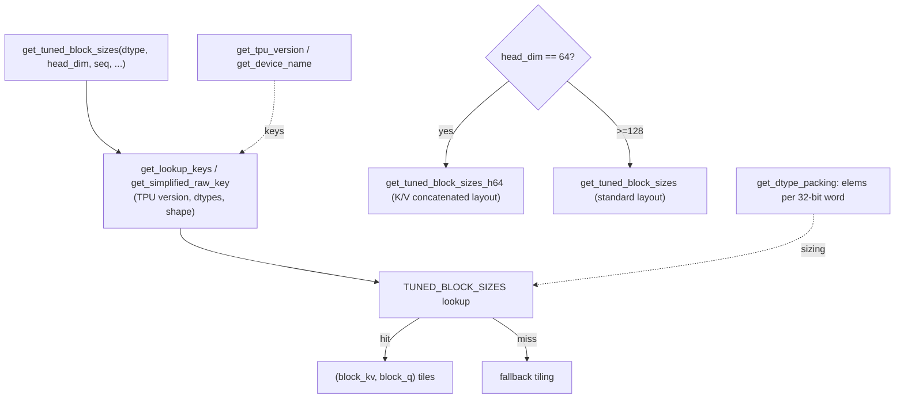

# ejkernel/kernels/_pallas/tpu/ragged_page_attention_v3/_utils — precomputed tuned block sizes + TPU packing helpers

## Overview
This file is the *tuning knowledge* for ragged paged attention v3, baked into the source. Its centerpiece is [`TUNED_BLOCK_SIZES`](../catalog/ejkernel/kernels/_pallas/tpu/ragged_page_attention_v3/_utils.md#TUNED_BLOCK_SIZES) — a large precomputed lookup table mapping `(TPU version, dtypes, head config, sequence shape)` to the `(block_kv, block_q)` tiling that was found fastest offline — accessed via [`get_tuned_block_sizes`](../catalog/ejkernel/kernels/_pallas/tpu/ragged_page_attention_v3/_utils.md#get_tuned_block_sizes_h64) (head_dim≥128) and [`get_tuned_block_sizes_h64`](../catalog/ejkernel/kernels/_pallas/tpu/ragged_page_attention_v3/_utils.md#get_tuned_block_sizes_h64) (head_dim=64). The rest is TPU arithmetic helpers: [`cdiv`](../catalog/ejkernel/kernels/_pallas/tpu/ragged_page_attention_v3/_utils.md#cdiv) (ceil-div), [`align_to`](../catalog/ejkernel/kernels/_pallas/tpu/ragged_page_attention_v3/_utils.md#align_to), and dtype-packing helpers ([`get_dtype_packing`](../catalog/ejkernel/kernels/_pallas/tpu/ragged_page_attention_v3/_utils.md#get_dtype_packing), [`get_dtype_bitwidth`](../catalog/ejkernel/kernels/_pallas/tpu/ragged_page_attention_v3/_utils.md#get_dtype_bitwidth)) that compute how sub-32-bit types pack into TPU's 32-bit words. The design idea: rather than autotune paged attention live (expensive, per serving deployment), ship a table of known-good tiles keyed by the situation.

## Diagram

## Design rationale (why it's built this way)
- **Precomputed tuning, not live autotuning.** [`TUNED_BLOCK_SIZES`](../catalog/ejkernel/kernels/_pallas/tpu/ragged_page_attention_v3/_utils.md#TUNED_BLOCK_SIZES) is a giant static dict of offline-tuned tiles. Paged attention is a serving kernel where compile/tune latency at request time is unacceptable, so the fastest tiles for each hardware/shape were found once and frozen into the table — the kernel looks them up in O(1) rather than benchmarking. This is the serving-latency analogue of the general autotuner.
- **Two layout regimes keyed on head_dim.** [`get_tuned_block_sizes`](../catalog/ejkernel/kernels/_pallas/tpu/ragged_page_attention_v3/_utils.md#get_tuned_block_sizes_h64) (head_dim≥128, standard layout) and [`get_tuned_block_sizes_h64`](../catalog/ejkernel/kernels/_pallas/tpu/ragged_page_attention_v3/_utils.md#get_tuned_block_sizes_h64) (head_dim=64, "K/V concatenated layout") are separate because a 64-dim head is narrower than TPU's 128-lane width, so K and V are concatenated to fill the lanes — a genuinely different memory layout needing its own tuned tiles.
- **Keys are simplified/normalized.** [`get_lookup_keys`](../catalog/ejkernel/kernels/_pallas/tpu/ragged_page_attention_v3/_utils.md#get_lookup_keys_h64)/[`get_simplified_raw_key`](../catalog/ejkernel/kernels/_pallas/tpu/ragged_page_attention_v3/_utils.md#get_simplified_raw_key) (and h64 variants) reduce a full situation to a canonical key (TPU version via [`get_tpu_version`](../catalog/ejkernel/kernels/_pallas/tpu/ragged_page_attention_v3/_utils.md#get_tpu_version)/[`get_device_name`](../catalog/ejkernel/kernels/_pallas/tpu/ragged_page_attention_v3/_utils.md#get_device_name), dtypes, shape buckets) so the table stays finite — nearby shapes map to the same tuned entry rather than needing an entry per exact shape.
- **Dtype packing reflects TPU's word geometry.** [`get_dtype_packing`](../catalog/ejkernel/kernels/_pallas/tpu/ragged_page_attention_v3/_utils.md#get_dtype_packing) returns "elements per 32-bit word" (1 for f32, 2 for bf16, 4 for int8) — the packing factor that determines how a paged KV block of a given dtype maps onto TPU memory, which in turn constrains legal block sizes.
- **Alignment helpers everywhere.** [`cdiv`](../catalog/ejkernel/kernels/_pallas/tpu/ragged_page_attention_v3/_utils.md#cdiv) and [`align_to`](../catalog/ejkernel/kernels/_pallas/tpu/ragged_page_attention_v3/_utils.md#align_to) are used pervasively to round page/block counts up to hardware-aligned boundaries — the ubiquitous "pad to a multiple of the tile" arithmetic that keeps Pallas grids tile-aligned.

## Entry points
- [`get_tuned_block_sizes`](../catalog/ejkernel/kernels/_pallas/tpu/ragged_page_attention_v3/_utils.md#get_tuned_block_sizes_h64) / [`get_tuned_block_sizes_h64`](../catalog/ejkernel/kernels/_pallas/tpu/ragged_page_attention_v3/_utils.md#get_tuned_block_sizes_h64) — the kernel's tile-size resolvers; return `(block_kv, block_q)` from the table for the current hardware/shape/dtype.
- [`TUNED_BLOCK_SIZES`](../catalog/ejkernel/kernels/_pallas/tpu/ragged_page_attention_v3/_utils.md#TUNED_BLOCK_SIZES) — the offline-tuned lookup dict.
- [`cdiv`](../catalog/ejkernel/kernels/_pallas/tpu/ragged_page_attention_v3/_utils.md#cdiv) / [`align_to`](../catalog/ejkernel/kernels/_pallas/tpu/ragged_page_attention_v3/_utils.md#align_to) — ceil-div and up-alignment used throughout the kernel.
- [`get_dtype_packing`](../catalog/ejkernel/kernels/_pallas/tpu/ragged_page_attention_v3/_utils.md#get_dtype_packing) / [`get_dtype_bitwidth`](../catalog/ejkernel/kernels/_pallas/tpu/ragged_page_attention_v3/_utils.md#get_dtype_bitwidth) — TPU word-packing computations.

## Mechanism (step-by-step)
1. **Build a canonical lookup key.** [`get_tuned_block_sizes`](../catalog/ejkernel/kernels/_pallas/tpu/ragged_page_attention_v3/_utils.md#get_tuned_block_sizes_h64) resolves the TPU version ([`get_tpu_version`](../catalog/ejkernel/kernels/_pallas/tpu/ragged_page_attention_v3/_utils.md#get_tpu_version)) and normalizes dtypes/shape via [`get_lookup_keys`](../catalog/ejkernel/kernels/_pallas/tpu/ragged_page_attention_v3/_utils.md#get_lookup_keys_h64)/[`get_simplified_raw_key`](../catalog/ejkernel/kernels/_pallas/tpu/ragged_page_attention_v3/_utils.md#get_simplified_raw_key) into a key.
2. **Look up (or fall back).** The key indexes [`TUNED_BLOCK_SIZES`](../catalog/ejkernel/kernels/_pallas/tpu/ragged_page_attention_v3/_utils.md#TUNED_BLOCK_SIZES); a hit yields the tuned `(block_kv, block_q)`, a miss falls to a default.
3. **head_dim=64 uses the concatenated-layout table.** When head_dim is 64, [`get_tuned_block_sizes_h64`](../catalog/ejkernel/kernels/_pallas/tpu/ragged_page_attention_v3/_utils.md#get_tuned_block_sizes_h64) + [`get_lookup_keys_h64`](../catalog/ejkernel/kernels/_pallas/tpu/ragged_page_attention_v3/_utils.md#get_lookup_keys_h64) are used instead, reflecting the K/V-concatenated memory layout.
4. **Kernel sizes with packing + alignment.** The forward kernel combines the tuned tiles with [`get_dtype_packing`](../catalog/ejkernel/kernels/_pallas/tpu/ragged_page_attention_v3/_utils.md#get_dtype_packing) and [`align_to`](../catalog/ejkernel/kernels/_pallas/tpu/ragged_page_attention_v3/_utils.md#align_to)/[`cdiv`](../catalog/ejkernel/kernels/_pallas/tpu/ragged_page_attention_v3/_utils.md#cdiv) to compute VMEM-legal, tile-aligned block shapes.

## Key data structures
- [`TUNED_BLOCK_SIZES`](../catalog/ejkernel/kernels/_pallas/tpu/ragged_page_attention_v3/_utils.md#TUNED_BLOCK_SIZES) — the frozen offline-tuning table (the largest object in the file).
- Key builders: [`get_lookup_keys`](../catalog/ejkernel/kernels/_pallas/tpu/ragged_page_attention_v3/_utils.md#get_lookup_keys_h64)/[`get_simplified_raw_key`](../catalog/ejkernel/kernels/_pallas/tpu/ragged_page_attention_v3/_utils.md#get_simplified_raw_key) (+ h64 variants).
- Packing/alignment: [`get_dtype_packing`](../catalog/ejkernel/kernels/_pallas/tpu/ragged_page_attention_v3/_utils.md#get_dtype_packing), [`get_dtype_bitwidth`](../catalog/ejkernel/kernels/_pallas/tpu/ragged_page_attention_v3/_utils.md#get_dtype_bitwidth), [`cdiv`](../catalog/ejkernel/kernels/_pallas/tpu/ragged_page_attention_v3/_utils.md#cdiv), [`align_to`](../catalog/ejkernel/kernels/_pallas/tpu/ragged_page_attention_v3/_utils.md#align_to).

## Dynamics (design intent)
> [!inferred] The existence of a giant hand-tuned table is itself the design statement: for a latency-critical serving kernel, the library trades the flexibility of live autotuning for the determinism and zero-latency of a precomputed lookup. The table is presumably generated by running the general autotuner offline across the shape/hardware grid and freezing the winners — so this file is the *cache*, and the general ops/tuning apparatus is what produced it.

## Edge cases
- **Shape/hardware not in the table** falls back to a default tiling that may be suboptimal — new TPU generations or unusual shapes won't benefit until the table is regenerated.
- **head_dim other than 64 or ≥128** — the two resolvers cover those regimes; an in-between head_dim isn't a first-class case.
- **Sub-32-bit dtypes** rely on [`get_dtype_packing`](../catalog/ejkernel/kernels/_pallas/tpu/ragged_page_attention_v3/_utils.md#get_dtype_packing) being correct — a wrong packing factor mis-sizes the KV block.

## Open questions
> [!inferred] How and how often `TUNED_BLOCK_SIZES` is regenerated (which offline harness, which shapes covered) isn't visible from this file; stale entries for a new TPU generation would silently degrade to the fallback.

## See also
- [ejkernel/kernels/_pallas/tpu/ragged_page_attention_v3/_pallas_impl_fwd](ejkernel-kernels-_pallas-tpu-ragged_page_attention_v3-_pallas_impl_fwd.md) — the forward kernel consuming these tiles.
- [ejkernel/kernels/_pallas/tpu/flash_attention/_utils](ejkernel-kernels-_pallas-tpu-flash_attention-_utils.md) — the live-tuned BlockSizes counterpart for dense attention.

## Sources
- raw/code/ejkernel/ejkernel/kernels/_pallas/tpu/ragged_page_attention_v3/_utils.py
