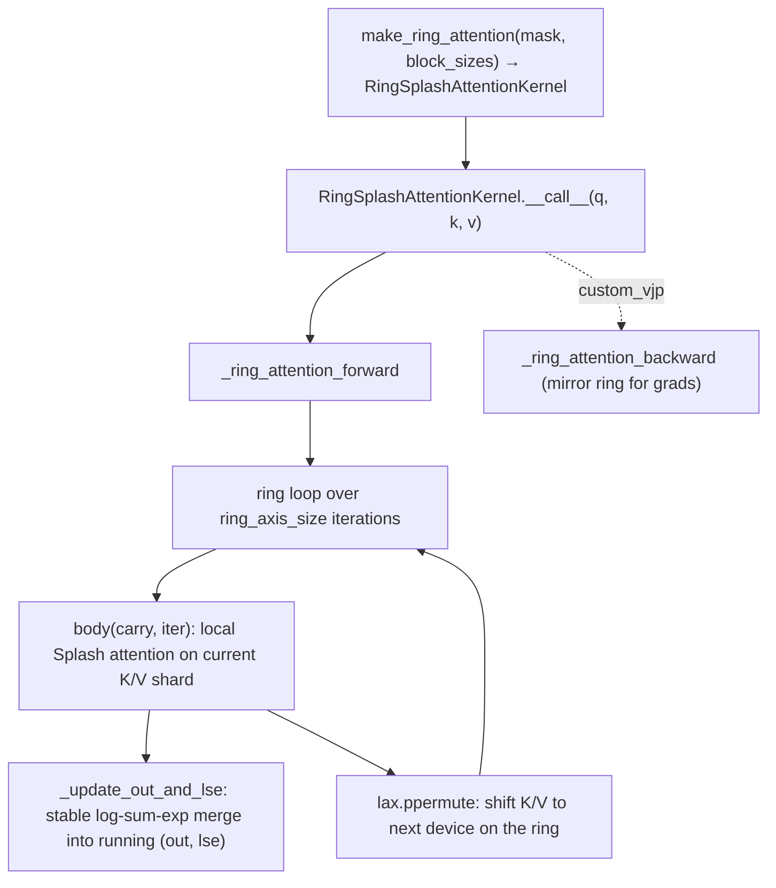

# ejkernel/kernels/_pallas/tpu/ring_attention/_pallas_impl_bwd — sequence-parallel ring attention over Splash

<!-- connect:up:begin -->
> **Cross-repo concept:** part of [pallas-kernel](../../../concepts/pallas-kernel.md), [ring-attention](../../../concepts/ring-attention.md), [sequence-parallelism](../../../concepts/sequence-parallelism.md), [splash-attention](../../../concepts/splash-attention.md) across this wiki's repos.
<!-- connect:up:end -->
## Overview
Ring attention is how you attend over a sequence too long to fit K/V on one device: the sequence is sharded across devices along the [`RING_AXIS`](../catalog/ejkernel/kernels/_pallas/tpu/ring_attention/_pallas_impl_bwd.md#RING_AXIS), each device holds a K/V shard, and the shards are **rotated around a ring** (`lax.ppermute`) so every device eventually sees every other device's K/V — computing local Splash attention on each and merging with numerically-stable log-sum-exp. This module builds that kernel: [`make_ring_attention`](../catalog/ejkernel/kernels/_pallas/tpu/ring_attention/_pallas_impl_bwd.md#make_ring_attention) constructs a [`RingSplashAttentionKernel`](../catalog/ejkernel/kernels/_pallas/tpu/ring_attention/_pallas_impl_bwd.md#RingSplashAttentionKernel) from a mask + [`BlockSizes`](../catalog/ejkernel/kernels/_pallas/tpu/ring_attention/_pallas_impl_bwd.md#BlockSizes), [`_ring_attention_forward`](../catalog/ejkernel/kernels/_pallas/tpu/ring_attention/_pallas_impl_bwd.md#_ring_attention_forward) runs the ring loop, and (this file's focus) the backward is wired through a `custom_vjp` ([`_ring_attention_custom`](../catalog/ejkernel/kernels/_pallas/tpu/ring_attention/_pallas_impl_bwd.md#_ring_attention_custom)). The key idea: ring attention is *Splash attention plus a communication pattern* — the per-block math is the same block-sparse kernel, wrapped in a device-ring that overlaps KV shifts with local compute.

## Diagram

## Design rationale (why it's built this way)
- **Ring communication overlaps with compute.** [`_ring_attention_forward`](../catalog/ejkernel/kernels/_pallas/tpu/ring_attention/_pallas_impl_bwd.md#_ring_attention_forward) defines `shift = lax.ppermute(...)` cycling each device's KV to `(i+1) % ring_size`, and its [`body`](../catalog/ejkernel/kernels/_pallas/tpu/ring_attention/_pallas_impl_bwd.md#_ring_attention_forward.body) computes local attention on the current shard while the next shard shifts in. This is the classic ring-attention overlap: communication latency is hidden behind the local Splash compute, so scaling to N devices doesn't pay N× communication stalls.
- **Stable online merge across the ring.** Each iteration's partial output is merged into a running `(out, lse)` via `_update_out_and_lse` using log-sum-exp — the same online-softmax accumulation flash attention uses, but here across *device* iterations rather than block iterations. `lse` starts at `-inf`, so the first shard initializes cleanly. This is what makes the distributed result numerically identical to single-device attention.
- **Built on the Splash kernel, not a new attention.** [`make_ring_attention`](../catalog/ejkernel/kernels/_pallas/tpu/ring_attention/_pallas_impl_bwd.md#make_ring_attention) takes a mask and [`BlockSizes`](../catalog/ejkernel/kernels/_pallas/tpu/ring_attention/_pallas_impl_bwd.md#BlockSizes) and each ring step invokes Splash attention with the sparse [`MaskInfo`](../catalog/ejkernel/kernels/_pallas/tpu/ring_attention/_pallas_impl_bwd.md#MaskInfo) — so ring attention inherits all of block-sparse's block-skipping, GQA/MQA (`is_mqa`), sliding window, and sinks. The ring is a wrapper, keeping one kernel implementation.
- **Custom VJP mirrors the ring for gradients.** [`_ring_attention_custom`](../catalog/ejkernel/kernels/_pallas/tpu/ring_attention/_pallas_impl_bwd.md#_ring_attention_custom) (+ `_ring_attention_custom_fwd`/`_bwd`) installs a `custom_vjp` whose backward runs its own ring loop to accumulate `dq`/`dkv` across devices — the gradient of a ring collective must itself be a ring collective, which JAX won't derive automatically for the Pallas kernel.
- **MQA-aware sharding.** `is_mqa` changes the K/V shape (shared KV heads → `[kv_seq, head_dim]` vs `[heads, kv_seq, head_dim]`), so the ring handles both grouped-query and multi-query layouts, computing `kv_seq_len` accordingly.

## Entry points
- [`make_ring_attention`](../catalog/ejkernel/kernels/_pallas/tpu/ring_attention/_pallas_impl_bwd.md#make_ring_attention) — factory building a [`RingSplashAttentionKernel`](../catalog/ejkernel/kernels/_pallas/tpu/ring_attention/_pallas_impl_bwd.md#RingSplashAttentionKernel) from a mask + [`BlockSizes`](../catalog/ejkernel/kernels/_pallas/tpu/ring_attention/_pallas_impl_bwd.md#BlockSizes) + `ring_axis`/`is_mqa`.
- [`RingSplashAttentionKernel`](../catalog/ejkernel/kernels/_pallas/tpu/ring_attention/_pallas_impl_bwd.md#RingSplashAttentionKernel) (+ [`__call__`](../catalog/ejkernel/kernels/_pallas/tpu/ring_attention/_pallas_impl_bwd.md#RingSplashAttentionKernel.__call__)) — the callable kernel object; invoking it runs the ring forward (and the custom_vjp backward under autodiff).
- [`_ring_attention_forward`](../catalog/ejkernel/kernels/_pallas/tpu/ring_attention/_pallas_impl_bwd.md#_ring_attention_forward) — the ring loop: local Splash attention + ppermute KV shift + LSE merge.
- [`_ring_attention_custom`](../catalog/ejkernel/kernels/_pallas/tpu/ring_attention/_pallas_impl_bwd.md#_ring_attention_custom) — the `custom_vjp`-wrapped entry threading forward/backward ring rules.

## Mechanism (step-by-step)
1. **Build the kernel for a mask.** [`make_ring_attention`](../catalog/ejkernel/kernels/_pallas/tpu/ring_attention/_pallas_impl_bwd.md#make_ring_attention) processes the mask into sparse [`MaskInfo`](../catalog/ejkernel/kernels/_pallas/tpu/ring_attention/_pallas_impl_bwd.md#MaskInfo) and returns a [`RingSplashAttentionKernel`](../catalog/ejkernel/kernels/_pallas/tpu/ring_attention/_pallas_impl_bwd.md#RingSplashAttentionKernel) bound to the tiling and ring axis.
2. **Ring forward.** [`_ring_attention_forward`](../catalog/ejkernel/kernels/_pallas/tpu/ring_attention/_pallas_impl_bwd.md#_ring_attention_forward) initializes `(out=0, lse=-inf)`, then for each of `ring_axis_size` iterations its [`body`](../catalog/ejkernel/kernels/_pallas/tpu/ring_attention/_pallas_impl_bwd.md#_ring_attention_forward.body) computes local Splash attention on the current KV shard, merges into the running output via `_update_out_and_lse`, and `lax.ppermute`s the KV to the next device.
3. **Causal across iterations.** Within [`_ring_attention_forward`](../catalog/ejkernel/kernels/_pallas/tpu/ring_attention/_pallas_impl_bwd.md#_ring_attention_forward), when `causal`, the per-iteration mask accounts for which device's KV shard is "in the past" relative to the local queries — so causality holds across the sharded sequence, not just within a shard.
4. **Backward rings the gradients.** Under autodiff, [`_ring_attention_custom`](../catalog/ejkernel/kernels/_pallas/tpu/ring_attention/_pallas_impl_bwd.md#_ring_attention_custom)'s `custom_vjp` runs a mirrored ring backward accumulating `dq`/`dkv`, using the saved `lse` to recompute attention weights per block.

## Key data structures
- [`RingSplashAttentionKernel`](../catalog/ejkernel/kernels/_pallas/tpu/ring_attention/_pallas_impl_bwd.md#RingSplashAttentionKernel) — the callable bundling mask/tiling/ring config.
- [`BlockSizes`](../catalog/ejkernel/kernels/_pallas/tpu/ring_attention/_pallas_impl_bwd.md#BlockSizes) / [`MaskInfo`](../catalog/ejkernel/kernels/_pallas/tpu/ring_attention/_pallas_impl_bwd.md#MaskInfo) / [`SegmentIds`](../catalog/ejkernel/kernels/_pallas/tpu/ring_attention/_pallas_impl_bwd.md#SegmentIds) / [`MaskFunctionType`](../catalog/ejkernel/kernels/_pallas/tpu/ring_attention/_pallas_impl_bwd.md#MaskFunctionType) — the Splash-attention types reused per ring step.
- The running `(out, lse)` carry — accumulated across ring iterations.
- [`RING_AXIS`](../catalog/ejkernel/kernels/_pallas/tpu/ring_attention/_pallas_impl_bwd.md#RING_AXIS) — the default mesh axis name for the ring collective.

## Dynamics (design intent)
> [!inferred] Ring attention is the sequence-parallelism primitive: it makes attention's memory (K/V) scale with the number of devices rather than being bounded by one device's HBM, at the cost of a ring collective per attention. Overlapping the ppermute with local Splash compute is what keeps it efficient; the online LSE merge is what keeps it exact. It's the kernel behind EasyDeL's `sp` (sequence) parallelism axis for very long contexts.

## Edge cases
- **`ring_axis_size == 1`** degenerates to plain local Splash attention (one iteration, no real shift).
- **Causal masking across shards** must correctly identify past/future shards per iteration — an off-by-one in the ring index would mask the wrong device's KV.
- **MQA vs GQA shapes** — `is_mqa` changes K/V rank; passing the wrong flag mis-computes `kv_seq_len`.

## Open questions
> [!inferred] The exact `_update_out_and_lse` LSE-merge arithmetic and the backward ring rule's residual handling are in this file but not reproduced here; this page documents the ring structure, its Splash foundation, and the custom-VJP wiring.

## See also
- [ejkernel/kernels/_pallas/tpu/blocksparse_attention/_kernel](ejkernel-kernels-_pallas-tpu-blocksparse_attention-_kernel.md) — the Splash kernel each ring step runs.
- [ejkernel/kernels/_pallas/tpu/blocksparse_attention/_info](ejkernel-kernels-_pallas-tpu-blocksparse_attention-_info.md) — the sparse MaskInfo it consumes.
- [ejkernel/ops/core/kernel](ejkernel-ops-core-kernel.md) — the Kernel/custom_vjp framework it plugs into.

## Sources
- raw/code/ejkernel/ejkernel/kernels/_pallas/tpu/ring_attention/_pallas_impl_bwd.py
