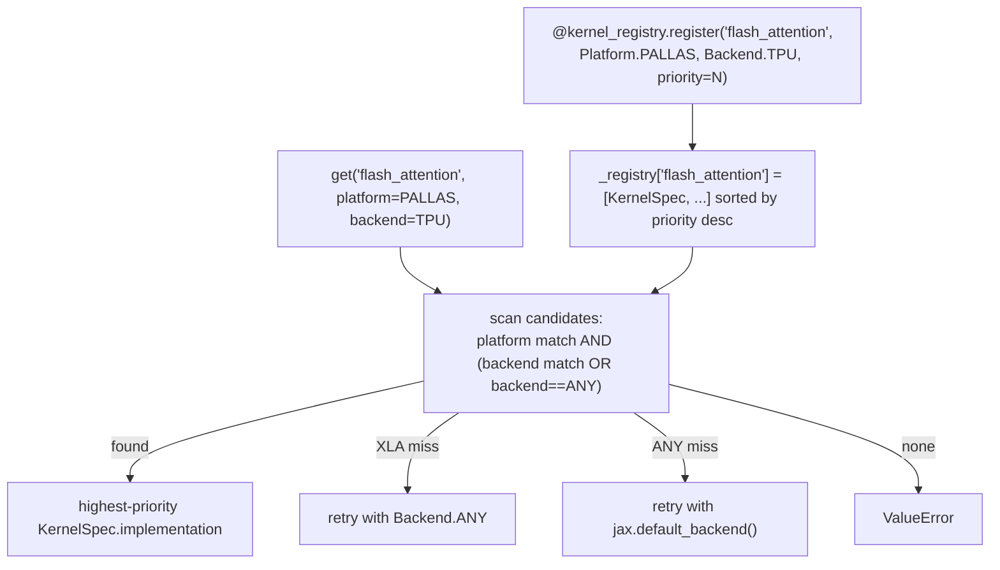

# ejkernel/kernels/_registry — the multi-platform kernel dispatch table

## Overview
ejkernel ships *many* implementations of the same algorithm (flash attention on Triton, Pallas, CUDA, XLA, ...), and this module is the table that picks the right one at call time. [`kernel_registry`](../catalog/ejkernel/kernels/_registry.md#kernel_registry) is a global `KernelRegistry` mapping an algorithm name (e.g. `"flash_attention"`) to a priority-ordered list of `KernelSpec`s, each tagged with a [`Platform`](../catalog/ejkernel/kernels/_registry.md#Platform) (compilation framework: Triton/Pallas/CUDA/CuTe/TileLang/XLA) and a [`Backend`](../catalog/ejkernel/kernels/_registry.md#Backend) (hardware: GPU/TPU/CPU/MPS/[`ANY`](../catalog/ejkernel/kernels/_registry.md#Backend.ANY)). Registration is decorator-based; lookup ([`KernelRegistry.get`](../catalog/ejkernel/kernels/_registry.md#KernelRegistry.get)) is priority-aware with wildcard and fallback rules. This is what lets the higher-level ops layer say "give me flash attention for this hardware" without importing any specific backend.

## Diagram

## Design rationale (why it's built this way)
- **Two orthogonal axes: platform × backend.** [`Platform`](../catalog/ejkernel/kernels/_registry.md#Platform) is *how* the kernel is compiled (Triton, Pallas, CUDA, CuTe, TileLang, XLA — note Pallas "supports both GPU and TPU"), while [`Backend`](../catalog/ejkernel/kernels/_registry.md#Backend) is *what hardware* it runs on. Separating them means one algorithm can have a Pallas-TPU impl and a Triton-GPU impl registered independently, and a query filters on both.
- **`Backend.ANY` as a wildcard for platform-agnostic impls.** [`Backend.ANY`](../catalog/ejkernel/kernels/_registry.md#Backend.ANY) "matches every backend query" — an XLA/JAX-primitive implementation that works everywhere registers once as `ANY` rather than duplicating per backend. The lookup treats `spec.backend == Backend.ANY` as always-matching.
- **Priority breaks ties; higher wins.** [`KernelSpec.backend`](../catalog/ejkernel/kernels/_registry.md#KernelSpec.backend)/[`.platform`](../catalog/ejkernel/kernels/_registry.md#KernelSpec.platform) plus a `priority` int order the candidate list (descending). When several impls match a query, the first (highest-priority) wins — so a hand-tuned Pallas kernel can be preferred over a generic XLA fallback for the same algorithm/hardware.
- **Graceful fallbacks, not hard failures.** [`KernelRegistry.get`](../catalog/ejkernel/kernels/_registry.md#KernelRegistry.get)'s documented fallbacks: a `Platform.XLA` miss retries with `Backend.ANY`; a `Backend.ANY` miss retries with `jax.default_backend()`. Only after all fallbacks does it raise — so a partially-populated registry still resolves to *something* runnable where possible.
- **Signature validation across impls.** The registry can `validate_signatures` an algorithm's implementations to ensure they share a compatible signature — because the whole point is that impls are interchangeable behind one call, a signature drift would silently break the swap.

## Entry points
- [`KernelRegistry.register`](../catalog/ejkernel/kernels/_registry.md#KernelRegistry.register) — the decorator each backend uses to publish an implementation under `(algorithm, platform, backend, priority)`; reached at import time as backend modules load.
- [`KernelRegistry.get`](../catalog/ejkernel/kernels/_registry.md#KernelRegistry.get) — the lookup the ops/modules layer calls to resolve `(algorithm, platform, backend)` to a callable; applies the matching + fallback rules.
- [`kernel_registry`](../catalog/ejkernel/kernels/_registry.md#kernel_registry) — the process-global `KernelRegistry` singleton all registrations and lookups go through.
- [`Platform`](../catalog/ejkernel/kernels/_registry.md#Platform) / [`Backend`](../catalog/ejkernel/kernels/_registry.md#Backend) — the two enums that tag and query implementations.

## Mechanism (step-by-step)
1. **Backends register on import.** Each kernel module applies [`KernelRegistry.register`](../catalog/ejkernel/kernels/_registry.md#KernelRegistry.register)(algorithm, platform, backend, priority) to its implementation function, appending a `KernelSpec` to `_registry[algorithm.lower()]` (kept sorted by descending priority).
2. **A caller queries by algorithm + optional filters.** [`KernelRegistry.get`](../catalog/ejkernel/kernels/_registry.md#KernelRegistry.get)(algorithm, platform, backend) normalizes string args to [`Platform`](../catalog/ejkernel/kernels/_registry.md#Platform)/[`Backend`](../catalog/ejkernel/kernels/_registry.md#Backend) enums and raises immediately if the algorithm is unknown.
3. **Priority-aware match with the ANY wildcard.** It scans the priority-ordered candidates, skipping any whose [`KernelSpec.platform`](../catalog/ejkernel/kernels/_registry.md#KernelSpec.platform) mismatches or whose [`KernelSpec.backend`](../catalog/ejkernel/kernels/_registry.md#KernelSpec.backend) mismatches *and* isn't [`Backend.ANY`](../catalog/ejkernel/kernels/_registry.md#Backend.ANY); the first survivor's `implementation` is returned.
4. **Fallbacks, then error.** On no match, [`KernelRegistry.get`](../catalog/ejkernel/kernels/_registry.md#KernelRegistry.get) retries a `Platform.XLA` query with `Backend.ANY`, and a `Backend.ANY` query retries with the live `jax.default_backend()`; if still nothing, `ValueError`.

## Key data structures
- `KernelSpec` (frozen dataclass) — `{platform, backend, algorithm, implementation, priority}`; the unit stored per algorithm.
- `KernelRegistry._registry` — `dict[algorithm_lower, list[KernelSpec]]` sorted by descending priority.
- [`Platform`](../catalog/ejkernel/kernels/_registry.md#Platform) (`StrEnum`: triton/pallas/cuda/cute/tilelang/xla) and [`Backend`](../catalog/ejkernel/kernels/_registry.md#Backend) (`StrEnum`: gpu/mps/tpu/cpu/[`any`](../catalog/ejkernel/kernels/_registry.md#Backend.ANY)).

## Dynamics (design intent)
> [!inferred] Registration being an import-time side effect on a global singleton means the available implementations are exactly those whose modules have been imported — the same island-visibility property as EasyDeL's factory. Priority + `Backend.ANY` together let the library ship a universal XLA baseline for every algorithm and layer faster hardware-specific Pallas/Triton impls on top, resolving to the best available without the caller knowing which exist.

## Edge cases
- **Unknown algorithm** raises `ValueError` before any matching — a typo in the algorithm name fails fast.
- **`Backend.ANY` impl** matches every backend query, so a too-eagerly-registered ANY impl can shadow a hardware-specific one if its priority is higher.
- **Signature drift** between impls of one algorithm isn't caught unless `validate_signatures` is run — interchangeability is a convention the validator enforces, not the type system.

## Open questions
> [!inferred] Which concrete kernels register at which priority (and thus the effective default for TPU flash attention) depends on import order and the per-kernel `priority` values, not visible from this registry module alone.

## See also
- [ejkernel/modules/base](ejkernel-modules-base.md) — platform/backend detection that feeds `get`.
- [ejkernel/ops/core/kernel](ejkernel-ops-core-kernel.md) — the Kernel abstraction wrapping resolved implementations.
- [ejkernel/modules/operations/configs](ejkernel-modules-operations-configs.md) — per-operation configs carrying platform/backend.

## Sources
- raw/code/ejkernel/ejkernel/kernels/_registry.py
