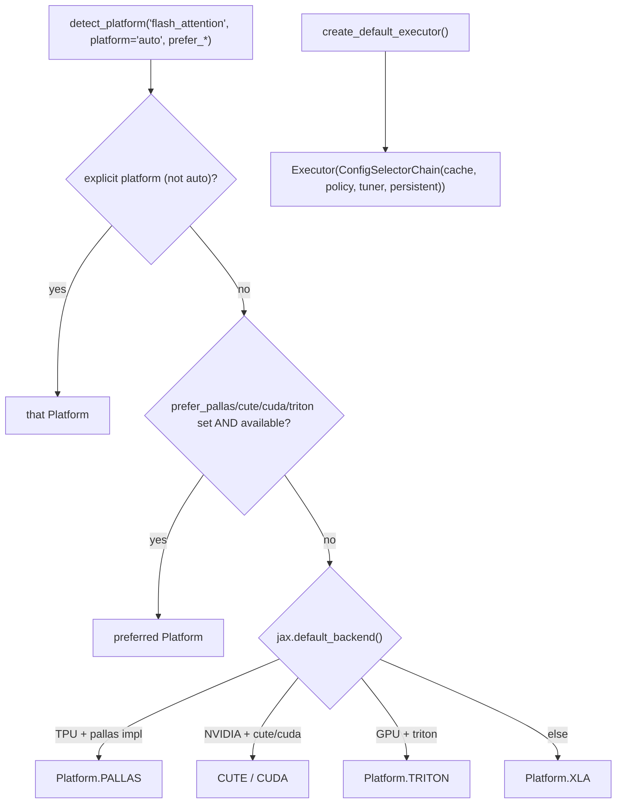

# ejkernel/modules/base — platform auto-detection and executor assembly for the module layer

## Overview
The `modules` layer is the user-facing wrapper around the low-level ops/kernels machinery, and this file supplies its glue: [`detect_platform`](../catalog/ejkernel/modules/base.md#detect_platform) picks the best [`Platform`](../catalog/ejkernel/kernels/_registry.md#Platform) for a given algorithm on the current hardware, [`create_default_executor`](../catalog/ejkernel/modules/base.md#create_default_executor) assembles a ready-to-use [`Executor`](../catalog/ejkernel/ops/execution/executor.md#Executor)+`ConfigSelectorChain` (now deprecated in favor of explicit construction), and [`mesh_to_jax_mesh`](../catalog/ejkernel/modules/base.md#mesh_to_jax_mesh) normalizes wrapped meshes down to a raw `jax.sharding.Mesh`. The key idea is `platform="auto"`: a caller asks for `"flash_attention"` and this module resolves — from explicit preferences, registry availability, and the live JAX backend — which of Pallas/CUDA/CuTe/Triton/XLA to actually run, so model code never hardcodes a backend.

## Diagram

## Design rationale (why it's built this way)
- **`auto` platform resolution encodes a hardware preference ladder.** [`detect_platform`](../catalog/ejkernel/modules/base.md#detect_platform)'s documented priority (when `auto`): explicit prefer-flags first, then TPU→Pallas, NVIDIA→CuTe→CUDA, GPU→Triton, and everything-else→XLA. This bakes the library's opinion about which backend is fastest per hardware into one function, so the module layer gets the best kernel by default while still honoring an explicit platform or a `prefer_*` nudge.
- **Availability-gated, not blind.** The selection only picks a platform if a matching implementation is actually registered for that algorithm (it queries the [`kernel_registry`](../catalog/ejkernel/kernels/_registry.md#kernel_registry)) — so `auto` never returns a platform that would then fail to resolve. An explicit platform with no implementation raises `ValueError`.
- **Executor assembly centralized (but now deprecated).** [`create_default_executor`](../catalog/ejkernel/modules/base.md#create_default_executor) wired an [`Executor`](../catalog/ejkernel/ops/execution/executor.md#Executor) with in-memory + optional persistent caching and autotuning in one call. It is explicitly `@deprecated` in favor of constructing `Executor(ConfigSelectorChain(...))` directly — the docstring shows the migration — reflecting a move toward explicit, composable executor construction over a convenience factory.
- **Mesh normalization for wrapped meshes.** [`mesh_to_jax_mesh`](../catalog/ejkernel/modules/base.md#mesh_to_jax_mesh) exists because some integrations (SpectraX's `SpxMesh`) wrap the JAX mesh, but `jax.shard_map` needs the raw `jax.sharding.Mesh` — the helper extracts `mesh.jax_mesh` when present, else returns the mesh unchanged, so shard_map execution works regardless of wrapping.

## Entry points
- [`detect_platform`](../catalog/ejkernel/modules/base.md#detect_platform) — resolve `(algorithm, platform='auto', prefer_*)` to a concrete [`Platform`](../catalog/ejkernel/kernels/_registry.md#Platform); called by module operations before dispatching to the registry.
- [`create_default_executor`](../catalog/ejkernel/modules/base.md#create_default_executor) — (deprecated) build a default caching+autotuning [`Executor`](../catalog/ejkernel/ops/execution/executor.md#Executor).
- [`mesh_to_jax_mesh`](../catalog/ejkernel/modules/base.md#mesh_to_jax_mesh) — unwrap a possibly-wrapped mesh to a raw `jax.sharding.Mesh` for shard_map.
- `KernelConfig` (with [`KernelConfig.backend`](../catalog/ejkernel/modules/base.md#KernelConfig.backend)) — the base config type module operations parameterize.

## Mechanism (step-by-step)
1. **Explicit wins immediately.** [`detect_platform`](../catalog/ejkernel/modules/base.md#detect_platform) returns the requested [`Platform`](../catalog/ejkernel/kernels/_registry.md#Platform) as-is when `platform` isn't `"auto"`/`None` — no detection.
2. **Preferences, then hardware ladder.** On `auto`, [`detect_platform`](../catalog/ejkernel/modules/base.md#detect_platform) applies any `prefer_*` flag whose platform is available, then consults `jax.default_backend()` and the registry: TPU with a Pallas impl → Pallas; NVIDIA with CuTe/CUDA → those; GPU with Triton → Triton; otherwise XLA.
3. **Executor built from a selection chain.** [`create_default_executor`](../catalog/ejkernel/modules/base.md#create_default_executor) constructs an [`Executor`](../catalog/ejkernel/ops/execution/executor.md#Executor) around a `ConfigSelectorChain(cache, AutotunePolicy(allow_autotune=...), Tuner(warmup, iters), persistent?)` — the standard caching+autotuning stack — while emitting a `DeprecationWarning` pointing to explicit construction.
4. **Mesh unwrapped for shard_map.** When a module runs under `shard_map`, [`mesh_to_jax_mesh`](../catalog/ejkernel/modules/base.md#mesh_to_jax_mesh) yields the raw JAX mesh the executor threads into the invocation.

## Key data structures
- `KernelConfig` — the module-layer base config ([`backend`](../catalog/ejkernel/modules/base.md#KernelConfig.backend) among its fields); specialized per operation in [modules/operations/configs](ejkernel-modules-operations-configs.md).
- The resolved [`Platform`](../catalog/ejkernel/kernels/_registry.md#Platform) — the output of detection, fed to `kernel_registry.get`.

## Dynamics (design intent)
> [!inferred] `detect_platform` is the module layer's counterpart to the executor's `_prefer_cuda_cfg` nudge: both encode "use the fastest available backend for this hardware" but at different stages (detection picks the platform up front; the executor can still redirect the config toward CUDA at run time). Together they make `platform="auto"` reliably land on the best registered kernel without the caller knowing the backend matrix.

## Edge cases
- **Explicit platform with no registered impl** raises `ValueError` — detection won't silently substitute.
- **`prefer_*` flag for an unavailable platform** is ignored, falling through to the hardware ladder.
- **`create_default_executor` is deprecated** — new code should build `Executor(ConfigSelectorChain(...))` directly; the factory may be removed.

## Open questions
> [!inferred] The exact per-algorithm availability checks (which platforms `detect_platform` considers "available") depend on the registry contents at call time; this page documents the resolution ladder, not the registered-kernel inventory.

## See also
- [ejkernel/kernels/_registry](ejkernel-kernels-_registry.md) — the Platform/Backend registry detection queries.
- [ejkernel/ops/execution/executor](ejkernel-ops-execution-executor.md) — the executor this module assembles.
- [ejkernel/modules/operations/configs](ejkernel-modules-operations-configs.md) — per-operation config subclasses of `KernelConfig`.

## Sources
- raw/code/ejkernel/ejkernel/modules/base.py
