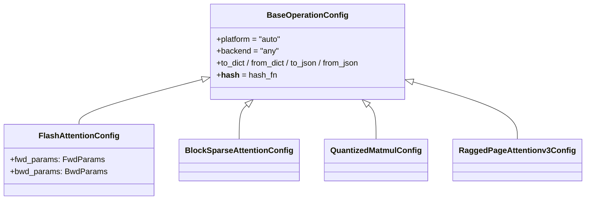

# ejkernel/modules/operations/configs — the per-operation config dataclasses (platform + tiling knobs)

## Overview
Every ejkernel operation is parameterized by a config dataclass, and this file defines them all — one [`BaseOperationConfig`](../catalog/ejkernel/modules/operations/configs.md#BaseOperationConfig) parent plus ~20 subclasses ([`FlashAttentionConfig`](../catalog/ejkernel/modules/operations/configs.md#FlashAttentionConfig), [`BlockSparseAttentionConfig`](../catalog/ejkernel/modules/operations/configs.md#BlockSparseAttentionConfig), [`QuantizedMatmulConfig`](../catalog/ejkernel/modules/operations/configs.md#QuantizedMatmulConfig), ragged-page/ring/grouped-matmul variants, ...). The base carries the two dispatch fields every op needs — [`platform`](../catalog/ejkernel/modules/operations/configs.md#BaseOperationConfig.platform) (which framework) and [`backend`](../catalog/ejkernel/modules/operations/configs.md#BaseOperationConfig.backend) (which hardware) — plus JSON/dict (de)serialization and a stable hash. Each subclass adds the *tuning knobs* that op's kernel understands (block sizes, forward/backward params). These configs are exactly the `Cfg` type flowing through the [Kernel](ejkernel-ops-core-kernel.md)/executor/autotune pipeline: `heuristic_cfg` returns one, `candidate_cfgs` enumerates them, and the tuner picks the fastest.

## Diagram

## Design rationale (why it's built this way)
- **Platform + backend on the base, tuning knobs on subclasses.** [`BaseOperationConfig`](../catalog/ejkernel/modules/operations/configs.md#BaseOperationConfig) puts [`platform`](../catalog/ejkernel/modules/operations/configs.md#BaseOperationConfig.platform) (`triton|pallas|cuda|cute|tilelang|xla|auto`, default `auto`) and [`backend`](../catalog/ejkernel/modules/operations/configs.md#BaseOperationConfig.backend) (`gpu|tpu|cpu|any`, default `any`) on *every* config, because dispatch is universal — so `detect_platform` + the registry can read them off any config. The op-specific fields (e.g. [`FlashAttentionConfig`](../catalog/ejkernel/modules/operations/configs.md#FlashAttentionConfig)'s `fwd_params`/`bwd_params`) live only on the subclass that needs them.
- **Configs are hashable and serializable — because they're cache keys.** [`BaseOperationConfig`](../catalog/ejkernel/modules/operations/configs.md#BaseOperationConfig) sets `__hash__ = hash_fn` and provides `to_dict`/`from_dict`/`to_json`/`from_json`. This is load-bearing: the config is what the autotuner persists to disk and what the selection chain caches, so it must round-trip through JSON and hash stably.
- **`__post_init__` coerces dict params into typed params.** [`FlashAttentionConfig`](../catalog/ejkernel/modules/operations/configs.md#FlashAttentionConfig) (and siblings) convert a dict `fwd_params`/`bwd_params` into typed `FwdParams`/`BwdParams` in `__post_init__` — so a config deserialized from JSON (where nested params are dicts) becomes fully-typed, letting the same dataclass serve both hand-written and persisted-cache construction.
- **Separate configs per attention variant.** There isn't one "attention config" — flash, block-sparse, ragged-page (v2/v3), ring, decode, chunked-prefill each get their own dataclass, because their kernels expose genuinely different tiling/paging knobs. The config type is thus a compile-time record of which kernel family an op belongs to.

## Entry points
- [`BaseOperationConfig`](../catalog/ejkernel/modules/operations/configs.md#BaseOperationConfig) — the parent every op config subclasses; its [`platform`](../catalog/ejkernel/modules/operations/configs.md#BaseOperationConfig.platform)/[`backend`](../catalog/ejkernel/modules/operations/configs.md#BaseOperationConfig.backend) fields drive dispatch, and its serialization/hash methods drive caching.
- [`FlashAttentionConfig`](../catalog/ejkernel/modules/operations/configs.md#FlashAttentionConfig) — the flash-attention config carrying `fwd_params`/`bwd_params` (block sizes for the forward/backward kernels).
- [`BlockSparseAttentionConfig`](../catalog/ejkernel/modules/operations/configs.md#BlockSparseAttentionConfig) / [`QuantizedMatmulConfig`](../catalog/ejkernel/modules/operations/configs.md#QuantizedMatmulConfig) — representative variant configs; the module operation for each op constructs and tunes one of these.

## Mechanism (step-by-step)
1. **An operation defines its config subclass.** Each module op has a [`BaseOperationConfig`](../catalog/ejkernel/modules/operations/configs.md#BaseOperationConfig) subclass exposing that kernel's knobs (e.g. [`FlashAttentionConfig`](../catalog/ejkernel/modules/operations/configs.md#FlashAttentionConfig)'s `fwd_params`/`bwd_params`).
2. **Construction normalizes nested params.** [`FlashAttentionConfig`](../catalog/ejkernel/modules/operations/configs.md#FlashAttentionConfig)'s `__post_init__` turns dict-typed nested params into their typed forms, so JSON-loaded configs are indistinguishable from hand-built ones.
3. **Dispatch reads platform/backend.** The module layer reads [`platform`](../catalog/ejkernel/modules/operations/configs.md#BaseOperationConfig.platform)/[`backend`](../catalog/ejkernel/modules/operations/configs.md#BaseOperationConfig.backend) off the config to resolve the implementation via `detect_platform` + the registry.
4. **Caching round-trips the config.** The autotuner persists the winning config via `to_json`/`from_json` and keys caches on its hash — so a tuned config for one operation signature is a serialized [`BaseOperationConfig`](../catalog/ejkernel/modules/operations/configs.md#BaseOperationConfig) subclass instance.

## Key data structures
- [`BaseOperationConfig`](../catalog/ejkernel/modules/operations/configs.md#BaseOperationConfig) — `{`[`platform`](../catalog/ejkernel/modules/operations/configs.md#BaseOperationConfig.platform)`, `[`backend`](../catalog/ejkernel/modules/operations/configs.md#BaseOperationConfig.backend)`}` + serialization + `hash_fn`.
- [`FlashAttentionConfig`](../catalog/ejkernel/modules/operations/configs.md#FlashAttentionConfig) — `fwd_params`/`bwd_params` (`FwdParams`/`BwdParams` tiling from [ops/utils/datacarrier](ejkernel-ops-utils-datacarrier.md)).
- The ~20 sibling configs (ring, ragged-page v2/v3, grouped-matmul, all-gather/reduce-scatter matmul, [`QuantizedMatmulConfig`](../catalog/ejkernel/modules/operations/configs.md#QuantizedMatmulConfig), ...) — one per kernel family.

## Dynamics (design intent)
> [!inferred] Because the config is simultaneously the dispatch descriptor (platform/backend), the tuning target (op-specific knobs), and the cache key (hash + JSON), a single dataclass instance is what unifies the whole pipeline — the same object detect_platform reads, the tuner mutates candidates of, and the persistent cache stores. That triple role is why serialization and stable hashing are on the base rather than optional.

## Edge cases
- **`platform="xla"` implies `backend="any"`** (per the base docstring) — XLA handles backend selection internally, so setting a specific backend with XLA is meaningless.
- **Dict vs typed nested params** — passing `fwd_params` as a dict works via `__post_init__`, but only for configs that implement the coercion; a config lacking it would keep the raw dict.
- **Hash stability** depends on `hash_fn` treating all fields consistently — an unhashable field added to a subclass would break cache keying.

## Open questions
> [!inferred] The full knob set of each of the ~20 subclasses isn't enumerated here; read the specific config's docstring in source when tuning a particular operation.

## See also
- [ejkernel/modules/base](ejkernel-modules-base.md) — `detect_platform` reads `platform`/`backend` off these configs.
- [ejkernel/ops/utils/datacarrier](ejkernel-ops-utils-datacarrier.md) — the `FwdParams`/`BwdParams` tiling carried in attention configs.
- [ejkernel/modules/operations/quantized_matmul](ejkernel-modules-operations-quantized_matmul.md) — an operation using `QuantizedMatmulConfig`.

## Sources
- raw/code/ejkernel/ejkernel/modules/operations/configs.py
