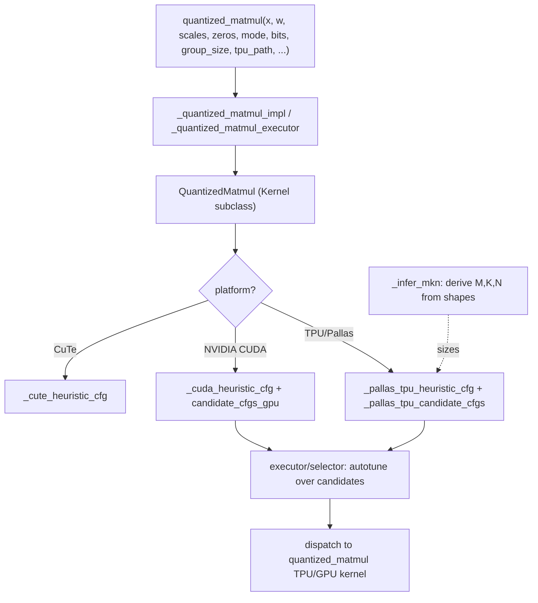

# ejkernel/modules/operations/quantized_matmul — the quantized-matmul operation with per-platform candidate configs

## Overview
This is the module-layer *operation* wrapping the quantized-matmul kernels — a [`Kernel`](../catalog/ejkernel/ops/core/kernel.md#Kernel) subclass (`QuantizedMatmul`) plus the public [`quantized_matmul`](../catalog/ejkernel/modules/operations/quantized_matmul.md#quantized_matmul) function. Its job is to take a quantized weight (`w`, `scales`, optional `zeros`) and a full-precision activation `x`, and dispatch to the fastest available quantized-matmul implementation for the current platform. The interesting content is the **per-platform candidate-config generation**: [`_pallas_tpu_candidate_cfgs`](../catalog/ejkernel/modules/operations/quantized_matmul.md#_pallas_tpu_candidate_cfgs) enumerates TPU tilings, [`QuantizedMatmul._candidate_cfgs_gpu_for_platform`](../catalog/ejkernel/modules/operations/quantized_matmul.md#QuantizedMatmul._candidate_cfgs_gpu_for_platform) enumerates GPU ones, and heuristic configs (`_pallas_tpu_heuristic_cfg`, `_cuda_heuristic_cfg`, `_cute_heuristic_cfg`) give the safe default per platform. So this file is where the generic autotuning framework meets the specific quantized-matmul kernels: it supplies the `heuristic_cfg`/`candidate_cfgs` the executor tunes over.

## Diagram

## Design rationale (why it's built this way)
- **Operation = Kernel subclass supplying configs.** `QuantizedMatmul` subclasses [`Kernel`](../catalog/ejkernel/ops/core/kernel.md#Kernel), so it plugs directly into the executor/autotune pipeline. It overrides the config methods per platform — [`candidate_cfgs_tpu`](../catalog/ejkernel/modules/operations/quantized_matmul.md#QuantizedMatmul.candidate_cfgs_tpu)/[`candidate_cfgs_gpu`](../catalog/ejkernel/modules/operations/quantized_matmul.md#QuantizedMatmul.candidate_cfgs_gpu) — because the optimal tiling for a quantized matmul is hardware-specific and worth searching.
- **Per-platform candidate enumeration.** [`_pallas_tpu_candidate_cfgs`](../catalog/ejkernel/modules/operations/quantized_matmul.md#_pallas_tpu_candidate_cfgs) generates the TPU tiling candidates (block M/K/N combinations legal for the packed layout), and [`QuantizedMatmul._candidate_cfgs_gpu_for_platform`](../catalog/ejkernel/modules/operations/quantized_matmul.md#QuantizedMatmul._candidate_cfgs_gpu_for_platform) does the GPU equivalent — so the autotuner searches a hardware-appropriate space rather than one generic set.
- **Rich quantization surface exposed at the op boundary.** [`quantized_matmul`](../catalog/ejkernel/modules/operations/quantized_matmul.md#quantized_matmul) takes `mode` (affine/nf4/mxfp4/...), `bits`, `group_size`, `axis`, `gemv_mode` (matrix-vector fast path), `revsplit_k` (reverse split-K reduction), `fuse`, and `tpu_path` (packed/hybrid/predecode) — the full quantization + kernel-strategy surface, so a caller controls both *what* quantization and *how* it's executed.
- **GEMV vs GEMM distinction.** `gemv_mode` exists because a quantized matrix-*vector* product (batch-1 decode) has a very different optimal kernel than a matrix-*matrix* product (prefill/training) — the op picks a GEMV-specialized path when the shapes warrant, using [`_infer_mkn`](../catalog/ejkernel/modules/operations/quantized_matmul.md#_infer_mkn) to derive M/K/N.
- **Heuristic per platform, not one default.** Separate [`_pallas_tpu_heuristic_cfg`](../catalog/ejkernel/modules/operations/quantized_matmul.md#_pallas_tpu_heuristic_cfg)/[`_cuda_heuristic_cfg`](../catalog/ejkernel/modules/operations/quantized_matmul.md#_cuda_heuristic_cfg)/[`_cute_heuristic_cfg`](../catalog/ejkernel/modules/operations/quantized_matmul.md#_cute_heuristic_cfg) mean the safe default is already hardware-tuned before any autotuning runs.

## Entry points
- [`quantized_matmul`](../catalog/ejkernel/modules/operations/quantized_matmul.md#quantized_matmul) — the public op: `x @ dequant(w, scales, zeros)` with quantization mode/bits/group_size and kernel-strategy knobs.
- `QuantizedMatmul` (Kernel) — the op's kernel class; supplies platform-specific config methods ([`candidate_cfgs_tpu`](../catalog/ejkernel/modules/operations/quantized_matmul.md#QuantizedMatmul.candidate_cfgs_tpu)/[`candidate_cfgs_gpu`](../catalog/ejkernel/modules/operations/quantized_matmul.md#QuantizedMatmul.candidate_cfgs_gpu)).
- [`_pallas_tpu_candidate_cfgs`](../catalog/ejkernel/modules/operations/quantized_matmul.md#_pallas_tpu_candidate_cfgs) / [`QuantizedMatmul.candidate_cfgs_tpu`](../catalog/ejkernel/modules/operations/quantized_matmul.md#QuantizedMatmul.candidate_cfgs_tpu) — TPU tuning candidates.
- [`_quantized_matmul_impl`](../catalog/ejkernel/modules/operations/quantized_matmul.md#_quantized_matmul_impl) / [`_quantized_matmul_executor`](../catalog/ejkernel/modules/operations/quantized_matmul.md#_quantized_matmul_executor._quantized_matmul_executor) — the implementation dispatch driving the kernel through the executor.

## Mechanism (step-by-step)
1. **Resolve quantization params.** [`quantized_matmul`](../catalog/ejkernel/modules/operations/quantized_matmul.md#quantized_matmul) validates `mode`/`bits`/`group_size` (via the qparams resolver) and infers M/K/N ([`_infer_mkn`](../catalog/ejkernel/modules/operations/quantized_matmul.md#_infer_mkn)) from the input shapes.
2. **Select platform + heuristic.** The op resolves the platform and picks its heuristic config ([`_pallas_tpu_heuristic_cfg`](../catalog/ejkernel/modules/operations/quantized_matmul.md#_pallas_tpu_heuristic_cfg) / [`_cuda_heuristic_cfg`](../catalog/ejkernel/modules/operations/quantized_matmul.md#_cuda_heuristic_cfg) / [`_cute_heuristic_cfg`](../catalog/ejkernel/modules/operations/quantized_matmul.md#_cute_heuristic_cfg)).
3. **Autotune over candidates.** If tuning is enabled, the executor benchmarks [`_pallas_tpu_candidate_cfgs`](../catalog/ejkernel/modules/operations/quantized_matmul.md#_pallas_tpu_candidate_cfgs) (or [`QuantizedMatmul._candidate_cfgs_gpu_for_platform`](../catalog/ejkernel/modules/operations/quantized_matmul.md#QuantizedMatmul._candidate_cfgs_gpu_for_platform)) and caches the winner.
4. **Dispatch to the kernel.** [`_quantized_matmul_impl`](../catalog/ejkernel/modules/operations/quantized_matmul.md#_quantized_matmul_impl) runs the chosen TPU/GPU quantized-matmul kernel with the selected config and `tpu_path` (packed/predecode), applying `gemv_mode`/`revsplit_k` strategies.

## Key data structures
- `QuantizedMatmul` (Kernel[QuantizedMatmulConfig, Array]) — the op class.
- `QuantizedMatmulConfig` (from [modules/operations/configs](ejkernel-modules-operations-configs.md)) — the tuned config type.
- Per-platform candidate/heuristic generators: [`_pallas_tpu_candidate_cfgs`](../catalog/ejkernel/modules/operations/quantized_matmul.md#_pallas_tpu_candidate_cfgs), [`_pallas_tpu_heuristic_cfg`](../catalog/ejkernel/modules/operations/quantized_matmul.md#_pallas_tpu_heuristic_cfg), [`_cuda_heuristic_cfg`](../catalog/ejkernel/modules/operations/quantized_matmul.md#_cuda_heuristic_cfg), [`_cute_heuristic_cfg`](../catalog/ejkernel/modules/operations/quantized_matmul.md#_cute_heuristic_cfg).

## Dynamics (design intent)
> [!inferred] This file is the seam between ejkernel's two halves: the generic autotuning framework (Kernel/executor/selector) and the concrete quantized-matmul kernels. By subclassing Kernel and supplying per-platform candidate/heuristic configs, quantized matmul gets cache+autotune "for free," while the kernel-strategy knobs (`tpu_path`, `gemv_mode`, `revsplit_k`) expose the quantized-specific execution choices the generic framework doesn't know about. It's the ejkernel counterpart to EasyDeL's quantized `ParallelLinear`.

## Edge cases
- **Unsupported mode/bits/group_size combo** is rejected by the qparams resolver before dispatch.
- **GEMV vs GEMM misclassification** — forcing a GEMM kernel on a batch-1 decode wastes throughput; `gemv_mode="auto"` picks based on shape.
- **`allow_dense_fallback`** — when set, an unsupported quantized path falls back to a dense matmul (correct but unquantized), which can silently lose the memory benefit.

## Open questions
> [!inferred] The exact `revsplit_k`/`gemv_mode` kernel variants and the GPU (CUDA/CuTe) implementations aren't detailed here; the TPU kernel internals are in [quantized_matmul/_pallas_impl_core](ejkernel-kernels-_pallas-tpu-quantized_matmul-_pallas_impl_core.md).

## See also
- [ejkernel/kernels/_pallas/tpu/quantized_matmul/_pallas_impl_core](ejkernel-kernels-_pallas-tpu-quantized_matmul-_pallas_impl_core.md) — the TPU kernel this op dispatches to.
- [ejkernel/quantization/_utils/qparams](ejkernel-quantization-_utils-qparams.md) — the mode/bits/group_size validation.
- [ejkernel/ops/core/kernel](ejkernel-ops-core-kernel.md) — the Kernel base this op subclasses.

## Sources
- raw/code/ejkernel/ejkernel/modules/operations/quantized_matmul.py
