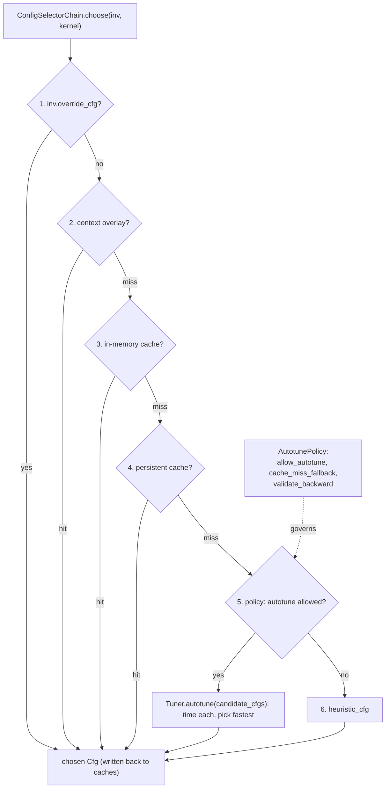

# ejkernel/ops/config/selection — the 7-tier config selection chain and autotune policy

## Overview
[`ConfigSelectorChain`](../catalog/ejkernel/ops/config/selection.md#ConfigSelectorChain) is the component the executor delegates to for "which config should this kernel invocation use?" It implements a strict 7-tier fallback: explicit override → context overlay → in-memory cache → persistent (disk) cache → autotune → heuristics → error. The behavior at each tier is governed by an [`AutotunePolicy`](../catalog/ejkernel/ops/config/selection.md#AutotunePolicy) (whether to autotune, what to do on a cache miss, whether to validate the backward pass), and the actual benchmarking is done by a [`Tuner`](../catalog/ejkernel/ops/config/selection.md#Tuner). The design idea is that config selection is a *cost hierarchy*: the cheapest correct answer (cache hit) is tried first, and the expensive one (autotuning by timing candidate configs) is a last resort whose results are cached — persistently — so it's paid at most once per structural signature per machine.

## Diagram

## Design rationale (why it's built this way)
- **A cost-ordered fallback, not a single strategy.** [`ConfigSelectorChain`](../catalog/ejkernel/ops/config/selection.md#ConfigSelectorChain)'s docstring lists the exact order: override → overlay → in-memory cache → persistent cache → autotune → heuristics → error. Each tier is strictly cheaper than the next, so steady-state calls hit the cache and never pay tuning; only a genuinely new signature reaches the tuner.
- **Policy separates "can" from "how".** [`AutotunePolicy`](../catalog/ejkernel/ops/config/selection.md#AutotunePolicy) exposes [`allow_autotune`](../catalog/ejkernel/ops/config/selection.md#AutotunePolicy.allow_autotune), `allow_heuristics`, [`cache_miss_fallback`](../catalog/ejkernel/ops/config/selection.md#AutotunePolicy.cache_miss_fallback) (`"autotune"` vs `"heuristics"`), and [`validate_backward`](../catalog/ejkernel/ops/config/selection.md#AutotunePolicy.validate_backward). The `cache_miss_fallback` field is what the executor reads to take its heuristics-only fast path — so a deployment can choose "never autotune, always heuristic" without changing the chain.
- **Backward-pass-aware tuning for training.** [`validate_backward`](../catalog/ejkernel/ops/config/selection.md#AutotunePolicy.validate_backward), when set, makes the [`Tuner`](../catalog/ejkernel/ops/config/selection.md#Tuner) measure gradient computation time too — "ensuring the selected configuration performs well for training workloads," not just inference. A block size optimal for the forward can be poor for the backward; this option tunes for the whole training step.
- **Autotuning results persist across runs.** The chain holds an optional `persistent` (disk) cache and `persist_autotune=True`, so a tuned config survives process restarts — the expensive search is amortized across every future run on the same hardware. `forbid_reautotune` (default True) plus `_autotuned_keys` prevents re-tuning the same op in a process.
- **Context managers for temporary policy changes.** `policy_override` / `forward_autotune_only` / `log_autotune_progress` let a caller temporarily flip policy (e.g. tune forward only, or log progress) within a `with` block without mutating the global chain.

## Entry points
- [`ConfigSelectorChain.choose`](../catalog/ejkernel/ops/config/selection.md#ConfigSelectorChain.choose) — the method the executor calls; walks the 7 tiers and returns a config (or raises if none available).
- [`ConfigSelectorChain`](../catalog/ejkernel/ops/config/selection.md#ConfigSelectorChain) (`__init__`) — assembles the chain from a `cache`, an [`AutotunePolicy`](../catalog/ejkernel/ops/config/selection.md#AutotunePolicy), a [`Tuner`](../catalog/ejkernel/ops/config/selection.md#Tuner), and an optional persistent cache.
- [`Tuner`](../catalog/ejkernel/ops/config/selection.md#Tuner) — the benchmarking tool: `measure` times a function, `autotune` picks the fastest among candidate configs.
- [`AutotunePolicy`](../catalog/ejkernel/ops/config/selection.md#AutotunePolicy) — the behavior knobs ([`allow_autotune`](../catalog/ejkernel/ops/config/selection.md#AutotunePolicy.allow_autotune), [`cache_miss_fallback`](../catalog/ejkernel/ops/config/selection.md#AutotunePolicy.cache_miss_fallback), [`validate_backward`](../catalog/ejkernel/ops/config/selection.md#AutotunePolicy.validate_backward)).

## Mechanism (step-by-step)
1. **Try the cheap tiers first.** [`ConfigSelectorChain.choose`](../catalog/ejkernel/ops/config/selection.md#ConfigSelectorChain.choose) checks the invocation's override, then a context overlay, then the in-memory cache, then the persistent disk cache — returning immediately on the first hit and writing the result back to the faster caches.
2. **Autotune on miss, if allowed.** If nothing is cached and the [`AutotunePolicy`](../catalog/ejkernel/ops/config/selection.md#AutotunePolicy) permits ([`allow_autotune`](../catalog/ejkernel/ops/config/selection.md#AutotunePolicy.allow_autotune) and [`cache_miss_fallback`](../catalog/ejkernel/ops/config/selection.md#AutotunePolicy.cache_miss_fallback) `== "autotune"`), the [`Tuner`](../catalog/ejkernel/ops/config/selection.md#Tuner) benchmarks the kernel's `candidate_cfgs` (measuring forward, and backward if [`validate_backward`](../catalog/ejkernel/ops/config/selection.md#AutotunePolicy.validate_backward)) and picks the fastest.
3. **Persist the winner.** [`ConfigSelectorChain.choose`](../catalog/ejkernel/ops/config/selection.md#ConfigSelectorChain.choose) stores the autotuned config in the in-memory cache and (if `persist_autotune`) the disk cache, and its key is recorded in `_autotuned_keys` so `forbid_reautotune` prevents repeating the search.
4. **Fall back to heuristics, else error.** If autotuning is disallowed, [`ConfigSelectorChain.choose`](../catalog/ejkernel/ops/config/selection.md#ConfigSelectorChain.choose) uses the kernel's `heuristic_cfg`; if even heuristics are disallowed and nothing else matched, `choose` raises — no silent wrong config.

## Key data structures
- [`ConfigSelectorChain`](../catalog/ejkernel/ops/config/selection.md#ConfigSelectorChain) — holds `cache`, `policy`, `tuner`, `persistent`, `persist_autotune`, `on_event`, `forbid_reautotune`, `_autotuned_keys`.
- [`AutotunePolicy`](../catalog/ejkernel/ops/config/selection.md#AutotunePolicy) — `{allow_autotune, allow_heuristics, cache_miss_fallback, validate_backward}`.
- [`Tuner`](../catalog/ejkernel/ops/config/selection.md#Tuner) — `warmup`/`iters` benchmarking with `measure`/`autotune`.

## Dynamics (design intent)
> [!inferred] The persistent cache + `forbid_reautotune` together make autotuning a genuinely one-time cost: the first run on a machine tunes and writes to disk, and every subsequent run (any process) loads the tuned config from the persistent tier before ever reaching the tuner — turning a per-signature search into a per-machine-lifetime cost.

## Edge cases
- **All tiers miss with autotune+heuristics disabled** → `choose` raises rather than guessing.
- **`validate_backward` off** tunes only the forward — a config great for inference may be suboptimal for a training backward.
- **`forbid_reautotune`** means a config that was tuned once won't be re-tuned even if hardware/conditions changed mid-process — a stale tuned config persists until the cache is cleared.

## Open questions
> [!inferred] The `Tuner.measure`/`autotune` timing internals (jit warmup, forward/backward splitting) and the `ConfigCache`/`PersistentCache` implementations are adjacent; this page documents the selection order and policy, with tuning covered in [ops-execution-tuning](ejkernel-ops-execution-tuning.md).

## See also
- [ejkernel/ops/execution/executor](ejkernel-ops-execution-executor.md) — the caller that delegates to `choose`.
- [ejkernel/ops/execution/tuning](ejkernel-ops-execution-tuning.md) — the autotune decorators built on this policy.
- [ejkernel/ops/core/kernel](ejkernel-ops-core-kernel.md) — supplies `candidate_cfgs`/`heuristic_cfg`.

## Sources
- raw/code/ejkernel/ejkernel/ops/config/selection.py
