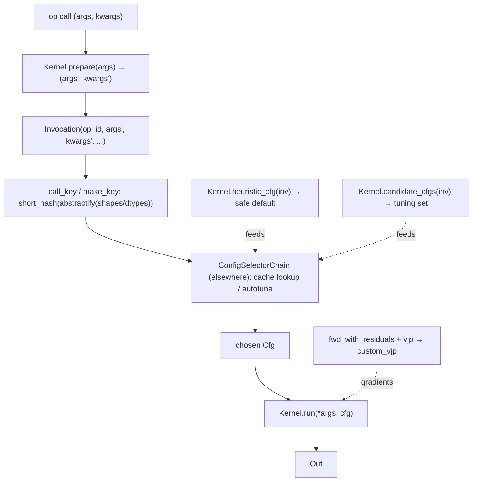

# ejkernel/ops/core/kernel — the Kernel/Invocation abstraction every autotuned op is built on

## Overview
This module defines the two types at the heart of ejkernel's autotuning machinery: [`Kernel`](../catalog/ejkernel/ops/core/kernel.md#Kernel), the abstract base a single configurable operation subclasses, and [`Invocation`](../catalog/ejkernel/ops/core/kernel.md#Invocation), the immutable snapshot of one call flowing through the config-selection → execution pipeline. The key design idea is a clean separation of *what to compute* (a `Kernel.run(cfg)`) from *how to configure it* (`heuristic_cfg` / `candidate_cfgs`) and *how to select the config* (the executor + selector chain, which live elsewhere). An [`Invocation`](../catalog/ejkernel/ops/core/kernel.md#Invocation) hashes on argument *shapes/dtypes, not values*, so a tuned config found once is reused for every future call with the same structural signature — the caching primitive that makes autotuning affordable.

## Diagram

## Design rationale (why it's built this way)
- **Cache on structure, not values.** [`Invocation.call_key`](../catalog/ejkernel/ops/core/kernel.md#Invocation) builds a 16-char hash from `abstractify(args)`/`abstractify(kwargs)` (shapes+dtypes), `batch_axes`, and `method` — deliberately excluding array values. Its docstring: "allowing the same configuration to be reused for arrays with the same structure." Two different weight matrices of the same shape share a tuned block-size config, so autotuning cost amortizes across all calls of a given signature.
- **Minimal required surface, rich optional surface.** A [`Kernel`](../catalog/ejkernel/ops/core/kernel.md#Kernel) subclass *must* override only `run` (the compute) and [`heuristic_cfg`](../catalog/ejkernel/ops/core/kernel.md#Kernel.heuristic_cfg) (a "fast, always-correct default"); everything else — [`candidate_cfgs`](../catalog/ejkernel/ops/core/kernel.md#Kernel.candidate_cfgs) (tuning set), `prepare` (arg preprocessing), `fwd_with_residuals`+`vjp` (custom gradients), and the shard_map variants — is optional. This keeps a new kernel trivial to add while letting perf-critical ones opt into tuning and gradients.
- **Gradients via `custom_vjp`, automatically.** The class docstring: "if `fwd_with_residuals` and `vjp` are both overridden, JAX's `custom_vjp` mechanism is used automatically." So a kernel author writes a forward-with-residuals and a backward, and ejkernel wires the `custom_vjp` — the kernel participates in autodiff without the author touching JAX's VJP plumbing.
- **shard_map is a first-class execution mode.** [`Invocation`](../catalog/ejkernel/ops/core/kernel.md#Invocation) carries `method='shard_map'` plus `mesh`/`in_specs`/`out_specs`/`check_vma`, and `Kernel` has `run_shard_map` / `fwd_with_residuals_shard_map` (+ GPU variants). Multi-device execution is thus a property of the invocation, not a separate kernel — the same `run` body can execute plain or under `jax.shard_map`.
- **`override_cfg` bypasses the whole selection pipeline.** Setting [`Invocation`](../catalog/ejkernel/ops/core/kernel.md#Invocation)`.override_cfg` skips cache+autotune and uses the given config directly (writing it back to the caches) — the escape hatch for pinning a known-good config.

## Entry points
- [`Kernel`](../catalog/ejkernel/ops/core/kernel.md#Kernel) / [`Kernel.__init__`](../catalog/ejkernel/ops/core/kernel.md#Kernel.__init__) — the base every operation subclasses; `__init__` assigns an `op_id` (explicit, class-attr, or auto `module.ClassName`) that becomes part of the cache key.
- [`Kernel.heuristic_cfg`](../catalog/ejkernel/ops/core/kernel.md#Kernel.heuristic_cfg) — the mandatory safe-default config; reached whenever autotuning is off or hasn't run yet.
- [`Kernel.candidate_cfgs`](../catalog/ejkernel/ops/core/kernel.md#Kernel.candidate_cfgs) — the optional tuning set the autotuner benchmarks; defaults to just the heuristic config.
- [`Invocation`](../catalog/ejkernel/ops/core/kernel.md#Invocation) — constructed by the executor after `prepare`; the object the selector chain and executor consume. Its [`kwargs`](../catalog/ejkernel/ops/core/kernel.md#Invocation.kwargs)/args carry the prepared call.

## Mechanism (step-by-step)
1. **`prepare` preprocesses, then an `Invocation` is snapshotted.** The executor calls `Kernel.prepare` (arg validation/coercion; default pass-through), then constructs an [`Invocation`](../catalog/ejkernel/ops/core/kernel.md#Invocation) capturing the prepared args/[`kwargs`](../catalog/ejkernel/ops/core/kernel.md#Invocation.kwargs), the kernel's `op_id`, any `batch_axes` (vmap context), and the execution `method`/`mesh`/specs.
2. **A structural key is derived.** [`Invocation`](../catalog/ejkernel/ops/core/kernel.md#Invocation)'s `call_key` (or `make_key` with a custom builder) hashes the abstract shapes/dtypes + batch axes + method into a stable short hash — the cache key under which a chosen config is stored/looked up.
3. **Config is selected.** The selector chain (external) either finds a cached config for this key, runs autotuning over [`Kernel.candidate_cfgs`](../catalog/ejkernel/ops/core/kernel.md#Kernel.candidate_cfgs), or falls back to [`Kernel.heuristic_cfg`](../catalog/ejkernel/ops/core/kernel.md#Kernel.heuristic_cfg). An `override_cfg` short-circuits all of this.
4. **`run` executes with the chosen config.** [`Kernel`](../catalog/ejkernel/ops/core/kernel.md#Kernel)'s `run(*args, cfg=...)` (or a `run_shard_map`/GPU variant, selected by the invocation's `method`) performs the computation; if the kernel defines `fwd_with_residuals`+`vjp`, JAX's `custom_vjp` routes gradients through them.

## Key data structures
- [`Invocation`](../catalog/ejkernel/ops/core/kernel.md#Invocation) — immutable per-call snapshot: `op_id`, `args`, [`kwargs`](../catalog/ejkernel/ops/core/kernel.md#Invocation.kwargs), `batch_axes`, `override_cfg`, `stamp`, `method`, `mesh`, `in_specs`/`out_specs`, `check_vma`.
- [`Kernel`](../catalog/ejkernel/ops/core/kernel.md#Kernel) — the op base with `run`/[`heuristic_cfg`](../catalog/ejkernel/ops/core/kernel.md#Kernel.heuristic_cfg)/[`candidate_cfgs`](../catalog/ejkernel/ops/core/kernel.md#Kernel.candidate_cfgs)/`prepare`/`fwd_with_residuals`/`vjp` and their shard_map/GPU counterparts.

## Dynamics (design intent)
- The `method`/`mesh`/`in_specs`/`out_specs` fields on [`Invocation`](../catalog/ejkernel/ops/core/kernel.md#Invocation) mean the *same* `Kernel` compiles to a plain call or a `jax.shard_map`'d call purely from invocation metadata — distributed execution doesn't fork the kernel definition.
- Because the cache key ignores values, autotuning is a one-time cost per structural signature; steady-state calls hit the cache and pay only the tuned `run`.

## Edge cases
- **Auto `op_id`** (`module.ClassName`) collides if two kernels share a name in the same module — the docstring shows explicit `op_id` as the disambiguator, and op_id is part of the cache key.
- **Only one of `fwd_with_residuals`/`vjp` overridden** means no `custom_vjp` is installed — gradients silently fall back to default (or fail), so both must be provided together.
- **`method='shard_map'` without `mesh`** is invalid — the shard_map variants require the mesh + partition specs on the invocation.

## Open questions
> [!inferred] The `ConfigSelectorChain`/`Executor` that actually consume the `Invocation` live in sibling packets ([ops-config-selection](ejkernel-ops-config-selection.md), [ops-execution-executor](ejkernel-ops-execution-executor.md)); this page documents the core contract, not the selection algorithm.

## See also
- [ejkernel/ops/execution/executor](ejkernel-ops-execution-executor.md) — builds `Invocation`s and drives the lifecycle.
- [ejkernel/ops/config/selection](ejkernel-ops-config-selection.md) — the config cache/autotune chain.
- [ejkernel/ops/execution/tuning](ejkernel-ops-execution-tuning.md) — the autotune loop over `candidate_cfgs`.
- [ejkernel/modules/base](ejkernel-modules-base.md) — how modules wrap kernels for a platform.

## Sources
- raw/code/ejkernel/ejkernel/ops/core/kernel.py
