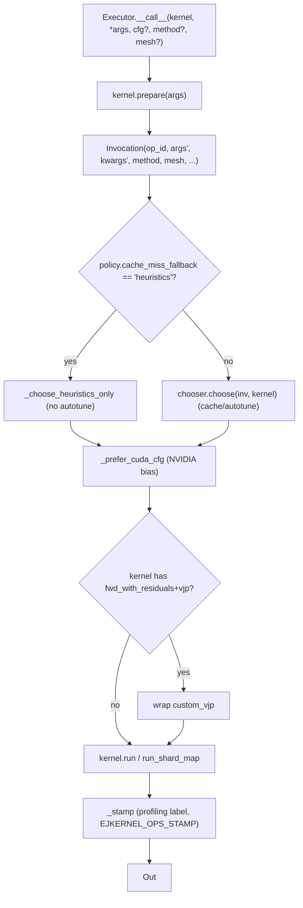

# ejkernel/ops/execution/executor — the engine that runs a kernel with a chosen config

## Overview
[`Executor`](../catalog/ejkernel/ops/execution/executor.md#Executor) is the orchestrator that turns a call to a [`Kernel`](../catalog/ejkernel/ops/core/kernel.md#Kernel) into an executed result: it preprocesses args, snapshots an `Invocation`, asks its config `chooser` for the best config, installs `custom_vjp` if the kernel provides gradients, optionally stamps profiling metadata, and finally runs the kernel (plain or under `jax.shard_map`). It is the piece that ties [`Kernel`](../catalog/ejkernel/ops/core/kernel.md#Kernel), the config-selection chain, and the registry together into one callable. Two subtleties define its behavior: a fast [`_choose_heuristics_only`](../catalog/ejkernel/ops/execution/executor.md#Executor._choose_heuristics_only) path that skips autotuning when the policy says so, and a [`_prefer_cuda_cfg`](../catalog/ejkernel/ops/execution/executor.md#Executor._prefer_cuda_cfg) post-step that biases the chosen config toward a native-CUDA implementation on NVIDIA GPUs when one exists.

## Diagram

## Design rationale (why it's built this way)
- **The chooser is injected, not hardcoded.** [`Executor.__init__`](../catalog/ejkernel/ops/execution/executor.md#Executor) takes a `chooser` (a `ConfigChooser` protocol, "typically ConfigSelectorChain"). The executor knows *the lifecycle* (prepare → choose → gradients → stamp → run) but not *the selection policy* — so cache-only, autotuning, or heuristic-only strategies all plug into the same engine.
- **A heuristics-only fast path.** [`choose_config`](../catalog/ejkernel/ops/execution/executor.md#Executor.choose_config) reads the chooser's `policy.cache_miss_fallback`; when it's `"heuristics"` it calls [`_choose_heuristics_only`](../catalog/ejkernel/ops/execution/executor.md#Executor._choose_heuristics_only) to get the kernel's `heuristic_cfg` directly, bypassing autotuning entirely. This is the "don't pay tuning cost on a cache miss" mode — correctness now, tuning later.
- **CUDA preference is a config-time nudge.** [`_prefer_cuda_cfg`](../catalog/ejkernel/ops/execution/executor.md#Executor._prefer_cuda_cfg) checks (via `_is_nvidia_gpu`, `_has_cuda_impl`, `_has_cute_impl`) whether a native CUDA/CuTe implementation exists for the algorithm on the current NVIDIA GPU and adjusts the chosen config to route there — so on the right hardware the tuned/heuristic config is redirected to the fastest available backend without the caller asking.
- **Profiling is opt-in and env-controlled.** The `_stamp` machinery injects a label into the compiled graph controlled by `EJKERNEL_OPS_STAMP` (`none`/`hash`/`json`) — so an xprof trace can attribute HLO back to `op_id:call_key` (or a full JSON payload) when debugging, at zero cost when off.
- **shard_map is threaded through, not special-cased.** [`Executor.__call__`](../catalog/ejkernel/ops/execution/executor.md#Executor.__call__) accepts `method='shard_map'` with `mesh`/`in_specs`/`out_specs`/`check_vma` and stores them on the `Invocation`, so distributed execution reuses the same choose-then-run pipeline.

## Entry points
- [`Executor.__call__`](../catalog/ejkernel/ops/execution/executor.md#Executor.__call__) — the main entry: run a kernel end-to-end with automatic config selection, optional `cfg` override, `stamp`, and shard_map parameters; returns the kernel output.
- [`Executor.choose_config`](../catalog/ejkernel/ops/execution/executor.md#Executor.choose_config) — select (but don't execute) the config that would be used — for inspection or pre-compilation.
- [`Executor._choose_heuristics_only`](../catalog/ejkernel/ops/execution/executor.md#Executor._choose_heuristics_only) — the fast no-autotune config path taken when the policy's `cache_miss_fallback` is `"heuristics"`.
- [`Executor._prefer_cuda_cfg`](../catalog/ejkernel/ops/execution/executor.md#Executor._prefer_cuda_cfg) — the NVIDIA-GPU config nudge applied after selection.

## Mechanism (step-by-step)
1. **Prepare + snapshot.** [`Executor.__call__`](../catalog/ejkernel/ops/execution/executor.md#Executor.__call__) calls `kernel.prepare(*args)`, pops the shard_map params out of kwargs, and builds an `Invocation` (op_id, prepared args/kwargs, `override_cfg`, `method`/`mesh`/specs).
2. **Choose the config.** Via [`choose_config`](../catalog/ejkernel/ops/execution/executor.md#Executor.choose_config): if the chooser's policy says heuristics-on-miss, [`_choose_heuristics_only`](../catalog/ejkernel/ops/execution/executor.md#Executor._choose_heuristics_only) returns the kernel's `heuristic_cfg`; otherwise `chooser.choose(inv, kernel)` runs cache lookup/autotuning. The result passes through [`_prefer_cuda_cfg`](../catalog/ejkernel/ops/execution/executor.md#Executor._prefer_cuda_cfg).
3. **Install gradients if present.** If the kernel defines `fwd_with_residuals`+`vjp`, [`Executor.__call__`](../catalog/ejkernel/ops/execution/executor.md#Executor.__call__) wraps the call in `custom_vjp` (splitting array leaves for the forward/backward) so the op is differentiable.
4. **Stamp + run.** [`Executor.__call__`](../catalog/ejkernel/ops/execution/executor.md#Executor.__call__) optionally `_stamp`s the call with a profiling label, then executed via `kernel.run` (or the `run_shard_map` variant when `method='shard_map'`), returning the output.

## Key data structures
- [`Executor`](../catalog/ejkernel/ops/execution/executor.md#Executor) — holds a `chooser` and a `stamp_prefix`; stateless per-call otherwise.
- The `Invocation` it builds (from [ops-core-kernel](ejkernel-ops-core-kernel.md)) — the per-call snapshot passed to the chooser.

## Dynamics (design intent)
> [!inferred] Because the executor owns the lifecycle but delegates selection to an injected chooser and delegates implementation choice to the registry, the same `Executor.__call__` supports "always heuristic" (cheap, deterministic), "cache + autotune" (fast steady-state), and "CUDA-preferred on NVIDIA" behavior — the perf policy is data (the chooser + env vars), not branches in the engine.

## Edge cases
- **`method='shard_map'` without `mesh`/specs** is invalid — the executor requires them on the invocation for the shard_map path.
- **Only one of `fwd_with_residuals`/`vjp`** means no `custom_vjp` wrap — the op won't differentiate as intended.
- **`_prefer_cuda_cfg` only fires on NVIDIA GPUs with a registered CUDA/CuTe impl** — on TPU it is a no-op, leaving the chosen (Pallas) config intact.

## Open questions
> [!inferred] The `ConfigSelectorChain` the chooser usually is, and the exact autotune loop, live in [ops-config-selection](ejkernel-ops-config-selection.md) / [ops-execution-tuning](ejkernel-ops-execution-tuning.md); this page documents the execution engine, not the selection internals.

## See also
- [ejkernel/ops/core/kernel](ejkernel-ops-core-kernel.md) — the Kernel/Invocation the executor drives.
- [ejkernel/ops/config/selection](ejkernel-ops-config-selection.md) — the chooser the executor delegates to.
- [ejkernel/ops/execution/tuning](ejkernel-ops-execution-tuning.md) — the autotune machinery.

## Sources
- raw/code/ejkernel/ejkernel/ops/execution/executor.py
