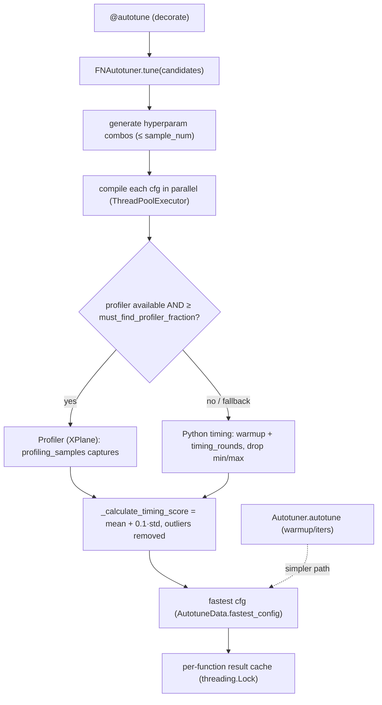

# ejkernel/ops/execution/tuning — the autotuners that time candidate configs and pick the fastest

## Overview
This module is where a kernel's candidate configs actually get *benchmarked*. It provides two autotuners: a simple [`Autotuner`](../catalog/ejkernel/ops/execution/tuning.md#Autotuner.autotune) (warmup + iters, used by the selection chain) and the far more elaborate [`FNAutotuner`](../catalog/ejkernel/ops/execution/tuning.md#FNAutotuner.tune) (the engine behind the `autotune` decorator) that compiles configs in parallel, times them with the JAX XPlane profiler (falling back to Python timing), removes outliers, and ranks by a composite score. The central design idea: accurate kernel timing on accelerators is *hard* (compilation, warmup, profiler flakiness, device layout), so the autotuner is built defensively — profiler-first with a Python fallback, outlier removal, warmup rounds, and a "must find profiler fraction" gate that rejects untrustworthy profiler runs.

## Diagram

## Design rationale (why it's built this way)
- **Profiler-first, Python-fallback timing.** [`FNAutotuner`](../catalog/ejkernel/ops/execution/tuning.md#FNAutotuner.tune) times with the JAX XPlane [`profiler`](../catalog/ejkernel/ops/execution/tuning.md#FNAutotuner.profiler) when available and falls back to `time.perf_counter` when not — governed by [`allow_fallback_timing`](../catalog/ejkernel/ops/execution/tuning.md#FNAutotuner.allow_fallback_timing). The profiler gives device-accurate op times; the fallback keeps tuning working where profiling is unavailable. [`must_find_profiler_fraction`](../catalog/ejkernel/ops/execution/tuning.md#FNAutotuner.must_find_profiler_fraction) (default 0.5) rejects profiler output if too few compiled configs show up in it — a trust gate against partial/garbled captures.
- **Composite score, not raw mean.** [`_calculate_timing_score`](../catalog/ejkernel/ops/execution/tuning.md#FNAutotuner._calculate_timing_score) ranks configs by `mean + 0.1 × std` — penalizing high-variance configs slightly so a config that is *usually* fast but occasionally slow doesn't beat a steady one. Outliers are removed first ([`profiling_samples`](../catalog/ejkernel/ops/execution/tuning.md#FNAutotuner.profiling_samples) captures aggregated).
- **Parallel compilation, careful warmup.** Configs are compiled concurrently in a `ThreadPoolExecutor` to hide compile latency; timing then uses warmup iterations ([`calls_per_round`](../catalog/ejkernel/ops/execution/tuning.md#FNAutotuner.calls_per_round), `timing_rounds` with min/max discarded) via [`_execute_and_block`](../catalog/ejkernel/ops/execution/tuning.md#FNAutotuner._execute_and_block) so device queues drain before measurement. `_block_all`-style blocking ensures async dispatch doesn't corrupt timings.
- **Optional device-layout discovery.** [`find_optimal_layouts_automatically`](../catalog/ejkernel/ops/execution/tuning.md#FNAutotuner.find_optimal_layouts_automatically) queries `compiled.input_formats` to place inputs in the device-preferred memory layout before timing — so a config isn't penalized for a suboptimal input layout that the real deployment wouldn't use.
- **Thread-safe per-function cache.** [`decorate`](../catalog/ejkernel/ops/execution/tuning.md#FNAutotuner.decorate)'s per-decorated-function result cache is guarded by a `threading.Lock` with a [`cache_size_limit`](../catalog/ejkernel/ops/execution/tuning.md#FNAutotuner.cache_size_limit) LRU bound; the `FNAutotuner` itself is stateless between [`tune`](../catalog/ejkernel/ops/execution/tuning.md#FNAutotuner.tune) calls and shareable across threads.

## Entry points
- `autotune` — the decorator wrapping a function so its config is tuned on first call and cached; backed by [`FNAutotuner`](../catalog/ejkernel/ops/execution/tuning.md#FNAutotuner.tune).
- [`FNAutotuner.tune`](../catalog/ejkernel/ops/execution/tuning.md#FNAutotuner.tune) / [`FNAutotuner.decorate`](../catalog/ejkernel/ops/execution/tuning.md#FNAutotuner.decorate) — the full pipeline (generate → compile → time → score → cache) and the decorator wiring around it.
- [`Autotuner.autotune`](../catalog/ejkernel/ops/execution/tuning.md#Autotuner.autotune) — the simpler warmup/iters benchmarker the [ConfigSelectorChain](ejkernel-ops-config-selection.md) uses; returns [`AutotuneData`](../catalog/ejkernel/ops/execution/tuning.md#AutotuneData) whose `fastest_config` is the winner.
- [`benchmark`](../catalog/ejkernel/ops/execution/tuning.md#benchmark) — a standalone `warmup`/`iters` timing helper; [`autotune_recorded`](../catalog/ejkernel/ops/execution/tuning.md#autotune_recorded) records results into an [`AutotuningResult`](../catalog/ejkernel/ops/execution/tuning.md#AutotuningResult) overlay.

## Mechanism (step-by-step)
1. **Enumerate + compile candidates.** [`FNAutotuner.tune`](../catalog/ejkernel/ops/execution/tuning.md#FNAutotuner.tune) generates hyperparameter combinations and compiles each (parallel `ThreadPoolExecutor`), tolerating per-config compile failures via [`_try_call`](../catalog/ejkernel/ops/execution/tuning.md#FNAutotuner._try_call).
2. **Time, profiler-first.** Each compiled config is timed with the XPlane [`profiler`](../catalog/ejkernel/ops/execution/tuning.md#FNAutotuner.profiler) ([`profiling_samples`](../catalog/ejkernel/ops/execution/tuning.md#FNAutotuner.profiling_samples) captures); if the profiler covered fewer than [`must_find_profiler_fraction`](../catalog/ejkernel/ops/execution/tuning.md#FNAutotuner.must_find_profiler_fraction) of configs, it falls back to Python timing ([`_time_fn`](../catalog/ejkernel/ops/execution/tuning.md#FNAutotuner._time_fn)/[`_timing_closure`](../catalog/ejkernel/ops/execution/tuning.md#FNAutotuner._timing_closure) with [`warmup`](../catalog/ejkernel/ops/execution/tuning.md#Autotuner.warmup)/[`iters`](../catalog/ejkernel/ops/execution/tuning.md#Autotuner.iters) rounds).
3. **Score + rank.** Outliers are dropped and configs ranked by [`_calculate_timing_score`](../catalog/ejkernel/ops/execution/tuning.md#FNAutotuner._calculate_timing_score) (`mean + 0.1·std`); the fastest is selected.
4. **Cache the winner.** [`FNAutotuner.decorate`](../catalog/ejkernel/ops/execution/tuning.md#FNAutotuner.decorate) stores the result in a lock-guarded per-function cache keyed by input signature (via [`_try_hash_input`](../catalog/ejkernel/ops/execution/tuning.md#_try_hash_input)), so subsequent calls skip tuning. The simpler [`Autotuner.autotune`](../catalog/ejkernel/ops/execution/tuning.md#Autotuner.autotune) returns an [`AutotuneData`](../catalog/ejkernel/ops/execution/tuning.md#AutotuneData) for the selection chain to consume.

## Key data structures
- [`AutotuneData`](../catalog/ejkernel/ops/execution/tuning.md#AutotuneData) — all measurements from a tuning run; `fastest_config` yields the winner.
- [`TimingResult`](../catalog/ejkernel/ops/execution/tuning.md#TimingResult) (+ [`hyperparams`](../catalog/ejkernel/ops/execution/tuning.md#TimingResult.hyperparams)) / [`Measurement`](../catalog/ejkernel/ops/execution/tuning.md#Measurement) / [`Entry`](../catalog/ejkernel/ops/execution/tuning.md#Entry) — per-config timing records.
- [`AutotuningResult`](../catalog/ejkernel/ops/execution/tuning.md#AutotuningResult) — a recorded result usable as a context overlay (`as_overlay`).
- [`FNAutotuner`](../catalog/ejkernel/ops/execution/tuning.md#FNAutotuner.tune) tuning knobs: [`profiling_samples`](../catalog/ejkernel/ops/execution/tuning.md#FNAutotuner.profiling_samples), [`must_find_profiler_fraction`](../catalog/ejkernel/ops/execution/tuning.md#FNAutotuner.must_find_profiler_fraction), [`calls_per_round`](../catalog/ejkernel/ops/execution/tuning.md#FNAutotuner.calls_per_round), [`cache_size_limit`](../catalog/ejkernel/ops/execution/tuning.md#FNAutotuner.cache_size_limit), [`max_compilation_time_seconds`](../catalog/ejkernel/ops/execution/tuning.md#FNAutotuner.max_compilation_time_seconds).

## Dynamics (design intent)
> [!inferred] The defensive timing design (profiler trust gate + Python fallback + outlier removal + variance-penalizing score) reflects that accelerator microbenchmarks are noisy and profiler captures are occasionally partial — a naive "min of N runs" would frequently pick a config that got a lucky measurement. The composite score and fraction gate trade a little tuning time for a config that is reliably fast in production.

## Edge cases
- **Profiler covers < `must_find_profiler_fraction`** → the run is distrusted and Python timing is used instead (or, if `allow_fallback_timing` is off, tuning may fail).
- **`max_compilation_time_seconds`** is "accepted but not enforced" (per docstring) — a pathologically slow-compiling config isn't actually timed out.
- **`cache_size_limit` eviction** means a long-lived process tuning many signatures can evict and re-tune older ones.

## Open questions
> [!inferred] The `Profiler` (XPlane) implementation and the exact hyperparameter-combination generation live in sibling modules; this page documents the autotuning pipeline and its timing discipline.

## See also
- [ejkernel/ops/config/selection](ejkernel-ops-config-selection.md) — the chain that invokes `Autotuner.autotune` on a cache miss.
- [ejkernel/ops/execution/executor](ejkernel-ops-execution-executor.md) — the engine whose policy gates whether tuning runs.
- [ejkernel/ops/core/kernel](ejkernel-ops-core-kernel.md) — supplies the `candidate_cfgs` being tuned.

## Sources
- raw/code/ejkernel/ejkernel/ops/execution/tuning.py
