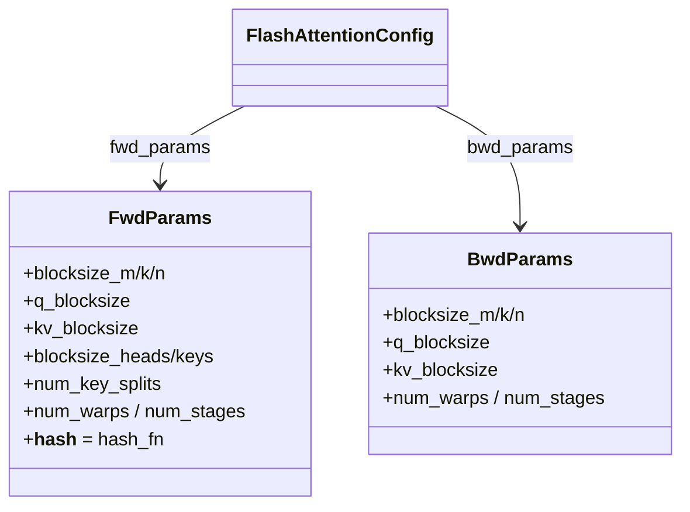

# ejkernel/ops/utils/datacarrier — FwdParams/BwdParams, the tiling knobs autotuning searches over

## Overview
This tiny module holds [`FwdParams`](../catalog/ejkernel/ops/utils/datacarrier.md#FwdParams) and [`BwdParams`](../catalog/ejkernel/ops/utils/datacarrier.md#BwdParams): the dataclasses that carry *block-size tiling parameters* for the forward and backward passes of a kernel. Every field is optional (`None`) — meaning "let the kernel or autotuner choose" — so these objects are simultaneously the manual-override surface and the autotuning search space. They are what a [`FlashAttentionConfig`](../catalog/ejkernel/modules/operations/configs.md#FlashAttentionConfig.fwd_params) carries as `fwd_params`/`bwd_params`, and their values (`q_blocksize`, [`kv_blocksize`](../catalog/ejkernel/ops/utils/datacarrier.md#FwdParams.kv_blocksize), `blocksize_m/k/n`, `num_warps`, `num_stages`) are precisely the TPU/GPU tiling dials that determine a kernel's memory footprint and throughput.

## Diagram

## Design rationale (why it's built this way)
- **All-optional so the same struct is both override and search space.** Every field on [`FwdParams`](../catalog/ejkernel/ops/utils/datacarrier.md#FwdParams)/[`BwdParams`](../catalog/ejkernel/ops/utils/datacarrier.md#BwdParams) defaults to `None`; the docstring: "All parameters are optional (None) to allow automatic selection during kernel execution or autotuning." A user can pin `kv_blocksize=1024` and leave the rest `None`, and the autotuner fills the unset ones — one type serves manual tuning and search.
- **Separate forward and backward tiling.** [`BwdParams`](../catalog/ejkernel/ops/utils/datacarrier.md#BwdParams) exists distinct from [`FwdParams`](../catalog/ejkernel/ops/utils/datacarrier.md#FwdParams) because, per its docstring, backward "parameters are typically smaller than forward pass due to different memory access patterns in gradient computation." The optimal tile for the forward attention isn't the optimal tile for the `dq`/`dkv` backward — so they're tuned independently, which is exactly why the [ConfigSelectorChain](ejkernel-ops-config-selection.md)'s `validate_backward` option matters.
- **Hashable for caching.** Both carry `__hash__ = hash_fn` (from this module's [`hash_fn`](../catalog/ejkernel/ops/utils/datacarrier.md#hash_fn)/[`get_safe_hash_int`](../catalog/ejkernel/ops/utils/datacarrier.md#get_safe_hash_int) helpers) — so a config containing them hashes stably as a cache key.
- **GPU + attention dials in one place.** The fields span both matmul tiling (`blocksize_m/k/n`) and attention tiling (`q_blocksize`, [`kv_blocksize`](../catalog/ejkernel/ops/utils/datacarrier.md#FwdParams.kv_blocksize), `blocksize_heads/keys`, `num_key_splits`) plus GPU execution knobs (`num_warps`, `num_stages`) — a single carrier reused across matmul and attention kernels rather than a per-kernel param type.

## Entry points
- [`FwdParams`](../catalog/ejkernel/ops/utils/datacarrier.md#FwdParams) — forward-pass tiling; set on a config's `fwd_params`, consumed by the kernel's forward and enumerated by `candidate_cfgs` for tuning. [`kv_blocksize`](../catalog/ejkernel/ops/utils/datacarrier.md#FwdParams.kv_blocksize) is the key attention dial.
- [`BwdParams`](../catalog/ejkernel/ops/utils/datacarrier.md#BwdParams) — backward-pass tiling; set on `bwd_params`, tuned separately (its [`kv_blocksize`](../catalog/ejkernel/ops/utils/datacarrier.md#BwdParams.kv_blocksize) often smaller than the forward's).
- [`hash_fn`](../catalog/ejkernel/ops/utils/datacarrier.md#hash_fn) / [`get_safe_hash_int`](../catalog/ejkernel/ops/utils/datacarrier.md#get_safe_hash_int) — the stable-hash helpers these (and the operation configs) use as `__hash__`.

## Mechanism (step-by-step)
1. **A config carries fwd/bwd params.** An attention config ([`FlashAttentionConfig`](../catalog/ejkernel/modules/operations/configs.md#FlashAttentionConfig.fwd_params)) holds a [`FwdParams`](../catalog/ejkernel/ops/utils/datacarrier.md#FwdParams) and optional [`BwdParams`](../catalog/ejkernel/ops/utils/datacarrier.md#BwdParams); `None` fields mean "unspecified."
2. **The kernel reads the tiling.** The Pallas/Triton kernel reads `q_blocksize`/[`kv_blocksize`](../catalog/ejkernel/ops/utils/datacarrier.md#FwdParams.kv_blocksize)/etc. to size its block loops; unspecified fields fall to kernel defaults.
3. **The autotuner searches over them.** A kernel's `candidate_cfgs` enumerates configs differing in these [`FwdParams`](../catalog/ejkernel/ops/utils/datacarrier.md#FwdParams) fields; the tuner benchmarks each and the fastest's params are cached.
4. **Backward tuned independently.** With `validate_backward`, [`BwdParams`](../catalog/ejkernel/ops/utils/datacarrier.md#BwdParams) tiling is included in the timing so the chosen tiles are good for the whole training step, not just the forward.

## Key data structures
- [`FwdParams`](../catalog/ejkernel/ops/utils/datacarrier.md#FwdParams) — `{blocksize_m/k/n, q_blocksize, `[`kv_blocksize`](../catalog/ejkernel/ops/utils/datacarrier.md#FwdParams.kv_blocksize)`, blocksize_heads/keys, num_key_splits, num_warps, num_stages}`.
- [`BwdParams`](../catalog/ejkernel/ops/utils/datacarrier.md#BwdParams) — the backward subset (no `blocksize_heads/keys/num_key_splits`).

## Dynamics (design intent)
> [!inferred] These params are the concrete lever the whole autotuning apparatus exists to turn: the executor, selector chain, and tuner are all machinery for finding good values of `q_blocksize`/`kv_blocksize` (and matmul `blocksize_*`) per operation signature. On TPU the block sizes govern VMEM pressure and MXU utilization, which is why a wrong tile can be an order of magnitude slower — and why tuning them is worth the infrastructure.

## Edge cases
- **All `None`** means the kernel uses its own defaults — a config with empty params is valid and defers entirely to the kernel/autotuner.
- **Forward params reused for backward** would ignore the different memory pattern — the separate [`BwdParams`](../catalog/ejkernel/ops/utils/datacarrier.md#BwdParams) exists precisely so they can diverge.
- **GPU-only fields** (`num_warps`, `num_stages`) are meaningless on TPU/Pallas and left `None` there.

## Open questions
> [!inferred] The valid ranges/legal combinations of block sizes per kernel are enforced inside each kernel, not in this carrier; an illegal tile is caught (or silently mis-sized) by the kernel, not by these dataclasses.

## See also
- [ejkernel/modules/operations/configs](ejkernel-modules-operations-configs.md) — the configs carrying these params.
- [ejkernel/ops/config/selection](ejkernel-ops-config-selection.md) — the chain that autotunes over them (incl. `validate_backward`).
- [ejkernel/kernels/_pallas/tpu/flash_attention/_utils](ejkernel-kernels-_pallas-tpu-flash_attention-_utils.md) — a kernel that consumes block sizes.

## Sources
- raw/code/ejkernel/ejkernel/ops/utils/datacarrier.py
