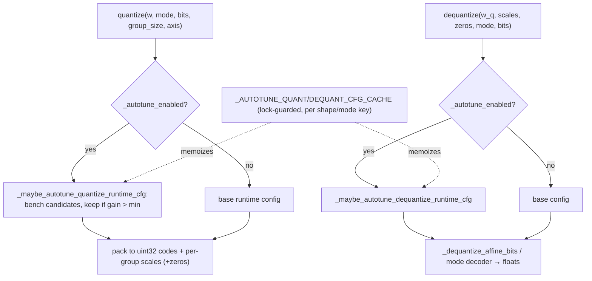

# ejkernel/quantization/_quants/quantizations — quantize/dequantize with runtime config autotuning

<!-- connect:up:begin -->
> **Cross-repo concept:** part of [autotuning](../../../concepts/autotuning.md) across this wiki's repos.
<!-- connect:up:end -->
## Overview
This module provides the public [`quantize`](../catalog/ejkernel/quantization/_quants/quantizations.md#quantize) (weights → packed uint32 codes + per-group scales) and [`dequantize`](../catalog/ejkernel/quantization/_quants/quantizations.md#dequantize) (codes + scales → floats) entry points, for all the quantization modes. The distinctive feature is a *runtime autotuner for the quant/dequant operations themselves*: [`_maybe_autotune_quantize_runtime_cfg`](../catalog/ejkernel/quantization/_quants/quantizations.md#_maybe_autotune_quantize_runtime_cfg) / [`_maybe_autotune_dequantize_runtime_cfg`](../catalog/ejkernel/quantization/_quants/quantizations.md#_maybe_autotune_dequantize_runtime_cfg) benchmark candidate `QuantRuntimeConfig`s for a given shape/mode and cache the fastest — a lightweight, lock-guarded, per-shape autotuning cache separate from the main ops-layer tuner. The idea: quantizing/dequantizing a large weight isn't free, and the optimal blocking depends on shape, so it's worth tuning — but cheaply and inline, gated by a minimum-gain threshold so tuning only sticks if it actually helps.

## Diagram

## Design rationale (why it's built this way)
- **Quant/dequant are ops worth tuning too.** Packing a big weight into sub-byte codes and unpacking it are non-trivial memory-bound kernels whose optimal blocking varies by shape. [`_maybe_autotune_quantize_runtime_cfg`](../catalog/ejkernel/quantization/_quants/quantizations.md#_maybe_autotune_quantize_runtime_cfg)/[`_maybe_autotune_dequantize_runtime_cfg`](../catalog/ejkernel/quantization/_quants/quantizations.md#_maybe_autotune_dequantize_runtime_cfg) benchmark candidate `QuantRuntimeConfig`s ([`_bench_ms`](../catalog/ejkernel/quantization/_quants/quantizations.md#_bench_ms) times them) and pick the fastest — a self-contained autotuner for this specific op family.
- **Gated by a minimum-gain threshold.** [`_autotune_min_gain`](../catalog/ejkernel/quantization/_quants/quantizations.md#_autotune_min_gain) sets a floor: a tuned config only replaces the base if it's faster by more than the threshold. This avoids caching a config whose "win" is within measurement noise — a discipline that keeps the runtime tuner from chasing spurious improvements.
- **Per-shape/mode cache, lock-guarded.** [`_AUTOTUNE_QUANT_CFG_CACHE`](../catalog/ejkernel/quantization/_quants/quantizations.md#_AUTOTUNE_QUANT_CFG_CACHE._AUTOTUNE_QUANT_CFG_CACHE)/[`_AUTOTUNE_DEQUANT_CFG_CACHE`](../catalog/ejkernel/quantization/_quants/quantizations.md#_AUTOTUNE_DEQUANT_CFG_CACHE._AUTOTUNE_DEQUANT_CFG_CACHE) (under [`_AUTOTUNE_CACHE_LOCK`](../catalog/ejkernel/quantization/_quants/quantizations.md#_AUTOTUNE_CACHE_LOCK)) key on a shape/mode signature ([`_quant_autotune_key`](../catalog/ejkernel/quantization/_quants/quantizations.md#_quant_autotune_key)/[`_dequant_autotune_key`](../catalog/ejkernel/quantization/_quants/quantizations.md#_dequant_autotune_key)) so tuning is amortized across all weights of the same shape and thread-safe for concurrent serving.
- **Never autotune under trace.** `_is_tracing_tree`/[`_block_tree`](../catalog/ejkernel/quantization/_quants/quantizations.md) guard against running the timing benchmark on traced (abstract) values — autotuning requires concrete arrays to time, so it's skipped inside `jit` tracing.
- **Enable/disable + introspection.** [`_autotune_enabled`](../catalog/ejkernel/quantization/_quants/quantizations.md#_autotune_enabled) (env-gated), `clear_runtime_autotune_cache`, and `runtime_autotune_cache_sizes` give operational control — a deployment can disable the runtime tuner or inspect/clear its caches.

## Entry points
- [`quantize`](../catalog/ejkernel/quantization/_quants/quantizations.md#quantize) — weights → `(packed uint32 codes, scales[, zeros])` with per-group scaling; optionally autotuned.
- [`dequantize`](../catalog/ejkernel/quantization/_quants/quantizations.md#dequantize) — packed codes + scales → floats; optionally autotuned.
- [`_maybe_autotune_quantize_runtime_cfg`](../catalog/ejkernel/quantization/_quants/quantizations.md#_maybe_autotune_quantize_runtime_cfg) / [`_maybe_autotune_dequantize_runtime_cfg`](../catalog/ejkernel/quantization/_quants/quantizations.md#_maybe_autotune_dequantize_runtime_cfg) — the inline runtime-config tuners.
- `clear_runtime_autotune_cache` / `runtime_autotune_cache_sizes` — cache management for the [`quantize`](../catalog/ejkernel/quantization/_quants/quantizations.md#quantize)/[`dequantize`](../catalog/ejkernel/quantization/_quants/quantizations.md#dequantize) runtime tuner.

## Mechanism (step-by-step)
1. **Resolve config (autotune or base).** [`quantize`](../catalog/ejkernel/quantization/_quants/quantizations.md#quantize) uses the caller's `runtime_config` if given, else — when [`_autotune_enabled`](../catalog/ejkernel/quantization/_quants/quantizations.md#_autotune_enabled) and not tracing — calls [`_maybe_autotune_quantize_runtime_cfg`](../catalog/ejkernel/quantization/_quants/quantizations.md#_maybe_autotune_quantize_runtime_cfg), which checks the per-shape cache and, on a miss, benchmarks [`_dequantize_candidate_cfgs`](../catalog/ejkernel/quantization/_quants/quantizations.md#_dequantize_candidate_cfgs)-style candidates ([`_dedupe_cfgs`](../catalog/ejkernel/quantization/_quants/quantizations.md#_dedupe_cfgs)'d) via [`_bench_ms`](../catalog/ejkernel/quantization/_quants/quantizations.md#_bench_ms), keeping the winner only if it beats the base by [`_autotune_min_gain`](../catalog/ejkernel/quantization/_quants/quantizations.md#_autotune_min_gain).
2. **Pack the weight.** With the config, [`quantize`](../catalog/ejkernel/quantization/_quants/quantizations.md#quantize) packs the weight into uint32 codes and per-group scales (and zeros for asymmetric affine), per the mode/bits/group_size/axis.
3. **Dequant is symmetric.** [`dequantize`](../catalog/ejkernel/quantization/_quants/quantizations.md#dequantize) resolves its config similarly and unpacks via the mode decoder ([`_dequantize_affine_bits`](../catalog/ejkernel/quantization/_quants/quantizations.md#_dequantize_affine_bits) for affine).
4. **Cache the tuned config.** [`_maybe_autotune_quantize_runtime_cfg`](../catalog/ejkernel/quantization/_quants/quantizations.md#_maybe_autotune_quantize_runtime_cfg) stores the winning config under the shape/mode key so future calls of the same shape skip benchmarking.

## Key data structures
- [`_AUTOTUNE_QUANT_CFG_CACHE`](../catalog/ejkernel/quantization/_quants/quantizations.md#_AUTOTUNE_QUANT_CFG_CACHE._AUTOTUNE_QUANT_CFG_CACHE) / [`_AUTOTUNE_DEQUANT_CFG_CACHE`](../catalog/ejkernel/quantization/_quants/quantizations.md#_AUTOTUNE_DEQUANT_CFG_CACHE._AUTOTUNE_DEQUANT_CFG_CACHE) — per-shape/mode config caches (lock: [`_AUTOTUNE_CACHE_LOCK`](../catalog/ejkernel/quantization/_quants/quantizations.md#_AUTOTUNE_CACHE_LOCK)).
- `QuantRuntimeConfig` — the tunable quant/dequant runtime config (blocking parameters).
- Keys: [`_quant_autotune_key`](../catalog/ejkernel/quantization/_quants/quantizations.md#_quant_autotune_key) / [`_dequant_autotune_key`](../catalog/ejkernel/quantization/_quants/quantizations.md#_dequant_autotune_key).

## Dynamics (design intent)
> [!inferred] This is a second, lighter autotuning layer specific to the quant/dequant primitives — distinct from the main ops-layer tuner — because these operations run outside the Kernel/executor pipeline (they're plain functions) but still benefit from shape-specific tuning. The min-gain gate and per-shape cache make it cheap enough to run inline on first use, which matters because quantizing a model's weights happens at load and dequant happens per-matmul on the packed path.

## Edge cases
- **Under jit tracing** autotuning is skipped (can't time abstract values) — the base config is used, so a jitted call won't tune.
- **Gain below threshold** keeps the base config — a marginal tuning result is discarded to avoid noise-chasing.
- **Cache staleness** — `clear_runtime_autotune_cache` exists because a cached config could become suboptimal if conditions change; there's no automatic invalidation.

## Open questions
> [!inferred] The concrete `QuantRuntimeConfig` fields and the candidate-generation for each mode aren't detailed here; the actual packed-matmul consumption of these codes is in [quantized_matmul/_pallas_impl_core](ejkernel-kernels-_pallas-tpu-quantized_matmul-_pallas_impl_core.md).

## See also
- [ejkernel/quantization/_utils/qparams](ejkernel-quantization-_utils-qparams.md) — the mode/bits/group validation used here.
- [ejkernel/quantization/quantized_array](ejkernel-quantization-quantized_array.md) — the array wrapper holding quantized codes+scales.
- [ejkernel/kernels/_pallas/tpu/quantized_matmul/_pallas_impl_core](ejkernel-kernels-_pallas-tpu-quantized_matmul-_pallas_impl_core.md) — the kernel that consumes packed codes.

## Sources
- raw/code/ejkernel/ejkernel/quantization/_quants/quantizations.py
