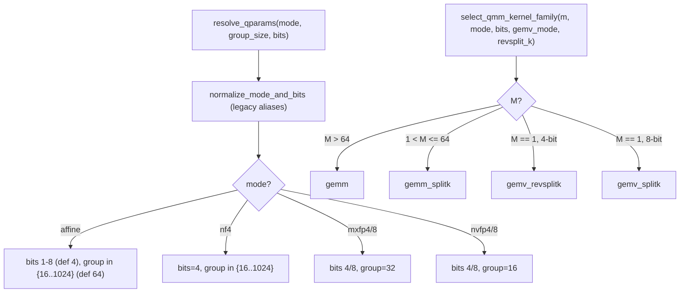

# ejkernel/quantization/_utils/qparams — quantization param validation + kernel-family selection policy

## Overview
Two decisions govern every quantized matmul: *what* quantization (mode, bit-width, group size) and *which kernel shape* (GEMM vs GEMV, plain vs split-K) — and this module owns both. [`resolve_qparams`](../catalog/ejkernel/quantization/_utils/qparams.md#resolve_qparams) validates and defaults the quantization parameters against per-mode rules (affine 1–8 bit, NF4 fixed 4-bit, MXFP4/8 group-32, NVFP4/8 group-16), and [`select_qmm_kernel_family`](../catalog/ejkernel/quantization/_utils/qparams.md#select_qmm_kernel_family) implements a "GemLite-style" policy that picks the [`KernelFamily`](../catalog/ejkernel/quantization/_utils/qparams.md#KernelFamily) (`gemm`/`gemm_splitk`/`gemv_splitk`/`gemv_revsplitk`) from the activation batch size `M` and the effective bit-width. The key idea: the right quantized kernel depends heavily on whether you're doing a single-token decode (`M=1`, a matrix-*vector* product) or a batched prefill/train (`M>64`, a matrix-*matrix* product), and this policy encodes that mapping.

## Diagram

## Design rationale (why it's built this way)
- **Per-mode parameter rules, enforced centrally.** [`resolve_qparams`](../catalog/ejkernel/quantization/_utils/qparams.md#resolve_qparams) encodes each mode's constraints: affine allows bits 1–8 and group sizes in [`AFFINE_NF4_GROUP_SIZES`](../catalog/ejkernel/quantization/_utils/qparams.md#AFFINE_NF4_GROUP_SIZES) `{16..1024}`; NF4 fixes bits to 4; the MX/NV float formats *require* a specific group size (32 for MX, 16 for NV) because those formats define scales per fixed-size block. Centralizing this means every caller (the module op, the kernels) gets the same validation and a clear `ValueError` on an illegal combo, rather than a downstream kernel miscompiling.
- **Kernel family chosen from batch size — the GEMV/GEMM split.** [`select_qmm_kernel_family`](../catalog/ejkernel/quantization/_utils/qparams.md#select_qmm_kernel_family)'s policy: `M>64` → `gemm`; `1<M≤64` → `gemm_splitk`; `M==1` 4-bit → `gemv_revsplitk`; `M==1` 8-bit → `gemv_splitk`. A single-token decode (`M=1`) is memory-bound on the weight read, so a GEMV kernel with reverse/split-K reduction is optimal; a batched matmul is compute-bound and wants a standard GEMM. Encoding this as a policy (not per-call guesswork) is what makes decode-vs-prefill fast automatically.
- **Split-K for moderate batch, revsplit-K for 4-bit GEMV.** Split-K partitions the contraction dimension across parallel accumulators to expose more parallelism when M is small; reverse split-K is a variant tuned for the 4-bit GEMV case. The policy picks the reduction strategy jointly with the kernel shape.
- **`gemv_mode`/`revsplit_k` overrides with validation.** Users can force `gemv_mode="on"` — but only if `M==1` (else `ValueError`) — and `revsplit_k="on"` only for 4-bit modes. The policy respects overrides but validates them, so a nonsensical override fails loudly.
- **Effective-bit awareness.** [`is_effective_4bit_mode`](../catalog/ejkernel/quantization/_utils/qparams.md#is_effective_4bit_mode) normalizes the notion of "4-bit" across the affine/NF4/MXFP4/NVFP4 formats, so the policy's 4-bit branch fires for all of them.

## Entry points
- [`resolve_qparams`](../catalog/ejkernel/quantization/_utils/qparams.md#resolve_qparams) — validate/default `(mode, group_size, bits)` → `(mode, group_size, bits, used_legacy_alias)`; the quantized-matmul op calls this first.
- [`select_qmm_kernel_family`](../catalog/ejkernel/quantization/_utils/qparams.md#select_qmm_kernel_family) — pick `(KernelFamily, revsplitk_parts)` from `M`/mode/bits and the gemv/revsplit overrides.
- [`QuantizationMode`](../catalog/ejkernel/quantization/_utils/qparams.md#QuantizationMode) / [`QuantizationAxis`](../catalog/ejkernel/quantization/_utils/qparams.md#QuantizationAxis) — the mode/axis enums; [`normalize_axis`](../catalog/ejkernel/quantization/_utils/qparams.md#normalize_axis) canonicalizes the quantization axis.
- [`GemvMode`](../catalog/ejkernel/quantization/_utils/qparams.md#GemvMode) / [`RevSplitKMode`](../catalog/ejkernel/quantization/_utils/qparams.md#RevSplitKMode) / [`KernelFamily`](../catalog/ejkernel/quantization/_utils/qparams.md#KernelFamily) — the override/selection type vocabulary.

## Mechanism (step-by-step)
1. **Normalize + validate params.** [`resolve_qparams`](../catalog/ejkernel/quantization/_utils/qparams.md#resolve_qparams) runs `normalize_mode_and_bits` (resolving legacy aliases), then applies the per-mode bit/group rules, raising on violations, returning the canonical tuple.
2. **Infer the kernel family.** [`select_qmm_kernel_family`](../catalog/ejkernel/quantization/_utils/qparams.md#select_qmm_kernel_family) reads `M` and the effective bit-width ([`is_effective_4bit_mode`](../catalog/ejkernel/quantization/_utils/qparams.md#is_effective_4bit_mode)) and applies the branch policy, honoring [`normalize_gemv_mode`](../catalog/ejkernel/quantization/_utils/qparams.md#normalize_gemv_mode)'d overrides.
3. **Return reduction partitioning.** For split-K/revsplit-K families [`select_qmm_kernel_family`](../catalog/ejkernel/quantization/_utils/qparams.md#select_qmm_kernel_family) returns the number of partitions (`revsplitk_parts`), which the kernel uses to size its parallel accumulators.
4. **Op dispatches accordingly.** The quantized-matmul op uses [`resolve_qparams`](../catalog/ejkernel/quantization/_utils/qparams.md#resolve_qparams)' `(mode, bits, group_size)` and `(KernelFamily, parts)` to pick the concrete kernel and its config.

## Key data structures
- [`QuantizationMode`](../catalog/ejkernel/quantization/_utils/qparams.md#QuantizationMode) (affine/nf4/mxfp4/mxfp8/nvfp4/nvfp8) / [`QuantizationAxis`](../catalog/ejkernel/quantization/_utils/qparams.md#QuantizationAxis) / [`BackendQuantizationMode`](../catalog/ejkernel/quantization/_utils/qparams.md#BackendQuantizationMode).
- [`KernelFamily`](../catalog/ejkernel/quantization/_utils/qparams.md#KernelFamily) (`gemm`/`gemm_splitk`/`gemv_splitk`/`gemv_revsplitk`), [`GemvMode`](../catalog/ejkernel/quantization/_utils/qparams.md#GemvMode), [`RevSplitKMode`](../catalog/ejkernel/quantization/_utils/qparams.md#RevSplitKMode).
- [`AFFINE_NF4_GROUP_SIZES`](../catalog/ejkernel/quantization/_utils/qparams.md#AFFINE_NF4_GROUP_SIZES) — the allowed group sizes for affine/NF4.

## Dynamics (design intent)
> [!inferred] This policy is where "quantized matmul is fast for decode" actually happens: the M-based branch automatically routes a batch-1 decode to a memory-optimal GEMV-revsplitK kernel and a batched prefill to a compute-optimal GEMM, so a serving deployment gets the right kernel per phase without the caller reasoning about it. The per-mode group-size rules encode the hard constraints of the MX/NV float formats, preventing an invalid quantization from reaching a kernel.

## Edge cases
- **`gemv_mode="on"` with `M != 1`** → `ValueError` (GEMV is a matrix-vector kernel; M must be 1).
- **`revsplit_k="on"` with non-4-bit mode** → `ValueError` (revsplit-K is a 4-bit-specific strategy).
- **MX/NV mode with wrong group size** → `resolve_qparams` raises (group is fixed by the format).

## Open questions
> [!inferred] The exact split-K partition-count heuristics and how each KernelFamily maps to a concrete TPU/GPU kernel are handled downstream in the op/kernel; this page documents the validation rules and the selection policy.

## See also
- [ejkernel/modules/operations/quantized_matmul](ejkernel-modules-operations-quantized_matmul.md) — the op that calls these to pick a kernel.
- [ejkernel/quantization/_quants/quantizations](ejkernel-quantization-_quants-quantizations.md) — the quantize/dequantize entry points using these modes.
- [ejkernel/kernels/_pallas/tpu/quantized_matmul/_pallas_impl_core](ejkernel-kernels-_pallas-tpu-quantized_matmul-_pallas_impl_core.md) — the TPU kernel formats these describe.

## Sources
- raw/code/ejkernel/ejkernel/quantization/_utils/qparams.py
