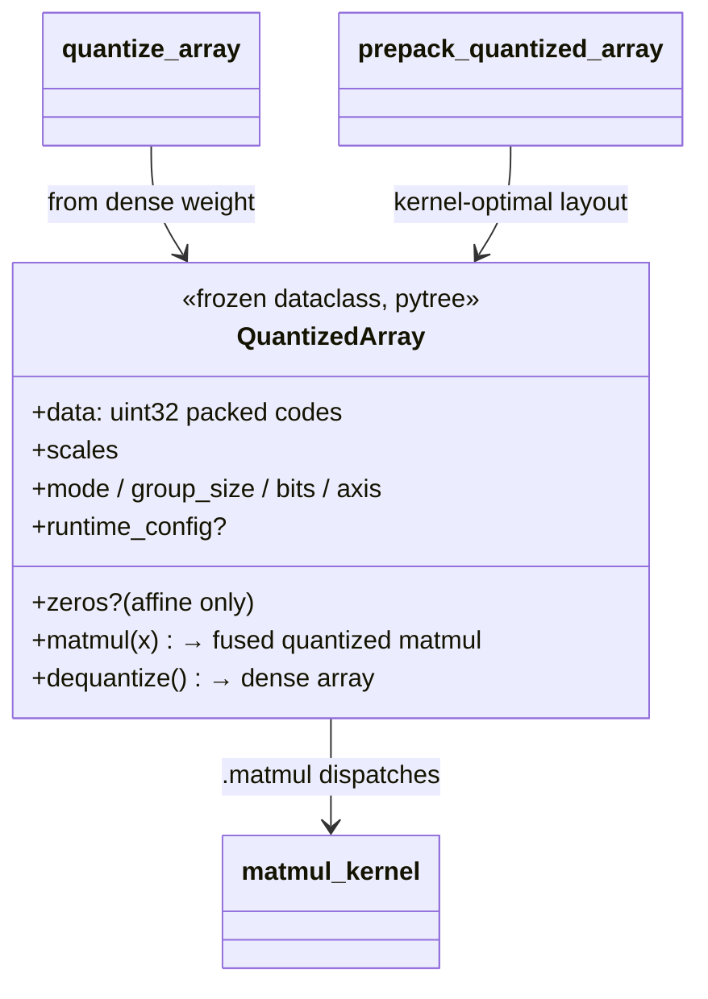

# ejkernel/quantization/quantized_array — QuantizedArray, the pytree container for packed weights

## Overview
`QuantizedArray` is the object a quantized weight *is*: a frozen, JAX-pytree-registered dataclass bundling the bit-packed codes ([`data`](../catalog/ejkernel/quantization/quantized_array.md#QuantizedArray.data), a uint32 array) with everything needed to use them — per-group [`scales`](../catalog/ejkernel/quantization/quantized_array.md#QuantizedArray.scales), optional [`zeros`](../catalog/ejkernel/quantization/quantized_array.md#QuantizedArray.zeros) (zero-points), and the static params ([`mode`](../catalog/ejkernel/quantization/quantized_array.md#QuantizedArray.mode), `group_size`, `bits`, `axis`). The key idea: quantized weights are self-describing values that flow through `jit` like any array (pytree registration) and carry a [`matmul`](../catalog/ejkernel/quantization/quantized_array.md#QuantizedArray.matmul) method, so a model can hold a `QuantizedArray` in place of a dense weight and call `.matmul(x)` to get a fused quantized matmul — the codes never need to be manually unpacked by the caller. [`quantize_array`](../catalog/ejkernel/quantization/quantized_array.md#quantize_array) builds one from a dense weight; [`prepack_quantized_array`](../catalog/ejkernel/quantization/quantized_array.md#prepack_quantized_array) rearranges an existing one into a kernel-optimal layout.

## Diagram

## Design rationale (why it's built this way)
- **Self-describing quantized value.** [`QuantizedArray`](../catalog/ejkernel/quantization/quantized_array.md#QuantizedArray.data) holds not just the codes but *all* metadata "required for runtime use" — [`mode`](../catalog/ejkernel/quantization/quantized_array.md#QuantizedArray.mode)/`group_size`/`bits`/`axis` — so any consumer can dequantize or matmul without out-of-band knowledge. A dense weight replaced by a `QuantizedArray` is a drop-in: the object knows how to reconstitute itself.
- **Pytree-registered + frozen so it survives `jit`.** `@jax.tree_util.register_pytree_node_class` + `@dataclass(frozen=True)` make it a proper JAX value — the array fields ([`data`](../catalog/ejkernel/quantization/quantized_array.md#QuantizedArray.data), [`scales`](../catalog/ejkernel/quantization/quantized_array.md#QuantizedArray.scales), [`zeros`](../catalog/ejkernel/quantization/quantized_array.md#QuantizedArray.zeros)) are pytree leaves while the static params ([`mode`](../catalog/ejkernel/quantization/quantized_array.md#QuantizedArray.mode)/bits/...) are aux data. So it can be a model parameter, passed through `jit`/`grad`, with static params specializing the compiled graph.
- **Shape encodes the packing.** The docstring spells out the layouts: `data` is `(K, ceil(N·bits/32))` for `axis='row'` — the codes packed along the output-channel axis into uint32 words — and [`scales`](../catalog/ejkernel/quantization/quantized_array.md#QuantizedArray.scales) is `(K, N//group_size)`. The scale *dtype* varies by mode: float for affine/NF4, uint8 for MX/NV (shared exponents / E4M3 codes). Encoding this in one type keeps the packing convention in one place.
- **`zeros` is affine-only.** [`zeros`](../catalog/ejkernel/quantization/quantized_array.md#QuantizedArray.zeros) (zero-points) is required for `mode='affine'` (dequant = `(q - zero) * scale`) and must be `None` for all other modes — the type enforces that the asymmetric-affine metadata is present exactly when the mode needs it.
- **`matmul` fuses; `dequantize` materializes.** [`QuantizedArray.matmul`](../catalog/ejkernel/quantization/quantized_array.md#QuantizedArray.matmul) runs the fused quantized matmul (dispatching to the quantized-matmul op/kernel) without densifying, while [`dequantize`](../catalog/ejkernel/quantization/_quants/quantizations.md#dequantize) reconstructs the full dense array when needed — two access modes for the same stored data.

## Entry points
- [`quantize_array`](../catalog/ejkernel/quantization/quantized_array.md#quantize_array) — build a `QuantizedArray` from a dense weight (mode/bits/group_size/axis).
- [`prepack_quantized_array`](../catalog/ejkernel/quantization/quantized_array.md#prepack_quantized_array) — rearrange an existing `QuantizedArray`'s codes into a kernel-optimal packed layout (a one-time prep before repeated matmuls).
- [`QuantizedArray.matmul`](../catalog/ejkernel/quantization/quantized_array.md#QuantizedArray.matmul) — the fused quantized matmul against an activation `x`.
- [`QuantizedArray`](../catalog/ejkernel/quantization/quantized_array.md#QuantizedArray.data) (+ [`data`](../catalog/ejkernel/quantization/quantized_array.md#QuantizedArray.data)/[`scales`](../catalog/ejkernel/quantization/quantized_array.md#QuantizedArray.scales)/[`zeros`](../catalog/ejkernel/quantization/quantized_array.md#QuantizedArray.zeros)/[`mode`](../catalog/ejkernel/quantization/quantized_array.md#QuantizedArray.mode)) — the container the model holds.

## Mechanism (step-by-step)
1. **Quantize a weight into the container.** [`quantize_array`](../catalog/ejkernel/quantization/quantized_array.md#quantize_array) packs a dense weight into uint32 [`data`](../catalog/ejkernel/quantization/quantized_array.md#QuantizedArray.data) + [`scales`](../catalog/ejkernel/quantization/quantized_array.md#QuantizedArray.scales)(+[`zeros`](../catalog/ejkernel/quantization/quantized_array.md#QuantizedArray.zeros)) and wraps it with the static params as a frozen `QuantizedArray`.
2. **Optionally prepack.** [`prepack_quantized_array`](../catalog/ejkernel/quantization/quantized_array.md#prepack_quantized_array) rearranges the codes into the layout the target matmul kernel prefers, done once so repeated matmuls avoid re-layout.
3. **Matmul without densifying.** [`QuantizedArray.matmul`](../catalog/ejkernel/quantization/quantized_array.md#QuantizedArray.matmul)(x) dispatches to the quantized-matmul op with the array's [`mode`](../catalog/ejkernel/quantization/quantized_array.md#QuantizedArray.mode)/bits/group_size, running the fused (packed or predecode) kernel.
4. **Dequantize only if needed.** [`dequantize`](../catalog/ejkernel/quantization/_quants/quantizations.md#dequantize) reconstructs the dense array (e.g. for an op with no quantized kernel).

## Key data structures
- [`QuantizedArray`](../catalog/ejkernel/quantization/quantized_array.md#QuantizedArray.data) — `{`[`data`](../catalog/ejkernel/quantization/quantized_array.md#QuantizedArray.data) (uint32 codes), [`scales`](../catalog/ejkernel/quantization/quantized_array.md#QuantizedArray.scales), [`zeros`](../catalog/ejkernel/quantization/quantized_array.md#QuantizedArray.zeros) (affine-only), [`mode`](../catalog/ejkernel/quantization/quantized_array.md#QuantizedArray.mode), group_size, bits, axis, runtime_config`}` — frozen pytree.

## Dynamics (design intent)
> [!inferred] `QuantizedArray` is the value-level unit that makes quantized models composable in JAX: because it's a pytree with a `matmul`, a model built with `QuantizedArray` weights runs under `jit`/`grad` with the quantized matmul fused in, and the weight carries its own dequant recipe. It's ejkernel's data-side complement to EasyDeL's `ParallelLinearQuantized` — the same "quantized weight is a first-class array" idea.

## Edge cases
- **`zeros` present for a non-affine mode** (or absent for affine) violates the type's invariant — dequant would be wrong; the mode dictates whether zeros must exist.
- **Layout mismatch** — calling [`matmul`](../catalog/ejkernel/quantization/quantized_array.md#QuantizedArray.matmul) on a non-prepacked array may force a re-layout each call; [`prepack_quantized_array`](../catalog/ejkernel/quantization/quantized_array.md#prepack_quantized_array) avoids this.
- **MX/NV uint8 scales** aren't float scales — treating them as float misinterprets the shared-exponent encoding.

## Open questions
> [!inferred] The exact bit-packing layout inside `data` and how `matmul` selects packed-vs-predecode are handled in the kernel/op layers; this page documents the container and its role.

## See also
- [ejkernel/quantization/_quants/quantizations](ejkernel-quantization-_quants-quantizations.md) — the quantize/dequantize functions producing/consuming these.
- [ejkernel/quantization/_utils/qparams](ejkernel-quantization-_utils-qparams.md) — the mode/bits/group rules the static params obey.
- [ejkernel/kernels/_pallas/tpu/quantized_matmul/_pallas_impl_core](ejkernel-kernels-_pallas-tpu-quantized_matmul-_pallas_impl_core.md) — the kernel `matmul` dispatches to.

## Sources
- raw/code/ejkernel/ejkernel/quantization/quantized_array.py
