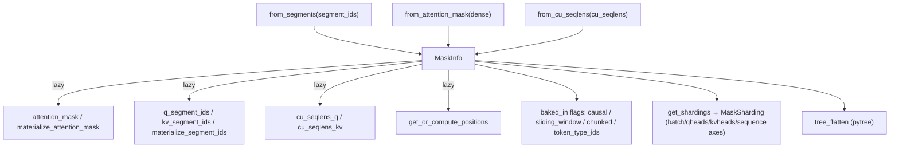

# ejkernel/types/mask — MaskInfo, the lazy multi-representation attention-mask container

## Overview
`MaskInfo` is ejkernel's single attention-mask type, and its whole point is that an attention mask has *several equivalent representations* — a dense boolean `[batch, heads, q, k]` mask, per-token segment IDs (`q_segment_ids`/`kv_segment_ids`), and cumulative sequence lengths (`cu_seqlens_q`/`cu_seqlens_kv`) — and different kernels want different ones. `MaskInfo` stores whichever was provided and *lazily converts* to the others on demand (materializing and caching), so a caller can build it from segment IDs and a kernel that needs the dense mask gets it computed transparently. It also carries "baked-in" flags ([`causal_mask_baked_in`](../catalog/ejkernel/types/mask.md#MaskInfo.causal_mask_baked_in), [`sliding_window_baked_in`](../catalog/ejkernel/types/mask.md#MaskInfo.sliding_window_baked_in), ...) so a kernel knows whether a masking structure is already applied, and sharding axis names so the mask shards consistently with the model. It is a JAX pytree ([`tree_flatten`](../catalog/ejkernel/types/mask.md#MaskInfo.tree_flatten)), so it flows through `jit`.

## Diagram

## Design rationale (why it's built this way)
- **Store one representation, derive the rest lazily.** The underscore-prefixed fields ([`_attention_mask`](../catalog/ejkernel/types/mask.md#MaskInfo._attention_mask), [`_q_segment_ids`](../catalog/ejkernel/types/mask.md#MaskInfo._q_segment_ids), [`_kv_segment_ids`](../catalog/ejkernel/types/mask.md#MaskInfo._kv_segment_ids), [`_cu_seqlens_q`](../catalog/ejkernel/types/mask.md#MaskInfo._cu_seqlens_q), [`_cu_seqlens_kv`](../catalog/ejkernel/types/mask.md#MaskInfo._cu_seqlens_kv)) hold whatever was passed; the public [`attention_mask`](../catalog/ejkernel/types/mask.md#MaskInfo._attention_mask)/[`q_segment_ids`](../catalog/ejkernel/types/mask.md#MaskInfo.q_segment_ids)/[`kv_segment_ids`](../catalog/ejkernel/types/mask.md#MaskInfo.kv_segment_ids) properties compute-on-first-access and cache. This means a variable-length (ragged) batch expressed as `cu_seqlens` and a dense mask are the *same* type — kernels don't each reimplement the conversion.
- **"Baked-in" flags prevent double-masking.** [`causal_mask_baked_in`](../catalog/ejkernel/types/mask.md#MaskInfo.causal_mask_baked_in)/[`sliding_window_baked_in`](../catalog/ejkernel/types/mask.md#MaskInfo.sliding_window_baked_in)/[`chunked_mask_baked_in`](../catalog/ejkernel/types/mask.md#MaskInfo.chunked_mask_baked_in)/[`token_type_ids_baked_in`](../catalog/ejkernel/types/mask.md#MaskInfo.token_type_ids_baked_in) record whether a structure is already applied — the same pattern EasyDeL's attention uses to tell the kernel `causal=False` when the mask already encodes causality, avoiding applying it twice.
- **Sharding axis names travel with the mask.** [`batch_axis_name`](../catalog/ejkernel/types/mask.md#MaskInfo.batch_axis_name) (`("dp","fsdp")`), [`qheads_axis_name`](../catalog/ejkernel/types/mask.md#MaskInfo.qheads_axis_name)/[`kvheads_axis_name`](../catalog/ejkernel/types/mask.md#MaskInfo.kvheads_axis_name) (`"tp"`), [`sequence_axis_name`](../catalog/ejkernel/types/mask.md#MaskInfo.sequence_axis_name) (`"sp"`) default to the standard mesh axes; [`get_shardings`](../catalog/ejkernel/types/mask.md#MaskInfo.get_shardings) turns them into a [`MaskSharding`](../catalog/ejkernel/types/mask.md#MaskSharding) so the mask partitions the same way as Q/K/V under `shard_map`.
- **Pytree so it survives `jit`.** [`tree_flatten`](../catalog/ejkernel/types/mask.md#MaskInfo.tree_flatten) registers `MaskInfo` as a pytree with the array fields as leaves and the flags/axis-names as static aux — so passing it into a jitted kernel is transparent, and changing a `baked_in` flag re-specializes rather than re-traces arrays.
- **Segment IDs use `-1` for padding.** The docstring: segment IDs "where -1 indicates padding" — a single sentinel that lets segment-based attention (packed sequences) and padding be expressed uniformly.

## Entry points
- `MaskInfo.from_segments` / `from_attention_mask` / `from_cu_seqlens` / `from_random` — the constructors, one per source representation (each yields a `MaskInfo` whose other representations materialize lazily via [`materialize_attention_mask`](../catalog/ejkernel/types/mask.md#MaskInfo.materialize_attention_mask)/[`materialize_segment_ids`](../catalog/ejkernel/types/mask.md#MaskInfo.materialize_segment_ids)).
- [`materialize_attention_mask`](../catalog/ejkernel/types/mask.md#MaskInfo.materialize_attention_mask) / [`materialize_segment_ids`](../catalog/ejkernel/types/mask.md#MaskInfo.materialize_segment_ids) — force a representation to exist (computing from another), returning a new `MaskInfo`; used before a kernel that requires that form.
- [`get_or_compute_attention_mask`](../catalog/ejkernel/types/mask.md#MaskInfo.get_or_compute_attention_mask) / [`get_or_compute_segment_ids`](../catalog/ejkernel/types/mask.md#MaskInfo.get_or_compute_segment_ids) / [`get_or_compute_positions`](../catalog/ejkernel/types/mask.md#MaskInfo.get_or_compute_positions) / [`get_or_compute_qkv_cu_seqlens`](../catalog/ejkernel/types/mask.md#MaskInfo.get_or_compute_qkv_cu_seqlens) — the lazy accessors kernels call.
- [`get_shardings`](../catalog/ejkernel/types/mask.md#MaskInfo.get_shardings) — produce the [`MaskSharding`](../catalog/ejkernel/types/mask.md#MaskSharding) partition spec from the axis-name fields.
- [`apply_kv_lengths`](../catalog/ejkernel/types/mask.md#MaskInfo.apply_kv_lengths) / [`apply_sliding_window`](../catalog/ejkernel/types/mask.md#MaskInfo.apply_sliding_window) / [`apply_token_type_ids`](../catalog/ejkernel/types/mask.md#MaskInfo.apply_token_type_ids) — derive a new mask with a structure applied (and the corresponding baked-in flag set).

## Mechanism (step-by-step)
1. **Construct from whatever's available.** A caller builds a `MaskInfo` via `from_segments`/`from_attention_mask`/`from_cu_seqlens`, populating only the matching underscore field; the others stay `None` until [`materialize_attention_mask`](../catalog/ejkernel/types/mask.md#MaskInfo.materialize_attention_mask) computes them.
2. **Kernel requests its preferred representation.** When a kernel needs the dense mask, [`attention_mask`](../catalog/ejkernel/types/mask.md#MaskInfo._attention_mask) (or [`materialize_attention_mask`](../catalog/ejkernel/types/mask.md#MaskInfo.materialize_attention_mask)) computes it from segment IDs on first access and caches; needing segment IDs or positions triggers the analogous `get_or_compute_*`.
3. **Structures applied incrementally.** [`apply_sliding_window`](../catalog/ejkernel/types/mask.md#MaskInfo.apply_sliding_window)/[`apply_kv_lengths`](../catalog/ejkernel/types/mask.md#MaskInfo.apply_kv_lengths)/[`apply_token_type_ids`](../catalog/ejkernel/types/mask.md#MaskInfo.apply_token_type_ids) return a new `MaskInfo` with the structure folded in and the matching `*_baked_in` flag set — so downstream code (and the kernel's `causal`/`sliding_window` args) can avoid re-applying it.
4. **Sharded + traced.** [`get_shardings`](../catalog/ejkernel/types/mask.md#MaskInfo.get_shardings) yields a [`MaskSharding`](../catalog/ejkernel/types/mask.md#MaskSharding) for `shard_map`; [`tree_flatten`](../catalog/ejkernel/types/mask.md#MaskInfo.tree_flatten) lets the whole object pass through `jit` with arrays as leaves.

## Key data structures
- `MaskInfo` — the container: `_attention_mask`/`_q_segment_ids`/`_kv_segment_ids`/`_cu_seqlens_q`/`_cu_seqlens_kv` (source data, lazily cross-computed), `q_positions`/`kv_positions`, the four `*_baked_in` flags, and four `*_axis_name` sharding fields.
- [`MaskSharding`](../catalog/ejkernel/types/mask.md#MaskSharding) (NamedTuple) — the resolved per-field partition spec from [`get_shardings`](../catalog/ejkernel/types/mask.md#MaskInfo.get_shardings).
- Derived queries: [`q_len`](../catalog/ejkernel/types/mask.md#MaskInfo.q_len)/[`kv_len`](../catalog/ejkernel/types/mask.md#MaskInfo.kv_len), [`q_lens`](../catalog/ejkernel/types/mask.md#MaskInfo.q_lens)/[`kv_lens`](../catalog/ejkernel/types/mask.md#MaskInfo.kv_lens), [`is_multi_sequence`](../catalog/ejkernel/types/mask.md#MaskInfo.is_multi_sequence)/[`is_self_attention`](../catalog/ejkernel/types/mask.md#MaskInfo.is_self_attention).

## Dynamics (design intent)
> [!inferred] The lazy-conversion design is what lets one attention interface serve dense-mask, packed-sequence (segment-id), and ragged (cu_seqlens) workloads: the model builds the cheapest representation it has, and each kernel materializes only the form it needs, so no caller pays for a representation no kernel consumes. The `baked_in` flags + kernel `causal`/`sliding_window` args together prevent the classic double-masking bug.

## Edge cases
- **Neither mask nor segment IDs present** → [`materialize_attention_mask`](../catalog/ejkernel/types/mask.md#MaskInfo.materialize_attention_mask) raises `ValueError` (nothing to compute from).
- **Segment-id `-1` padding** must be respected by consumers — treating `-1` as a real segment corrupts packed-sequence attention.
- **Baked-in flag mismatch** — if a mask has `causal_mask_baked_in=True` but the kernel is also told `causal=True`, causality is applied twice; the flags exist to be read, not ignored.

## Open questions
> [!inferred] The exact segment-id→dense-mask and cu_seqlens→segment-id conversion algorithms (the `_scan_1d`/`count_segment` helpers) are in this file but their internals aren't detailed here; this page documents the representation-unification contract and the lazy/sharding/pytree behavior.

## See also
- [ejkernel/kernels/_pallas/tpu/blocksparse_attention/_info](ejkernel-kernels-_pallas-tpu-blocksparse_attention-_info.md) — a kernel-side MaskInfo (sparse block representation) that consumes similar mask data.
- [ejkernel/ops/core/kernel](ejkernel-ops-core-kernel.md) — the Kernel pipeline this mask flows through as an argument.

## Sources
- raw/code/ejkernel/ejkernel/types/mask.py
