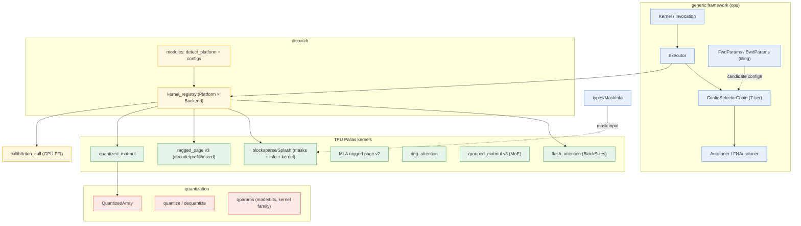

# ejkernel — what it is and how it fits together

## In one paragraph
ejkernel is a multi-backend, autotuned kernel library for JAX — the low-level compute engine behind frameworks like EasyDeL. Its central design idea is a clean split between a *generic autotuning framework* (define a kernel, enumerate candidate configs, benchmark, cache the fastest per input signature) and a *large catalog of concrete kernels* (TPU Pallas + GPU Triton/CUDA/CuTe + XLA fallbacks) registered against a `(Platform, Backend)` dispatch table. A caller asks for an algorithm (`"flash_attention"`) and ejkernel resolves the best implementation for the current hardware, tunes its block sizes, caches the result to disk, and runs it — all transparently. On TPU the perf-critical surface is a suite of Pallas kernels: dense flash attention, block-sparse (Splash) attention, ragged paged attention (v3 + MLA) for continuous-batching serving, ring attention for sequence parallelism, grouped matmul for MoE, and quantized matmul — each tiled by block-size configs that are the primary tuning target.

## Core architecture

## Main concepts

**Kernel + Invocation: the autotuning unit.** A [`Kernel`](concepts/ejkernel-ops-core-kernel.md) subclass supplies `run`, `heuristic_cfg`, and optional `candidate_cfgs`/gradients; an `Invocation` snapshots one call and hashes on argument *shapes* (not values) so a tuned config is reused across all calls of a signature. See [ejkernel-ops-core-kernel](concepts/ejkernel-ops-core-kernel.md).

**Executor + 7-tier config selection.** The [`Executor`](concepts/ejkernel-ops-execution-executor.md) drives the lifecycle (prepare → choose config → custom_vjp → stamp → run); the [`ConfigSelectorChain`](concepts/ejkernel-ops-config-selection.md) resolves config via override → overlay → in-memory cache → persistent cache → autotune → heuristics → error, governed by an `AutotunePolicy`. The [autotuner](concepts/ejkernel-ops-execution-tuning.md) times candidates profiler-first with a Python fallback and a variance-penalizing score.

**Registry + platform detection.** The [`kernel_registry`](concepts/ejkernel-kernels-_registry.md) maps an algorithm to priority-ordered `(Platform, Backend)` implementations with `Backend.ANY` wildcards and XLA fallbacks; [modules/base](concepts/ejkernel-modules-base.md)'s `detect_platform` picks the best platform for the current hardware. Operations parameterize a [config](concepts/ejkernel-modules-operations-configs.md) carrying platform/backend + tiling.

**Tiling is the tuning target.** [`FwdParams`/`BwdParams`](concepts/ejkernel-ops-utils-datacarrier.md) (block sizes) and the flash-attention [`BlockSizes`](concepts/ejkernel-kernels-_pallas-tpu-flash_attention-_utils.md) (with major/minor validation) are the concrete dials the whole framework searches — negligible for numerics, huge for TPU performance.

**Attention masks: composable + sparse.** [`MaskInfo`](concepts/ejkernel-types-mask.md) unifies dense/segment-id/cu_seqlens representations lazily; the Splash [mask algebra](concepts/ejkernel-kernels-_pallas-tpu-blocksparse_attention-_masks.md) composes causal/local/chunked masks that the [sparse-info pass](concepts/ejkernel-kernels-_pallas-tpu-blocksparse_attention-_info.md) classifies per block (empty/partial/full) into prefetch tables the [Splash kernel](concepts/ejkernel-kernels-_pallas-tpu-blocksparse_attention-_kernel.md) uses to skip masked work.

**Serving attention: ragged paged + MLA.** [Ragged paged attention v3](concepts/ejkernel-kernels-_pallas-tpu-ragged_page_attention_v3-_pallas_impl_fwd.md) handles mixed decode/prefill in one launch over a paged KV cache (with a [precomputed tuned-block table](concepts/ejkernel-kernels-_pallas-tpu-ragged_page_attention_v3-_utils.md)); the [MLA variant](concepts/ejkernel-kernels-_pallas-tpu-multi_latent_ragged_page_attention_v2-_pallas_impl_fwd.md) does the same for DeepSeek latent attention with explicit async pipelining. This is the kernel side of EasyDeL's eSurge continuous batching.

**Sequence parallelism: ring attention.** [Ring attention](concepts/ejkernel-kernels-_pallas-tpu-ring_attention-_pallas_impl_bwd.md) shards the sequence across devices, rotating K/V around a ring (`ppermute`) and merging with online log-sum-exp — Splash attention plus a communication pattern, for contexts too long for one device.

**MoE + quantized matmul.** [Grouped matmul v3](concepts/ejkernel-kernels-_pallas-tpu-grouped_matmulv3-_pallas_impl.md) does per-expert matmul with fused activation/dequant in one launch (the MoE FFN kernel); [quantized matmul](concepts/ejkernel-modules-operations-quantized_matmul.md) dispatches over a [TPU kernel](concepts/ejkernel-kernels-_pallas-tpu-quantized_matmul-_pallas_impl_core.md) with packed/predecode paths and GemLite-style [kernel-family selection](concepts/ejkernel-quantization-_utils-qparams.md).

**Quantization data model.** [`QuantizedArray`](concepts/ejkernel-quantization-quantized_array.md) is a pytree holding packed codes + scales that carries its own `.matmul`; [quantize/dequantize](concepts/ejkernel-quantization-_quants-quantizations.md) build/consume it with an inline runtime-config autotuner.

**GPU bridge.** [callib/triton_call](concepts/ejkernel-callib-_triton_call.md) is the JAX↔Triton FFI that makes `Platform.TRITON` kernels runnable on GPU — dormant on TPU-only hosts.

## How a request flows
A framework calls an ejkernel operation (e.g. flash attention). The module resolves the platform (`detect_platform`) and constructs a config; the [`Executor`](concepts/ejkernel-ops-execution-executor.md) snapshots an `Invocation`, the [`ConfigSelectorChain`](concepts/ejkernel-ops-config-selection.md) returns a cached/tuned/heuristic tiling, the [registry](concepts/ejkernel-kernels-_registry.md) resolves the concrete kernel for the hardware, and the [`Kernel`](concepts/ejkernel-ops-core-kernel.md) runs (with custom_vjp gradients if defined). Autotuned configs persist to disk so the search is a one-time per-signature cost.

## Map of the wiki
- "How does autotuning/dispatch work?" → [core kernel](concepts/ejkernel-ops-core-kernel.md), [executor](concepts/ejkernel-ops-execution-executor.md), [selection](concepts/ejkernel-ops-config-selection.md), [tuning](concepts/ejkernel-ops-execution-tuning.md), [registry](concepts/ejkernel-kernels-_registry.md).
- "Which attention kernel for X?" → flash ([utils](concepts/ejkernel-kernels-_pallas-tpu-flash_attention-_utils.md)), block-sparse ([kernel](concepts/ejkernel-kernels-_pallas-tpu-blocksparse_attention-_kernel.md)), serving ([ragged v3](concepts/ejkernel-kernels-_pallas-tpu-ragged_page_attention_v3-_pallas_impl_fwd.md) / [MLA](concepts/ejkernel-kernels-_pallas-tpu-multi_latent_ragged_page_attention_v2-_pallas_impl_fwd.md)), long-context ([ring](concepts/ejkernel-kernels-_pallas-tpu-ring_attention-_pallas_impl_bwd.md)).
- "How is quantization done?" → [qparams](concepts/ejkernel-quantization-_utils-qparams.md), [quantizations](concepts/ejkernel-quantization-_quants-quantizations.md), [QuantizedArray](concepts/ejkernel-quantization-quantized_array.md), [quantized matmul kernel](concepts/ejkernel-kernels-_pallas-tpu-quantized_matmul-_pallas_impl_core.md).
- "How is MoE computed?" → [grouped matmul v3](concepts/ejkernel-kernels-_pallas-tpu-grouped_matmulv3-_pallas_impl.md).
- Exhaustive per-symbol index → `catalog/`; concept table → `index.md`.

## Sources
- raw/code/ejkernel (commit f1b5eb128f)
