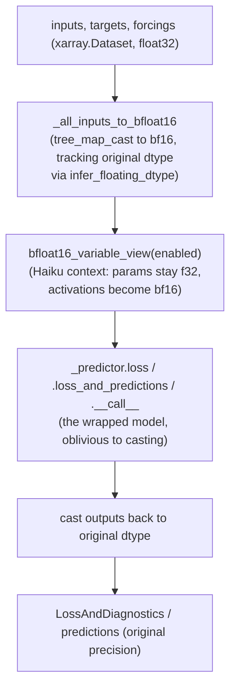

# graphcast.casting — Bfloat16Cast, a mixed-precision Predictor decorator

## Overview

[`Bfloat16Cast`](../catalog/graphcast/casting.md#Bfloat16Cast.__call__) is a `Predictor`-wrapping
decorator: it casts float inputs to `bfloat16` before delegating to the wrapped
[`_predictor`](../catalog/graphcast/casting.md), then casts outputs back — while
[`bfloat16_variable_view`](../catalog/graphcast/casting.md#bfloat16_variable_view) ("Context for
Haiku modules with float32 params, but bfloat16 activations") independently ensures the wrapped
model's *parameters* stay in float32 even while its *activations* run in bfloat16. This is the same
composable-decorator pattern used throughout the codebase: `Predictor` implementations
([`Bfloat16Cast`](../catalog/graphcast/casting.md), `InputsAndResiduals` in `normalization.py`, the
autoregressive wrapper in `autoregressive.py`) all share the identical
`loss`/`loss_and_predictions`/`__call__` interface
(see [`Predictor.loss`](../catalog/graphcast/predictor_base.md#Predictor.loss)/
[`loss_and_predictions`](../catalog/graphcast/predictor_base.md#Predictor.loss_and_predictions)),
letting them compose transparently around one inner predictor.

## Diagram

## Design rationale (why it's built this way)

**`Bfloat16Cast` is a decorator around a `Predictor`, not a training-loop-level cast, so any
predictor can opt into bf16-activation compute by construction (wrapping), without that predictor's
own code knowing about precision at all.** All three of
[`Bfloat16Cast.__call__`](../catalog/graphcast/casting.md#Bfloat16Cast.__call__),
[`Bfloat16Cast.loss`](../catalog/graphcast/casting.md#Bfloat16Cast.loss), and
[`Bfloat16Cast.loss_and_predictions`](../catalog/graphcast/casting.md#Bfloat16Cast.loss_and_predictions)
follow the identical shape: check `_enabled`, cast inputs via `_all_inputs_to_bfloat16`, enter
`bfloat16_variable_view`, delegate to `self._predictor`'s matching method — the wrapped predictor is
never aware casting is happening.

**Parameters and activations are decoupled — params stay float32 while activations run in bf16 —
via a Haiku-specific "variable view" context manager, not a blanket dtype cast.**
[`bfloat16_variable_view`](../catalog/graphcast/casting.md#bfloat16_variable_view)'s doc states this
precisely: "Context for Haiku modules with float32 params, but bfloat16 activations" — this is the
standard mixed-precision-training pattern (master weights in higher precision, compute in lower
precision) implemented as a context manager rather than as an explicit per-layer cast.

**The original input dtype is tracked (`infer_floating_dtype`) so outputs can be cast back precisely,
rather than assuming everything downstream should simply become/stay bfloat16.** Every one of
`Bfloat16Cast`'s three methods calls `infer_floating_dtype` before casting — this makes the wrapper
correct regardless of whether the caller's original data was float32 or float64, restoring that exact
original precision on the way out rather than hardcoding float32 as the "real" dtype.

**`_enabled` is a runtime flag on `Bfloat16Cast`, not a compile-time choice, so the same wrapped model
graph can run in full precision or mixed precision without rebuilding it.** Every method checks
`self._enabled` before deciding whether to cast at all — disabling it makes `Bfloat16Cast` a pure
pass-through to `_predictor`.

## Entry points

- [`Bfloat16Cast.__call__`](../catalog/graphcast/casting.md#Bfloat16Cast.__call__) — the inference-time
  forward pass; casts `inputs`/`targets_template`/`forcings` and delegates to the wrapped predictor.
- [`Bfloat16Cast.loss`](../catalog/graphcast/casting.md#Bfloat16Cast.loss) /
  [`loss_and_predictions`](../catalog/graphcast/casting.md#Bfloat16Cast.loss_and_predictions) — the
  training-time entry points, mirroring the base
  [`Predictor.loss`](../catalog/graphcast/predictor_base.md#Predictor.loss)/
  [`loss_and_predictions`](../catalog/graphcast/predictor_base.md#Predictor.loss_and_predictions)
  interface every predictor (including
  [`GenCast.loss`](../catalog/graphcast/gencast.md#GenCast.loss) and the autoregressive wrapper's
  [`loss`](../catalog/graphcast/autoregressive.md#Predictor.loss)) implements.
- [`bfloat16_variable_view`](../catalog/graphcast/casting.md#bfloat16_variable_view) — entered around
  every call into the wrapped predictor whenever bf16 casting is enabled.

## Mechanism (step-by-step)

1. **[`Bfloat16Cast.__call__`](../catalog/graphcast/casting.md#Bfloat16Cast.__call__) (and its
   `loss`/`loss_and_predictions` siblings) cast inputs to bfloat16, with the original dtype recorded
   first.**
   `infer_floating_dtype` inspects the input tree, then `_all_inputs_to_bfloat16`
   (`tree_map_cast`) casts every float leaf.
2. **The wrapped predictor call runs inside
   [`bfloat16_variable_view`](../catalog/graphcast/casting.md#bfloat16_variable_view)**, so any Haiku
   parameter read
   inside the call is transparently presented as bf16 to the compute graph while remaining stored as
   float32.
3. **The wrapped predictor's own `loss`/[`loss_and_predictions`](../catalog/graphcast/casting.md#Bfloat16Cast.loss_and_predictions)/`__call__`
   runs unmodified** — it is
   `self._predictor`, any `Predictor` implementation.
4. **Outputs (predictions, diagnostics) are cast back to the recorded original dtype by
   [`Bfloat16Cast.loss`](../catalog/graphcast/casting.md#Bfloat16Cast.loss)/its siblings** before
   returning to the caller — a training loop or evaluation harness sees consistent, original-precision
   results regardless of the bf16 compute happening internally.

## Key data structures

- **`Bfloat16Cast`** — wraps one `_predictor` (any `Predictor`); `_enabled` toggles the whole cast
  behavior.
- **[`LossAndDiagnostics`](../catalog/graphcast/predictor_base.md#LossAndDiagnostics)** — type alias
  for `losses.LossAndDiagnostics`; the return shape every `loss`/`loss_and_predictions` implementation
  shares (including `Bfloat16Cast`'s own).

## Dynamics (design intent)
Not addressable beyond the cast-in/compute/cast-out pipeline described above from this packet's
subgraph.

## Edge cases
None directly visible in this packet's subgraph beyond the `_enabled` pass-through behavior.

## Open questions
- Whether `bfloat16_variable_view` interacts correctly with gradient checkpointing/rematerialization
  (a common TPU-memory-saving technique) isn't addressed by the symbols in this packet's subgraph.

## See also
- [graphcast-sparse_transformer](graphcast-sparse_transformer.md) — `wrap_fn_for_upcast_downcast`/
  `reduce_precision`, the analogous per-op (rather than per-model) upcast/downcast mechanism used
  inside the transformer's attention math.
