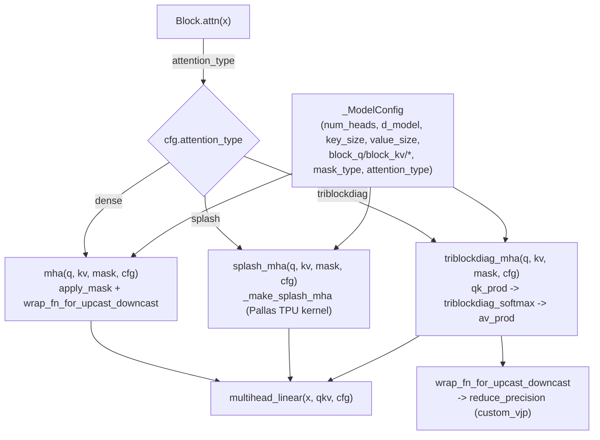

# graphcast.sparse_transformer — three interchangeable attention backends for GenCast

## Overview

This module implements GenCast's mesh-transformer attention with three interchangeable
implementations sharing one `_ModelConfig` and one `multihead_linear` projection:
[`mha`](../catalog/graphcast/sparse_transformer.md#mha) (dense multi-head attention),
[`splash_mha`](../catalog/graphcast/sparse_transformer.md#splash_mha) ("Splash attention" — the TPU
Pallas kernel), and
[`triblockdiag_mha`](../catalog/graphcast/sparse_transformer.md#triblockdiag_mha) ("Triblockdiag
multihead attention" — a custom block-diagonal-with-neighbors sparsity pattern, presumably matching
the icosahedral mesh's local connectivity). `Block.attn` picks one at config time, and every backend
routes its matmuls through
[`wrap_fn_for_upcast_downcast`](../catalog/graphcast/sparse_transformer_utils.md#wrap_fn_for_upcast_downcast)
for BF16-safe precision handling.

## Diagram

## Design rationale (why it's built this way)

**All three attention backends share the exact same `_ModelConfig`, `multihead_linear` projection, and
calling convention `(q_input, kv_input, mask, cfg) -> jnp.ndarray`, so swapping backends is a
config-only change, not a code change.** [`mha`](../catalog/graphcast/sparse_transformer.md#mha),
[`splash_mha`](../catalog/graphcast/sparse_transformer.md#splash_mha), and
[`triblockdiag_mha`](../catalog/graphcast/sparse_transformer.md#triblockdiag_mha) all take identical
leading arguments and read the same `d_model`/`key_size`/`value_size`/`num_heads`/`num_layers`/
`attn_winit_final_mult` fields off [`_ModelConfig`](../catalog/graphcast/sparse_transformer.md#_ModelConfig)
("Transformer config") — [`Block.attn`](../catalog/graphcast/sparse_transformer.md#Block.attn)'s own
body is presumably a one-line dispatch among the three.

**`triblockdiag_mha` computes QK and AV products as two separate named inner functions
(`qk_prod`/`av_prod`), each independently wrapped for upcast/downcast, rather than one fused
attention function — because the block-diagonal sparsity structure means the two matmuls have
genuinely different shapes and precision-sensitivity profiles.**
[`qk_prod`](../catalog/graphcast/sparse_transformer.md#triblockdiag_mha.qk_prod) and
[`av_prod`](../catalog/graphcast/sparse_transformer.md#triblockdiag_mha.av_prod) are both nested
functions inside `triblockdiag_mha`, called separately around a `triblockdiag_softmax` in between —
this decomposition is what lets
[`wrap_fn_for_upcast_downcast`](../catalog/graphcast/sparse_transformer_utils.md#wrap_fn_for_upcast_downcast)
be applied independently to each matmul stage.

**BF16 precision safety is centralized in one wrapper (`wrap_fn_for_upcast_downcast`) built on a
`custom_vjp`-decorated primitive (`reduce_precision`), rather than each attention backend managing
casts itself.** [`wrap_fn_for_upcast_downcast`](../catalog/graphcast/sparse_transformer_utils.md#wrap_fn_for_upcast_downcast)'s
doc — "Wraps `fn` to upcast to float32 and then downcast, for use with BF16" — composes with
[`reduce_precision`](../catalog/graphcast/sparse_transformer_utils.md#reduce_precision) (`@functools.partial(jax.custom_vjp,
nondiff_argnums=(1, 2))`, parameterized by `exponent_bits`/`mantissa_bits`) — the custom VJP means the
precision-reduction itself has a hand-specified gradient rather than relying on autodiff through a
literal bit-truncation operation (which would otherwise produce a zero or undefined gradient almost
everywhere).

**Splash attention takes the mask as either a plain array or a
`splash_attention.splash_attention_mask.Mask` object, letting the caller choose between materialized
and structured masking**, mirroring the same materialized-vs-structured mask duality seen in other
Splash-attention integrations across the TPU-perf ecosystem (cf. levanter's `AttentionMask`, a
different codebase, same underlying JAX Splash kernel).

## Entry points

- [`Block.attn`](../catalog/graphcast/sparse_transformer.md#Block.attn) — the per-block dispatch point
  calling one of `mha`/`splash_mha`/`triblockdiag_mha` based on `cfg.attention_type`.
- [`Transformer.__call__`](../catalog/graphcast/sparse_transformer.md#Transformer.__call__) — the
  top-level transformer forward pass, applying `num_layers` blocks to `node_features` with
  `global_norm_conditioning`.
- [`multihead_linear`](../catalog/graphcast/sparse_transformer.md#multihead_linear) — "Linearly
  project `x` to have `head_size` dimensions per head"; called by all three attention backends for
  their Q/K/V projections.

## Mechanism (step-by-step)

1. **A [`_ModelConfig`](../catalog/graphcast/sparse_transformer.md#_ModelConfig) is constructed once,
   fixing `attention_type`, block sizes
   (`block_q`/`block_kv`/`block_kv_compute`/`block_kv_dkv`/`block_kv_dkv_compute`/`block_q_dkv`), and
   mask type/block size for the whole transformer.**
2. **[`Block.attn`](../catalog/graphcast/sparse_transformer.md#Block.attn) dispatches to the
   configured backend**, all three sharing
   [`multihead_linear`](../catalog/graphcast/sparse_transformer.md#multihead_linear) for Q/K/V
   projection.
3. **[`splash_mha`](../catalog/graphcast/sparse_transformer.md#splash_mha) builds a Pallas
   Splash-attention call via `_make_splash_mha`**, passing through the
   configured block sizes and an optional `tanh_soft_cap` for logit soft-capping.
4. **[`triblockdiag_mha`](../catalog/graphcast/sparse_transformer.md#triblockdiag_mha) computes
   `qk_prod`, a `triblockdiag_softmax`, then `av_prod`** — each stage
   independently precision-managed via
   [`wrap_fn_for_upcast_downcast`](../catalog/graphcast/sparse_transformer_utils.md#wrap_fn_for_upcast_downcast).
5. **[`mha`](../catalog/graphcast/sparse_transformer.md#mha) applies a plain `apply_mask` before a
   standard softmax attention**, also wrapped for
   upcast/downcast, with an independent `normalize_logits` flag controlling whether logits are
   pre-normalized before the softmax.

## Key data structures

- **[`_ModelConfig`](../catalog/graphcast/sparse_transformer.md#_ModelConfig)** — "Transformer config":
  [`num_layers`](../catalog/graphcast/sparse_transformer.md#_ModelConfig.num_layers),
  [`num_heads`](../catalog/graphcast/sparse_transformer.md#_ModelConfig.num_heads),
  [`d_model`](../catalog/graphcast/sparse_transformer.md#_ModelConfig.d_model),
  [`key_size`](../catalog/graphcast/sparse_transformer.md#_ModelConfig.key_size)/
  [`value_size`](../catalog/graphcast/sparse_transformer.md#_ModelConfig.value_size),
  [`attn_winit_final_mult`](../catalog/graphcast/sparse_transformer.md#_ModelConfig.attn_winit_final_mult),
  plus Splash-specific
  [`block_kv`](../catalog/graphcast/sparse_transformer.md#_ModelConfig.block_kv)/
  [`block_kv_compute`](../catalog/graphcast/sparse_transformer.md#_ModelConfig.block_kv_compute) and
  sibling block-size fields.
- **`Transformer`** — holds
  [`_cfg`](../catalog/graphcast/sparse_transformer.md#Transformer._cfg) (the `_ModelConfig`); its
  `__call__` applies `num_layers` `Block`s.

## Dynamics (design intent)
Not addressable beyond the config-driven backend dispatch described above from this packet's subgraph.

## Edge cases
None directly visible in this packet's subgraph beyond the `reduce_precision` custom-VJP handling
noted above.

## Open questions

- Which attention backend GenCast's production configuration actually selects by default (dense vs.
  Splash vs. triblockdiag) isn't resolved by the symbols in this packet's subgraph alone.
- Whether the `triblockdiag` sparsity pattern's block structure specifically matches the icosahedral
  mesh's local neighbor connectivity (see
  [graphcast-icosahedral_mesh](graphcast-icosahedral_mesh.md)) is a plausible inference but not
  directly confirmed by this packet's cited symbols.

## See also
- [graphcast](graphcast.md) — the mesh-graph construction this transformer's `node_features` derive
  from.
