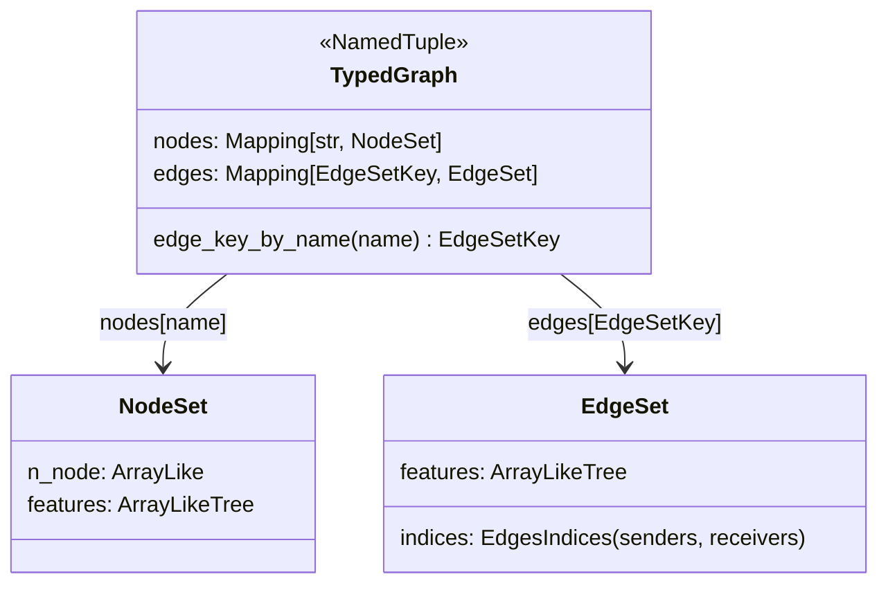

# graphcast.typed_graph — TypedGraph, the shared graph representation

## Overview

[`TypedGraph`](../catalog/graphcast/typed_graph.md#TypedGraph) ("A graph with typed nodes and edges")
is a plain `NamedTuple` — [`nodes`](../catalog/graphcast/typed_graph.md#TypedGraph.nodes) (a
`Mapping[str, NodeSet]`) and [`edges`](../catalog/graphcast/typed_graph.md#TypedGraph.edges) (a
`Mapping[EdgeSetKey, EdgeSet]`) — used identically by every graph-building site in the codebase: both
[`GraphCast`](../catalog/graphcast/graphcast.md#GraphCast._init_grid2mesh_graph)'s and GenCast's
denoiser's (`_DenoiserArchitecture`) three-graph construction
(`_init_grid2mesh_graph`/`_init_mesh_graph`/`_init_mesh2grid_graph`) produce and consume the exact
same `TypedGraph` shape, and
[`DeepTypedGraphNet`](../catalog/graphcast/deep_typed_graph_net.md#DeepTypedGraphNet._networks_builder)
is the one GNN implementation that operates generically over any `TypedGraph`.

## Diagram

## Design rationale (why it's built this way)

**One `TypedGraph` type serves every graph in the codebase (Grid2Mesh, Mesh, Mesh2Grid, in both
GraphCast and GenCast's denoiser) rather than a bespoke type per graph role, so
[`DeepTypedGraphNet`](../catalog/graphcast/deep_typed_graph_net.md#DeepTypedGraphNet._networks_builder)
(the message-passing GNN) can operate generically on any of them.** Every graph-construction method —
[`GraphCast._init_grid2mesh_graph`](../catalog/graphcast/graphcast.md#GraphCast._init_grid2mesh_graph),
[`_DenoiserArchitecture._init_grid2mesh_graph`](../catalog/graphcast/denoiser.md#_DenoiserArchitecture._init_grid2mesh_graph),
and their `_init_mesh_graph`/`_init_mesh2grid_graph` siblings across both files — constructs the same
`NodeSet`/`EdgeSet`/`EdgeSetKey`/`TypedGraph` types, confirming this is a genuinely shared
representation, not a coincidentally-similar one.

**Nodes are keyed by plain string name (`Mapping[str, NodeSet]`) but edges are keyed by a richer
`EdgeSetKey` (presumably `(name, (sender_node_type, receiver_node_type))`), because an edge set's
identity depends on which two node types it connects, not just a name.**
[`TypedGraph.edge_key_by_name`](../catalog/graphcast/typed_graph.md#TypedGraph.edge_key_by_name)
exists specifically to look up an `EdgeSetKey` from a plain name string — implying edges are commonly
addressed by name in calling code even though they're stored keyed by the richer key.

## Entry points

- [`TypedGraph`](../catalog/graphcast/typed_graph.md#TypedGraph) — the constructor every
  `_init_*_graph` method calls to assemble its result.
- [`TypedGraph.edge_key_by_name`](../catalog/graphcast/typed_graph.md#TypedGraph.edge_key_by_name) —
  called wherever code needs to address an edge set by its plain name (e.g.
  [`GraphCast._run_grid2mesh_gnn`](../catalog/graphcast/graphcast.md#GraphCast._run_grid2mesh_gnn)
  and its denoiser counterpart both call it).
- [`DeepTypedGraphNet._networks_builder`](../catalog/graphcast/deep_typed_graph_net.md#DeepTypedGraphNet._networks_builder) —
  the GNN construction entry point that takes a `graph_template: TypedGraph` to know what
  node/edge types its per-type networks must handle.

## Mechanism (step-by-step)

1. **A graph-construction method builds [`NodeSet`](../catalog/graphcast/typed_graph.md#NodeSet)/[`EdgeSet`](../catalog/graphcast/typed_graph.md#EdgeSet)
   instances**, each carrying `features` (an
   `ArrayLikeTree` — arbitrary nested array structure, not just a flat array) plus structural fields
   (`n_node` for nodes; sender/receiver indices for edges).
2. **The node/edge sets are assembled into one [`TypedGraph`](../catalog/graphcast/typed_graph.md#TypedGraph)**
   via its `nodes`/`edges` mapping fields.
3. **Downstream code addresses a specific edge set either by its full `EdgeSetKey` or by plain name**
   via [`edge_key_by_name`](../catalog/graphcast/typed_graph.md#TypedGraph.edge_key_by_name).
4. **[`DeepTypedGraphNet.__call__`](../catalog/graphcast/deep_typed_graph_net.md#DeepTypedGraphNet.__call__)
   consumes a `TypedGraph` as a *template*** — `_networks_builder` takes
   `graph_template: TypedGraph` to determine, at construction time, which per-node-type and
   per-edge-type sub-networks it needs to build (see
   [graphcast-deep_typed_graph_net](graphcast-deep_typed_graph_net.md)).

## Key data structures

- **[`TypedGraph`](../catalog/graphcast/typed_graph.md#TypedGraph)** — `nodes: Mapping[str, NodeSet]`,
  `edges: Mapping[EdgeSetKey, EdgeSet]`.
- **[`NodeSet`](../catalog/graphcast/typed_graph.md#NodeSet)** — `n_node` (count),
  [`features`](../catalog/graphcast/typed_graph.md#NodeSet.features) (an
  [`ArrayLikeTree`](../catalog/graphcast/typed_graph.md#ArrayLikeTree)).
- **[`EdgeSet`](../catalog/graphcast/typed_graph.md#EdgeSet)** — `features` (an
  [`ArrayLikeTree`](../catalog/graphcast/typed_graph.md#ArrayLikeTree)), plus sender/receiver index
  structure.

## Dynamics (design intent)
Not addressable beyond the shared-representation design described above from this packet's subgraph.

## Edge cases
None directly visible in this packet's subgraph.

## Open questions
- The exact structure of `EdgeSetKey` (whether it's a plain string, a tuple of node-type names, or
  something richer) isn't fully resolved by the symbols in this packet's subgraph.

## See also
- [graphcast](graphcast.md) — `GraphCast`'s three `TypedGraph`-producing methods.
- [graphcast-deep_typed_graph_net](graphcast-deep_typed_graph_net.md) — `DeepTypedGraphNet`, the GNN
  that consumes a `TypedGraph` template.
