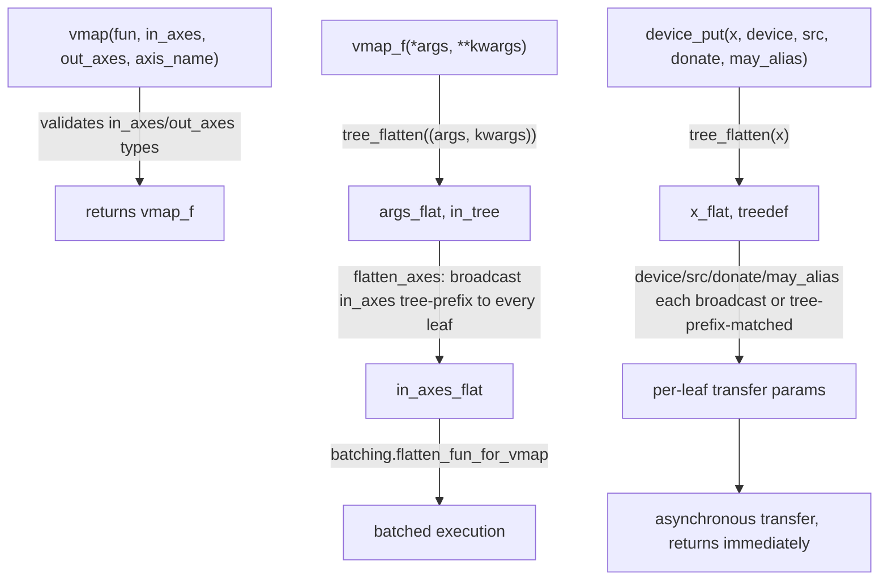

# jax._src.api — vmap tree-prefix axis specs, device_put donation/aliasing

## Overview

[`vmap`](../catalog/jax/_src/api.md#vmap) builds a batched version of a function, accepting
`in_axes`/`out_axes` as tree-prefixes of the argument/output pytrees rather than requiring a
per-leaf spec for every value; its returned wrapper,
[`vmap_f`](../catalog/jax/_src/api.md#vmap.vmap_f), does the real per-call flattening and dispatch into
`batching.flatten_fun_for_vmap`. [`device_put`](../catalog/jax/_src/api.md#device_put) transfers
`x` to a target device/sharding, asynchronously, with optional `donate`/`may_alias` hints that
control whether the source buffer can be reused rather than copied.

## Diagram

## Design rationale (why it's built this way)

**`in_axes`/`out_axes` need only be a *tree prefix* of the argument/output pytree, not a full
per-leaf specification — `flatten_axes` broadcasts the prefix onto the full tree.**
[`vmap`](../catalog/jax/_src/api.md#vmap)'s docstring states `in_axes` "must be a container tree
prefix of the positional argument tuple," and [`vmap_f`](../catalog/jax/_src/api.md#vmap.vmap_f) calls
`flatten_axes` to expand that prefix across the fully flattened argument tree — this lets a user
write `in_axes=0` once to mean "map axis 0 for everything" without needing to manually replicate
that `0` once per leaf of an arbitrarily nested container argument.

**Lists are silently canonicalized to tuples in `in_axes`, deliberately deviating from strict
pytree-prefix semantics, with the reason documented inline.**
[`vmap`](../catalog/jax/_src/api.md#vmap)'s comment explains: "in_axes can never be a list" as a
strict tree prefix (since a list is not a leaf, it would need to itself be a tree of trees), "but in
cases like these users expect tuples and lists to be treated essentially interchangeably" — so
`vmap` explicitly converts a list `in_axes` to a tuple rather than raising an error, prioritizing
ergonomics over pytree-prefix strictness for this one specific case (citing a GitHub issue as the
motivating user complaint).

**`device_put`'s `donate`/`may_alias` parameters are explicitly best-effort, not a strict
contract.** The docstring for `donate` states "JAX will donate if possible, otherwise it won't" —
callers cannot assume donation actually occurs even when requested; this reflects that whether a
buffer can genuinely be reused (versus copied) depends on runtime/backend details outside the
caller's control, so the API surface is intentionally a hint, not a guarantee.

## Entry points

- [`vmap`](../catalog/jax/_src/api.md#vmap) — the public batching-transform constructor.
- [`vmap_f`](../catalog/jax/_src/api.md#vmap.vmap_f) — the actual per-call wrapper `vmap` returns,
  reached every time the batched function is invoked.
- [`device_put`](../catalog/jax/_src/api.md#device_put) — reached to transfer/commit an array (or
  pytree of arrays) to a device or sharding.

## Mechanism (step-by-step)

1. **[`vmap`](../catalog/jax/_src/api.md#vmap) validates `in_axes`/`out_axes` types** (canonicalizing
   lists to tuples), then returns [`vmap_f`](../catalog/jax/_src/api.md#vmap.vmap_f) as the batched
   callable.
2. **[`vmap_f`](../catalog/jax/_src/api.md#vmap.vmap_f) flattens `(args, kwargs)` into a pytree**, expands
   the `in_axes` tree-prefix to a per-leaf `in_axes_flat` via `flatten_axes`, and dispatches into
   `batching.flatten_fun_for_vmap`.
3. **[`device_put`](../catalog/jax/_src/api.md#device_put) flattens `x`**, computes each leaf's
   abstract value via `shaped_abstractify`, and expands `device`/`src` (if not already a single
   `Device`/`Sharding`/`MemorySpace`) across the tree via `flatten_axes` before issuing the transfer.

## Key data structures

- **`in_axes`/`out_axes`** — int, `None`, or a (nested) tree-prefix container thereof; expanded via
  `flatten_axes` at call time, not at `vmap` construction time.

## Dynamics (design intent)

Because [`device_put`](../catalog/jax/_src/api.md#device_put) "is always asynchronous... returns
immediately without blocking," a caller issuing many `device_put` calls in sequence does not incur
per-call transfer latency serialized on the Python thread — the actual transfers can overlap, with
their completion only observed when the resulting array's value is later actually consumed.

## Edge cases

- [`vmap_f`](../catalog/jax/_src/api.md#vmap.vmap_f) raises `ValueError` immediately if `in_axes` is a
  tuple whose length doesn't match the number of positional `args` — this shape check happens before
  any flattening/tracing work.
- [`device_put`](../catalog/jax/_src/api.md#device_put)'s docstring notes that with `device=None`,
  behavior differs depending on whether `x` is already on a device (identity, effectively a no-op)
  versus not (transferred to the default device, *uncommitted*) — the two cases are not
  equivalent, and callers relying on committing `x` must pass an explicit `device`.

## Open questions

- Whether `vmap`'s list-to-tuple canonicalization for `in_axes` is applied symmetrically to
  `out_axes` is not addressed by this packet's cited subgraph (only the `in_axes` canonicalization
  is shown).

## See also
- [jax-_src-tree_util](jax-_src-tree_util.md) — `tree_flatten`, used by both `vmap_f` and
  `device_put` to decompose their pytree arguments.
- [jax-_src-mesh](jax-_src-mesh.md) / [jax-_src-named_sharding](jax-_src-named_sharding.md) —
  `Sharding`/`Mesh` types accepted as `device_put`'s `device`/`src` parameters.
