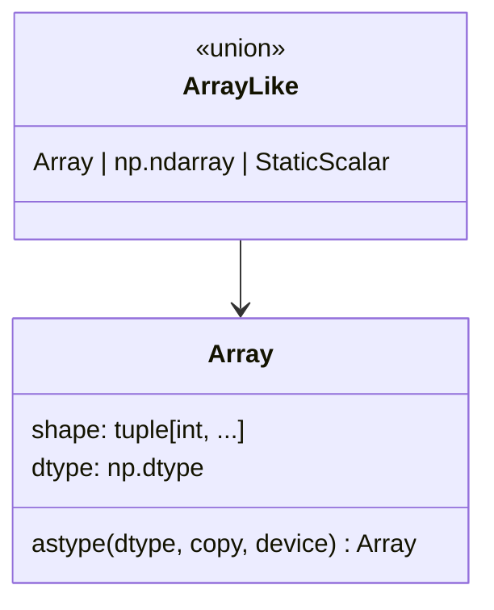

# jax._src.basearray — Array, the unified instance-check/type-annotation base class

## Overview

[`Array`](../catalog/jax/_src/basearray.md#Array) is the base class backing `jax.Array` — the
single type that both concrete on-device arrays and traced `Tracer` values are instances of. Its
docstring states its purpose directly: `isinstance(x, jax.Array)` returns `True` "both inside and
outside traced functions," so user code can check "is this a JAX array" uniformly regardless of
whether it's under tracing. [`ArrayLike`](../catalog/jax/_src/basearray.md#ArrayLike) is the
broader union type (`Array | np.ndarray | StaticScalar`) used for function parameters that accept
anything array-convertible.

## Diagram

## Design rationale (why it's built this way)

**`Array` is explicitly documented as an instance-check/annotation type, not a constructor.** The
class docstring warns "`jax.Array` should not be used directly for creation of arrays," directing
users instead to `jax.numpy` creation routines (`jnp.array`, `jnp.zeros`, etc.) — this keeps the
type-identity role (what `isinstance` and type annotations check against) cleanly separate from
the many concrete array-construction code paths, which can each produce a genuine array object
without needing to route through a common constructor.

**`shape`/`dtype` are properties, not stored attributes, keeping the interface uniform across
concrete arrays and tracers.** [`Array.shape`](../catalog/jax/_src/basearray.md#Array.shape)/
[`Array.dtype`](../catalog/jax/_src/basearray.md#Array.dtype) are declared as abstract
`@property` methods on the base class — since a `Tracer` and a concrete on-device array store this
information completely differently under the hood, exposing it via a property lets each subclass
implement the property however is natural for its own representation while presenting one
consistent read interface.

## Entry points

- [`Array`](../catalog/jax/_src/basearray.md#Array) — the type every concrete JAX array and
  `Tracer` is an instance of; reached via `isinstance(x, jax.Array)` checks throughout the codebase.
- [`Array.astype`](../catalog/jax/_src/basearray.md#Array.astype) — reached to produce a
  dtype-cast (and optionally device-moved) copy of an array.

## Mechanism (step-by-step)

1. **Any concrete array or `Tracer` subclasses [`Array`](../catalog/jax/_src/basearray.md#Array)**,
   inheriting its `__slots__ = ['__weakref__']` (no other stored fields on the base class itself)
   and its abstract `shape`/`dtype` property interface.
2. **[`Array.shape`](../catalog/jax/_src/basearray.md#Array.shape)/
   [`dtype`](../catalog/jax/_src/basearray.md#Array.dtype) are overridden per concrete subclass**
   to expose that subclass's own shape/dtype representation through the common property interface.
3. **[`ArrayLike`](../catalog/jax/_src/basearray.md#ArrayLike) is used at API boundaries** (function
   parameter types) wherever a value that is "array-like" but not necessarily a genuine
   [`Array`](../catalog/jax/_src/basearray.md#Array) instance (e.g. a raw `np.ndarray` or Python
   scalar) is acceptable.

## Key data structures

- **[`Array`](../catalog/jax/_src/basearray.md#Array)** — the base class itself; `__hash__ = None`
  (arrays are unhashable, consistent with numpy array semantics).
- **[`ArrayLike`](../catalog/jax/_src/basearray.md#ArrayLike)** — `Union[Array, np.ndarray,
  StaticScalar]`, the broader accept-anything-array-convertible type.

## Dynamics (design intent)

Because `shape`/`dtype` are abstract properties rather than stored fields, adding a new concrete
array representation (e.g. a new device-array backend) only requires implementing these properties
correctly — no shared base-class storage format constrains how the new representation stores its
shape/dtype internally.

## Edge cases

- `Array.__hash__ = None` means `Array` instances cannot be used as dict keys or set members,
  matching NumPy's array semantics rather than Python's default object-identity hashing.
- [`Array.astype`](../catalog/jax/_src/basearray.md#Array.astype) accepts `device` as well as
  `dtype`/`copy` — a single call can both cast dtype and move device placement, which callers
  optimizing for minimal data movement should be aware can be combined into one op.

## Open questions

- What performance difference (if any) exists between `Array.astype`'s combined dtype-cast +
  device-move path versus separate cast-then-move calls is not addressed by this packet's cited
  subgraph.

## See also
- [jax-_src-core](jax-_src-core.md) — `ShapedArray`, the concrete `AbstractValue` type used for
  `Array`'s abstract-value representation during tracing.
- [jax-_src-dtypes](jax-_src-dtypes.md) — `dtype`, the canonicalization logic behind
  `Array.dtype`'s values.
