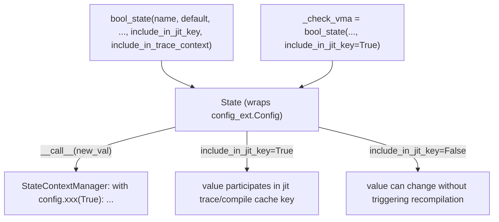

# jax._src.config — global/thread-local config State, jit-cache-key-affecting flags

## Overview

[`State`](../catalog/jax/_src/config.md#State) wraps a compiled `config_ext.Config` value with
Python-side hooks, a context-manager interface, and — critically for compilation caching — an
`include_in_jit_key` flag that determines whether toggling this config option should be treated as
part of a `jit`-compiled function's cache key. [`bool_state`](../catalog/jax/_src/config.md#bool_state)
is the convenience constructor used to define most of JAX's boolean feature flags (e.g.
[`_check_vma`](../catalog/jax/_src/config.md#_check_vma), the internal flag backing `shard_map`'s
variance-mismatch-array checking). The singleton [`config`](../catalog/jax/_src/config.md#config)
object exposes every registered flag as an attribute.

## Diagram

## Design rationale (why it's built this way)

**`include_in_jit_key`/`include_in_trace_context` are explicit, per-flag opt-ins, not a blanket
default — most config options do *not* affect the jit cache key.**
[`bool_state`](../catalog/jax/_src/config.md#bool_state)'s docstring states these params control
"whether to include the state in the JIT cache key"/"trace context" respectively, both defaulting to
`False` — since most config toggles are debug/logging-only concerns that shouldn't force
recompilation whenever flipped, only flags whose value genuinely changes generated code (like
[`_check_vma`](../catalog/jax/_src/config.md#_check_vma), which is `include_in_jit_key=True`) opt
into cache-key participation; getting this wrong either causes silent stale-compile bugs (if a
code-affecting flag is excluded) or unnecessary recompilation (if a cosmetic flag is included).

**`State.__bool__` is explicitly disabled with a targeted error message, rather than left to raise a
generic `TypeError`.** [`State.__bool__`](../catalog/jax/_src/config.md#State) raises `TypeError`
with the message "did you mean to use `'{0}.value'` instead?" — since `State` instances are
callable context managers (`config.xxx(True)`), a user writing `if config.xxx:` (missing `.value`)
would otherwise get a confusing generic truthiness error; this override turns a common mistake into
an actionable message.

## Entry points

- [`bool_state`](../catalog/jax/_src/config.md#bool_state) — reached to define a new boolean
  config flag, registering it as both an absl flag/env var and a
  [`State`](../catalog/jax/_src/config.md#State)-backed context manager.
- [`config`](../catalog/jax/_src/config.md#config) — the singleton exposing every registered
  config option as an attribute for reading current values.
- [`_check_vma`](../catalog/jax/_src/config.md#_check_vma) — a representative internal flag
  (backing `shard_map`'s variance-mismatch-array checking), explicitly marked
  `include_in_jit_key=True`.

## Mechanism (step-by-step)

1. **[`bool_state`](../catalog/jax/_src/config.md#bool_state) constructs a
   [`State`](../catalog/jax/_src/config.md#State) instance**, registering it under `name` in the
   module-level `config_states` dict and wiring up any supplied global/thread-local update hooks.
2. **[`State.__call__`](../catalog/jax/_src/config.md#State) returns a `StateContextManager`**,
   letting the flag be temporarily overridden via `with config.some_flag(True): ...`.
3. **Whenever the [`State`](../catalog/jax/_src/config.md#State) instance's value changes** (via
   its internal setter or the context manager), any registered `update_global_hook`/
   `update_thread_local_hook` fires, and if `include_in_jit_key`/`include_in_trace_context` are
   set, the new value becomes part of subsequent trace/compile cache keys.

## Key data structures

- **[`State`](../catalog/jax/_src/config.md#State)** — wraps `config_ext.Config[_T]`; carries
  `_name`, `_update_thread_local_hook`, `_update_global_hook`, `_parser`,
  `_default_context_manager_value`.
- **[`config`](../catalog/jax/_src/config.md#config)** — the singleton `Config()` instance every
  registered `State` attaches to as an attribute.

## Dynamics (design intent)

Because `include_in_jit_key` is opt-in per flag, the set of flags actually influencing compilation
caching is small and deliberate — auditing which flags can cause silent recompilation-vs-staleness
issues means grepping for `include_in_jit_key=True` call sites rather than reasoning about every
config option in the codebase.

## Edge cases

- [`_check_vma`](../catalog/jax/_src/config.md#_check_vma)'s help string reads "internal
  implementation detail of shard_map, DO NOT USE," and the surrounding code comment says "make it so
  people don't use this, this is internal" — a flag that is both cache-key-affecting and explicitly
  not meant for external use, illustrating that `include_in_jit_key=True` flags aren't necessarily
  user-facing feature toggles.
- [`State.__init__`](../catalog/jax/_src/config.md#State) applies `parser` to `default` before
  passing it to the base `config_ext.Config` constructor — a flag with a parser sees its default
  value transformed once at registration time, not left as the raw literal.

## Open questions

- Whether there is tooling or a lint rule enforcing that every config flag whose value changes
  generated code sets `include_in_jit_key=True` (versus relying on manual audit) is not addressed by
  this packet's cited subgraph.

## See also
- [jax-_src-core](jax-_src-core.md) — `Primitive.bind`, whose mesh-mismatch behavior is itself
  gated by config-flag-controlled semantics in the broader mesh/sharding system.
