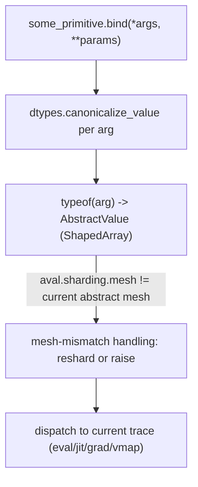

# jax._src.core — Primitive.bind, ShapedArray, and the abstract-value trace protocol

## Overview

[`Primitive.bind`](../catalog/jax/_src/core.md#Primitive.bind) is the single dispatch point every
JAX operation goes through: it canonicalizes arguments, computes each argument's abstract value via
[`typeof`](../catalog/jax/_src/core.md#typeof), and hands off to whatever trace (eval, jit, grad,
vmap, ...) is currently active.
[`ShapedArray`](../catalog/jax/_src/core.md#ShapedArray) is the concrete
[`AbstractValue`](../catalog/jax/_src/core.md#AbstractValue) type carrying shape/dtype plus — in
current JAX — `sharding`/`manual_axis_type`/`memory_space`, meaning sharding is now part of a
value's *type*, not just runtime metadata attached after the fact. `bind` uses this to detect and
react to mesh mismatches between an argument's sharding and the currently active abstract mesh
(explicit-sharding-in-types).

## Diagram

## Design rationale (why it's built this way)

**Sharding lives inside `ShapedArray` itself, not as separate side-channel metadata — so `bind` can
detect mesh mismatches at the abstract-value level before any op actually executes.**
[`ShapedArray`](../catalog/jax/_src/core.md#ShapedArray) carries a `sharding` field, and
[`Primitive.bind`](../catalog/jax/_src/core.md#Primitive.bind) compares `aval.sharding.mesh` against
the currently active abstract mesh, triggering a `reshard` for `Auto`-mesh mismatches or raising
`NotImplementedError` for `Explicit`-axis mismatches closed over by `shard_map` — this is the
mechanism underlying JAX's `Manual`/`Auto`/`Explicit` mesh-axis-type system (see
[jax-_src-mesh](jax-_src-mesh.md)).

**`typeof` resolves an abstract value via an MRO walk over a fast-path dict, not `isinstance`
chains.** [`typeof`](../catalog/jax/_src/core.md#typeof) looks up `type(x)` directly in
`pytype_aval_mappings` first, then falls back to walking `typ.__mro__[1:]` — this keeps the common
case (an exact registered type) O(1) while still supporting subclasses without every subclass
needing its own explicit registration.

## Entry points

- [`Primitive.bind`](../catalog/jax/_src/core.md#Primitive.bind) — the sole call-site every JAX
  primitive operation goes through.
- [`typeof`](../catalog/jax/_src/core.md#typeof) — reached by `bind` (and broadly elsewhere) to
  compute an argument's abstract value.

## Mechanism (step-by-step)

1. **[`Primitive.bind`](../catalog/jax/_src/core.md#Primitive.bind) canonicalizes every argument**
   via `dtypes.canonicalize_value`, then computes its
   [`ShapedArray`](../catalog/jax/_src/core.md#ShapedArray) via
   [`typeof`](../catalog/jax/_src/core.md#typeof).
2. **If the argument's sharding mesh differs from the currently active abstract mesh**,
   [`Primitive.bind`](../catalog/jax/_src/core.md#Primitive.bind) inspects the mesh's axis types: an
   all-`Auto` mismatch triggers an implicit `reshard`; an `Explicit`-axis mismatch closed over by
   `shard_map` raises `NotImplementedError` directing the caller to pass the input as an explicit
   `shard_map` argument instead.
3. **Escaped-tracer and cross-trace-leak checks run** inside
   [`Primitive.bind`](../catalog/jax/_src/core.md#Primitive.bind) on any argument that is itself a
   `Tracer`, before dispatch proceeds to the active trace.

## Key data structures

- **[`Primitive`](../catalog/jax/_src/core.md#Primitive)** — `name`, `multiple_results`,
  `call_primitive`, `ref_primitive`, `skip_canonicalization` flags controlling `bind`'s behavior per
  primitive kind.
- **[`ShapedArray`](../catalog/jax/_src/core.md#ShapedArray)** — `shape`/`dtype`/`weak_type`/
  `sharding`/`manual_axis_type`/`memory_space`; interned via a `_create`/`weak_value_interner`
  pattern so structurally-identical abstract values share one object.
- **[`AbstractValue`](../catalog/jax/_src/core.md#AbstractValue)** — the base class
  `ShapedArray` extends.

## Dynamics (design intent)

Because sharding is encoded directly in `ShapedArray`, tracing a function under different input
shardings produces genuinely different abstract values (not the same aval with sharding attached
separately afterward) — this is what lets `jit`'s tracing cache correctly distinguish differently
sharded calls as needing separate compiled programs.

## Edge cases

- [`Primitive.bind`](../catalog/jax/_src/core.md#Primitive.bind)'s mesh-mismatch branch only fires
  `if not self.skip_canonicalization and isinstance(aval, ShapedArray) and not
  aval.sharding.mesh.empty` — primitives that set `skip_canonicalization = True` bypass this check
  entirely, and an empty (unset) mesh is treated as "nothing to check" rather than a mismatch.
- A `Tracer` argument whose trace `is_valid()` returns `False` raises an escaped-tracer error
  immediately in `bind`, rather than silently proceeding with a stale trace.

## Open questions

- Whether the `Explicit`-axis `NotImplementedError` path in `bind` is expected to be lifted in a
  future JAX release (the comment marks related casting as "not yet allowed") is not addressed by
  this packet's cited subgraph.

## See also
- [jax-_src-mesh](jax-_src-mesh.md) — `Mesh`/`AbstractMesh`/`AxisType`, the mesh and axis-type
  system `bind`'s mismatch handling reacts to.
- [jax-_src-named_sharding](jax-_src-named_sharding.md) — `NamedSharding`, the sharding type
  attached to `ShapedArray.sharding`.
- [jax-_src-dtypes](jax-_src-dtypes.md) — `canonicalize_value`/`dtype`, used by `bind` to
  canonicalize arguments before computing their abstract value.
