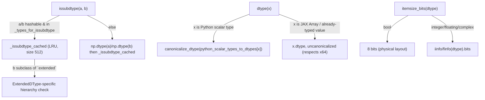

# jax._src.dtypes — extended-dtype-aware issubdtype, canonicalization, and bit-width queries

## Overview

This module extends NumPy's dtype machinery to handle JAX's "extended" dtypes (PRNG key types,
bfloat16, sub-byte int types) that don't conform to NumPy's own type hierarchy.
[`issubdtype`](../catalog/jax/_src/dtypes.md#issubdtype) is a
`np.issubdtype`-compatible check that special-cases these extensions;
[`dtype`](../catalog/jax/_src/dtypes.md#dtype) canonicalizes a Python/NumPy value's dtype according
to JAX's x64-mode-aware rules; [`itemsize_bits`](../catalog/jax/_src/dtypes.md#itemsize_bits)
computes true per-element bit width, correcting for sub-byte integer types where
`dtype.itemsize` alone would be wrong.

## Diagram

## Design rationale (why it's built this way)

**`issubdtype` special-cases extended dtypes explicitly rather than delegating entirely to NumPy's
hierarchy.** The function's own comment explains the two departures from `np.issubdtype`: "extended"
dtypes (e.g. PRNG key types) aren't normal NumPy dtypes and need bespoke handling, while custom
dtypes like `bfloat16`/`int4` *are* normal NumPy dtypes but "don't conform to the standard numpy
type hierarchy" (e.g. `bfloat16`'s scalar type isn't a subclass of `np.floating`) — so both classes
of extension get explicit branches in
[`_issubdtype_cached`](../catalog/jax/_src/dtypes.md#issubdtype) rather than relying on subclass
checks that would silently misclassify them.

**Values that already carry a JAX-respected dtype are intentionally *not* canonicalized, to preserve
x64 semantics once formed.** [`dtype`](../catalog/jax/_src/dtypes.md#dtype)'s branch for
`_types_whose_dtype_should_not_be_canonicalized` (JAX arrays, literal arrays, scalars) returns
`x.dtype` directly with a comment: "once we've formed an x64 value, that is something we respect
irrespective of the x64 mode" — canonicalization (which may downcast float64→float32 when x64 is
disabled) only applies at value-*creation* time, not to values that already exist with an explicit
dtype.

**`itemsize_bits` cannot use `dtype.itemsize` directly because that field is wrong for sub-byte
integer types.** The function's comment states this explicitly, computing bit width via
`iinfo(dtype).bits`/`finfo(dtype).bits` instead — `dtype.itemsize` reports whole bytes, which
under-/over-counts for dtypes narrower than one byte (e.g. int4).

## Entry points

- [`issubdtype`](../catalog/jax/_src/dtypes.md#issubdtype) — reached throughout JAX (and user code
  via `jax.numpy.issubdtype`) wherever a dtype-hierarchy check must account for JAX's extended
  dtypes.
- [`dtype`](../catalog/jax/_src/dtypes.md#dtype) — reached to compute the canonical dtype for a
  Python/NumPy value or type.
- [`check_and_canonicalize_user_dtype`](../catalog/jax/_src/dtypes.md#check_and_canonicalize_user_dtype) —
  reached to validate and canonicalize a user-supplied `dtype` argument at an API boundary.
- [`itemsize_bits`](../catalog/jax/_src/dtypes.md#itemsize_bits) — reached wherever true per-element
  bit width (not byte-rounded size) matters, e.g. for sub-byte dtypes.

## Mechanism (step-by-step)

1. **[`issubdtype`](../catalog/jax/_src/dtypes.md#issubdtype) normalizes both arguments** to one of
   `(type, np.dtype, ExtendedDType)` (converting via `np.dtype(...)` if not already one of those),
   then delegates to the LRU-cached
   [`_issubdtype_cached`](../catalog/jax/_src/dtypes.md#issubdtype) helper.
2. **[`dtype`](../catalog/jax/_src/dtypes.md#dtype) branches on the input's category**: Python
   scalar types/values map through `python_scalar_types_to_dtypes` then
   `canonicalize_dtype`; already-typed JAX/array values return their own `.dtype` uncanonicalized;
   strings/`np.dtype` inputs are validated against the set of valid JAX dtypes (or extended dtypes)
   before canonicalization.
3. **[`itemsize_bits`](../catalog/jax/_src/dtypes.md#itemsize_bits) branches on dtype category**
   (bool → 8 bits; integer/floating/complex → `iinfo`/`finfo`-derived bit counts), raising
   `ValueError` for `None` or unrecognized dtypes.

## Key data structures

- **`ExtendedDType`** — the base type for JAX-specific dtype extensions (PRNG keys, etc.), handled
  specially throughout [`issubdtype`](../catalog/jax/_src/dtypes.md#issubdtype)/
  [`dtype`](../catalog/jax/_src/dtypes.md#dtype).
- **`_types_for_issubdtype`** — `(type, np.dtype, ExtendedDType)`, the tuple
  [`issubdtype`](../catalog/jax/_src/dtypes.md#issubdtype) normalizes its arguments against before
  the cached hierarchy check.

## Dynamics (design intent)

Because [`_issubdtype_cached`](../catalog/jax/_src/dtypes.md#issubdtype) is an LRU cache keyed on
already-normalized `(type | np.dtype | ExtendedDType)` pairs (with `trace_context_in_key=False`,
i.e. independent of x64 mode), repeated `issubdtype` checks against the same dtype pair anywhere in
JAX's hot paths (op dispatch, type checking) are effectively O(1) after the first call.

## Edge cases

- [`issubdtype`](../catalog/jax/_src/dtypes.md#issubdtype)'s docstring/comment notes `None` is
  allowed for either argument (treated equivalently to `float64`, matching `np.issubdtype`'s own
  quirky behavior) — a deliberate compatibility choice, not an oversight.
- [`dtype`](../catalog/jax/_src/dtypes.md#dtype) raises `TypeError` for a string/`np.dtype` input
  that is neither in the valid JAX dtype set nor an extended dtype — there is no silent fallback to
  an arbitrary NumPy dtype.

## Open questions

- Whether `_issubdtype_cached`'s 512-entry LRU cache size has ever needed tuning for workloads with
  unusually many distinct dtype pairs is not addressed by this packet's cited subgraph.

## See also
- [jax-_src-core](jax-_src-core.md) — `ShapedArray`/`typeof`, which rely on canonicalized dtypes
  for abstract-value construction.
- [jax-_src-basearray](jax-_src-basearray.md) — `Array.dtype`, the property whose values this
  module's canonicalization rules govern.
