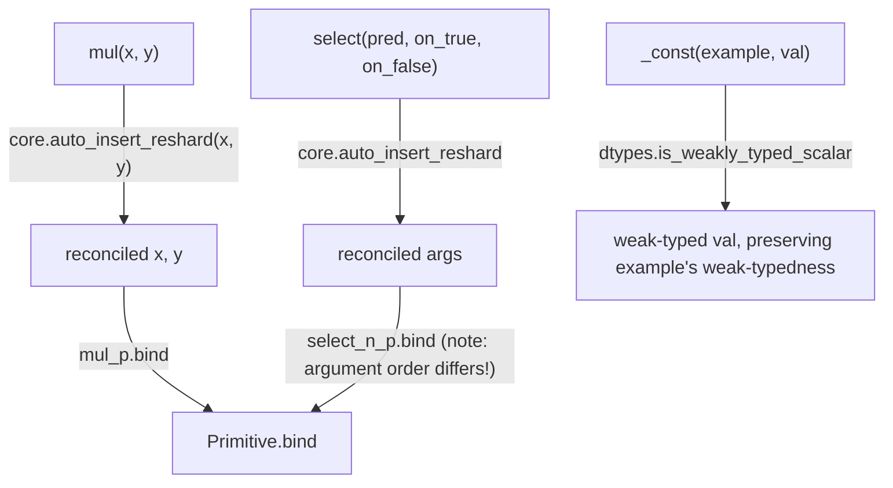

# jax._src.lax.lax — primitive wrappers, auto_insert_reshard, and weak-type constant handling

## Overview

This module is where the low-level XLA-mirroring ops (`mul`, `select`, `pad`, `full_like`, ...) are
defined as thin Python wrappers around
[`Primitive.bind`](../catalog/jax/_src/core.md#Primitive.bind) calls. Every wrapper that combines
two or more array arguments (
[`mul`](../catalog/jax/_src/lax/lax.md#mul),
[`select`](../catalog/jax/_src/lax/lax.md#select)) routes them through `core.auto_insert_reshard`
before binding — an automatic mesh-reconciliation step that runs ahead of the primitive itself.
[`_const`](../catalog/jax/_src/lax/lax.md#_const) constructs constants whose weak-typedness matches
the "example" array they're derived from, avoiding unwanted dtype promotion when combining a
constant with a weakly-typed input.

## Diagram

## Design rationale (why it's built this way)

**Every multi-array primitive wrapper calls `core.auto_insert_reshard` before `.bind`, rather than
letting `bind`'s own mesh-mismatch handling (see [jax-_src-core](jax-_src-core.md)) be the only
reconciliation point.** [`mul`](../catalog/jax/_src/lax/lax.md#mul)/
[`select`](../catalog/jax/_src/lax/lax.md#select)/`pad`/`rev` all call
`core.auto_insert_reshard(...)` on their array arguments first — this handles the common case of
combining differently-sharded-but-compatible arrays (e.g. one argument replicated, another
explicitly sharded) at the point where the *combination* is being requested, rather than deferring
entirely to the more general (and more restrictive) per-primitive mismatch handling in `bind`.

**`select`'s underlying primitive (`select_n_p`) takes arguments in the *opposite* order from the
public `select` function, and the code says so explicitly.** The comment "Caution! The
`select_n_p` primitive has the *opposite* order of arguments to `select()`" documents that
[`select`](../catalog/jax/_src/lax/lax.md#select) reorders `(pred, on_false, on_true)` before
binding `select_n_p` — because `select_n_p` implements the more general `select_n` (N-way select),
whose natural argument order doesn't match the simpler 2-way `select`'s (`pred, on_true, on_false`)
convention.

**`_const` preserves the example value's weak-typedness rather than always producing a strongly
typed constant.** [`_const`](../catalog/jax/_src/lax/lax.md#_const) checks
`dtypes.is_weakly_typed_scalar(example)` and, if true, constructs `val` via the scalar type of
`example` (falling back to an explicit-dtype `np.array` only if dtypes still don't match) — this
avoids the constant unexpectedly forcing dtype promotion when combined with the (possibly weak)
example value it was derived alongside.

## Entry points

- [`mul`](../catalog/jax/_src/lax/lax.md#mul) / [`select`](../catalog/jax/_src/lax/lax.md#select) —
  representative elementwise/selection primitive wrappers; the pattern (reshard-then-bind) is shared
  by essentially every binary+ `lax` op.
- [`full_like`](../catalog/jax/_src/lax/lax.md#full_like) — reached to build a filled array whose
  shape/dtype/sharding default to matching an existing example array.
- [`_const`](../catalog/jax/_src/lax/lax.md#_const) — reached internally (e.g. by `_zero`/`_one`) to
  build a constant compatible with an example array's weak-typedness.

## Mechanism (step-by-step)

1. **A wrapper like [`mul`](../catalog/jax/_src/lax/lax.md#mul) calls
   `core.auto_insert_reshard(x, y)`** to reconcile any sharding mismatch between its array
   arguments before the primitive itself runs.
2. **The reconciled arguments are passed to the underlying primitive's `.bind`** (e.g. `mul_p.bind`,
   `select_n_p.bind` — the latter with arguments reordered from the public
   [`select`](../catalog/jax/_src/lax/lax.md#select) signature).
3. **[`full_like`](../catalog/jax/_src/lax/lax.md#full_like) derives `fill_shape`/`weak_type`/`dtype`
   from the example `x`** unless explicitly overridden, then constructs the filled array (with a
   dtype-extension-aware branch for `dtypes.ExtendedDType`).
4. **[`_const`](../catalog/jax/_src/lax/lax.md#_const) checks weak-typedness of its `example`
   argument** and constructs `val` to match, falling back to an explicit `np.array(val, dtype)` only
   when the scalar-typed value's dtype doesn't already match.

## Key data structures

- **`mul_p`/`select_n_p`** — the underlying [`Primitive`](jax-_src-core.md) instances these
  public functions wrap.

## Dynamics (design intent)

Because reshard reconciliation happens once, at the wrapper level, before `.bind`, every downstream
primitive's `bind` call (see [jax-_src-core](jax-_src-core.md)) sees already-mesh-compatible
arguments in the common case — the more restrictive mesh-mismatch handling inside `bind` itself is
a fallback/hard-failure path, not the primary reconciliation mechanism.

## Edge cases

- [`full_like`](../catalog/jax/_src/lax/lax.md#full_like)'s docstring lists three cases where the
  output sharding will *not* match the input `x`'s sharding: sharding unavailable during tracing
  (falls back to `jit`), `x` weakly typed or uncommitted (uses default sharding), and an explicit
  `shape` different from `x.shape` (uses default sharding) — callers relying on sharding
  preservation must be aware of these three exceptions.
- `_zero`/`_one` (thin wrappers over `full_like`) explicitly reset the sharding's `spec` to
  `P()` (fully replicated) rather than preserving the example's own partition spec — a scalar
  zero/one constant has no meaningful partitioning to preserve.

## Open questions

- Whether `auto_insert_reshard`'s reconciliation cost is measurable relative to raw primitive
  dispatch overhead at high call-rate is not addressed by this packet's cited subgraph (its
  implementation is outside the packet's own module).

## See also
- [jax-_src-core](jax-_src-core.md) — `Primitive.bind`, the dispatch point every wrapper here
  eventually calls, including its own (more restrictive) mesh-mismatch handling.
- [jax-_src-dtypes](jax-_src-dtypes.md) — `is_weakly_typed_scalar`/dtype canonicalization used by
  `_const`/`full_like`.
