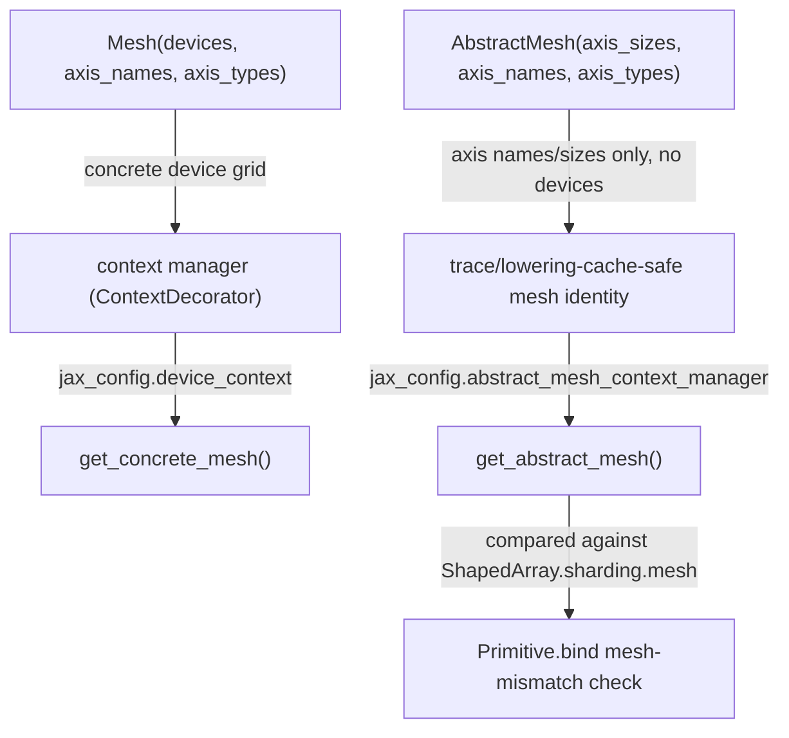

# jax._src.mesh — Mesh/AbstractMesh, AxisType, and trace-cache-preserving abstraction

## Overview

[`Mesh`](../catalog/jax/_src/mesh.md#Mesh) declares the concrete hardware device grid a computation
runs over (a named-axis view over `jax.devices()`), while
[`AbstractMesh`](../catalog/jax/_src/mesh.md#AbstractMesh) captures only axis names/sizes/types —
no concrete devices — specifically so tracing/lowering caches don't miss when the same logical mesh
shape is later bound to different physical devices. [`AxisType`](../catalog/jax/_src/mesh.md#AxisType)
(`Auto`/`Explicit`/`Manual`) tags each mesh axis with how sharding along it is controlled, driving
the mesh-mismatch handling in [`Primitive.bind`](../catalog/jax/_src/core.md#Primitive.bind) (see
[jax-_src-core](jax-_src-core.md)).
[`get_abstract_mesh`](../catalog/jax/_src/mesh.md#get_abstract_mesh) reads the currently active
abstract mesh from a context-local config value.

## Diagram

## Design rationale (why it's built this way)

**`AbstractMesh` deliberately omits concrete devices so that identical logical mesh shapes don't
cause tracing/lowering cache misses when the underlying devices change.** The class docstring states
this directly: use `AbstractMesh` "as an input to the sharding passed to `with_sharding_constraint`
and mesh passed to `shard_map` to avoid tracing and lowering cache misses when your mesh shape and
axis names stay the same but the devices change" — a `Mesh` is keyed (for caching purposes) on its
actual device identities, so recompiling for a *different* set of physically identical devices with
the same shape would otherwise unnecessarily bust the cache; `AbstractMesh` strips that dependency.

**Both `Mesh` and `AbstractMesh` intern their instances via a `_create`/`weak_value_interner`
pattern**, mirroring [`ShapedArray`](jax-_src-core.md)'s own interning — structurally identical
mesh descriptions (same devices/axis names/types, or same axis sizes/names/types for the abstract
form) collapse to the same object, which matters for equality/hashing performance in code paths
that frequently compare or hash mesh objects (e.g. `bind`'s mesh-mismatch check).

## Entry points

- [`Mesh`](../catalog/jax/_src/mesh.md#Mesh) — the concrete device-mesh constructor, typically used
  as a context manager (`with Mesh(devices, axis_names): ...`).
- [`AbstractMesh`](../catalog/jax/_src/mesh.md#AbstractMesh) — reached to construct a
  device-independent mesh descriptor for use with `with_sharding_constraint`/`shard_map`.
- [`get_abstract_mesh`](../catalog/jax/_src/mesh.md#get_abstract_mesh) — reached (e.g. by
  [`Primitive.bind`](../catalog/jax/_src/core.md#Primitive.bind)) to read whichever abstract mesh is
  currently active in context.

## Mechanism (step-by-step)

1. **[`Mesh`](../catalog/jax/_src/mesh.md#Mesh) is constructed from a `devices` array plus
   `axis_names`** (and optional [`AxisType`](../catalog/jax/_src/mesh.md#AxisType)s, defaulting all
   axes to `Auto`), interned via `_create`.
2. **Entering a [`Mesh`](../catalog/jax/_src/mesh.md#Mesh) as a context manager sets a
   context-local device-context value**, readable later via `get_concrete_mesh`.
3. **[`get_abstract_mesh`](../catalog/jax/_src/mesh.md#get_abstract_mesh) reads
   `jax_config.abstract_mesh_context_manager.value`**, falling back to a module-level
   `empty_abstract_mesh` singleton if nothing is set.
4. **[`Primitive.bind`](../catalog/jax/_src/core.md#Primitive.bind) compares an argument's
   `ShapedArray.sharding.mesh` against `get_abstract_mesh()`**, taking the `Auto`/`Explicit`-specific
   action described in [jax-_src-core](jax-_src-core.md) on a mismatch.

## Key data structures

- **[`Mesh`](../catalog/jax/_src/mesh.md#Mesh)** — `devices` (`np.ndarray`), `axis_names`, `size`;
  a `ContextDecorator` subclass, usable as either a context manager or a decorator.
- **[`AbstractMesh`](../catalog/jax/_src/mesh.md#AbstractMesh)** — `axis_sizes`, `axis_names`,
  `axis_types`; immutable, no device references.
- **[`AxisType`](../catalog/jax/_src/mesh.md#AxisType)** — `enum.Enum` with `Auto`/`Explicit`/
  `Manual` members, one per mesh axis, controlling how that axis's sharding is determined.

## Dynamics (design intent)

Because `AbstractMesh` equality/hashing depends only on axis names/sizes/types (never device
identity), two physically different device sets with the same logical mesh shape produce equal
`AbstractMesh` objects — any cache keyed on `AbstractMesh` (tracing, lowering) naturally hits across
device-set changes that preserve logical shape, which is the entire point of the abstraction.

## Edge cases

- [`_normalize_axis_types`](../catalog/jax/_src/mesh.md#Mesh) (used during `Mesh`/`AbstractMesh`
  construction — referenced in this module) raises `TypeError`/`ValueError` if `axis_types` isn't a
  tuple of [`AxisType`](../catalog/jax/_src/mesh.md#AxisType) values matching `axis_names`' length —
  a mismatched or wrongly-typed `axis_types` argument fails at construction, not at first use.
- [`get_abstract_mesh`](../catalog/jax/_src/mesh.md#get_abstract_mesh) returns a shared
  `empty_abstract_mesh` singleton (not `None`) when no mesh context is active — callers comparing
  against `get_abstract_mesh()` never need a separate "no mesh" branch.

## Open questions

- Whether `AbstractMesh`'s cache-hit-preservation property has been measured directly (e.g. a
  before/after retrace count on a device-swap benchmark) is not addressed by this packet's cited
  subgraph.

## See also
- [jax-_src-core](jax-_src-core.md) — `Primitive.bind`/`ShapedArray`, which consume
  `get_abstract_mesh()`'s result for mesh-mismatch detection.
- [jax-_src-named_sharding](jax-_src-named_sharding.md) — `NamedSharding.mesh`, which holds either
  a `Mesh` or `AbstractMesh`.
