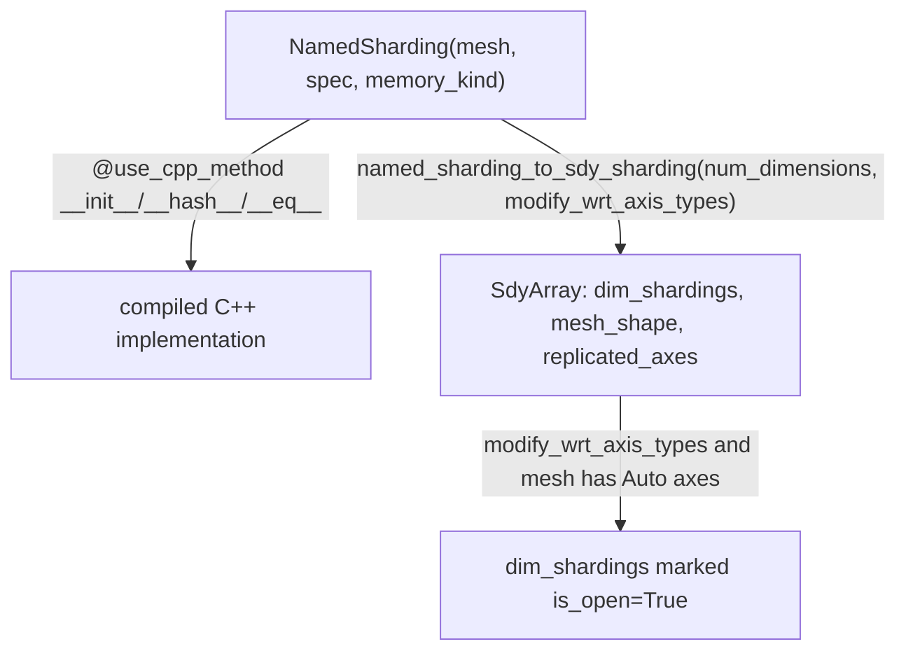

# jax._src.named_sharding — NamedSharding (mesh + PartitionSpec) and Shardy (SDY) lowering

## Overview

[`NamedSharding`](../catalog/jax/_src/named_sharding.md#NamedSharding) is JAX's primary
user-facing sharding representation: a pair of a
[`Mesh`](../catalog/jax/_src/mesh.md#Mesh)/[`AbstractMesh`](../catalog/jax/_src/mesh.md#AbstractMesh)
and a `PartitionSpec` describing which mesh axis (if any) shards each array dimension. Its hot
methods (`__init__`, `__hash__`, `__eq__`) are marked `@use_cpp_method()`, delegating to a compiled
implementation. [`named_sharding_to_sdy_sharding`](../catalog/jax/_src/named_sharding.md#named_sharding_to_sdy_sharding)
converts a `NamedSharding` into the Shardy (SDY) MLIR dialect's array-sharding representation used by
newer XLA/Shardy-based partitioning, LRU-cached for repeated conversions of the same sharding.

## Diagram

## Design rationale (why it's built this way)

**`NamedSharding`'s construction and equality/hashing are delegated to a compiled C++
implementation via `@use_cpp_method()`, not left as pure Python.** `__init__`/`__hash__`/`__eq__`
all carry this decorator — since `NamedSharding` objects are constructed and compared extremely
frequently (every sharded array carries one, and JAX's caching/dispatch logic hashes/compares
shardings constantly), moving these operations to compiled code removes Python-interpreter overhead
from a genuinely hot path, mirroring the same C++-offload pattern seen in
[jax-_src-util](jax-_src-util.md)'s `safe_map`/`safe_zip`.

**SDY conversion treats `Auto`-typed mesh axes as requiring "open" (unconstrained) dimension
shardings, not the sharding's own explicit spec.**
[`named_sharding_to_sdy_sharding`](../catalog/jax/_src/named_sharding.md#named_sharding_to_sdy_sharding)'s
`modify_wrt_axis_types` branch marks every `dim_sharding` as `is_open=True` whenever the mesh has any
`Auto`-typed axis (`self.mesh._any_axis_auto`) — since `Auto` axes are meant to let the compiler's
own automatic partitioner choose sharding rather than strictly enforcing the user's spec, the SDY
representation must mark those dimensions as negotiable, not fixed, so downstream Shardy-based
partitioning can actually exercise its automatic choices.

## Entry points

- [`NamedSharding`](../catalog/jax/_src/named_sharding.md#NamedSharding) — the primary sharding
  constructor, reached wherever an array's sharding is specified in terms of a mesh + partition
  spec.
- [`named_sharding_to_sdy_sharding`](../catalog/jax/_src/named_sharding.md#named_sharding_to_sdy_sharding) —
  reached during lowering to Shardy (SDY)-based partitioning to convert a `NamedSharding` into its
  MLIR-dialect equivalent.

## Mechanism (step-by-step)

1. **[`NamedSharding.__init__`](../catalog/jax/_src/named_sharding.md#NamedSharding) stores
   `mesh`/`spec`/`memory_kind`/`_logical_device_ids`**, calling `check_pspec` to validate the spec
   against the mesh before returning.
2. **[`named_sharding_to_sdy_sharding`](../catalog/jax/_src/named_sharding.md#named_sharding_to_sdy_sharding)
   builds one `SdyDim` per output dimension** from `self.spec.partitions`, marking
   `PartitionSpec.UNCONSTRAINED` dimensions as open and named-axis dimensions as closed with those
   axes.
3. **If `modify_wrt_axis_types` and the mesh has any `Auto` axis**, this same
   [`named_sharding_to_sdy_sharding`](../catalog/jax/_src/named_sharding.md#named_sharding_to_sdy_sharding)
   call forces every dimension's sharding open, and separately tracks `Explicit`-typed replicated
   axes as `explicit_replicated_axes`.

## Key data structures

- **[`NamedSharding`](../catalog/jax/_src/named_sharding.md#NamedSharding)** —
  [`mesh`](../catalog/jax/_src/named_sharding.md#NamedSharding.mesh) (
  [`Mesh`](../catalog/jax/_src/mesh.md#Mesh) or [`AbstractMesh`](../catalog/jax/_src/mesh.md#AbstractMesh)),
  [`spec`](../catalog/jax/_src/named_sharding.md#NamedSharding.spec) (`PartitionSpec`),
  `_memory_kind`, `_logical_device_ids`.
- **`SdyArray`/`SdyDim`** — the Shardy MLIR-dialect sharding representation
  [`named_sharding_to_sdy_sharding`](../catalog/jax/_src/named_sharding.md#named_sharding_to_sdy_sharding)
  produces.

## Dynamics (design intent)

Because [`named_sharding_to_sdy_sharding`](../catalog/jax/_src/named_sharding.md#named_sharding_to_sdy_sharding)
is `@cache(max_size=4096, trace_context_in_key=False)`, repeated SDY conversion of the same
`(NamedSharding, num_dimensions, modify_wrt_axis_types)` combination — common when lowering many ops
sharing the same sharding — is amortized to a single conversion, independent of tracing context.

## Edge cases

- [`NamedSharding.__hash__`](../catalog/jax/_src/named_sharding.md#NamedSharding) caches its
  computed hash in `self._hash` on first access — since `NamedSharding` is otherwise treated as
  effectively immutable after construction, this is safe, but any code path that mutates a
  `NamedSharding`'s fields post-construction (not exercised in this packet's cited subgraph) would
  invalidate the cached hash.
- [`named_sharding_to_sdy_sharding`](../catalog/jax/_src/named_sharding.md#named_sharding_to_sdy_sharding)'s
  cache is keyed with `trace_context_in_key=False` — conversions are considered identical across
  different tracing contexts as long as the `(self, num_dimensions, modify_wrt_axis_types)` tuple
  matches, which assumes `NamedSharding.__eq__`/`__hash__` fully capture sharding identity.

## Open questions

- Whether the 4096-entry cache size for `named_sharding_to_sdy_sharding` has ever needed tuning for
  models with unusually many distinct shardings is not addressed by this packet's cited subgraph.

## See also
- [jax-_src-mesh](jax-_src-mesh.md) — `Mesh`/`AbstractMesh`/`AxisType`, the mesh type
  `NamedSharding.mesh` holds and whose `Auto`/`Explicit` axis types drive SDY conversion behavior.
- [jax-_src-util](jax-_src-util.md) — `safe_map`/`safe_zip`, another example of the
  compiled-extension-for-hot-path pattern used here via `@use_cpp_method()`.
