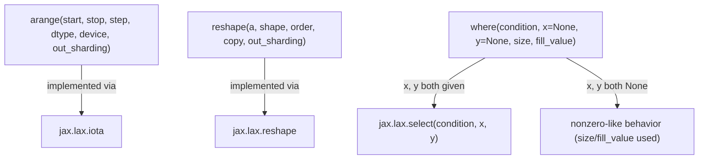

# jax._src.numpy.lax_numpy — arange/reshape/where, NumPy-compatible wrappers over lax primitives

## Overview

This module implements `jax.numpy`'s NumPy-compatible surface as thin wrappers over `jax.lax`
primitives: [`arange`](../catalog/jax/_src/numpy/lax_numpy.md#arange) is "implemented in terms of
`jax.lax.iota`," [`reshape`](../catalog/jax/_src/numpy/lax_numpy.md#reshape) in terms of
`jax.lax.reshape`, and the three-argument form of
[`where`](../catalog/jax/_src/numpy/lax_numpy.md#where) "lowers to `jax.lax.select`" (see
[jax-_src-lax](jax-_src-lax.md)). Every public function is tagged with the
[`export`](../catalog/jax/_src/numpy/lax_numpy.md#export) decorator (`set_module('jax.numpy')`),
which records the function's canonical public module for docs/repr purposes.

## Diagram

## Design rationale (why it's built this way)

**`reshape` always returns a logical copy, relying on the compiler (not the Python-level API) to
elide the copy when safe.** The docstring states: "`jax.numpy.reshape` will return a copy rather
than a view... However, under JIT, the compiler will optimize-away such copies when possible, so
this doesn't have performance impacts in practice" — since JAX's functional/immutable array model
has no notion of a NumPy-style view sharing a buffer, `reshape`'s semantics are always "copy," but
this is not a performance concession in the common (JIT-compiled) case because XLA's own
optimizer removes the redundant copy at the HLO level.

**`where` unifies two semantically different behaviors (element-select vs. nonzero-like index
query) behind one overloaded public function, dispatching on whether `x`/`y` are provided.**
[`where`](../catalog/jax/_src/numpy/lax_numpy.md#where)'s docstring explicitly calls out that
"when only `condition` is provided, `jnp.where(condition)` is equivalent to `jnp.nonzero(condition)`"
while the three-argument form "lowers to `jax.lax.select`" — a single call site (`jnp.where`)
matches the NumPy convention where both usages share one function name, even though the underlying
lowering targets are entirely different primitives (`nonzero`'s dynamic-shape-producing gather
logic vs. `select`'s straightforward elementwise select).

## Entry points

- [`arange`](../catalog/jax/_src/numpy/lax_numpy.md#arange) — reached to construct an
  evenly-spaced value array, accepting optional `device`/`out_sharding` to commit the result.
- [`reshape`](../catalog/jax/_src/numpy/lax_numpy.md#reshape) — reached to reshape an array,
  supporting `-1`-inferred dimensions and `'C'`/`'F'` ordering (not `'A'`).
- [`where`](../catalog/jax/_src/numpy/lax_numpy.md#where) — reached both for elementwise
  conditional selection (3-arg form) and nonzero-index queries (1-arg form).

## Mechanism (step-by-step)

1. **[`arange`](../catalog/jax/_src/numpy/lax_numpy.md#arange) accepts the same
   `(start)`/`(start, stop)`/`(start, stop, step)` positional signatures as Python's `range`**,
   determines an output dtype via type promotion if unspecified, and lowers via `jax.lax.iota`.
2. **[`reshape`](../catalog/jax/_src/numpy/lax_numpy.md#reshape) validates the target shape
   (resolving any `-1` dimension)** and lowers via `jax.lax.reshape`; the `copy` parameter is
   accepted for NumPy-API compatibility but "unused by JAX."
3. **[`where`](../catalog/jax/_src/numpy/lax_numpy.md#where) branches on whether `x`/`y` are
   `None`**: if both given, lowers to `jax.lax.select`; if both omitted, behaves like
   `jnp.nonzero` (consuming `size`/`fill_value` instead).

## Key data structures

- **[`export`](../catalog/jax/_src/numpy/lax_numpy.md#export)** — the `set_module('jax.numpy')`
  decorator alias applied to every public function in this module, recording its canonical
  `jax.numpy` public-API identity.

## Dynamics (design intent)

Because every function here is a thin wrapper delegating to a `jax.lax` primitive, the actual
compiled cost of e.g. `jnp.reshape`/`jnp.arange`/`jnp.where` is entirely determined by the
underlying `lax` primitive's lowering — this module's own Python-level code contributes only
one-time tracing overhead, not per-execution cost.

## Edge cases

- [`reshape`](../catalog/jax/_src/numpy/lax_numpy.md#reshape) explicitly does not support
  `order='A'` (NumPy's "any order, whichever is more efficient" option) — only `'C'`/`'F'` are
  valid, so code relying on NumPy's `'A'` semantics must pick an explicit order when porting to JAX.
- [`arange`](../catalog/jax/_src/numpy/lax_numpy.md#arange)'s `device`/`out_sharding` are both
  optional and serve overlapping purposes; the docstring recommends `out_sharding` specifically
  "if using explicit sharding," implying the two parameters are not fully interchangeable across
  JAX's sharding modes.

## Open questions

- Whether `where`'s two behaviors (select vs. nonzero-like) share any measurable compiled-cost
  difference that would make one preferred over calling `jnp.nonzero` directly is not addressed by
  this packet's cited subgraph.

## See also
- [jax-_src-lax](jax-_src-lax.md) — `select`/`mul`, the underlying primitive wrappers `where`
  and other `jax.numpy` functions ultimately lower to.
- [jax-_src-named_sharding](jax-_src-named_sharding.md) — `NamedSharding`, accepted as `arange`'s
  `out_sharding` parameter.
